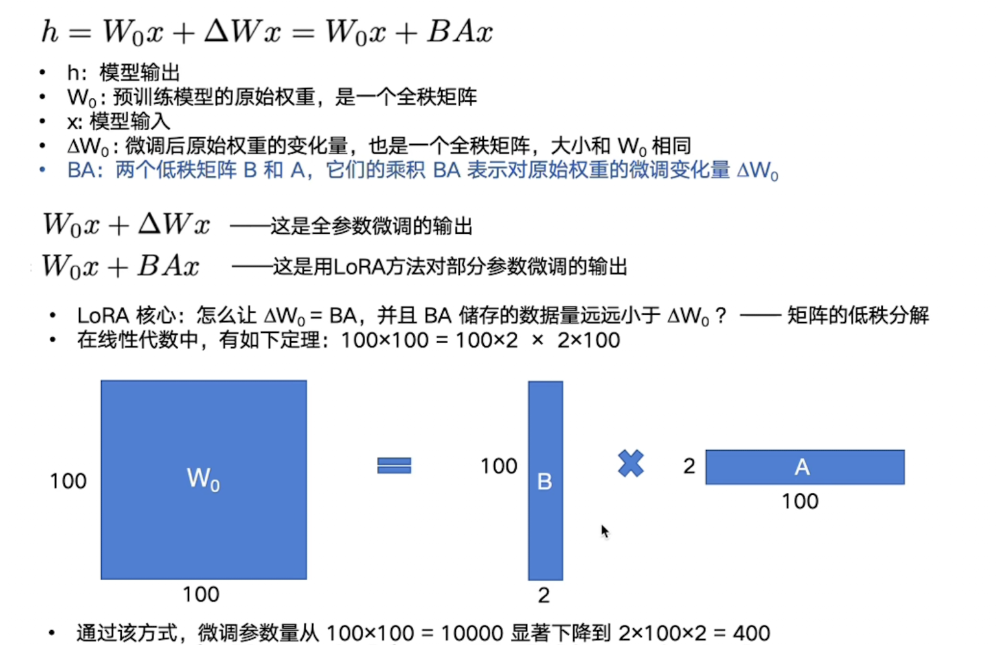

### 三条主流技术路线
**2.1 SFT - Supervised Fine-Tuning（有监督微调）**

**数据**

• 把“问题 → 理想答案”整理成对话或指令格式（行业教材、FAQ、内部文档整理、员工写的示例）

• 通常几百～几千条就能明显提升专业度；领域极窄时可能要 1–10 万条

**流程**

选定基础模型（e.g. Llama-3-8B, Qwen-7B）
用 LoRA / QLoRA / 全参微调继续训练几 epoch
产出 新权重（完全离线，可部署私有化）
优点

• 推理时无外部检索，延迟低

• 输出流畅，像“学过就会”

**局限**

• 内容“固化”在权重里——知识一旦过期只能重新训练

• 微调后可能遗忘通用能力（需混合数据或低 lr）

适用：案例一、二（静态、专有且稳定的知识）

**2.2 RLHF – Reinforcement Learning from Human Feedback（含 DPO）**

**背景**

微调只能教“正确写法”，却无法告诉模型“什么语气最好”；RLHF 用“成对偏好”来训练奖励函数或直接做策略优化。

**数据形式**

Prompt + A/​B 两个答案 + 人类选择更好的那个
（也可以打分 1–7 或排名）

**训练套路**

先用 SFT 提供一个可用初始模型
标注偏好对 → 训练奖励模型 RM
PPO / DPO / RLAIF 等算法更新策略模型
Direct Preference Optimization (DPO)
• 把 RL 目标转成封闭形式交叉熵损失，直接微调，收敛快、稳定性好，开源实现多。

**优点**

• 不需写“规则引擎”，就能让模型自然地学会二次元/学术/幽默等风格

• 可持续在线学习（A/B 测试即数据）

**局限**

• 标注成本高：同一条 prompt 至少要两个答案

• 算法与超参调不好会“崩”输出质量

适用：案例三（语气、格式、礼貌度由用户投票决定）

**2.3 RAG – Retrieval-Augmented Generation（检索增强生成）**

**核心组件**

• Retriever：向量/关键词检索，把“可能相关”的文档找出来

• LLM：把检索到的文档连同用户问题一起喂给模型，让它“开卷作答”

• 可选：Freshness 触发器、搜索 API、SQL/GraphQL 连接器

**数据链路**

• 文档抓取 → 切分 → Embedding → 向量库

• 在线询问时按相似度 Top-k 检索 → concatenate context → 调用 LLM

**优点**

• 实时性：文档更新即可立即生效

• 可追溯：“引用来源”天然支持标注

• 便于安全审计：过滤检索结果比过滤大模型输出简单很多

**局限**

• 全链路延迟高（检索 + LLM）

• 需要运维索引库；文档过长要分块+去重

• 上下文窗口有限，长文 still 会截断

适用：案例四（活动价、每日菜单等随时变化的信息）

**LoRA算法**

