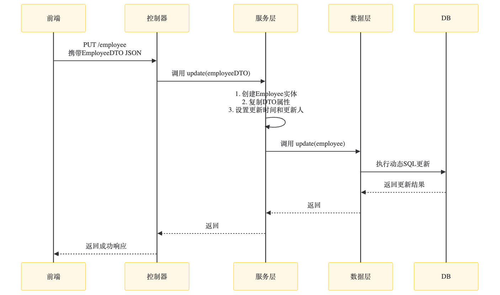
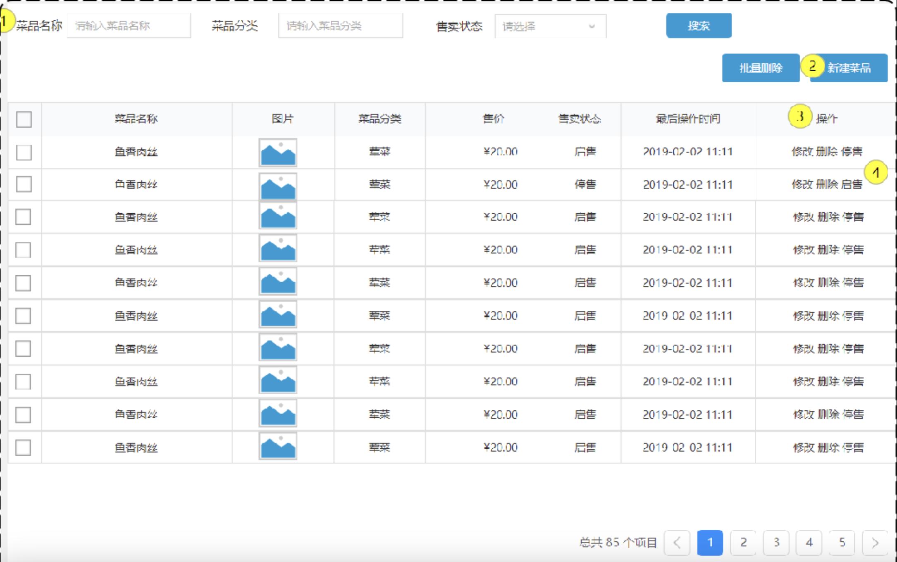
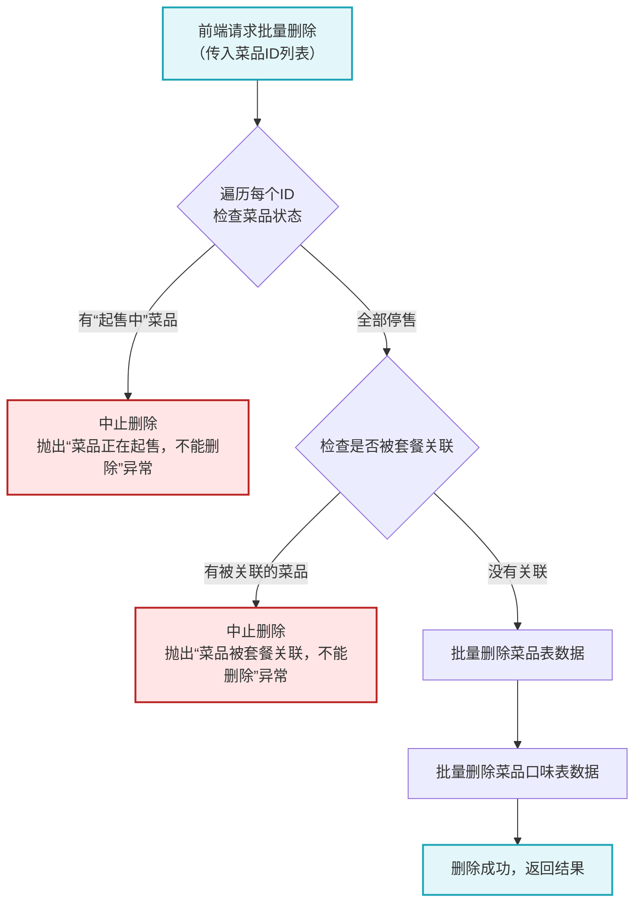
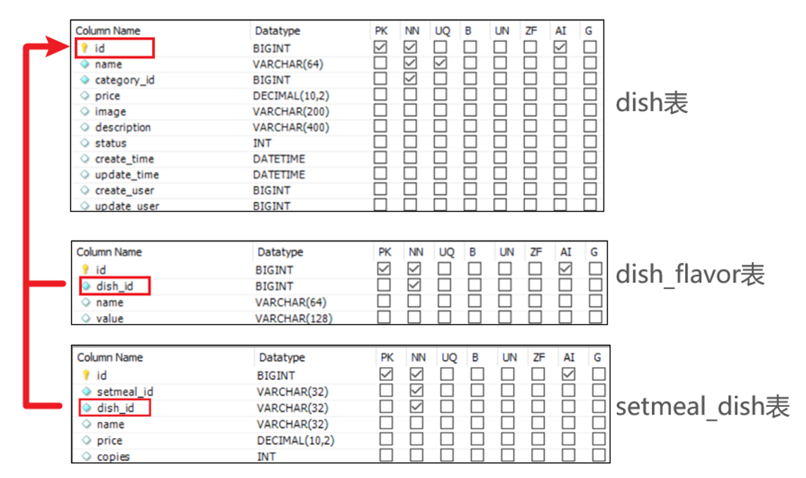

## 一、新增员工

### 1. DTO 设计

- 当前端提交数据和实体类属性差异大时，建议用 DTO 封装数据。

### 2. Controller 层

- 在 `com.sky.controller.admin` 包下，新建 `EmployeeController`，实现新增员工方法。

### 3. Service 层

- **接口**：在 `EmployeeService` 接口中声明新增员工方法。
- **实现**：`EmployeeServiceImpl` 实现具体逻辑。

### 4. Mapper 层

- 在 `EmployeeMapper` 中声明 `insert` 方法。

---

### 代码完善

#### 1. 用户名已存在问题

- 因为用户名有唯一约束，重复插入时会抛异常。
- **解决**：通过全局异常处理器处理。

#### 2. 创建人ID固定问题

- 新增员工时，创建人ID和修改人ID被写死。

#### 3. ThreadLocal 用于线程隔离

- ThreadLocal为每个线程提供单独一份存储空间，具有线程隔离的效果，只有在线程内才能获取到对应的值，线程外则不能访问。在拦截器中解析出当前登录员工id，并放入线程局部变量中：：

    ```java
    //校验令牌
        try {
            //.................
            Claims claims = JwtUtil.parseJWT(jwtProperties.getAdminSecretKey(), token);
            Long empId = Long.valueOf(claims.get(JwtClaimsConstant.EMP_ID).toString());
            log.info("当前员工id：", empId);
            /////将用户id存储到ThreadLocal////////
            BaseContext.setCurrentId(empId);
            ////////////////////////////////////
            //3、通过，放行
            return true;
        } catch (Exception ex) {
            //......................
        }
    ```

---

## 二、员工分页

### 1. DTO 设计

- `EmployeePageQueryDTO implements Serializable`
- 接收前端传递的分页查询条件，在Controller方法中作为参数，Spring MVC会自动将HTTP请求参数（如?name=张&page=1&pageSize=10）绑定到该DTO对象。
- ?name=张&page=1&pageSize=10值指的是每页十条数据，找到第一页数据中名字为张的数据.

### 2. PageResult 封装

- 响应结构：

    ```json
    {
      "total": 28,
      "records": [
        { "id": 1021, "name": "张明", ... },
        ...
      ]
    }
    ```
- total(整体数据量)：告诉前端符合条件的总记录数<br>
records(当前页数据)：本次查询返回的具体数据列表
### 3. Controller 层

- 新增分页查询方法：

    ```java
    @GetMapping("/employees")
    public Result<PageResult> getEmployees(EmployeePageQueryDTO queryParams) {
        PageResult result = employeeService.pageQuery(queryParams);
        return Result.success(result);
    }
    ```

### 4. Service 层

- 接口声明 `pageQuery`
- 实现类中用 PageHelper：

    ```java
    PageHelper.startPage(dto.getPage(), dto.getPageSize());
    Page<Employee> page = employeeMapper.pageQuery(dto);
    return new PageResult(page.getTotal(), page.getResult());
    ```
- *note: 在PageHelper中，有一个静态的ThreadLocal变量，startPage(int pageNum, int pageSize)会在threadlocalmap里存下这对key-value:*

    ```java
    public abstract class PageHelper {
        private static final ThreadLocal<Page> LOCAL_PAGE = new ThreadLocal<Page>();

        public static void startPage(int pageNum, int pageSize) {
            Page page = new Page(pageNum, pageSize);
            LOCAL_PAGE.set(page);
        }

        public static Page getPage() {
            return LOCAL_PAGE.get();
        }

        public static void clearPage() {
            LOCAL_PAGE.remove();
        }
    }
    ```
### 5. Mapper 层

- 定义：

     ```java
    Page<Employee> pageQuery(EmployeePageQueryDTO employeePageQueryDTO);
    ```
---

### 6. 具体例子案例

#### 用户操作（前端界面）：

- 在搜索框输入：`"张"`（查询姓张的员工）
- 选择每页显示 `10` 条记录
- 点击`"第 3 页"`

**请求：**
GET /employees?name=张&page=3&pageSize=10

### 后端处理流程

#### 1. Controller 接收参数

```java
@GetMapping("/employees")
public Result<PageResult> getEmployees(EmployeePageQueryDTO queryParams) {
    // queryParams 自动填充为：
    //   name = "张"
    //   page = 3
    //   pageSize = 10
    PageResult result = employeeService.pageQuery(queryParams);
    return Result.success(result);
}
```
#### 2. Service 处理分页
```java
public PageResult pageQuery(EmployeePageQueryDTO dto) {
    // 设置分页参数：第3页，每页10条
    PageHelper.startPage(dto.getPage(), dto.getPageSize());
    
    // 执行查询（携带name="张"条件）
    Page<Employee> page = employeeMapper.pageQuery(dto);
    
    // 转换为通用分页结果
    return new PageResult(page.getTotal(), page.getResult());
}
```

#### 3. Mapper 执行 SQL
自动执行的 SQL 分为两步：
```sql
-- 1. 先执行 COUNT 查询获取总数
SELECT COUNT(*) FROM employee 
WHERE name LIKE '%张%';

-- 2. 再执行分页数据查询
SELECT * FROM employee 
WHERE name LIKE '%张%' 
ORDER BY create_time DESC 
LIMIT 20, 10;  -- 跳过前20条，取10条
```

#### 4.输出结果说明
- 数据库中共有 28 个姓"张"的员工
- 第 3 页应显示第 21-28 号员工（只有 8 条，最后一页不足 10 条）
#### 5. 后端返回的 JSON 示例
```json
{
  "code": 200,
  "message": "成功",
  "data": {
    "total": 28,  // 姓"张"的员工总数
    "records": [
      {
        "id": 1021,
        "name": "张明",
        "position": "高级工程师",
        "department": "研发部",
        "hireDate": "2020-05-15"
      },
      {
        "id": 1015,
        "name": "张伟",
        "position": "产品经理",
        "department": "产品部",
        "hireDate": "2019-11-22"
      }
      // ... 其他6个员工数据
    ]
  }
}
```

---

## 三、编辑员工信息流程



## 四、启用/禁用员工账号流程

.png)


## 五、新增菜品功能

### 功能描述

在添加菜品时需要：
- 选择菜品所属的分类
- 选择口味
- 上传菜品图片

**约束条件：**
- 菜品名称必须唯一
- 菜品必须属于某个分类，不能单独存在

### 接口设计

1. **根据类型查询分类**
   ```http
   GET /admin/category/list?type=1/2
   ```
   参数：
   - type=1：查询菜品分类
   - type=2：查询套餐分类
2. **文件上传接口**
    ```http
   POST /admin/common/upload
   ```
    成功响应示例：
    ``` JSON
    {
    "code": 1,
    "data": "images/dish/malaxiao.jpg",
    "msg": "文件上传成功"
    }

    ```
    <span style="color: orange;">**拿到 data 里的图片路径，下一步新增菜品要用！**</span>

3. **新增菜品接口**
   ```http
   POST /admin/dish
   ```

4. **总体的流程为**<br>
   1. **查分类**<br>
        前端自动请求(根据类型查询分类)：
       ```http
       GET /category/list?type=1
       ```
       作用：获取所有菜品分类（热菜/凉菜等）供用户选择
   1. **填信息**
       - 输入菜名、价格
       - 手动选择分类（如选“热菜”）
       - 上传菜品图片
   2. **传图片**
       - 调用接口(上传图片接口)：
        ```http
        POST /admin/common/upload
        ```
       - 关键输出：获取图片存储路径（如images/dish/malaxiao.jpg）
   3. **创菜品**<br>
       提交数据：
       ```http
       POST /admin/dish
       ```
       关键字段：
       ```JSON
       {
       "name": "麻辣小龙虾",
       "categoryId": 2,      // 用户选择的分类ID
       "image": "images/dish/malaxiao.jpg"  // 上传接口返回的路径
       }
       ```

    ### 新增菜品核心实现
    ```java
    package com.sky.service.impl;
    @Service
    @Slf4j
    public class DishServiceImpl implements DishService {

    @Autowired
    private DishMapper dishMapper;
    @Autowired
    private DishFlavorMapper dishFlavorMapper;

    /**
     * 新增菜品和对应的口味
     *
     * @param dishDTO
     */
    @Transactional
    public void saveWithFlavor(DishDTO dishDTO) {

        Dish dish = new Dish();

        BeanUtils.copyProperties(dishDTO, dish);

        //向菜品表插入1条数据
        dishMapper.insert(dish);//后绪步骤实现

        //获取insert语句生成的主键值
        Long dishId = dish.getId();

        List<DishFlavor> flavors = dishDTO.getFlavors();
        if (flavors != null && flavors.size() > 0) {
            flavors.forEach(dishFlavor -> {
                dishFlavor.setDishId(dishId);
            });
            //向口味表插入n条数据
            dishFlavorMapper.insertBatch(flavors);//后绪步骤实现
        }
      }
    ```
    - 这段代码为某个菜品（dish）批量添加所有相关口味（flavor），每个口味记录都设置了dishId（指向这道菜）。
    - 也就是说遍历每个菜的所有口味，将每个口味都set这个菜品的id。
    每个口味可能对应多个菜品，那么就会有多条独立的数据。
    - 例如微辣可能对应宫保鸡丁和麻婆豆腐，那么就会有‘微辣，宫保鸡丁’和‘微辣，麻婆豆腐’两条数据

## 六、菜品分页查询
在菜品列表展示时，除了菜品的基本信息(名称、售价、售卖状态、最后操作时间)外，还有两个字段特殊
### 1.图片字段
我们从数据库查询出来的仅仅是图片的名字，图片要想在表格中回显展示出来，就需要下载这个图片。 

**为什么数据库里只存图片名或相对路径？**<br>
为了保持灵活性和可维护性：<br>
如果将图片的完整URL（如http://example.com/images/dish/malaxiao.jpg）存到数据库，那么以后服务器地址变化、端口变化、域名变化，所有历史数据都需要批量修改，非常麻烦。<br>
存储相对路径或文件名，只要你修改了图片服务器地址，前端/后端拼接URL即可，数据库数据不用动。
### 2.菜品分类
前端展示的是分类名称，而不是分类ID，而我们从数据库中获取的是分类ID，此时我们就需要根据菜品的分类ID，去分类表中查询分类信息，然后在页面展示。

**为什么从数据库中拿到的是分类ID**<br>
在数据库设计中，菜品和分类是多对一关系（每个菜品属于一个分类）。<br>
为了减少数据冗余，菜品表只存分类ID（外键），而不是把分类名称直接存到每一条菜品记录里。这样做的好处是：分类名称如果改了，只用改分类表，不用批量改菜品表。因此通过菜品的查询只能拿到分类的ID。

### 3.前端展示图



### 4.菜品分页查询时的数据流

#### 前端做了什么操作？<br>
假设你在后台管理页面，看到如下场景：
- 页面有“菜品名称”、“菜品分类”、“售卖状态”等筛选框
- 你输入关键字“鱼”，选择分类“川菜”，选择“起售”，点了“搜索”
- 你点击了第二页<br>

此时，前端会把这些查询条件和分页信息，作为请求参数发送给后端（通常是GET请求，参数放在URL里，或POST请求放在body里）。
```http
GET /admin/dish/page?page=2&pageSize=10&name=鱼&categoryId=101&status=1
```

#### 后端怎么处理？返回了什么数据？<br>
后端接收到参数后，会：
- 拼接SQL或用ORM根据这些条件查出符合条件的第2页的10条数据
- 查询每条菜品的基本信息
- 通常还会查出总条数，分页用
- 并且会把分类名称、图片URL等补全

后端返回的JSON数据格式通常如下：
```JSON
{
  "code": 1,
  "msg": "查询成功",
  "data": {
    "total": 35,           // 总条数
    "records": [
      {
        "id": 1,
        "name": "鱼香肉丝",
        "categoryId": 101,
        "categoryName": "川菜",       // 分类名称，方便前端直接展示
        "price": 20.00,
        "image": "images/dish/yuxiang.jpg", // 图片相对路径
        "imageUrl": "http://static.xxx.com/images/dish/yuxiang.jpg", // 完整图片URL
        "status": 1,
        "updateTime": "2019-02-02 11:11:11"
      },
      ...共10条
    ]
  }
}
```

#### 前端拿到数据后，如何展示？
- 前端拿到records数组，直接渲染表格
- categoryName直接展示分类名
- imageUrl放到标签里展示图片
- status展示为“起售”或“停售”
- total用来显示分页控件（比如共35条，显示4页）

#### 分页的实质：
- 前端确实不知道有多少数据、有多少页，必须靠后端告诉它
分页的页数 = 总数据条数 ÷ 每页数据量
- 前端看到的页码、分页按钮，都是根据后端返回的总条数算出来的<br>
比如后端返回total: 35，pageSize: 10<br>
前端就能算出有4页（1、2、3、4），并渲染出分页按钮
- 前端每点一次“下一页”或指定页码，都会向后端重新请求该页的数据

## 菜品批量删除流程


note: 在进行删除菜品操作时，会涉及到以下三张表。



