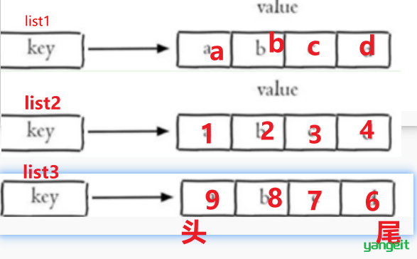

# Day4
## 字符串 string 操作命令
- SET key value 设置指定 key 的值
- GET key 获取指定 key 的值
- SETEX key seconds value 设置指定 key 的值，并将 key 的过期时间设为 seconds 秒
- SETNX key value 只有在 key 不存在时设置 key 的值
---
## 哈希hash操作命令
- HSET key field value 将哈希表 key 中的字段 field 的值设为 value
- HGET key field 获取存储在哈希表中指定字段的值
- HDEL key field 删除存储在哈希表中的指定字段
- HKEYS key 获取哈希表中所有字段
- HVALS key 获取哈希表中所有值
- HGETALL key 获取在哈希表中指定 key 的所有字段和值

**<span style="color:red;">典型应用场景：</span>**
- 用户信息、对象属性存储：以用户ID为 key，属性作为 field。
    如：一个用户的 profile，包括 name、age、gender、balance 等。
    <br>
- 计数器集合：某类事件的各维度统计，如广告点击、文章阅读量等。
    <br>
- 购物车:用户ID为 key，商品ID作为 field，商品数量为 value。
---
## 列表 list 操作命令
- LPUSH key value1 [value2] 将一个或多个值插入到列表头部
- LRANGE key start stop 获取列表指定范围内的元素
- RPOP key 移除并获取列表最后一个元素
- LLEN key 获取列表长度
- BRPOP key1 [key2 ] timeout 移出并获取列表的最后一个元素， 如果列表没有元素会阻塞列表直到等待超时或发现可弹出元素为止


**<span style="color:red;">note:先插入的在尾部，后插入的在头部</span>**

**<span style="color:red;">典型应用场景：常用于消息队列</span>**



---
## set 操作命令
- SADD key member1 [member2] 向集合添加一个或多个成员
- SMEMBERS key 返回集合中的所有成员
- SCARD key 获取集合的成员数
- SINTER key1 [key2] 返回给定所有集合的交集
- SUNION key1 [key2] 返回所有给定集合的并集
- SDIFF key1 [key2] 返回给定所有集合的差集
- SREM key member1 [member2] 移除集合中一个或多个成员

**<span style="color:red;">典型应用场景：</span>**
- 社交关系：用户好友、关注、粉丝集合。

    <br>
- 共同好友、共同兴趣推荐: 用 SINTER 做交集计算。
   
---
## 存JSON用String还是Hash

1. **用 String 存 JSON情况：**
```zsh
SET user:1001 '{"name":"Tom","age":23,"gender":"male"}'"
```
大括号要用单引号括起来
- 优点：简单直观，和应用层 JSON 使用方式一致，减少数据结构转换。
适合对象结构不经常变动、整体读写为主的场景。
<br>
- 缺点：只能整体读写，无法单独修改某个字段（如只改 age）。
需要在业务层做序列化和反序列化，性能略有消耗。
2. **用 Hash 存 JSON：**
```zhs
HSET user:1001 name Tom age 23 gender male
```
- 优点：可以原子性地独立读写某个字段，比如只更新 
```zhs
HSET user:1001 age 24。
```
- 缺点：
        1. 结构变更时要手动维护 field，和应用层 JSON 结构不一致。
        2. field 数量极多时（>1000），性能下降，内存占用变高。
        3. 不支持嵌套对象，复杂结构序列化还需要自己处理。


---

## sorted set 操作命令
- ZADD key score1 member1 [score2 member2] 向有序集合添加一个或多个成员，或者更新已存在成员的 分数
- ZRANGE key start stop [WITHSCORES] 通过索引区间返回有序集合中指定区间内的成员
- ZINCRBY key increment member 有序集合中对指定成员的分数加上增量 increment
- ZREM key member [member ...] 移除有序集合中的一个或多个成员

---

## 通用命令
- KEYS pattern 查找所有符合给定模式( pattern)的 key
- EXISTS key 检查给定 key 是否存在
- TYPE key 返回 key 所储存的值的类型
- TTL key 返回给定 key 的剩余生存时间(TTL, time to live)，以秒为单位
- DEL key 该命令用于在 key 存在是删除 key


---

## 外卖项目redis使用情况：

- 字符串（String）：
应用场景： 存储用户的基本信息、订单信息等。例如，可以将用户的地址信息、订单号等存储在字符串中。
- 哈希表（Hash）：
应用场景： 存储用户详细信息，如用户的个人资料。可以使用哈希表将用户ID作为键，用户信息作为字段存储。
- 列表（List）：
应用场景： 订单队列，用于存储用户提交的订单，支持快速的订单插入和获取操作。
- 集合（Set）：
应用场景： 存储用户的收藏夹或者喜好标签。可以使用集合存储用户喜欢的食物类型、餐馆标签等。
- 有序集合（Sorted Set）：
应用场景： 排行榜功能，根据用户的订单金额或者积分排名。有序集合可以按照分数排序，方便实现排行榜功能。

---

## 在Java里使用redis

要编写配置类：
```java
package com.sky.config;

import lombok.extern.slf4j.Slf4j;
import org.springframework.context.annotation.Bean;
import org.springframework.context.annotation.Configuration;
import org.springframework.data.redis.connection.RedisConnectionFactory;
import org.springframework.data.redis.core.RedisTemplate;
import org.springframework.data.redis.serializer.StringRedisSerializer;

@Configuration
@Slf4j
public class RedisConfiguration {

    @Bean
    public RedisTemplate redisTemplate(RedisConnectionFactory redisConnectionFactory){
        log.info("开始创建redis模板对象...");
        RedisTemplate redisTemplate = new RedisTemplate();
        //设置redis的连接工厂对象
        redisTemplate.setConnectionFactory(redisConnectionFactory);
        //设置redis key的序列化器
        redisTemplate.setKeySerializer(new StringRedisSerializer());
        return redisTemplate;
    }
}
```

Note: Spring Boot 框架会自动装配 RedisTemplate 对象，但是默认的key序列化器为 JdkSerializationRedisSerializer，导致我们存到Redis中后的数据和原始数据有差别，故设置为 StringRedisSerializer 序列化器。


 **1. 操作String类型：**
```java
    redisTemplate.opsForValue().set("name","小明");
    // redisTemplate.opsForValue()返回一个 
    // ValueOperations 对象，该对象提供了多种操作字符串数据的方法，
    // 例如 set、get、setIfAbsent 等。
    String city = (String) redisTemplate.opsForValue().get("name");
    // 这行代码获取键 "name" 的值，并将其转换为字符串类型，然后打印出来。
    System.out.println(city);
    redisTemplate.opsForValue().set("code","1234",3, TimeUnit.MINUTES);
    // 这行代码将键 "code" 的值设置为 "1234"，并指定过期时间为 3 分钟。
    redisTemplate.opsForValue().setIfAbsent("lock","1");
    redisTemplate.opsForValue().setIfAbsent("lock","2");
    // 检查键 "lock" 是否存在。如果键不存在，则将键的值设置为 "1"或"2"。
```
**2. 哈希**
添加字段和值：hashOperations.put("hashKey", "field", "value")。
获取指定字段值：hashOperations.get("hashKey", "field")。
获取所有字段名：hashOperations.keys("hashKey")。
获取所有字段值：hashOperations.values("hashKey")。
删除字段：hashOperations.delete("hashKey", "field")。

**3. 列表（List）**
左侧入栈：listOperations.leftPush("listKey", "value")。
批量左侧入栈：listOperations.leftPushAll("listKey", "value1", "value2")。
获取列表范围：listOperations.range("listKey", start, end)。
右侧出栈：listOperations.rightPop("listKey")。
获取列表长度：listOperations.size("listKey")。

**4. 集合**
添加元素：setOperations.add("setKey", "value1", "value2")。
获取集合元素：setOperations.members("setKey")。
获取集合大小：setOperations.size("setKey")。
求交集：setOperations.intersect("setKey1", "setKey2")。
求并集：setOperations.union("setKey1", "setKey2")。
移除元素：setOperations.remove("setKey", "value")。

**5. 有序集合**
添加元素并指定分数：zSetOperations.add("zsetKey", "value", score)。
获取指定范围的元素：zSetOperations.range("zsetKey", start, end)。
更新元素分数：zSetOperations.incrementScore("zsetKey", "value", delta)。
移除元素：zSetOperations.remove("zsetKey", "value")。

**6. 通用命令操作重点**
获取所有键：redisTemplate.keys("*")。
检查键是否存在：redisTemplate.hasKey("key")。
获取键类型：redisTemplate.type("key")。
删除键：redisTemplate.delete("key")。

---

## 店铺营业状态设置
接口设计：
1. 设置营业状态
2. 管理端查询营业状态
3. 用户端查询营业状态

Note:  从技术层面分析，其实管理端和用户端查询营业状态时，可通过一个接口去实现即可。因为营业状态是一致的。但是，本项目约定：
      - 管理端 发出的请求，统一使用/admin作为前缀。
      - 用户端 发出的请求，统一使用/user作为前缀。
因为访问路径不一致，故分为两个接口实现。


**流程图：**


---
# Day 6
## Httpclient

**作用：**
1. 发送HTTP请求
2. 接收响应数据
```java
@SpringBootTest
public class HttpClientTest {

    /**
     * 测试通过 httpclient 发送 GET 方式的请求
     */
    @Test
    public void test07() throws IOException {
        // 创建 httpclient 对象
        CloseableHttpClient httpClient = HttpClients.createDefault();

        // 创建 GET 请求对象，指定请求的 URL
        HttpGet httpGet = new HttpGet("https://query.asilu.com/weather/baidu/?city=长沙");

        try {
            // 发送请求并获取响应
            CloseableHttpResponse response = httpClient.execute(httpGet);

            // 获取响应状态码
            int statusCode = response.getStatusLine().getStatusCode();
            System.out.println("响应码为：" + statusCode);

            // 判断响应状态是否为 200（HTTP OK）
            if (statusCode == 200) {
                // 获取响应内容并转换为字符串
                String result = EntityUtils.toString(response.getEntity(), "UTF-8");
                System.out.println("响应数据为：" + result);
            }

            // 关闭响应资源
            response.close();
        } finally {
            // 确保 httpClient 资源被关闭
            httpClient.close();
        }
    }
}
```