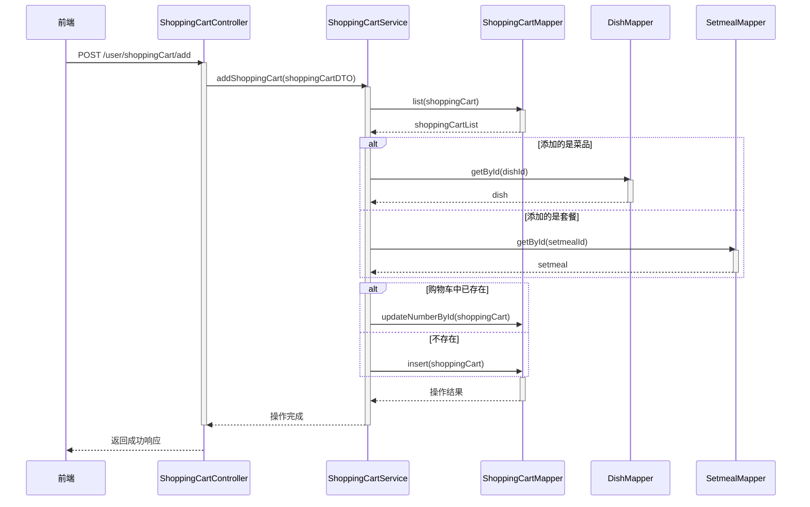
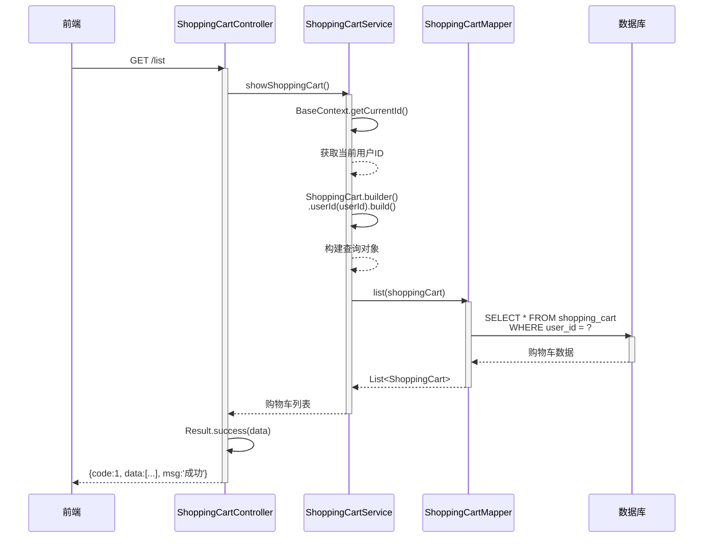
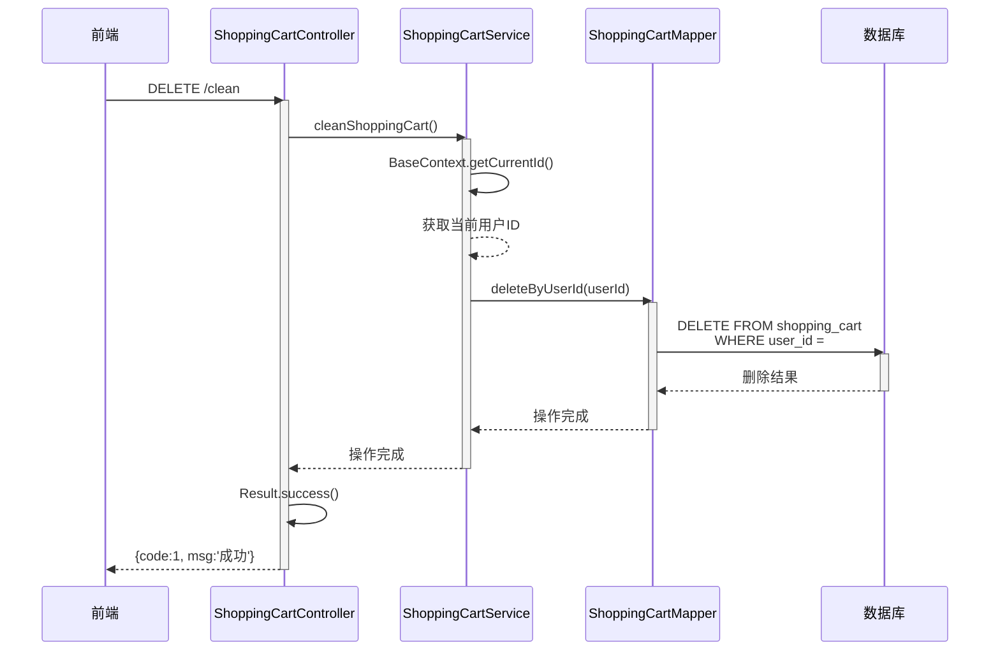

# Day 7

### **为什么需要对菜品的储存方式进行修改**：
用户端小程序展示的菜品数据都是通过查询数据库获得，如果用户端访问量比较大,数据库访问压力随之增大。


Note: 每个分类下的菜品保存一份缓存数据, 数据库中菜品数据有变更时清理缓存数据

---

### **给DishController增加按照分类查询菜品的方法：**
```java
@Autowired
private RedisTemplate redisTemplate;
/**
    * 根据分类id查询菜品
    *
    * @param categoryId
    * @return
    */
@GetMapping("/list")
@ApiOperation("根据分类id查询菜品")
public Result<List<DishVO>> list(Long categoryId) {

    //构造redis中的key，规则：dish_分类id
    String key = "dish_" + categoryId;

    //查询redis中是否存在菜品数据
    List<DishVO> list = (List<DishVO>) redisTemplate.opsForValue().get(key);
    if(list != null && list.size() > 0){
        //如果存在，直接返回，无须查询数据库
        return Result.success(list);
    }
    ////////////////////////////////////////////////////////
    Dish dish = new Dish();
    dish.setCategoryId(categoryId);
    dish.setStatus(StatusConstant.ENABLE);//查询起售中的菜品

    //如果不存在，查询数据库，将查询到的数据放入redis中
    list = dishService.listWithFlavor(dish);
    ////////////////////////////////////////////////////////
    redisTemplate.opsForValue().set(key, list);

    return Result.success(list);
}
```

**Note:** 这个接口就是前端在点击某个菜品分类时，将分类ID传到后端，然后后端根据这个分类ID查出该分类下的所有菜品，缓存在redis里，并返回给前端。

---

### **Spring Cache**
Spring Cache 是一个提供缓存功能抽象的框架，通过简单的注解即可实现缓存功能，使用便捷。它允许开发者在不侵入业务代码的情况下，灵活地添加或切换底层缓存实现。

- **核心注解：**
  
| 注解               | 说明                                                                 |
|--------------------|----------------------------------------------------------------------|
| @EnableCaching     | 开启缓存注解功能，通常添加在应用的启动类上，如 @SpringBootApplication 类。 |
| @Cacheable         | 方法执行前先查询缓存。若缓存命中，直接返回缓存结果；若未命中，执行方法后将结果存入缓存。 |
| @CachePut          | 无论缓存是否存在，都将方法的返回值存入缓存。通常用于更新缓存。              |
| @CacheEvict        | 从缓存中删除一条或多条数据。支持单个删除和批量删除。                      |

- 在save方法上加注解@CachePut:
当前UserController的save方法是用来保存用户信息的，我们希望在该用户信息保存到数据库的同时，也往缓存中缓存一份数据，我们可以在save方法上加上注解 @CachePut，用法如下：
```java
	/**
	* CachePut：将方法返回值放入缓存
	* value：缓存的名称，每个缓存名称下面可以有多个key
	* key：缓存的key
	*/

    @PostMapping
    @CachePut(value = "userCache", key = "#user.id")//key的生成：userCache::1
    public User save(@RequestBody User user){
        userMapper.insert(user);
        return user;
    }

```


**Note:**
   @CachePut 的 value 和 key 参数容易让人误以为它们直接对应缓存中的 key-value 键值对。但实际上它们是这样配合的：
    1. value: 指定缓存的名称，它是用于逻辑划分缓存空间的一个标识。例如项目中有多个功能模块，每个模块可以用不同的缓存名称，这样能更好地组织和管理缓存数据。就像去不同的文件夹（缓存名称）找相应的文件（缓存数据）。
    2. key: 用于定位缓存中具体存储位置的标识。它是基于 SpEL（Spring 表达式语言）来动态生成的，通过它可以灵活地从方法参数或返回值中提取信息来作为缓存的键。

<br>

- 在getById上加注解@Cacheable：
    作用: 在方法执行前，spring 先查看缓存中是否有数据，如果有数据，则直接返回缓存数据；若没有数据，调用方法并将方法返回值放到缓存中
    - cacheNames: 缓存的名称，每个缓存名称下面可以有多个key
    - key: 缓存的key ----------> 支持Spring的表达式语言SPEL语法
```java
/**
* Cacheable：在方法执行前spring先查看缓存中是否有数据，如果有数据，则直接返回缓存数据；若没有数据，	  *调用方法并将方法返回值放到缓存中
* cacheNames：缓存的名称，每个缓存名称下面可以有多个key
* key：缓存的key
*/
@GetMapping
@Cacheable(cacheNames = "userCache",key="#id")
public User getById(Long id){
    User user = userMapper.getById(id);
    return user;
}
```
  
**在 delete 方法上加注解@CacheEvict：**
```java
@DeleteMapping
@CacheEvict(cacheNames = "userCache",key = "#id")//删除某个key对应的缓存数据
public void deleteById(Long id){
    userMapper.deleteById(id);
}

@DeleteMapping("/delAll")
@CacheEvict(cacheNames = "userCache",allEntries = true)//删除userCache下所有的缓存数据
public void deleteAll(){
    userMapper.deleteAll();
}
```

---

### **套餐缓存**

- 管理端和用户端的setcontroller注解的区别
  - 用户端的 SetmealController
    使用 @Cacheable：用户端的套餐查询接口通常会使用 @Cacheable 注解。这样，当用户请求某个分类下的套餐列表时，系统会先检查 Redis 缓存中是否存在对应的数据。如果缓存中有数据，就直接返回缓存数据，避免了对数据库的查询，提高了响应速度。
    ```java
    /**
    * 条件查询
    *
    * @param categoryId
    * @return
    */
    @GetMapping("/list")
    @ApiOperation("根据分类id查询套餐")
    @Cacheable(cacheNames = "setmealCache",key = "#categoryId") //key: setmealCache::100
    public Result<List<Setmeal>> list(Long categoryId) {
        Setmeal setmeal = new Setmeal();
        setmeal.setCategoryId(categoryId);
        setmeal.setStatus(StatusConstant.ENABLE);

        List<Setmeal> list = setmealService.list(setmeal);
        return Result.success(list);
    }
    ```

  - 管理端的 SetmealController
    使用 @CacheEvict：管理端的套餐管理接口（如新增、修改、删除、上下架等操作）会使用 @CacheEvict 注解。当管理端对套餐数据进行修改后，相关的缓存数据会被清理或更新，以确保用户端在下一次查询时能够获取到最新的套餐信息。
    ```java
    /**
    * 新增套餐
    *
    * @param setmealDTO
    * @return
    */
    @PostMapping
    @ApiOperation("新增套餐")
    @CacheEvict(cacheNames = "setmealCache",key = "#setmealDTO.categoryId")
    //key: setmealCache::100
    //只清除与该分类 ID 相关的缓存数据，
    //而不是整个缓存空间的所有数据。这种做法更加精细和高效。

    public Result save(@RequestBody SetmealDTO setmealDTO) {
        setmealService.saveWithDish(setmealDTO);
        return Result.success();
    }
    /**
        * 批量删除套餐
        *
        * @param ids
        * @return
        */
    @DeleteMapping
    @ApiOperation("批量删除套餐")
    @CacheEvict(cacheNames = "setmealCache",allEntries = true)
    // allEntries = true 表示清除指定缓存名称下的所有条目。
    public Result delete(@RequestParam List<Long> ids) {
        setmealService.deleteBatch(ids);
        return Result.success();
    }
    /**
        * 修改套餐
        *
        * @param setmealDTO
        * @return
        */
    @PutMapping
    @ApiOperation("修改套餐")
    @CacheEvict(cacheNames = "setmealCache",allEntries = true)
    public Result update(@RequestBody SetmealDTO setmealDTO) {
        setmealService.update(setmealDTO);
        return Result.success();
    }

    /**
        * 套餐起售停售
        *
        * @param status
        * @param id
        * @return
        */
    @PostMapping("/status/{status}")
    @ApiOperation("套餐起售停售")
    @CacheEvict(cacheNames = "setmealCache",allEntries = true)
    public Result startOrStop(@PathVariable Integer status, Long id) {
        setmealService.startOrStop(status, id);
        return Result.success();
    }

    ```
 ---

### **添加购物车:**

核心业务逻辑：
1. 添加商品到购物车
接收前端请求：
前端发送一个 POST 请求到 /user/shoppingCart/add，携带 ShoppingCartDTO 对象作为请求体。
2. 调用服务层方法：
控制器层接收到请求后，调用 ShoppingCartService 的 addShoppingCart 方法。
3. 设置用户 ID：
在服务实现层，将当前登录用户的 ID 设置到 ShoppingCart 对象中，确保只能查询和操作当前用户的购物车数据。
4. 查询购物车中是否已存在商品：
根据 ShoppingCart 对象的条件（如用户 ID、菜品 ID 或套餐 ID 等），查询购物车中是否已存在该商品。
5. 更新或插入购物车数据：
如果商品已存在，更新数量（数量加 1）。
如果商品不存在，根据是否是菜品或套餐，分别查询菜品或套餐的详细信息，并插入新的购物车记录。
6. 返回响应：
操作完成后，返回成功响应给前端。

核心serviceimp代码:
```java
    package com.sky.service.impl;
    @Service
    public class ShoppingCartServiceImpl implements ShoppingCartService {

        @Autowired
        private ShoppingCartMapper shoppingCartMapper;
        @Autowired
        private DishMapper dishMapper;
        @Autowired
        private SetmealMapper setmealMapper;
        /**
         * 添加购物车
         *
         * @param shoppingCartDTO
         */
        public void addShoppingCart(ShoppingCartDTO shoppingCartDTO) {
            //shoppingCart 在这段代码中表示的是单次操作下的购物车记录，
            //而不是整个购物车的所有商品。
            ShoppingCart shoppingCart = new ShoppingCart();
            BeanUtils.copyProperties(shoppingCartDTO, shoppingCart);
            //只能查询自己的购物车数据
            shoppingCart.setUserId(BaseContext.getCurrentId());

            //判断当前商品是否在购物车中,list是查询购物车方法
            List<ShoppingCart> shoppingCartList = shoppingCartMapper.list(shoppingCart);

            if (shoppingCartList != null && shoppingCartList.size() == 1) {
                //由于每次购物车都只能增加一次，所以成功加入的size为1
                //如果已经存在，就更新数量，数量加1
                shoppingCart = shoppingCartList.get(0);
                // 表示获取查询结果列表中的第一个元素。
                // 这里假设查询结果最多有一个匹配项
                //（即同一用户不能将同一商品多次添加到购物车），
                // 因此直接取第一个元素。
                shoppingCart.setNumber(shoppingCart.getNumber() + 1);
                shoppingCartMapper.updateNumberById(shoppingCart);
            } else {
                //如果不存在，插入数据，数量就是1

                //判断当前添加到购物车的是菜品还是套餐
                Long dishId = shoppingCartDTO.getDishId();
                if (dishId != null) {
                    //添加到购物车的是菜品
                    Dish dish = dishMapper.getById(dishId);
                    shoppingCart.setName(dish.getName());
                    shoppingCart.setImage(dish.getImage());
                    shoppingCart.setAmount(dish.getPrice());
                } else {
                    //添加到购物车的是套餐
                    Setmeal setmeal = setmealMapper.getById(shoppingCartDTO.getSetmealId());
                    shoppingCart.setName(setmeal.getName());
                    shoppingCart.setImage(setmeal.getImage());
                    shoppingCart.setAmount(setmeal.getPrice());
                }
                shoppingCart.setNumber(1);
                shoppingCart.setCreateTime(LocalDateTime.now());
                shoppingCartMapper.insert(shoppingCart);
            }
        }
    }
```
Note:
- 为什么更新时不需要判断商品类型？
当更新购物车中的商品数量时，我们已经知道该商品是菜品还是套餐，因为它是通过查询购物车表得到的。购物车表中已经存储了商品的详细信息，包括商品是菜品还是套餐、商品的名称、价格、图片等。因此，更新时只需要根据查询到的记录来更新数量即可，不需要再次判断商品类型。
- 为什么插入时需要判断商品类型？
当向购物车中插入新商品时，我们需要根据商品的类型（菜品或套餐）来获取相应的信息（如名称、价格、图片等）。这是因为菜品和套餐的信息分别存储在不同的表中（菜品表和套餐表），当用户添加一个菜品到购物车时，系统需要从菜品表中获取该菜品的名称、价格、图片等信息，并将这些信息插入到购物车表中。同样地，当用户添加一个套餐时，系统需要从套餐表中获取相应的信息。需要分别查询。


**流程图：**


---

### **查询购物车**

**流程图：**


Note: 获取购物车的数据不需要前端传递任何参数。购物车数据是基于当前登录用户的 ID 来查询的。

---

### **清空购物车**

**流程图：**

---

# Day8

### **用户下单流程图：**


### **接口说明：**
1. 接口路径
    - POST /user/order/submit
2. 请求参数（OrdersSubmitDTO）
   - 地址簿id
   - 配送状态（立即送出/定时送出等）
   - 打包费
   - 总金额
   - 备注
   - 餐具数量
（还有：购物车商品列表其实从数据库查，不必前端传）

3. 返回数据（OrderSubmitVO）
   - 下单时间
   - 订单总金额
   - 订单号
   - 订单id

### **什么是回调**
回调指的是在某个操作完成后，由第三方（比如微信支付平台）主动向你的系统发起一个HTTP请求，通知你操作结果。
场景举例：
- 用户在微信支付页面完成支付，微信主动POST请求你的/notify/paySuccess接口，告知“该订单已支付成功”，这就是回调。
  

作用：
- 让你的系统能实时感知支付平台的状态变化（比如支付成功），并据此进行后续业务处理（如修改订单状态、发货等）。

### 微信支付回调为什么需要幂等性
 **什么是幂等姓：**
 同一个操作（如支付回调）被执行一次与被执行多次，对系统产生的结果是一样的，不会出现数据重复或状态混乱。

 **为什么微信支付需要：**
网络问题/安全机制下，微信等第三方平台回调可能会多次发起（比如你没及时响应，或者响应内容格式不对，都会重试！）。

如果你的回调处理代码没有幂等性，就可能出现：
- 订单状态被重复修改
- 钱包多次加钱
- 发货多次
- 数据库脏数据

**举例说明：**
- 用户付款后，微信回调你两次。如果你每次都把订单状态从“未支付”改成“已支付”，没问题。
- 如果你每次都给用户发货，用户就会收到两份货，出现重大bug！
- 正确做法：必须保证相同回调只处理一次，这就要设计幂等逻辑（比如先查订单状态，只处理未支付订单）。