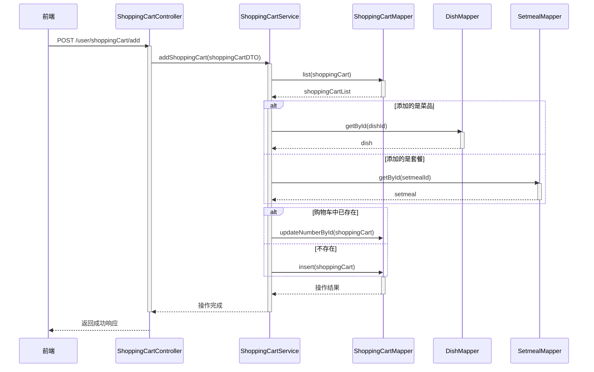
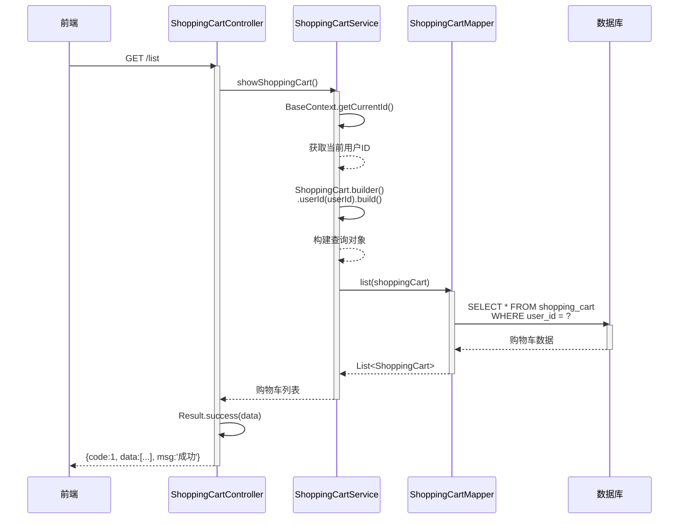
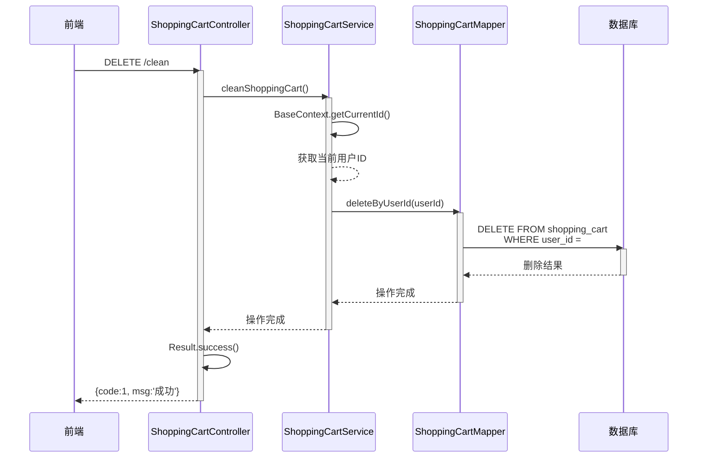
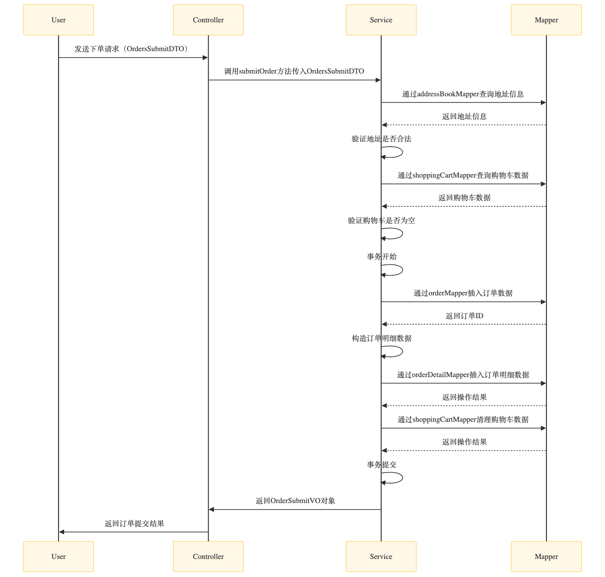
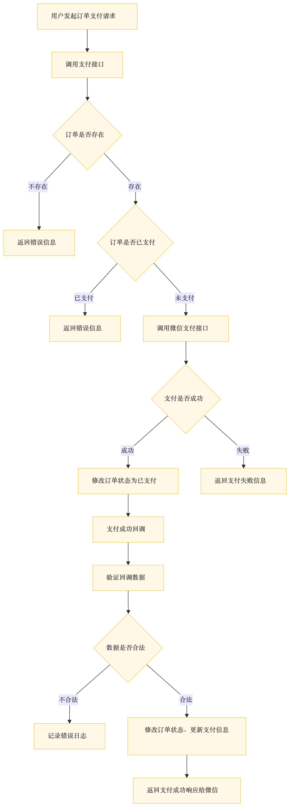
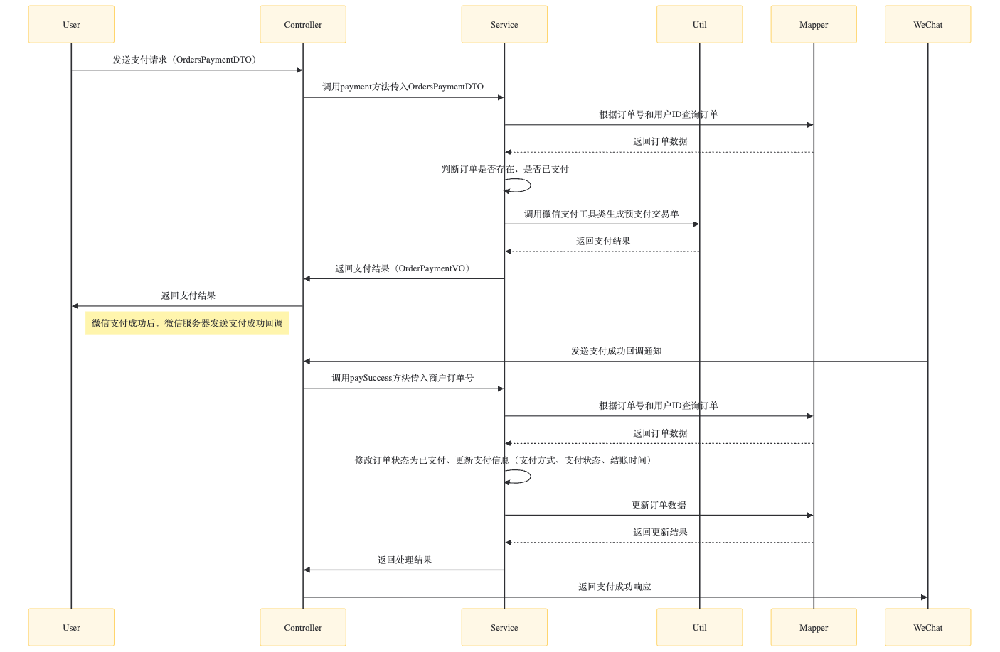
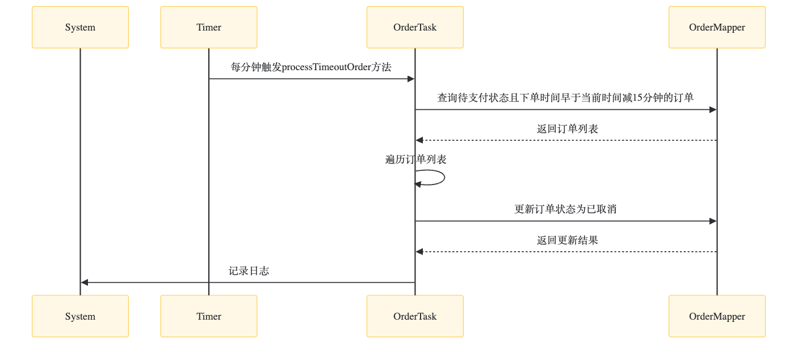
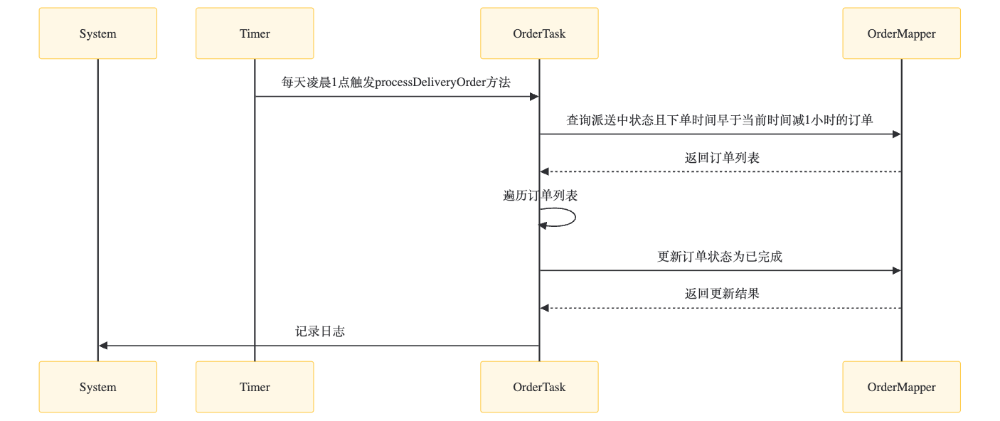

# Day 7

### **为什么需要对菜品的储存方式进行修改**：
用户端小程序展示的菜品数据都是通过查询数据库获得，如果用户端访问量比较大,数据库访问压力随之增大。


Note: 每个分类下的菜品保存一份缓存数据, 数据库中菜品数据有变更时清理缓存数据

---

### **给DishController增加按照分类查询菜品的方法：**
```java
@Autowired
private RedisTemplate redisTemplate;
/**
    * 根据分类id查询菜品
    *
    * @param categoryId
    * @return
    */
@GetMapping("/list")
@ApiOperation("根据分类id查询菜品")
public Result<List<DishVO>> list(Long categoryId) {

    //构造redis中的key，规则：dish_分类id
    String key = "dish_" + categoryId;

    //查询redis中是否存在菜品数据
    List<DishVO> list = (List<DishVO>) redisTemplate.opsForValue().get(key);
    if(list != null && list.size() > 0){
        //如果存在，直接返回，无须查询数据库
        return Result.success(list);
    }
    ////////////////////////////////////////////////////////
    Dish dish = new Dish();
    dish.setCategoryId(categoryId);
    dish.setStatus(StatusConstant.ENABLE);//查询起售中的菜品

    //如果不存在，查询数据库，将查询到的数据放入redis中
    list = dishService.listWithFlavor(dish);
    ////////////////////////////////////////////////////////
    redisTemplate.opsForValue().set(key, list);

    return Result.success(list);
}
```

**Note:** 这个接口就是前端在点击某个菜品分类时，将分类ID传到后端，然后后端根据这个分类ID查出该分类下的所有菜品，缓存在redis里，并返回给前端。

---

### **Spring Cache**
Spring Cache 是一个提供缓存功能抽象的框架，通过简单的注解即可实现缓存功能，使用便捷。它允许开发者在不侵入业务代码的情况下，灵活地添加或切换底层缓存实现。

- **核心注解：**
  
| 注解               | 说明                                                                 |
|--------------------|----------------------------------------------------------------------|
| @EnableCaching     | 开启缓存注解功能，通常添加在应用的启动类上，如 @SpringBootApplication 类。 |
| @Cacheable         | 方法执行前先查询缓存。若缓存命中，直接返回缓存结果；若未命中，执行方法后将结果存入缓存。 |
| @CachePut          | 无论缓存是否存在，都将方法的返回值存入缓存。通常用于更新缓存。              |
| @CacheEvict        | 从缓存中删除一条或多条数据。支持单个删除和批量删除。                      |

- 在save方法上加注解@CachePut:
当前UserController的save方法是用来保存用户信息的，我们希望在该用户信息保存到数据库的同时，也往缓存中缓存一份数据，我们可以在save方法上加上注解 @CachePut，用法如下：
```java
	/**
	* CachePut：将方法返回值放入缓存
	* value：缓存的名称，每个缓存名称下面可以有多个key
	* key：缓存的key
	*/

    @PostMapping
    @CachePut(value = "userCache", key = "#user.id")//key的生成：userCache::1
    public User save(@RequestBody User user){
        userMapper.insert(user);
        return user;
    }

```


**Note:**
   @CachePut 的 value 和 key 参数容易让人误以为它们直接对应缓存中的 key-value 键值对。但实际上它们是这样配合的：
    1. value: 指定缓存的名称，它是用于逻辑划分缓存空间的一个标识。例如项目中有多个功能模块，每个模块可以用不同的缓存名称，这样能更好地组织和管理缓存数据。就像去不同的文件夹（缓存名称）找相应的文件（缓存数据）。
    2. key: 用于定位缓存中具体存储位置的标识。它是基于 SpEL（Spring 表达式语言）来动态生成的，通过它可以灵活地从方法参数或返回值中提取信息来作为缓存的键。

<br>

- 在getById上加注解@Cacheable：
    作用: 在方法执行前，spring 先查看缓存中是否有数据，如果有数据，则直接返回缓存数据；若没有数据，调用方法并将方法返回值放到缓存中
    - cacheNames: 缓存的名称，每个缓存名称下面可以有多个key
    - key: 缓存的key ----------> 支持Spring的表达式语言SPEL语法
```java
/**
* Cacheable：在方法执行前spring先查看缓存中是否有数据，如果有数据，则直接返回缓存数据；若没有数据，	  *调用方法并将方法返回值放到缓存中
* cacheNames：缓存的名称，每个缓存名称下面可以有多个key
* key：缓存的key
*/
@GetMapping
@Cacheable(cacheNames = "userCache",key="#id")
public User getById(Long id){
    User user = userMapper.getById(id);
    return user;
}
```
  
**在 delete 方法上加注解@CacheEvict：**
```java
@DeleteMapping
@CacheEvict(cacheNames = "userCache",key = "#id")//删除某个key对应的缓存数据
public void deleteById(Long id){
    userMapper.deleteById(id);
}

@DeleteMapping("/delAll")
@CacheEvict(cacheNames = "userCache",allEntries = true)//删除userCache下所有的缓存数据
public void deleteAll(){
    userMapper.deleteAll();
}
```

---

### **套餐缓存**

- 管理端和用户端的setcontroller注解的区别
  - 用户端的 SetmealController
    使用 @Cacheable：用户端的套餐查询接口通常会使用 @Cacheable 注解。这样，当用户请求某个分类下的套餐列表时，系统会先检查 Redis 缓存中是否存在对应的数据。如果缓存中有数据，就直接返回缓存数据，避免了对数据库的查询，提高了响应速度。
    ```java
    /**
    * 条件查询
    *
    * @param categoryId
    * @return
    */
    @GetMapping("/list")
    @ApiOperation("根据分类id查询套餐")
    @Cacheable(cacheNames = "setmealCache",key = "#categoryId") //key: setmealCache::100
    public Result<List<Setmeal>> list(Long categoryId) {
        Setmeal setmeal = new Setmeal();
        setmeal.setCategoryId(categoryId);
        setmeal.setStatus(StatusConstant.ENABLE);

        List<Setmeal> list = setmealService.list(setmeal);
        return Result.success(list);
    }
    ```

  - 管理端的 SetmealController
    使用 @CacheEvict：管理端的套餐管理接口（如新增、修改、删除、上下架等操作）会使用 @CacheEvict 注解。当管理端对套餐数据进行修改后，相关的缓存数据会被清理或更新，以确保用户端在下一次查询时能够获取到最新的套餐信息。
    ```java
    /**
    * 新增套餐
    *
    * @param setmealDTO
    * @return
    */
    @PostMapping
    @ApiOperation("新增套餐")
    @CacheEvict(cacheNames = "setmealCache",key = "#setmealDTO.categoryId")
    //key: setmealCache::100
    //只清除与该分类 ID 相关的缓存数据，
    //而不是整个缓存空间的所有数据。这种做法更加精细和高效。

    public Result save(@RequestBody SetmealDTO setmealDTO) {
        setmealService.saveWithDish(setmealDTO);
        return Result.success();
    }
    /**
        * 批量删除套餐
        *
        * @param ids
        * @return
        */
    @DeleteMapping
    @ApiOperation("批量删除套餐")
    @CacheEvict(cacheNames = "setmealCache",allEntries = true)
    // allEntries = true 表示清除指定缓存名称下的所有条目。
    public Result delete(@RequestParam List<Long> ids) {
        setmealService.deleteBatch(ids);
        return Result.success();
    }
    /**
        * 修改套餐
        *
        * @param setmealDTO
        * @return
        */
    @PutMapping
    @ApiOperation("修改套餐")
    @CacheEvict(cacheNames = "setmealCache",allEntries = true)
    public Result update(@RequestBody SetmealDTO setmealDTO) {
        setmealService.update(setmealDTO);
        return Result.success();
    }

    /**
        * 套餐起售停售
        *
        * @param status
        * @param id
        * @return
        */
    @PostMapping("/status/{status}")
    @ApiOperation("套餐起售停售")
    @CacheEvict(cacheNames = "setmealCache",allEntries = true)
    public Result startOrStop(@PathVariable Integer status, Long id) {
        setmealService.startOrStop(status, id);
        return Result.success();
    }

    ```
 ---

### **添加购物车:**

核心业务逻辑：
1. 添加商品到购物车
接收前端请求：
前端发送一个 POST 请求到 /user/shoppingCart/add，携带 ShoppingCartDTO 对象作为请求体。
2. 调用服务层方法：
控制器层接收到请求后，调用 ShoppingCartService 的 addShoppingCart 方法。
3. 设置用户 ID：
在服务实现层，将当前登录用户的 ID 设置到 ShoppingCart 对象中，确保只能查询和操作当前用户的购物车数据。
4. 查询购物车中是否已存在商品：
根据 ShoppingCart 对象的条件（如用户 ID、菜品 ID 或套餐 ID 等），查询购物车中是否已存在该商品。
5. 更新或插入购物车数据：
如果商品已存在，更新数量（数量加 1）。
如果商品不存在，根据是否是菜品或套餐，分别查询菜品或套餐的详细信息，并插入新的购物车记录。
6. 返回响应：
操作完成后，返回成功响应给前端。

核心serviceimp代码:
```java
    package com.sky.service.impl;
    @Service
    public class ShoppingCartServiceImpl implements ShoppingCartService {

        @Autowired
        private ShoppingCartMapper shoppingCartMapper;
        @Autowired
        private DishMapper dishMapper;
        @Autowired
        private SetmealMapper setmealMapper;
        /**
         * 添加购物车
         *
         * @param shoppingCartDTO
         */
        public void addShoppingCart(ShoppingCartDTO shoppingCartDTO) {
            //shoppingCart 在这段代码中表示的是单次操作下的购物车记录，
            //而不是整个购物车的所有商品。
            ShoppingCart shoppingCart = new ShoppingCart();
            BeanUtils.copyProperties(shoppingCartDTO, shoppingCart);
            //只能查询自己的购物车数据
            shoppingCart.setUserId(BaseContext.getCurrentId());

            //判断当前商品是否在购物车中,list是查询购物车方法
            List<ShoppingCart> shoppingCartList = shoppingCartMapper.list(shoppingCart);

            if (shoppingCartList != null && shoppingCartList.size() == 1) {
                //由于每次购物车都只能增加一次，所以成功加入的size为1
                //如果已经存在，就更新数量，数量加1
                shoppingCart = shoppingCartList.get(0);
                // 表示获取查询结果列表中的第一个元素。
                // 这里假设查询结果最多有一个匹配项
                //（即同一用户不能将同一商品多次添加到购物车），
                // 因此直接取第一个元素。
                shoppingCart.setNumber(shoppingCart.getNumber() + 1);
                shoppingCartMapper.updateNumberById(shoppingCart);
            } else {
                //如果不存在，插入数据，数量就是1

                //判断当前添加到购物车的是菜品还是套餐
                Long dishId = shoppingCartDTO.getDishId();
                if (dishId != null) {
                    //添加到购物车的是菜品
                    Dish dish = dishMapper.getById(dishId);
                    shoppingCart.setName(dish.getName());
                    shoppingCart.setImage(dish.getImage());
                    shoppingCart.setAmount(dish.getPrice());
                } else {
                    //添加到购物车的是套餐
                    Setmeal setmeal = setmealMapper.getById(shoppingCartDTO.getSetmealId());
                    shoppingCart.setName(setmeal.getName());
                    shoppingCart.setImage(setmeal.getImage());
                    shoppingCart.setAmount(setmeal.getPrice());
                }
                shoppingCart.setNumber(1);
                shoppingCart.setCreateTime(LocalDateTime.now());
                shoppingCartMapper.insert(shoppingCart);
            }
        }
    }
```
Note:
- 为什么更新时不需要判断商品类型？
当更新购物车中的商品数量时，我们已经知道该商品是菜品还是套餐，因为它是通过查询购物车表得到的。购物车表中已经存储了商品的详细信息，包括商品是菜品还是套餐、商品的名称、价格、图片等。因此，更新时只需要根据查询到的记录来更新数量即可，不需要再次判断商品类型。
- 为什么插入时需要判断商品类型？
当向购物车中插入新商品时，我们需要根据商品的类型（菜品或套餐）来获取相应的信息（如名称、价格、图片等）。这是因为菜品和套餐的信息分别存储在不同的表中（菜品表和套餐表），当用户添加一个菜品到购物车时，系统需要从菜品表中获取该菜品的名称、价格、图片等信息，并将这些信息插入到购物车表中。同样地，当用户添加一个套餐时，系统需要从套餐表中获取相应的信息。需要分别查询。


**流程图：**


---

### **查询购物车**

**流程图：**


Note: 获取购物车的数据不需要前端传递任何参数。购物车数据是基于当前登录用户的 ID 来查询的。

---

### **清空购物车**

**流程图：**

---

# Day8

### **用户下单流程图：**



### **接口说明：**
1. 接口路径
    - POST /user/order/submit
2. 请求参数（OrdersSubmitDTO）
   - 地址簿id
   - 配送状态（立即送出/定时送出等）
   - 打包费
   - 总金额
   - 备注
   - 餐具数量
（还有：购物车商品列表其实从数据库查，不必前端传）

3. 返回数据（OrderSubmitVO）
   - 下单时间
   - 订单总金额
   - 订单号
   - 订单id

### **什么是回调**
回调指的是在某个操作完成后，由第三方（比如微信支付平台）主动向你的系统发起一个HTTP请求，通知你操作结果。
场景举例：
- 用户在微信支付页面完成支付，微信主动POST请求你的/notify/paySuccess接口，告知“该订单已支付成功”，这就是回调。
  

作用：
- 让你的系统能实时感知支付平台的状态变化（比如支付成功），并据此进行后续业务处理（如修改订单状态、发货等）。

### 微信支付回调为什么需要幂等性
 **什么是幂等姓：**
 同一个操作（如支付回调）被执行一次与被执行多次，对系统产生的结果是一样的，不会出现数据重复或状态混乱。

 **为什么微信支付需要：**
网络问题/安全机制下，微信等第三方平台回调可能会多次发起（比如你没及时响应，或者响应内容格式不对，都会重试！）。

如果你的回调处理代码没有幂等性，就可能出现：
- 订单状态被重复修改
- 钱包多次加钱
- 发货多次
- 数据库脏数据

**举例说明：**
- 用户付款后，微信回调你两次。如果你每次都把订单状态从“未支付”改成“已支付”，没问题。
- 如果你每次都给用户发货，用户就会收到两份货，出现重大bug！
- 正确做法：必须保证相同回调只处理一次，这就要设计幂等逻辑（比如先查订单状态，只处理未支付订单）。

**微信支付流程图：**


<br>

**微信支付时序图：**


---

# Spring Task
**cron表达式：**
- 其实就是一个字符串，通过cron表达式可以定义任务触发的时间。
- 构成规则： 分为6或7个域，由空格分隔开，每个域代表一个含义，
每个域的含义分别为：秒、分钟、小时、日、月、周、年(可选)
- 一般日和周的值不同时设置，其中一个设置，另一个用？表示。

---

# 订单状态定时处理
**支付超时订单处理（自动关单）**
  - 订单下单后，15分钟内未支付，则系统自动把订单状态改为“已取消”，并记录取消原因和时间。
  - 频率：每分钟检查一次。
  - 代码如下：

    ```java
    public void processTimeoutOrder(){
        LocalDateTime time = LocalDateTime.now().plusMinutes(-15);
        List<Orders> ordersList = orderMapper.getByStatusAndOrdertimeLT(Orders.PENDING_PAYMENT, time);
        if(ordersList != null && ordersList.size() > 0){
            ordersList.forEach(order -> {
                order.setStatus(Orders.CANCELLED);
                order.setCancelReason("支付超时，自动取消");
                order.setCancelTime(LocalDateTime.now());
                orderMapper.update(order);
            });
        }
    }
    ```
    ```sql
    @Select("select * from orders where status = #{status} and order_time < #{orderTime}")
    List<Orders> getByStatusAndOrdertimeLT(Integer status, LocalDateTime orderTime);
    ```



**派送中订单自动完成**
  - 订单处于“派送中”状态，且超过1小时还未操作为“已完成”，系统自动将其设置为“已完成”。
  - 频率：每天凌晨1点触发一次。
  - 代码如下：
    ```java
    public void processDeliveryOrder(){
        LocalDateTime time = LocalDateTime.now().plusMinutes(-60);
        List<Orders> ordersList = orderMapper.getByStatusAndOrdertimeLT(Orders.DELIVERY_IN_PROGRESS, time);
        if(ordersList != null && ordersList.size() > 0){
            ordersList.forEach(order -> {
                order.setStatus(Orders.COMPLETED);
                orderMapper.update(order);
            });
        }
    }
    ```
    

**订单状态流转是否具有幂等性：**
- 你有一个定时任务，把“待支付超时订单”状态从待支付（1）改为已取消（5）。这个任务如果因为某种原因重复执行了2次，或者多线程/多实例并发执行，如果每次都能正确把状态从1->5，并且不会因为重复操作导致数据异常，这就是幂等的。
    ```java
    order.setStatus(Orders.CANCELLED);
    // 只把当前状态是“待支付”的订单改为“已取消”
    orderMapper.update(order);
    ```
- sol: update时加where status=xxx，避免并发多次处理
    ```sql
    UPDATE orders SET status=5 WHERE id=123 AND status=1
    ```
    只会把状态=1（待支付）的订单改为已取消，如果状态已经被其他线程/任务改为5（已取消）了，这次update就什么都不做。

---

# 来单提醒

用户下单并且支付成功后，需要第一时间通知外卖商家。通知的形式有如下两种：
- 语音播报
- 弹出提示框

步骤如下：
- 通过WebSocket实现管理端页面和服务端保持长连接状态
- 当客户支付后，调用WebSocket的相关API实现服务端向客户端推送消息
- 客户端浏览器解析服务端推送的消息，判断是来单提醒还是客户催单，进行相应的消息提示和语音播报
- 约定服务端发送给客户端浏览器的数据格式为JSON，字段包括：type，orderId，content
  - type 为消息类型，1为来单提醒 2为客户催单
  - orderId 为订单id
  - content 为消息内容

```java
    @Autowired
    private WebSocketServer webSocketServer;
	/**
     * 支付成功，修改订单状态
     *
     * @param outTradeNo
     */
    public void paySuccess(String outTradeNo) {
        // 当前登录用户id
        Long userId = BaseContext.getCurrentId();

        // 根据订单号查询当前用户的订单
        // 根据订单号（outTradeNo）和当前登录用户id（userId）
        // 联合查询，拿到唯一订单（ordersDB）。
        Orders ordersDB = orderMapper.getByNumberAndUserId(outTradeNo, userId);

        //BaseContext.getCurrentId()只是用来查出当前用户，
        //辅助定位当前登录用户的订单。


        // 根据订单id更新订单的状态、支付方式、支付状态、结账时间
        Orders orders = Orders.builder()
                .id(ordersDB.getId())
                .status(Orders.TO_BE_CONFIRMED)
                .payStatus(Orders.PAID)
                .checkoutTime(LocalDateTime.now())
                .build();

        //这里的update，是通过订单的id唯一定位的
        //（ordersDB.getId()）
        orderMapper.update(orders);
		//////////////////////////////////////////////
        Map map = new HashMap();
        map.put("type", 1);//消息类型，1表示来单提醒
        map.put("orderId", orders.getId());
        map.put("content", "订单号：" + outTradeNo);

        //通过WebSocket实现来单提醒，向客户端浏览器推送消息
        webSocketServer.sendToAllClient(JSON.toJSONString(map));
        ///////////////////////////////////////////////////
    }
```


# Day11

### 营业额统计

**TurnoverReportVO.java设计：**
- code (integer)
接口状态码：用于标识本次请求是否成功，一般约定：
  - 200：成功
  - 其他：失败（如400参数错误，500服务异常等）

- data (object)
本次营业额统计的主要数据都在这里，结构如下：
  - dateList (string)：日期列表，例如 "2024-06-01,2024-06-02,2024-06-03"
逗号分隔，前端可用split(',')处理成数组。
  - turnoverList (string)：营业额列表，例如 "1000,1200,900"
    逗号分隔，每个值与dateList一一对应。


**代码详情：**
Controller层：
```java
package com.sky.controller.admin;
/**
 * 报表
 */
@RestController
@RequestMapping("/admin/report")
@Slf4j
@Api(tags = "统计报表相关接口")
public class ReportController {

    @Autowired
    private ReportService reportService;

    /**
     * 营业额数据统计
     *
     * @param begin
     * @param end
     * @return
     */
    @GetMapping("/turnoverStatistics")
    @ApiOperation("营业额数据统计")
    public Result<TurnoverReportVO> turnoverStatistics(
        //begin和end通过接口获得：
        //GET /admin/report/turnoverStatistics?begin=2024-06-01&end=2024-06-07
            @DateTimeFormat(pattern = "yyyy-MM-dd")  LocalDate begin,
            @DateTimeFormat(pattern = "yyyy-MM-dd")  LocalDate end) {

        return Result.success(reportService.getTurnover(begin, end));

    }
}
```

Service层：
```java
package com.sky.service.impl;

@Service
@Slf4j
public class ReportServiceImpl implements ReportService {

    @Autowired
    private OrderMapper orderMapper;

    /**
     * 根据时间区间统计营业额
     * @param begin
     * @param end
     * @return
     */
    public TurnoverReportVO getTurnover(LocalDate begin, LocalDate end) {
        List<LocalDate> dateList = new ArrayList<>();
        dateList.add(begin);

        // 将每一天加入到集合中，组成x轴日期数据
        while (!begin.equals(end)){
            begin = begin.plusDays(1);//日期计算，获得指定日期后1天的日期
            dateList.add(begin);
        }

        // 接下来根据日期数据，获得对应的y轴数据
       List<Double> turnoverList = new ArrayList<>();

        for (LocalDate date : dateList) {
            //构造一天的起止时间,放入map中以查出一天所有订单
            LocalDateTime beginTime = LocalDateTime.of(date, LocalTime.MIN);
            LocalDateTime endTime = LocalDateTime.of(date, LocalTime.MAX);

            //用Map封装查询条件
            Map map = new HashMap();
            // 状态已完成
        	map.put("status", Orders.COMPLETED);
        	map.put("begin",beginTime);
        	map.put("end", endTime);

            Double turnover = orderMapper.sumByMap(map); 
            // 如果查询的数据是null，则设置0.0
            turnover = turnover == null ? 0.0 : turnover;

            // 添加进入集合中，组成y轴数据
            turnoverList.add(turnover);
        }

        //数据封装：根据接口文档要求，使用逗号，隔开
        return TurnoverReportVO.builder()
                .dateList(StringUtils.join(dateList,","))
                .turnoverList(StringUtils.join(turnoverList,","))
                .build();
    }
}

```
### Mapper常见参数传递方式

**1. 用Map作为参数:**

写法：
```java
public List<Order> selectByMap(Map<String, Object> params);
``` 
用法：
```java
Map<String, Object> map = new HashMap<>();
map.put("begin", beginTime);
map.put("end", endTime);
map.put("status", Orders.COMPLETED);
orderMapper.selectByMap(map);
```
映射：
```xml
<select id="selectByMap" resultType="Order">
  SELECT * FROM orders
  WHERE order_time >= #{begin}
    AND order_time <= #{end}
    AND status = #{status}
</select>
```
优点：
MyBatis会把map中的key当做参数名，value为参数值。
SQL里用#{key}来引用，灵活可选，适合动态参数、可选参数多的场景。

**2. 用普通类型（单个/多个）作为参数：**
不加@Param写法：
```java
public Order selectByIdAndStatus(Long id, Integer status);
```

XML映射：
```xml
<select id="selectByIdAndStatus" resultType="Order">
  SELECT * FROM orders WHERE id = #{param1} AND status = #{param2}
</select>
```
注意：
- 如果没有加@Param注解，MyBatis会按顺序给参数命名为param1、param2、param3...
- id对应param1，status对应param2。

使用 @Param 注解自定义参数名：
```java
Order selectByIdAndStatus(@Param("id") Long id, @Param("status") Integer status);
```

XML映射：
```xml
<select id="selectByIdAndStatus" resultType="Order">
  SELECT * FROM orders WHERE id = #{id} AND status = #{status}
</select>
</select>
```
注意：
- 加了@Param("xxx")，XML里就可以用#{id}、#{status}，更直观、易维护。
- 推荐做法，参数多时一定要用@Param，否则容易出错。


**3. 用POJO/DTO作为参数:**
写法：
```java
public List<Order> selectByCondition(OrderQueryDTO queryDTO);
```
XML映射：
```xml
<select id="selectByCondition" resultType="Order">
  SELECT * FROM orders
  WHERE status = #{status}
    AND order_time >= #{begin}
    AND order_time <= #{end}
</select>
```
原理：
MyBatis自动把DTO的属性映射为SQL参数。
优点：结构清晰、参数多时方便、类型安全。

---

### 用户统计

**核心代码：**

```java
    @Override
    public UserReportVO getUserStatistics(LocalDate begin, LocalDate end) {
        // 创建日期集合，组装X轴数据
        List<LocalDate> dateList = new ArrayList<>();
        dateList.add(begin);

    // 将每一天加入到集合中，组成x轴日期数据
    // 生成从begin到end的所有日期列表，比如2024-06-01 ~ 2024-06-05，
    // 则dateList为[6.1, 6.2, 6.3, 6.4, 6.5]。
        while (!begin.equals(end)){
            begin = begin.plusDays(1);
            dateList.add(begin);
        }

        // 创建新增用户数、总用户数集合，组装Y轴数据
        List<Integer> newUserList = new ArrayList<>(); //新增用户数
        List<Integer> totalUserList = new ArrayList<>(); //总用户数

        for (LocalDate date : dateList) {
            LocalDateTime beginTime = LocalDateTime.of(date, LocalTime.MIN);
            LocalDateTime endTime = LocalDateTime.of(date, LocalTime.MAX);
            //新增用户数量 select count(id) from user where create_time > ? and create_time < ?
            // 统计当天0点到24点之间注册的用户数
            Integer newUser = getUserCount(beginTime, endTime);
            // 统计截止到当天24点之前，注册的所有用户数
            //总用户数量 select count(id) from user where  create_time < ?
            Integer totalUser = getUserCount(null, endTime);

            // 添加进入集合中，组成y轴数据
            newUserList.add(newUser);
            totalUserList.add(totalUser);
        }

        return UserReportVO.builder()
                .dateList(StringUtils.join(dateList,","))
                .newUserList(StringUtils.join(newUserList,","))
                .totalUserList(StringUtils.join(totalUserList,","))
                .build();
    }
```
- 解析：
  - 整体业务目标
这个getUserStatistics方法用于实现用户数据统计分析，主要功能是：
    1. 给定时间区间（begin ~ end），统计每天的新增用户数和平台总用户数。
    2. 返回的数据结构，前端可以直接用于画报表（比如用户增长趋势折线图）。

---

### 如何将对象集合（List<GoodsSalesDTO>）中的属性提取出来，拼接成逗号分隔的字符串

**代码逐步解析：**
1. 构造假数据
```java
ArrayList<GoodsSalesDTO> goodsSalesDTOS = new ArrayList<>();
for (int i = 0; i < 4; i++) {
    GoodsSalesDTO dto = GoodsSalesDTO.builder().name("apple" + i).number(i + 3).build();
    goodsSalesDTOS.add(dto);
}
System.out.println(goodsSalesDTOS);
```
- 创建了一个GoodsSalesDTO对象的集合，模拟了4个商品（apple0~3），销量分别为3,4,5,6。
- 典型的“DTO造数据”过程。

2. 提取商品名list并拼接
```java
List<String> nameList = goodsSalesDTOS.stream().map(GoodsSalesDTO::getName).collect(Collectors.toList());
// map方法会对流中的每一个元素执行一遍GoodsSalesDTO::getName，
// 即把每个DTO对象的name属性提取出来。
// .collectors把上一步流式处理后的结果（Stream<String>）
// 收集成一个新的List。
String nameListStr = StringUtils.join(nameList, ",");
System.out.println("nameListStr:"+nameListStr);
```
- 通过stream().map(...).collect(...)把每个DTO里的name提取出来组成List。
- 然后用StringUtils.join(list, ",")拼接成“apple0,apple1,apple2,apple3”。

3. 提取销量list并拼接
```java
List<Integer> numberlist = goodsSalesDTOS.stream().map(GoodsSalesDTO::getNumber).collect(Collectors.toList());
String numberlistStr = StringUtils.join(numberlist, ",");
System.out.println("numberlistStr:"+numberlistStr);
```
- 方式同上，把number属性提出来，拼成“3,4,5,6”。
