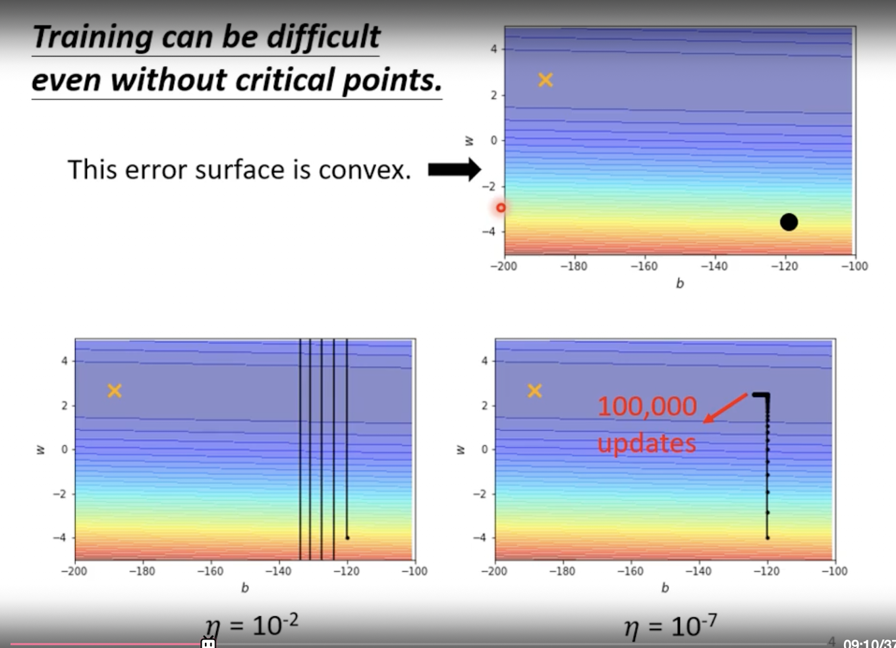
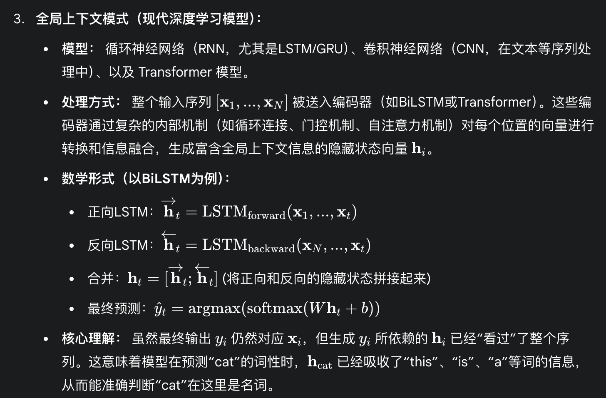
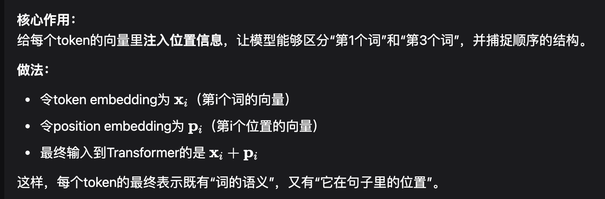
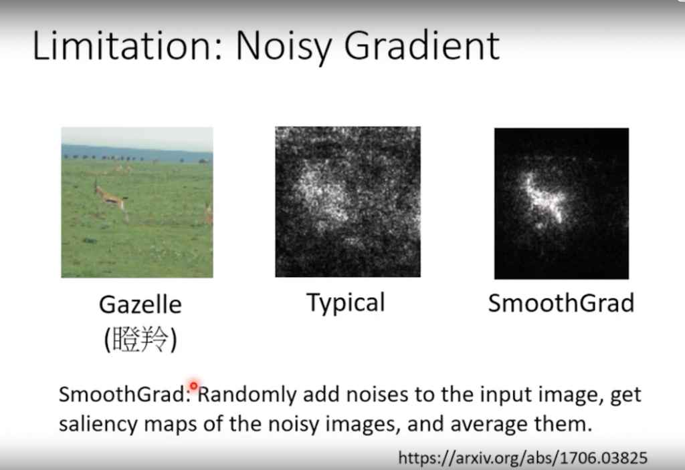

### 前向传播的示例


一个包含单个隐藏层的前馈神经网络的**前向传播（Forward Propagation）**过程。从输入层的特征接收，到隐藏层的“加权求和 -> 激活”，再到输出层的最终合成，每一个步骤和对应的数学公式都描述得准确无误。

特别是您将展开的求和公式：

$$
y = b + \sum_i c_i \cdot \mathrm{sigmoid}(b_i + \sum_j w_{ij} x_j)
$$

与简洁的矩阵/向量形式：

$$
y = b + \mathbf{c}^T \mathbf{a} \quad\quad \text{其中} \quad \mathbf{a} = \mathrm{sigmoid}(\mathbf{b}_{\text{hidden}} + \mathbf{W} \mathbf{x})
$$

---

### “线性变换（加权求和）+ 非线性变换（激活函数）”的层叠结构。


### 深度学习的主要目标：

1. **最终目标：最小化损失函数**  
   深度学习模型训练的唯一目标，是找到一组最优的参数 $\theta^*$，使得损失函数 $L$ 的值最小。损失函数衡量了模型预测值与真实值之间的差距，损失越小，模型就越“聪明”。  
   数学表达为：

   $$
   \theta^* = \arg\min_\theta L(\theta)
   $$

   - $L(\theta)$：损失函数（Loss Function），例如均方误差（MSE）或交叉熵损失。
   - $\theta$：参数向量（Parameter Vector），它是一个包含了模型所有需要学习的参数（如神经网络的权重 $w$ 和偏置 $b$）的巨大向量。  
     $$
     \theta = 
     \begin{bmatrix}
     \theta_1 \\
     \theta_2 \\
     \theta_3 \\
     \vdots
     \end{bmatrix}
     $$

---

2. **核心工具：梯度（Gradient）**  
   梯度是一个向量，表示损失函数 $L$ 对每一个参数 $\theta_i$ 的偏导数。

   $$
   g = \nabla L(\theta) = 
   \begin{bmatrix}
   \frac{\partial L}{\partial \theta_1} \\
   \frac{\partial L}{\partial \theta_2} \\
   \frac{\partial L}{\partial \theta_3} \\
   \vdots
   \end{bmatrix}
   $$

   梯度的本质含义是：函数值在当前点上升最快的方向。也就是说，梯度向量指向的方向，是让损失函数 $L$ 增幅最大的方向。

---

3. **核心动作：参数更新（Parameter Update）**  
   为了让损失函数减小，我们需要让参数 $\theta$ 沿着梯度的**反方向**进行更新。这就是梯度下降法的核心思想。

    更新公式为：

  $$
  \theta_{\text{new}} = \theta_{\text{old}} - \eta \cdot g
  $$

 其中 $\eta$ (eta)：**学习率（Learning Rate）**，它是一个超参数，用来控制每一步更新的“步长”大小。它决定了我们沿着梯度反方向前进的距离。

---

### **朴素梯度下降法（Vanilla Gradient Descent）**。
它虽然是核心，但在应对深度学习复杂结构的优化问题时，会遇到三个主要挑战：

1. **在“峡谷”地带收敛缓慢且振荡（Slow Convergence in Ravines）**：  
   深度学习的损失函数曲面通常不是“漂亮的碗”，而是充满了狭长、陡峭的“峡谷”。朴素梯度下降在这种地形下，会在峡谷两侧来回振荡，而沿着峡谷底部（最优方向）的前进速度却非常慢。

2. **容易陷入局部最优或鞍点（Stuck in Local Minima or Saddle Points）**：  
   在高维空间中，损失函数曲面充满了局部小值点和鞍点。在这些点，梯度值接近于零（$g = 0$）。一旦参数更新到这里，梯度消失，优化过程就会“卡住”并提前停止，尽管这种并非全局最优解。

3. **对所有参数使用相同的学习率（One Learning Rate for All）**：  
   朴素梯度下降法对所有参数 $\theta$ 都使用同一个学习率 $\eta$，但在实际模型中，不同参数的重要性不同，它们需要的更新步长也可能天差地别。例如，某些参数可能已经接近最优值，需要微调（小步长），而另一些参数离最优值还很远，需要大步快跑（大步长）。单一的 $\eta$ 无法满足这种差异化的需求。

---

### 小批量梯度下降法（Mini-batch Gradient Descent）

1. **核心目标** 
   - 公式：$\theta^* = \arg\min L$  
   - 解释：找到一组最优参数 $\theta^*$，使得在整个**数据集**上的总损失 $L$ 最小。

2. **核心思想：化整为零，小步快跑** 
   - 对比方法：  
     - **不用 $L$（总损失）**：直接基于全部数据计算梯度，虽然精准但速度极慢，且消耗巨大内存。
     - **改用 $L_\text{batch}$（批次损失）**：将数据集 $N$ 切分为多个小批次 batch。每次更新只基于一小批数据，用局部的、近似的梯度进行快速迭代。
     - **精髓：高频更新**。用计算速度换取梯度精度，通过大量迭代次数逼近最优解。

---
#### 步骤
1. **初始化**：随机设定模型参数的起点 $\theta^0$。
2. **开始循环（遍历所有批次）**：
   - 处理第 1 批（Batch 1）：
     - 计算损失：$L^1$（仅基于 Batch 1 和 $\theta^0$ 计算）
     - 计算梯度：$g^1 = \nabla L^1(\theta^0)$
     - 更新参数：$\theta^1 \leftarrow \theta^0 - \eta g^1$
   - 处理第 2 批（Batch 2）：
     - 计算损失：$L^2$（仅基于 Batch 2 和 新参数 $\theta^1$ 计算）
     - 计算梯度：$g^2 = \nabla L^2(\theta^1)$
     - 更新参数：$\theta^2 \leftarrow \theta^1 - \eta g^2$
   - 处理第 k 批（Batch k）：
     - 使用上一步更新后的参数 $\theta^{k-1}$ 进行计算。
     - 更新得到新参数 $\theta^k$。
3. 循环结束：当所有批次都处理完毕，一轮 **Epoch** 结束。

一个 Epoch 代表着对整个训练数据集的一次完整遍历。而这个遍历不是一次性完成的，而是被拆分成了若干个迭代（Iteration），每一次迭代就是“处理一个批次，计算梯度，更新参数”的步骤。

---

4. **关键词语**
   - $\theta$ (Theta)：模型的所有参数（权重 $w$、偏置 $b$）。
   - $\eta$ (Eta)：学习率，即每次参数更新的步长。
   - `batch`：从总数据中分出的一小份数据。
   - Batch Size：每个 batch 中包含的数据样本数量。
   - Epoch（轮次）：模型完整地、不重不漏地处理完所有 batch 的一遍过程。

---

5. **优缺点**  
   - 优点：
     - **速度快**：相对于计算全部数据，每次迭代的计算量小得多。
     - **内存友好**：无需将整个数据集一次性载入内存/显存。
     - **优化效果好**：梯度的“噪声”有助于算法跳出局部最小值点和鞍点。
   - 缺点：
     - **收敛不稳定**：损失函数的下降曲线不是平滑的，而是带有“抖动”的，因为每次更新的梯度都是一个近似值。

---

> “我们为什么不把网络做得更深？”（Why don’t we go deeper?）
>
> **答案**：因为更深的网络意味着模型更复杂、学习能力更强，这会**极大地增加过拟合的风险**。当模型开始“背题”而不是“学知识”时，它在新数据上的表现就会下降。训练的最终目的不是在旧数据上取得 100 分，而是在未来的新数据上表现良好。

---

### Loss 与 Bias 的区别与联系  

#### 1. 核心概念  
| 概念 | 直观含义 | 数学表达（以回归为例） |
|------|----------|------------------------|
| **Loss（损失）** | 当前参数下模型“错了多少” | L(θ) = 𝐄_{(x,y)∼𝒟}[ ℓ(f_θ(x), y ) ] |
| **Bias（偏差）** | 模型可表达函数与真实函数 f\*(x) 的系统差距 | Bias(x) = 𝐄_{𝒟,θ̂}[ f_θ̂(x) ] − f\*(x) |

#### 2. 两者的本质区别  
1. Loss 是一个 **目标函数值**，训练只是在试图把它降到最低。  
2. Bias 属于 **泛化误差分解**中的“近似误差”部分，反映 **假设空间** 与任务之间的鸿沟。  
    - 假设空间 (Hypothesis Space)，记为 H，是指一个特定的机器学习模型能够学习到的所有可能函数的集合。换句话说，它是由模型的架构 (Architecture) 所决定的这个模型的“能力边界”或“函数库”。

        -  一个简单的模型（如线性回归）有一个小的假设空间。它只能学习线性函数，无论如何训练，它也学不出一条曲线。

        - 一个复杂的模型（如深度神经网络）有一个巨大的假设空间。它有能力学习和表示极其复杂的非线性函数。

3. 大 Loss 的成因可以是  
   - a) 假设空间太弱 → **大 Bias**  
   - b) 优化停在鞍点/坏局部极小 → **优化不足**  
   - c) 数据本身噪声大 → **Noise**  
   - d) 小数据/随机性 → **Variance**  
4. Bias 大则基本指向：模型架构、特征或正则化的 **归纳偏好** 不足。

  - 归纳偏好，简而言之，就是学习算法在从有限训练数据中进行归纳推理时，对假设空间（Hypothesis Space）中不同假设（模型）所持有的偏好或倾向性。 它决定了当面对多种同样能解释训练数据的模型时，算法会选择哪一个。或者说，它是一种预设的信念，关于“什么样”的模型或函数更可能是“正确”的。

#### 4. 对照表  
| 维度 | Loss | Bias |
|------|------|------|
| 依赖 | 参数 θ + 损失函数 ℓ | 假设空间 𝓗 + 归纳偏好 |
| 可观测性 | 直接可计算 | 需知道 f\*(x)，一般只能理论估计 |
| 典型调控 | 学习率、优化器、Batch Size、动量 | 换模型、增特征、减正则、迁移学习 |
| 极端示例 | 训练 MSE 仍 30 | 线性模型无法拟合 sin(x) |

#### 5. 诊断与排错流程  
1. **先看训练 Loss 是否已充分下降**  
   - 否 → 调优化器 / 学习率 / 迭代轮  
2. **训练 Loss 已低但测试 Loss 高**  
   - 考虑过拟合 → 加正则、数据增广、Dropout  
3. **训练 + 测试 Loss 都高**  
   - a) 损失面仍未极小 → 再调优化  
   - b) 换更有表达力的模型 / 特征 → 降 Bias  
4. **Loss 下降到瓶颈仍不满意**  
   - 检查是否为噪声下界（不可达区域）

#### 6. 关键词速记  
- 假设空间（Hypothesis Space）决定 **能否** 拟合  
- 优化器决定 **能不能** 找到那组能拟合的参数  
- Bias 大 → **药方不对**；优化不好 → **药还没熬好**

---

### 模型架构、特征或正则化

**模型架构：**

模型架构 (Model Architecture) 是指一个模型的内部结构和组织方式。它定义了模型的组成部分以及这些部分之间的数据流和连接方式。对于神经网络而言，架构具体指：

- 层的类型 (Type of Layers): 模型由哪些类型的层构成，例如全连接层 (Fully Connected)、卷积层 (Convolutional)、循环层 (Recurrent) 等。

    - **全连接层 (Fully Connected Layer)** 的特点是，它的每一个神经元都与前一层的所有神经元相连接，也与后一层的所有神经元相连接。它会对输入数据进行一次非线性的变换，试图找出输入特征之间存在的各种复杂的、全局性的关联。 处理本身没有空间或时间结构的数据，比如表格数据（预测房价、用户流失等）。通常放在卷积神经网络 (CNN) 的最后，用来对前面提取到的特征进行汇总和分类。

    - **卷积层(Convolutional Layer)** 通过使用被称为“**滤波器**”或“**卷积核**”的小窗口，在输入数据上进行滑动扫描。它并非一次性查看全部数据，而是专注于识别局部区域的特定模式（如边缘、角点、纹理等），并通过“参数共享”机制极大地提高了效率。
        - 第一个放大镜，专门用来识别“垂直边缘”。

        - 第二个放大镜，专门用来识别“水平边缘”。

        - 第三个放大镜，专门用来识别“圆形轮廓”。

        - ...等等。

        - 滑动扫描 (卷积操作): 你拿着第一个“垂直边缘”放大镜，从照片的左上角开始，一格一格地向右、向下地毯式扫描整张照片。

        - 记录发现 (生成特征图): 你随身带着一张新的、空白的地图（特征图 Feature Map）。每当你的放大镜在某个位置“看”到了强烈的垂直边缘信号，你就在新地图的对应位置上做一个标记。扫描完成后，这张新地图就清晰地标出了原图中所有垂直边缘的位置。
        - 局部感知和参数共享。它只关心小范围内的模式，并且用同一个“放大镜”去检查所有地方，非常适合处理像图像这样空间结构固定的数据。

    - **循环层 (Recurrent Layer)** 的核心特点是它包含一个“循环”结构，允许信息在时间步之间传递。在处理序列中的每一个元素时，它不仅会考虑当前的输入，还会结合从上一个元素传递过来的“记忆”（隐藏状态），从而能够理解序列中的顺序和上下文关系。
        - 核心特点: 拥有记忆，处理时序依赖。它内部的循环结构就像大脑的记忆功能，让它能处理好坏、前后关联的序列信息。  

- 层的数量 (Number of Layers): 模型的深度，即包含多少个层。

- 每层的参数: 例如，每层有多少个神经元（宽度），卷积层的滤波器大小是多少等。

- 层的连接方式: 例如，层是简单地顺序堆叠，还是像 ResNet (残差网络) 那样有“跳跃连接 (skip connections)”。

模型架构直接决定了模型的容量 (Capacity) 或复杂度 (Complexity)。一个简单的架构（如浅层网络）容量小，学习能力有限，容易欠拟合；一个复杂的架构（如非常深的网络）容量大，学习能力强，但也更容易过拟合。

**特征**

特征 (Features) 是指从原始数据中提取出来的、用于模型进行学习和预测的一组可测量的属性或变量。它们是模型的直接输入，也就是我们常说的$ x $。

一个好的特征应该与预测目标$ y $高度相关。特征的质量和选择，在很大程度上决定了机器学习模型的性能上限。这个过程通常被称为特征工程 (Feature Engineering)。

在传统机器学习中，特征工程是一个需要大量领域知识、耗时耗力的手动过程。而在深度学习中，一个巨大的优势是神经网络可以自动从原始数据中学习和提取有用的特征。例如，在图像识别中，网络的底层会自动学习到边缘、颜色等低级特征，中层会组合成纹理、形状等中级特征，高层则会组合成物体部件等高级特征。


**正则化**

正则化是解决“过拟合”问题、控制模型“方差 (Variance)”最直接、最常用的手段。当模型在测试集上损失很大而在训练集损失很小的时候，其中一个解决方案就是“让模型更简单”，而正则化就是实现这一目标的具体技术手段。


---

### **机器学习模型误差的系统性分解**

在机器学习理论中，一个模型的泛化误差（Generalization Error）可以被系统性地分解为三个主要来源：偏差（Bias）、方差（Variance）和不可约误差（Irreducible Error, 或称噪声）。此外，在实践中，我们还必须考虑优化过程本身引入的优化误差。

### **a) 偏差 (Bias): 模型假设空间的局限性**

#### **核心定义与问题描述**
**偏差**衡量的是学习算法的期望预测与真实结果之间的偏离程度，其根本原因在于模型做出了过于简化的假设（Erroneous Assumptions），导致其**假设空间（Hypothesis Space）**无法有效覆盖数据背后的真实规律。一个高偏差的模型由于其复杂度不足，无法捕捉到数据中的复杂模式，即使在训练集上亦表现不佳，此现象被称为**欠拟合（Underfitting）**。

#### **解决方案：扩展模型假设空间**
*   **增强模型复杂度**: 这是解决高偏差问题的最直接途径。
    *   对于**神经网络**：可通过增加网络**深度**（更多的隐藏层）或**宽度**（每层更多的神经元）来提升模型的非线性拟合能力。
    *   对于**传统机器学习**：可从简单的线性模型迁移至更复杂的非线性模型，例如从逻辑回归转向梯度提升决策树（GBDT）或支持向量机（SVM）。
*   **选择更适配的模型架构**: 模型的归纳偏置（Inductive Bias）必须与问题领域相匹配。例如，使用全连接网络处理图像数据，其假设空间与图像的空间局部性特征不匹配，效果欠佳；而换用卷积神经网络（CNN），其架构内在地为处理图像数据设计，性能会得到本质性提升。
*   **降低正则化强度**: 正则化是一种通过惩罚模型复杂度来防止过拟合的技术。然而，过度的正则化会过度约束模型，人为地减小其有效的假设空间，从而引入偏差。

### **b) 优化误差 (Insufficient Optimization): 搜索过程的非最优性**

#### **核心定义与问题描述**
**优化误差**指的是，在给定的模型假设空间内，由于优化算法未能找到损失函数的全局最小值而产生的误差。即，模型本身有能力拟合数据，但训练过程未能充分发掘其潜力。这通常表现为模型在训练集上的损失无法收敛到一个足够低的水平，或收敛速度极其缓慢，可能陷入了局部最小值或鞍点。

#### **解决方案：改进搜索过程**
*   **采用更先进的优化器**: 从基础的随机梯度下降（SGD）迁移至自适应优化算法，如**Adam**或**RMSprop**。这些算法能够为每个参数动态调整学习率，并结合动量，从而更高效地在复杂的损失曲面中导航，有效避开鞍点。
*   **调整学习率策略**: 采用**学习率调度器（Learning Rate Scheduler）**。在训练初期使用较大的学习率以快速下降，在训练后期则减小学习率以进行精细调整，从而更稳定地收敛至最优解。
*   **增加训练时长**: 有时模型仅仅需要更多的时间（即更多的训练轮次，**Epochs**）来逐步收敛。

### **c) 不可约误差/噪声 (Irreducible Error / Noise): 数据内在的随机性**

#### **核心定义与问题描述**
**不可约误差**，或称**噪声（Noise）**，是指数据本身固有的、无法通过任何模型消除的随机性部分。它定义了任何模型在该数据集上所能达到的理论性能上限，即贝叶斯错误率（Bayes Error Rate）。试图用模型去拟合这部分噪声，是导致过拟合的直接原因之一。

#### **噪声的来源**
*   **测量或记录误差 (Measurement/Recording Error)**: 在数据采集过程中由于设备精度、人为失误等引入的误差。
*   **潜在或未观测变量 (Latent or Unobserved Variables)**: 结果 $y$ 通常是众多因素共同作用的结果，而我们能够观测到的特征 $x$ 仅是其中的一部分。未被观测到的变量对 $y$ 的影响，在模型看来即表现为随机噪声。
*   **内在随机性 (Inherent Stochasticity)**: 许多现实世界的过程本身就不是确定性的，天然包含随机成分（例如，量子力学现象或用户行为的不可预测性）。

#### **解决方案：降低噪声影响**
*   **数据清洗 (Data Cleaning)**: 通过系统性方法识别并修正或移除数据集中的异常值（Outliers）和错误标签（Mislabeled Data）。
*   **获取更多数据**: 如果噪声是随机且零均值的，那么增加数据量可以使得这些随机扰动在统计上相互抵消，从而让模型更好地学习到数据背后真实的、确定性的规律。
*   **设定合理的性能预期**: 认识到任何模型都无法达到零误差，并根据对数据噪声的估计，设定一个符合现实的性能目标。

### **d) 方差 (Variance): 模型对数据随机性的敏感度**

#### **核心定义与问题描述**
**方差**衡量的是模型对于训练数据集中微小波动的敏感程度。一个高方差的模型，通常是由于其假设空间过于强大和复杂，而训练数据量相对不足。这导致模型不仅学习到了数据中的真实规律，还把训练数据中有限的、偶然的噪声和巧合也当作普适规律“记忆”了下来。其直接后果是模型在训练集上表现优异，但在未见过的测试集上表现糟糕，此现象被称为**过拟合（Overfitting）**。

#### **解决方案：约束模型复杂度或增加数据**
*   **增加数据量**: 这是对抗过拟合最根本且最有效的方法。数据量越大，模型就越难以“记住”所有偶然的噪声，而必须被迫去学习具有泛化能力的共性规律。
*   **数据增强 (Data Augmentation)**: 在无法直接获取新数据时，通过对现有数据进行变换（如旋转、裁剪、变色等）来创造“伪新数据”，从而扩充训练集的多样性。
*   **应用正则化 (Regularization)**: 这是约束模型复杂度的核心技术。
    *   **L1/L2正则化**: 通过在损失函数中添加对权重范数的惩罚项，来限制权重的大小，使模型更倾向于学习到更简单、更平滑的解。
    *   **Dropout**: 在神经网络训练过程中，以一定概率随机地将部分神经元暂时“失活”，强制网络学习冗余的、鲁棒的特征表示。
*   **降低模型复杂度**: 这是与解决高偏差问题相反的操作。明确地选择一个更简单的模型（例如，减少神经网络的层数或神经元数量），以缩减其假设空间，使其没有足够的能力去“背诵”噪声。

---

### 网络退化问题

当你试图通过增加模型复杂度来解决“模型偏差”时，如果发现更复杂的模型在训练集上的表现反而变差了，那么你遇到的新瓶颈就不再是模型能力问题，而是优化问题。

**1. 梯度消失 (Vanishing Gradients)**

核心原理: 神经网络的参数更新依赖于反向传播 (Backpropagation)，这个过程的本质是链式法则的应用。梯度从输出层传向输入层时，需要逐层相乘。如果网络中许多层的激活函数导数（或权重）都小于1，那么这些小于1的数连乘多次后，梯度信号会变得指数级衰减，当它传到靠近输入的浅层网络时，已经变得微乎其微，近乎为零。

后果: 靠近输入的那些层接收不到有效的梯度信号，它们的参数几乎得不到更新，相当于“僵死”在那里，无法学习。整个深度网络的潜力因此无法被发挥。

**反向传播具体计算：**


**2. 梯度爆炸 (Exploding Gradients)**

核心原理: 这是与梯度消失相反的情况。如果在反向传播的链式乘法中，许多中间结果都大于1，那么梯度信号就会指数级增长，最终变得异常巨大。

后果: 巨大的梯度会导致参数更新的步子迈得“过大”，直接跳过了最优解，甚至可能导致损失值变为 NaN (Not a Number)，使整个训练过程彻底崩溃。这种情况通常比梯度消失更容易被发现。

**3. 损失函数地貌的急剧复杂化 (Drastic Complication of Loss Landscape)**

核心原理: 网络的深度增加，会使其损失函数所对应的“地形”变得极其复杂和崎岖。相比浅层网络平滑的“山谷”，深度网络的损失地貌充满了大量的鞍点 (Saddle Points)、平坦区域 (Plateaus) 和狭长的峡谷 (Ravines)。

后果: 基础的梯度下降优化器在这种地形中很容易“迷路”。

在平坦区域或鞍点，梯度近乎为零，优化器会“卡住”，误以为到达了最优解。

在狭长的峡谷中，优化器会在两侧来回振荡，而沿着谷底（最优方向）的前进却非常缓慢。

结论: 面对这三大挑战，一个在浅层网络上工作良好的优化器，在没有额外帮助的情况下，很难驾驭深度网络这个极其复杂的系统，因此无法充分训练网络，导致其在训练集上的表现甚至不如结构更简单的浅层网络。

---

### **深度学习优化中的二阶信息：从泰勒展开到鞍点逃逸**

#### **1. 损失函数的泰勒展开与二阶近似**

##### **核心思想**
在深度学习中，损失函数 $L(\theta)$ 的全局形态是一个极其复杂的高维非凸曲面，无法直接进行解析求解。然而，在任意一点 $\theta'$ 的一个足够小的邻域内，我们可以利用**泰勒展开——Taylor Expansion**来构建一个该函数的多项式近似。通过捕捉函数的局部信息，我们可以更有效地指导优化过程。

**非凸的含义**

非凸（Non-Convex）：损失函数曲面存在大量的局部极小值（Local Minima）、鞍点（Saddle Points）、平坦区域（Plateaus）和狭窄的山谷（Ravines）。这意味着传统的梯度下降算法非常容易陷入局部最优，或者在鞍点处停滞不前，难以找到真正的全局最优解。
##### **二阶泰勒展开公式**
在点 $\theta'$ 附近，损失函数 $L(\theta)$ 的二阶泰勒近似为：
$L(\theta) \approx L(\theta') + (\theta - \theta')^T g + \frac{1}{2}(\theta - \theta')^T H (\theta - \theta')$
其中：
*   **$L(\theta')$**: **零阶项**，一个标量，代表在当前参数点 $\theta'$ 的损失值。
*   **$(\theta - \theta')^T g$**: **一阶项**，描述了函数的局部**线性**变化趋势。$g = \nabla L(\theta')$ 是损失函数在 $\theta'$ 点的**梯度（Gradient）**向量，指向函数值上升最快的方向。传统的**梯度下降（Gradient Descent）**算法仅利用此一阶信息。
*   **$\frac{1}{2}(\theta - \theta')^T H (\theta - \theta')$**: **二阶项**，描述了函数的局部**曲率（Curvature）**。$H = \nabla^2 L(\theta')$ 是损失函数在 $\theta'$ 点的**海森矩阵（Hessian Matrix）**。

##### **几何直观**
一阶近似将复杂的损失曲面局部地看作一个**切平面（Tangent Plane）**。二阶近似则将其看作一个更贴合真实曲面的**二次曲面（Quadric Surface）**，如抛物面。引入二阶项能够提供关于曲面如何弯曲的信息，从而实现更快的优化收敛。


#### **2. 海森矩阵 (Hessian Matrix) 的数学释义**

##### **定义与本质**
海森矩阵 $H$ 是一个方阵，由损失函数 $L$ 关于其所有参数 $\theta$ 的二阶偏导数组成：
$H_{ij} = \frac{\partial^2 L}{\partial \theta_i \partial \theta_j}$

其本质是量化了函数在某点局部曲率的数学工具。它提供了比梯度更精细的、关于损失地貌的信息。

##### **与梯度的区别**
*   **梯度 $g$**: 一个向量，描述了函数值**变化最快**的方向（一阶信息）。它回答了“朝哪个方向走，下降最快？”。
*   **海森矩阵 $H$**: 一个矩阵，描述了梯度自身如何变化，即**曲率**（二阶信息）。它回答了“在我下降的方向上，坡度是越来越陡，越来越缓，还是上下起伏？”。

##### **Hessian的应用价值**
*   **加速收敛**: 利用Hessian信息的方法（如牛顿法）能够根据曲率自适应地调整步长和方向，在平坦区域迈大步，在陡峭区域迈小步，从而比一阶方法更快收敛。
*   **判定极值点类型**: 在梯度为零的驻点，Hessian的性质可以帮助我们区分该点是局部最小值、局部最大值还是鞍点。

#### **3. 利用海森矩阵判定驻点类型**

##### **判定流程**
1.  **寻找驻点**: 首先通过求解 $\nabla L(\theta) = 0$ 找到所有驻点 $\theta^*$。
2.  **分析Hessian矩阵的定性 (Definiteness)**: 在驻点 $\theta^*$ 处计算Hessian矩阵 $H(\theta^*)$，并根据其特征值（Eigenvalues）来判断其定性。
    *   **正定矩阵 (Positive Definite)**: 若所有特征值均大于0，则 $H$ 是正定的。这意味着在所有方向上，曲面都向上弯曲（如碗底）。该驻点为**局部最小值（Local Minimum）**。
    *   **负定矩阵 (Negative Definite)**: 若所有特征值均小于0，则 $H$ 是负定的。这意味着在所有方向上，曲面都向下弯曲（如山顶）。该驻点为**局部最大值（Local Maximum）**。
    *   **不定矩阵 (Indefinite)**: 若特征值中既有正数也有负数，则 $H$ 是不定的。这意味着在某些方向上曲面向上弯曲，而在另一些方向上向下弯曲。该驻点为**鞍点（Saddle Point）**。
    *   **半定矩阵 (Semi-definite)**: 若存在等于0的特征值，则无法仅通过Hessian判定。

##### **示例**
*   $f(x, y) = x^2 + y^2$: 在驻点 $(0,0)$，其Hessian矩阵为 $H = \begin{bmatrix} 2 & 0 \\ 0 & 2 \end{bmatrix}$。特征值为2, 2（均为正），故H为正定矩阵，$(0,0)$为局部最小值。
*   $f(x, y) = x^2 - y^2$: 在驻点 $(0,0)$，其Hessian矩阵为 $H = \begin{bmatrix} 2 & 0 \\ 0 & -2 \end{bmatrix}$。特征值为2, -2（一正一负），故H为不定矩阵，$(0,0)$为鞍点。

#### **4. 鞍点 (Saddle Points) 在深度学习优化中的挑战**

##### **核心特征与挑战**
鞍点的特征是梯度为零，但它并非局部最优点。在鞍点附近，存在至少一个下降方向和一个上升方向。在深度学习的高维参数空间中，理论与实践均表明，**鞍点的数量远多于局部最小值**。一阶优化方法（如SGD）在鞍点附近由于梯度几乎为零，会极大地减慢训练速度，导致优化过程停滞。

##### **示例：简单神经网络的鞍点**
对于网络 $y = w_1 w_2 x$，目标 $y=1$，$x=1$，损失函数 $L = (1 - w_1 w_2)^2$。
*   在驻点 $(w_1, w_2) = (0,0)$，梯度 $g = \begin{bmatrix} 2(1-w_1w_2)(-w_2) \\ 2(1-w_1w_2)(-w_1) \end{bmatrix} = \begin{bmatrix} 0 \\ 0 \end{bmatrix}$。
*   在该点计算Hessian矩阵: $H(0,0) = \begin{bmatrix} 0 & -2 \\ -2 & 0 \end{bmatrix}$。该矩阵的特征值为2和-2，是不定矩阵，因此原点是一个鞍点。

#### **5. 利用海森信息逃离鞍点**

##### **逃逸原理**
在鞍点 $\theta^*$ 处，梯度 $g=0$，损失函数的二阶近似简化为：
$L(\theta) \approx L(\theta^*) + \frac{1}{2}(\theta - \theta^*)^T H (\theta - \theta^*)$

要使损失下降，我们需要找到一个更新方向 $v = \theta - \theta^*$，使得二次型 $v^T H v < 0$。

##### **特征向量方向**
二次型 $v^T H v$ 的几何意义是函数在方向 $v$ 上的**二阶方向导数**，即曲率。与Hessian的特征分解联系起来：
*   若 $v$ 是Hessian矩阵 $H$ 的一个特征向量，其对应的特征值为 $\lambda$，则 $v^T H v = v^T(\lambda v) = \lambda ||v||^2$。
*   在鞍点，Hessian矩阵 $H$ 至少存在一个**负特征值** $\lambda_{neg} < 0$。
*   令 $v_{neg}$ 为该负特征值对应的特征向量。如果我们沿此方向更新参数，即 $\theta_{new} = \theta^* + \alpha v_{neg}$，那么损失的变化量将为：
    $\Delta L \approx \frac{1}{2} (\alpha v_{neg})^T H (\alpha v_{neg}) = \frac{1}{2} \alpha^2 (\lambda_{neg} ||v_{neg}||^2) < 0$

这意味着，只要沿Hessian矩阵的**负特征值对应的特征向量方向**移动，就能够保证损失下降，从而成功“滚下”鞍点。

##### **实际应用**
直接计算完整Hessian矩阵及其特征分解在深度学习中计算开销极大。因此，实际应用中多采用近似方法：
*   **牛顿法**及其变体（如拟牛顿法L-BFGS）隐式地利用了Hessian信息来逃离鞍点。
*   **Hessian-free** 方法，如使用**幂迭代（Power Iteration）**等算法，可以高效地找到Hessian矩阵的最小（最负）特征值及其对应的特征向量，而无需显式构造整个矩阵。
*   **随机梯度下降（SGD）**本身引入的噪声，在某种程度上也能帮助模型“抖出”鞍点，尽管其机制不如二阶方法直接和高效。


---

Generated markdown
### **梯度下降 (Gradient Descent) 优化算法基础**

**梯度下降**是一种基础且核心的迭代式优化算法，其根本目标是寻找一个函数（在机器学习中，特指**损失函数 $L(\theta)$**）的最小值。其核心思想在于，参数 $\theta$ 的更新遵循函数在当前点下降最快的方向，该方向由**负梯度（Negative Gradient）**给出。通过在每一次迭代中，沿着负梯度方向按一定步长调整参数，损失函数值将逐步降低，最终收敛至一个局部或全局最优的参数集。

### **随机梯度下降 (Stochastic Gradient Descent, SGD)**

#### **从批量梯度下降 (BGD) 到随机梯度下降 (SGD)**

*   **批量梯度下降 (Batch Gradient Descent, BGD)**: 这是梯度下降最原始、最标准的形式。在每一次参数更新前，BGD会遍历**整个训练数据集**来计算一个精确的、全局的梯度。
    *   **数学形式**: $L(\theta) = \frac{1}{N}\sum_{i=1}^{N} L_i(\theta; x_i, y_i)$
    *   **更新规则**: $\theta_{t+1} = \theta_t - \eta \cdot \nabla_{\theta} L(\theta)$
    *   **局限性**: 尽管BGD的更新方向是当前参数点下最准确的下降方向，但当数据集规模 $N$ 极大时，每次更新都需要巨大的计算开销，导致训练效率极其低下。

*   **随机梯度下降 (SGD) 的核心变革**: 为了解决BGD的效率问题，SGD引入了**随机性（Stochasticity）**。它不再使用全量数据，而是每次仅随机采样**一个样本** $(x_i, y_i)$ 来估计整体梯度，并立即进行参数更新。
    *   **更新规则**:
    $\theta_{t+1} = \theta_t - \eta \cdot \nabla_{\theta} L(\theta_t; x_i, y_i)$

*   **小批量随机梯度下降 (Mini-batch SGD)**: 在现代深度学习实践中，纯粹的SGD（单样本更新）由于硬件利用率低和梯度噪声过大，已不常用。我们通常所说的SGD，实际上指的是**小批量随机梯度下降**。它在BGD和纯SGD之间取得了平衡，每次使用一个小的、随机采样的数据批次（mini-batch）来估计梯度。这是目前应用最广泛的策略。

### **核心概念：梯度估计的随机性与批量大小 (Batch Size)**

#### **梯度的带噪估计与优化动力学**

当使用一个大小为 $m$ 的小批量数据来计算梯度时，我们得到的梯度 $\nabla \tilde{L}(\theta)$ 实际上是真实全局梯度 $\nabla L(\theta)$ 的一个**有噪声的估计（Noisy Estimate）**。

*   **数学表达**:
    $\nabla \tilde{L}(\theta) = \nabla L(\theta) + \epsilon$
    其中，噪声项 $\epsilon$ 是一个均值为零的随机变量，其方差与批量大小 $m$ 成反比。即，批量越小，梯度的噪声越大。

*   **噪声的积极作用**: 这种由随机采样引入的噪声，在优化过程中扮演了关键的、积极的角色：
    *   **逃离局部极小与鞍点**: 在高维非凸的损失地貌中，鞍点的数量远多于局部最小值。梯度的随机扰动使得优化路径不会在梯度近乎为零的鞍点或局部最小值点完全停滞，而是有机会“抖出”这些陷阱，继续探索更优的区域。
    *   **增强探索能力**: 带噪声的更新方向为优化过程引入了探索性，其行为类似于**模拟退火（Simulated Annealing）**，有助于找到更具全局最优性质的解。

#### **计算效率与硬件并行化**

*   **小批量 (Small Batch Size)**: 每次更新的计算量小，内存占用低。然而，频繁的更新操作和较低的数据吞吐量导致其无法充分利用现代GPU/TPU等硬件的并行计算能力，硬件利用率低下，总训练时间可能更长。

*   **大批量 (Large Batch Size)**: 能够显著提升硬件的并行计算效率，在单次更新中处理更多数据，从而缩短每个训练周期（epoch）的 wall-clock time。但是，当批量大小超过硬件内存容量时，效率会因数据传输瓶颈而急剧下降。

#### **泛化能力：平坦最小值 vs. 尖锐最小值 (Flat vs. Sharp Minima)**

这是一个关于批量大小如何影响模型最终泛化性能的核心理论。

*   **小批量与平坦最小值 (Flat Minima)**: 训练过程中较大的梯度噪声，使得优化算法难以收敛到损失曲面中那些“尖锐”的、狭窄的极小值区域。相反，它更倾向于寻找并稳定在那些宽阔、平坦的“盆地”中，即**平坦最小值**。一个位于平坦最小值的模型，其参数即使发生微小扰动，损失值的变化也不大。这种特性使得模型对测试数据中与训练数据分布的微小差异更加**鲁棒（Robust）**，从而获得更好的**泛化能力（Generalization）**。

*   **大批量与尖锐最小值 (Sharp Minima)**: 梯度噪声较小，优化路径更平滑、更确定。这使得算法能够精确地收敛到它遇到的第一个极小值点，而这个点很可能是**尖锐最小值**。一个位于尖锐最小值的模型，对参数扰动极为敏感，它可能在训练集上取得了极低的损失，但由于对训练数据的过拟合，其在测试集上的表现往往较差，导致**泛化差距（Generalization Gap）**增大。


### **动量梯度下降法 (Gradient Descent with Momentum) 深度解析**

#### **核心原理：引入惯性以平滑优化路径**

标准的梯度下降（GD/SGD）算法在每次参数更新时，仅依赖于当前位置的梯度信息，这使其在优化路径上表现为一种“短视”的、无记忆的探索。**动量梯度下降法（Momentum）**通过引入一个物理学中的**惯性（Inertia）**或**速度（Velocity）**概念，对此进行了根本性的改进。其核心思想是，参数的更新方向不仅取决于当前的梯度，还取决于一个历史梯度信息的累积量。这个累积量，即“动量”项，使得优化过程能够“记忆”之前的移动方向与幅度，从而在更新时表现出惯性。

#### **数学公式与迭代动力学**

动量法的更新过程可以被精确地描述为一个两步的迭代过程。设当前参数为 $\theta_{t-1}$，学习率为 $\eta$，动量衰减系数为 $\lambda$ (在许多文献中也用 $\beta$ 表示)，在 $t$ 时刻计算的梯度为 $g_t$。

*   **1. 更新动量（或称速度）向量 $m_t$**:
    $m_t = \lambda m_{t-1} - \eta g_t$

*   **2. 更新参数 $\theta_t$**:
    $\theta_t = \theta_{t-1} + m_t$

其中，初始动量向量 $m_0$ 被设置为零向量 $\mathbf{0}$。

#### **动量项 $m_t$ 的数学释义**
动量向量 $m_t$ 并不仅仅是上一次的移动方向，而是对所有历史梯度进行**指数加权移动平均（Exponentially Weighted Moving Average, EWMA）**的结果。通过对动量更新公式进行递归展开，我们可以揭示其内在结构：

$m_t = \lambda m_{t-1} - \eta g_t$
$m_t = \lambda (\lambda m_{t-2} - \eta g_{t-1}) - \eta g_t = \lambda^2 m_{t-2} - \lambda\eta g_{t-1} - \eta g_t$
$m_t = \dots$
$m_t = \lambda^t m_0 - \eta \sum_{i=0}^{t-1} \lambda^{t-1-i} g_i$

由于 $m_0 = \mathbf{0}$，上式简化为：

$m_t = -\eta \sum_{i=0}^{t-1} \lambda^{t-1-i} g_i$

此公式清晰地表明，当前的更新向量 $m_t$ 是过去所有梯度 $g_0, g_1, \dots, g_{t-1}$ 的加权和。其中，衰减系数 $\lambda$（通常是一个接近1的数，如0.9）使得近期梯度的权重高于远期梯度，权重按指数级 $\lambda^k$ 递减。

#### **几何直观与图示说明**
*   **红色箭头 ($g^t$)**: 代表在参数点 $\theta^t$ 处计算出的**原始梯度**方向。这是在没有动量的情况下，参数最陡峭的下降方向。
*   **蓝色虚线**: 代表上一步动量向量 $m^{t-1}$ 经过衰减后的**惯性分量** $\lambda m^{t-1}$。
*   **蓝色实线箭头 ($m^t$)**: 代表当前步骤**实际的参数更新向量**。它是由惯性分量 $\lambda m^{t-1}$ 和当前梯度分量 $-\eta g^t$ 进行向量加和得到的最终结果。

该图示直观地表明，参数的实际移动方向（蓝色实线）是历史移动趋势与当前梯度方向的折衷，而非简单地遵循当前梯度。


#### **实际意义与优化效果**

动量法的引入旨在解决标准梯度下降面临的两个核心问题：

*   **加速收敛**: 在损失曲面的平缓区域或长峡谷的谷底，梯度方向保持相对一致。此时，动量项会持续累积同向的梯度分量，形成一个不断增大的更新步长，从而帮助优化过程**加速**穿越这些区域。
*   **抑制振荡**: 在损失曲面的狭长、陡峭的“峡谷”地貌中，梯度方向会在谷壁之间剧烈、高频地来回变化。在动量法的加权和中，这些方向相反的梯度分量会相互抵消，从而有效**抑制（dampen）**了在这些维度上的振荡，使得优化路径更加平滑，并专注于沿谷底方向前进。

综合来看，动量法使得优化过程收敛更快，并且由于其平滑效应，更不容易被局部极小值点或鞍点所困住。

#### **进阶分析：训练停滞与梯度范数的关系**

一个常见的误区是认为“训练过程停滞（loss曲线平缓）等同于梯度变得极小（接近于零）”。然而，在许多高维非凸优化问题中，情况并非如此。

*   **现象**: 模型的损失函数（Loss）在很长一段时间内几乎不再下降，但与此同时，梯度的范数（norm of gradient）却维持在一个相对较大的值，并且可能存在波动。
*   **原因**: 这种情况通常发生在**病态条件（ill-conditioned）**的损失曲面中，例如一个极其狭长的“峡谷”。在这种地形下，梯度向量绝大部分的分量都指向陡峭的“谷壁”方向，只有极小的分量指向平缓的“谷底”（即最优解的方向）。
    *   **梯度范数**: 由于指向谷壁的分量很大，梯度向量的整体范数（长度）也很大。
    - **SGD的困境**: 标准SGD会主要沿着梯度方向移动，导致其在谷壁间来回“反弹”，而在通往最优解的谷底方向上进展极其缓慢，从而造成训练停滞的假象。
*   **动量的作用**: 动量法在此场景下表现出巨大优势。来回反弹的谷壁方向梯度分量，在动量的指数加权平均中会相互抵消。而持续指向谷底的微小梯度分量，则会稳定地累积起来，形成一个有效的、指向正确优化方向的动量，从而带领参数高效地“滚出”这个狭长的峡谷。


* **上图 (loss):** 纵轴是损失值loss，横轴是训练迭代次数。loss整体下降，但有些阶段下降很慢，甚至几乎不动（比如图中平缓的部分）。
* **下图 (norm of gradient):** 纵轴是梯度的范数（大小），横轴同样是训练迭代次数。红圈处，梯度范数其实不小，甚至还有波动。

很多人误以为：

“训练停滞/卡住 ≈ 梯度很小（几乎为0），优化器动不了了。”



这组图展示了即使损失面是凸的（没有复杂的局部极小值或鞍点），训练也可能很难进行。
右上：展示了一个凸的误差面（彩虹色等高线），理论上最优解（黑点）就在底部。
左下（学习率$\eta$较大）：更新轨迹剧烈震荡，难以稳定逼近最优解——因为步长太大，每次都跨过最优解点，导致反复震荡。
右下（学习率$\eta$极小）：更新轨迹虽然方向对了，但前进特别慢，需要十万步才能接近最优解——步长太小效率极低。
结论：即便没有临界点，优化也可能因为学习率选得不合适（太大或太小）而变得困难，导致“卡住”或收敛特别慢。


### 1. 普通 SGD 更新方式（对单个参数 $\theta_i$）：

$
\theta_i^{t+1} = \theta_i^t - \eta\, g_i^t
$

- $\eta$ 是全局学习率  
- $g_i^t$ 是当前参数的梯度

---

### 2. 改进思路：为每个参数设计属于自己的学习率

$
\theta_i^{t+1} = \theta_i^t - \eta_i\, g_i^t
$

甚至可以写成：

$
\theta_i^{t+1} = \theta_i^t - \frac{\eta}{\sigma_i^t} g_i^t
$

$\sigma_i^t$ 使更新与每个参数自己的“历史梯度大小”自适应。

---

### Root Mean Square (RMS) 方法的由来（简单均方根平均）

#### 目的

让每个参数的更新步长自适应：

- 如果某个参数的梯度一直很大，更新步长要缩小（否则容易发散）
- 如果某个参数梯度一直很小，步长可以放大

---

### 更新公式推导（每一步的自适应步长）

$
\theta_i^{t+1} = \theta_i^t - \frac{\eta}{\sigma_i^t} g_i^t
$

其中，$\sigma_i^t$ 是第 $i$ 个参数历史梯度的均方根（Root Mean Square，RMS）。

---

### RMS 的计算方法

逐步递推如下：

- 第一次：
 $
  \sigma_i^0 = \sqrt{(g_i^0)^2} = |g_i^0|
  $

- 第二次：
$
  \sigma_i^1 = \sqrt{\frac{1}{2} \left[ (g_i^0)^2 + (g_i^1)^2 \right]}
$

- 第三次：
$
  \sigma_i^2 = \sqrt{\frac{1}{3} \left[ (g_i^0)^2 + (g_i^1)^2 + (g_i^2)^2 \right]}
$

- 第 $t$ 次：
$
  \sigma_i^t = \sqrt{\frac{1}{t+1} \sum_{j=0}^t (g_i^j)^2}
$


#### 实际意义举例

- **参数方向平坦（梯度小）：** RMS 也小，步长大，更新更快
- **参数方向陡峭（梯度大）：** RMS 也大，步长小，更新更稳

这样能让每个参数根据自己的“历史梯度活跃程度”自适应调整步长，避免某些参数更新太慢或者太快。


#### RMSProp、AdaGrad 等自适应优化器的核心思想

- **RMSProp** 用的就是这种思想，但实际实现会加上指数滑动平均（而不是简单均值），让历史信息“逐步遗忘”。
- **AdaGrad** 也是类似思路，但采用了“累计历史梯度平方和”的方式。

---

Generated markdown
### **深度学习中的核心任务、输出层设计与优化策略**

#### **基础任务范式：回归与分类**

##### **回归 (Regression)**
*   **目标**: 预测一个或多个连续的数值。其输出是一个实数或实数向量。
*   **网络输出层数学形式**: 对于一个单层隐藏层的网络，其输出 $y$ 可被建模为：
    $y = c^T \sigma(Wx + b_{hidden}) + b_{output}$
    其中，$x$ 是输入特征向量，$W$ 和 $b_{hidden}$ 是隐藏层的权重与偏置，$\sigma(\cdot)$ 是非线性激活函数，$c^T$ 和 $b_{output}$ 是输出层的线性变换权重与偏置。输出 $y$ 直接用于与真实值进行比较，通常采用均方误差（MSE）等损失函数。

##### **分类 (Classification)**
*   **目标**: 判断输入样本隶属于预定义类别集合中的哪一类。
*   **网络输出层数学形式 (Logits)**: 在进行最终的概率转换之前，网络通常会输出一个代表每个类别得分的实数向量，称为**logits**。对于一个单层隐藏层的网络，其logits输出 $y$ 可被建模为：
    $y = W' \sigma(Wx + b_{hidden}) + b'$
    其中，$W'$ 和 $b'$ 是输出层的权重与偏置，其输出维度等于类别的数量。

#### **Softmax函数：从Logits到概率分布的转换**

##### **原理与作用**
在多分类任务中，我们需要将网络输出的原始得分（logits）转换为一个合法的**概率分布**，其中每个元素值介于 $[0, 1]$ 区间，且所有元素之和为1。**Softmax函数**正是实现此功能的关键组件。

##### **数学公式**
对于一个包含 $K$ 个类别的logits向量 $y = [y_1, y_2, \dots, y_K]$，Softmax函数计算得到的第 $i$ 个类别的概率 $\hat{y}_i$ 定义为：
$\hat{y}_i = \frac{\exp(y_i)}{\sum_{j=1}^{K} \exp(y_j)}$
此操作通过指数函数将任意实数映射到正数域，然后通过归一化确保了概率分布的性质。最终的输出向量 $\hat{y}$ 被用于与真实标签（通常为one-hot编码）计算交叉熵损失。

#### **自适应学习率优化：基于梯度历史的步长调整**

为克服固定学习率在复杂损失曲面中优化效率低下的问题，自适应学习率算法被提出。其核心思想是为每个参数独立地、动态地调整其更新步长。一个关键的机制是利用梯度的**滑动均方根（Root Mean Square, RMS）**。

##### **滑动均方根的数学定义**
对于第 $i$ 个参数，在时间步 $t$ 的梯度滑动均方根 $\sigma_i^t$ 通过以下递归公式计算：
$\sigma_i^t = \sqrt{\alpha (\sigma_i^{t-1})^2 + (1-\alpha)(g_i^t)^2}$
*   **$g_i^t$**: 在时间步 $t$ 时，损失函数对参数 $i$ 的梯度。
*   **$\alpha$**: 一个介于 $(0, 1)$ 之间的衰减系数（或称平滑系数），决定了历史梯度信息的“遗忘速率”。一个较大的 $\alpha$ 意味着历史梯度的影响衰减得更慢。
此公式本质上是**梯度平方的指数加权移动平均（Exponentially Weighted Moving Average, EWMA）**的平方根。

##### **作用机制**
该机制通过将学习率与 $\sigma_i^t$ 的倒数成比例，实现了自适应调整：
*   当参数 $i$ 的历史梯度值持续较大时（例如，在损失曲面的陡峭方向），$\sigma_i^t$ 的值会增大，从而**减小**该参数的有效学习率，以防止更新步长过大导致振荡或发散。
*   当参数 $i$ 的历史梯度值持续较小时（例如，在损失曲面的平坦方向），$\sigma_i^t$ 的值会减小，从而**增大**该参数的有效学习率，以加速在该方向上的收敛。

#### **学习率调度策略 (Learning Rate Schedulers)**

学习率调度是一种在整个训练过程中系统性地调整全局学习率的宏观策略，以平衡收敛速度与稳定性。

##### **ResNet中的分段恒定与预热策略**
*   **策略描述**:
    1.  **预热（Warmup）**: 训练开始时，采用一个较小的学习率（如0.01）进行若干个周期的“预热”。
    2.  **主学习率**: 预热结束后，将学习率提升至一个较大的值（如0.1）。
    3.  **阶梯式下降（Step Decay）**: 随着训练的进行，在预设的训练周期数，将学习率按一定比例（如除以10）进行阶梯式降低。
*   **理论依据**: 预热阶段有助于在模型参数被随机初始化的不稳定初期，避免因学习率过大而导致的梯度爆炸或训练发散。后续的阶梯式下降则允许模型在训练后期进行更精细的权重调整，以收敛至更优的解。

##### **Transformer中的“预热+逆平方根衰减”策略**
*   **策略描述**: 该策略结合了线性的学习率预热和后续的平滑衰减。
*   **数学公式**:
    $\text{lrate} = d_{\text{model}}^{-0.5} \cdot \min(\text{step\_num}^{-0.5}, \text{step\_num} \cdot \text{warmup\_steps}^{-1.5})$
    *   **预热阶段 ($\text{step\_num} \le \text{warmup\_steps}$)**: 学习率从0开始，随训练步数 $\text{step\_num}$ **线性增加**。
    *   **衰减阶段 ($\text{step\_num} > \text{warmup\_steps}$)**: 学习率与训练步数的**平方根倒数**成比例进行平滑衰减。
    *   **$d_{\text{model}}$**: 模型的隐藏层维度，作为一个归一化常数。
*   **理论依据**: 这种平滑的“预热+衰减”曲线被证明对于稳定大型Transformer模型的训练至关重要，它既保证了训练初期的稳定性，又能在后期实现有效的收敛。


---

### **分类任务中的损失函数：交叉熵与均方误差的比较分析**

#### **1. 分类任务的输出与损失计算流程**

在解决分类问题时，神经网络的典型处理流程如下：
1.  **Logits生成**: 网络的最终隐藏层经过一个线性变换，输出一个维度等于类别总数的实数向量 $y$。该向量中的每个元素 $y_i$ 被称为第 $i$ 类的**logit**，可理解为模型对该类别的原始、未归一化的得分。
2.  **概率转换**: 将logits向量 $y$ 输入到**Softmax函数**中，将其转换为一个合法的概率分布向量 $\hat{y}$。
    $\hat{y}_i = \frac{\exp(y_i)}{\sum_{j} \exp(y_j)}$
3.  **损失计算**: 将模型输出的概率分布 $\hat{y}$ 与真实的标签分布（通常为one-hot向量）进行比较，通过一个**损失函数**来量化它们之间的差异。

#### **2. 损失函数的选择：均方误差 vs. 交叉熵**

##### **均方误差 (Mean Squared Error, MSE)**
*   **数学公式**:
    $L_{MSE} = \sum_{i} (y_i^{true} - \hat{y}_i^{pred})^2$
    其中 $y^{true}$ 是真实的one-hot标签向量，$\hat{y}^{pred}$ 是模型预测的概率分布向量。
*   **理论局限**: MSE源自于回归问题，其核心是度量欧氏空间中的距离。尽管在分类任务中可用，但它存在显著的理论与实践缺陷。其损失曲面对于分类问题而言通常是非凸的，且当模型的预测与真实标签相差甚远时（例如，正确类别的预测概率接近0），其梯度可能会变得非常小，导致学习停滞。这种现象被称为**梯度饱和（Gradient Saturation）**。

##### **交叉熵 (Cross-Entropy)**
*   **数学公式**:
    $L_{CE} = - \sum_{i} y_i^{true} \log(\hat{y}_i^{pred})$
*   **理论优势**: 交叉熵是度量两个概率分布之间差异的标准信息论方法，是分类问题的**首选损失函数**。

#### **3. 交叉熵损失的简化与推导**

在多分类任务中，真实标签 $y^{true}$ 通常采用**one-hot编码**。例如，若真实类别为第 $c$ 类，则 $y_c^{true}=1$ 且对于所有 $i \neq c$，$y_i^{true}=0$。在此情况下，交叉熵的求和公式可以被极大地简化：

$L_{CE} = - \sum_{i} y_i^{true} \log(\hat{y}_i^{pred}) = - (1 \cdot \log(\hat{y}_c^{pred}) + \sum_{i \neq c} 0 \cdot \log(\hat{y}_i^{pred}))$
$L_{CE} = - \log(\hat{y}_c^{pred})$

此简化形式揭示了一个核心洞察：**交叉熵损失本质上只关注模型为正确类别所预测的概率的对数**。我们的目标是最大化这个概率，这等价于最小化其负对数。

将Softmax的定义代入上述简化公式，我们可以得到一个在数值计算上更稳定、更常用的形式，即**Log-Sum-Exp**形式。假设正确类别为1：

$L = - \log(\hat{y}_1) = - \log\left(\frac{\exp(y_1)}{\sum_{j} \exp(y_j)}\right)$
根据对数运算法则 $\log(a/b) = \log(a) - \log(b)$，我们得到：
$L = -(\log(\exp(y_1)) - \log(\sum_{j} \exp(y_j)))$
$L = \log(\sum_{j} \exp(y_j)) - y_1$
这种形式在深度学习框架中被广泛用于实现交叉熵损失，因为它有效避免了直接计算指数函数可能导致的数值上溢问题。

#### **4. 为什么交叉熵在分类任务中优于MSE**

##### **梯度动态与优化效率**
交叉熵损失函数与其输出层（Softmax）的组合具有一个极其优美的数学性质。其关于logits $y_i$ 的梯度为：
$\frac{\partial L_{CE}}{\partial y_i} = \hat{y}_i - y_i^{true}$
这个梯度形式非常直观：它就是**预测概率与真实概率之间的差异**。
*   当模型预测错误时（例如，对于正确类别 $c$，$y_c^{true}=1$ 但 $\hat{y}_c$ 很小），梯度 $\hat{y}_c - 1$ 是一个较大的负数，从而产生一个强大的、指向正确方向的更新信号。
*   相比之下，MSE的梯度形式更为复杂，且存在梯度饱和问题，导致在模型极度“不自信”时，反而无法提供足够强的学习信号。交叉熵则能提供持续且强劲的“惩罚”，迫使模型快速修正。

##### **概率论解释：最大似然估计等价性**
交叉熵损失具有坚实的理论基础。最小化交叉熵损失在数学上等价于**最大化对数似然估计（Maximizing the Log-Likelihood Estimation, MLE）**。
*   **似然函数**: 给定输入 $x$ 和模型参数 $\theta$，模型输出的类别概率分布 $\hat{y}$ 即为在该模型下观测到各个类别的概率 $P(y|x; \theta)$。
*   **最大化似然**: 我们的目标是调整参数 $\theta$，使得对于整个训练集，观测到所有真实标签的联合概率（即似然）最大化。
*   **等价性**: 最大化对数似然 $\sum \log P(y_{true}|x; \theta)$，等价于最小化其负数，即 $-\sum \log(\hat{y}_{true})$，这正是交叉熵损失的定义。
因此，使用交叉熵作为损失函数，意味着我们正以一种有原则的、概率论上最优的方式来训练分类模型。


---

### **卷积神经网络 (CNN) 的设计哲学：从全连接的局限性到归纳偏置的引入**

#### **1. 机器学习的根本目标：泛化能力**

在深入CNN之前，必须首先明确机器学习的理论目标。

*   **理想模型 ($h^{all}$)**: 假设我们能够获取宇宙中所有可能的数据，构成一个完备的数据集 $D_{all}$。通过在此数据集上最小化损失函数 $L$，我们可以得到一个理论上最完美的模型 $h^{all}$。此模型在 $D_{all}$ 上的损失 $L(h^{all}, D_{all})$ 是所有可能模型中最低的。
*   **现实模型 ($h^{train}$)**: 在实践中，我们只能获得一个有限的子集，即训练集 $D_{train}$。我们通过在 $D_{train}$ 上最小化损失函数，得到我们实际产出的模型 $h^{train}$。
*   **泛化目标**: 机器学习的根本目标是使我们在现实中训练出的模型 $h^{train}$，在面对所有未知数据时的表现 $L(h^{train}, D_{all})$，能够尽可能地逼近理想完美模型 $h^{all}$ 的表现 $L(h^{all}, D_{all})$。这两个损失值之间的差距，定义了我们模型的**泛化能力**。

由于 $D_{all}$ 不可获取，我们通常使用一个独立的**测试集 $D_{test}$** 作为其代理，来评估模型的泛化性能。

#### **2. 全连接网络 (FCN) 在图像处理中的内在缺陷**

当将传统的全连接网络（Fully Connected Network, FCN）直接应用于图像处理时，其架构与图像数据的内在属性之间存在严重的**不匹配**，导致两大核心挑战：

*   **挑战一：高维度与参数爆炸 (Curse of Dimensionality & Parameter Explosion)**
    *   **高维性**: 一张看似简单的彩色图像（例如 $100 \times 100 \times 3$）在被展平（flatten）为一维向量后，其维度高达30,000。
    *   **参数爆炸**: 在FCN中，每一层的每个神经元都与前一层的所有神经元相连接。这导致连接权重数量的急剧增长，不仅带来了巨大的计算与存储开销，更重要的是，极易导致模型**过拟合（Overfitting）**。

*   **挑战二：空间局部性的缺失 (Lack of Spatial Locality)**
    *   **图像特征的局部性**: 图像中的有意义模式（如眼睛、边缘、纹理）通常是**局部**的，即它们仅由一小片邻近像素区域决定。
    *   **FCN的全局感知**: FCN的每个神经元都会平等地考虑输入图像中的**每一个像素**，它无法天然地利用像素之间的空间邻近关系。例如，一个用于判断某像素是否属于“眼睛”的神经元，会同时接收到来自眼睛、天空和树木等所有区域的像素输入，这极大地增加了学习的复杂性，并且与我们的直观认知相悖。

#### **3. 卷积神经网络 (CNN) 的核心设计原则：引入归纳偏置**

正是为了应对FCN的上述挑战，研究人员借鉴生物视觉系统的原理，设计了卷积神经网络。CNN的核心在于引入了针对图像数据特性的强大**归纳偏置（Inductive Bias）**。所谓归纳偏置，即在学习算法中预先植入的一组关于解的形态的假设。CNN的归纳偏置主要通过以下三个机制实现：


##### **a. 局部感受野 (Local Receptive Fields)**
*   **机制**: CNN中的每个神经元（或更准确地说，卷积核的每个输出单元）不再连接到整个输入图像，而是只连接到一个局部的、小尺寸的区域，这个区域被称为**感受野**。
*   **作用**: 这一设计直接利用了图像特征的**局部性**。它强制模型首先从学习底层的、局部的特征（如边缘、角点）开始，然后通过后续的层将这些局部特征组合成更高级、更复杂的模式。

##### **b. 权值共享 (Parameter Sharing)**
*   **机制**: 这是CNN最关键、最精髓的创新。同一个**卷积核（Kernel 或 Filter）**——即一组学习到的权重——在整个输入图像上进行滑动（或卷积）操作。这意味着，用于在图像左上角检测水平边缘的权重参数，与用于在右下角检测同一水平边缘的权重参数是**完全相同**的。
*   **作用**:
    1.  **参数效率**: 权值共享极大地减少了模型的参数数量，从根本上缓解了FCN的参数爆炸和过拟合问题。
    2.  **平移不变性 (Translation Invariance)**: 这一机制使得模型天然地具备了**平移不变性**。一个特征无论出现在图像的哪个位置，同一个卷积核都能将其识别出来。这解决了FCN中特征与位置强耦合的低效问题。

##### **c. 池化层 (Pooling Layers)**
*   **机制**: 池化层（如最大池化或平均池化）对特征图进行下采样，即在一个局部区域内，用一个单一的值（如最大值或平均值）来代表整个区域。
*   **作用**:
    1.  **降维与计算效率**: 减少了后续层的特征图维度，从而降低了计算量。
    2.  **增强鲁棒性**: 引入了小范围的平移不变性，使得模型对特征的微小位置变化不那么敏感，从而提高了模型的鲁棒性。

#### **4. CNN架构的数学与实践细节**
*   **多卷积核**: 一个卷积层通常会使用多个不同的卷积核并行工作。每个卷积核被训练来识别一种特定的局部特征（例如，一个核检测水平线，另一个检测垂直线，再一个检测绿色色块等）。这些核各自生成一个**特征图（Feature Map）**。
*   **步长 (Stride)**: 定义了卷积核在图像上每次滑动的像素距离。较大的步长会导致输出特征图尺寸减小。
*   **填充 (Padding)**: 在输入图像的边缘添加额外的像素（通常为0），以控制输出特征图的尺寸，并确保图像边缘的信息能够被充分处理。

#### **5. CNN与FCN在假设空间上的对比**
从数学视角看，FCN可以拟合任意复杂的非线性函数，其假设空间是极为广阔的。而CNN通过引入上述的归纳偏置，实际上是**主动地限制了其假设空间**。CNN只能拟合一类特殊的、满足卷积结构和空间局部性假设的函数。

*   **为什么CNN模型偏差更大?** 正是因为这种假设空间的限制。如果输入数据不满足CNN的归纳偏置（例如，输入是一组像素顺序被打乱的图片，或者是一个非空间的表格数据），CNN的性能会急剧下降，表现出高偏差。而FCN由于其通用性，原则上仍然可以从这些打乱的数据中学习到任意映射关系。
*   **为什么CNN泛化能力更强?** 对于像图像这样天然满足其归纳偏置的数据，CNN的假设空间限制反而成了一个巨大的优势。它剔除了大量不切实际的、可能导致过拟合的复杂函数，使得模型能够在有限的数据上，更高效地学习到具有泛化能力的、正确的解。这是一种以“牺牲部分理论表达能力”为代价，换取“在特定问题域上更高泛化性能”的成功范例。


---

Generated markdown
### **归纳偏置、学习理论与CNN的内在机制：一份深度学术解析**

#### **1. 机器学习的根本目标：从经验误差到泛化误差**

在对任何高级模型架构（如卷积神经网络）进行剖析之前，我们必须首先建立一个坚实的理论框架，以理解机器学习的根本目标。这个目标的核心在于追求卓越的**泛化能力（Generalization Ability）**，即模型在处理其在训练阶段从未见过的全新数据时的表现。为了精确地定义这一目标，我们必须严格区分两种核心的误差度量。

##### **经验误差 (Empirical Error)**
*   **定义**: 经验误差，在学术语境中亦称为**训练误差（Training Error）**或**样本内误差（In-sample Error, $E_{in}$）**，是学习算法产生的模型在**训练数据集**上所表现出的平均损失。这是一个我们可以在训练过程中直接计算和优化的量，它衡量了模型对“已见”数据的拟合程度。
*   **数学公式**: 对于一个包含 $n$ 个独立同分布（i.i.d.）样本的训练集 $D_{train} = \{(x_1, y_1), \dots, (x_n, y_n)\}$，一个模型 $h$ 的经验误差被定义为所有样本点损失的均值：
    $\text{经验误差}(h) = E_{in}(h) = \frac{1}{n} \sum_{i=1}^{n} L(h(x_i), y_i)$
    其中，$h(x_i)$ 是模型对样本 $x_i$ 的预测输出， $y_i$ 是其真实标签，$L$ 是预先定义的损失函数（例如，均方误差或交叉熵）。在实践中，我们的训练算法（如梯度下降）致力于寻找一个模型 $h^{train}$，以最小化此经验误差。

##### **泛化误差 (Generalization Error)**
*   **定义**: 泛化误差，亦称**样本外误差（Out-of-sample Error, $E_{out}$）**，是模型在**所有可能的、遵循真实数据分布的数据**上所表现出的期望损失。它代表了模型的**真实性能**，是衡量一个模型在实际应用中“好坏”的黄金标准。
*   **数学公式**: 泛化误差在数学上被定义为损失函数在未知的、真实的联合数据分布 $P_{\text{data}}(x,y)$ 上的期望值：
    $\text{泛化误差}(h) = E_{out}(h) = \mathbb{E}_{(x,y) \sim P_{\text{data}}}[L(h(x), y)]$
    此公式的深刻含义是：如果我们能够从真实的数据生成分布 $P_{\text{data}}$ 中无限次地采样新数据点 $(x,y)$，并计算模型在这些点上的损失，那么这些损失的平均值就是泛化误差。

##### **泛化目标与理论模型**
机器学习的最终目标是，通过在有限的训练集 $D_{train}$ 上最小化经验误差，我们得到的模型 $h^{train}$，其泛化误差 $E_{out}(h^{train})$ 能够尽可能地逼近一个在理论上最完美的模型 $h^{all}$ 所能达到的最低泛化误差 $E_{out}(h^{all})$。这个理论上的 $h^{all}$ 是通过在全体数据分布 $P_{\text{data}}$ 上最小化损失得到的。$E_{out}(h^{train})$ 与 $E_{out}(h^{all})$ 之间的差距越小，我们称模型的泛化能力越强。由于我们永远无法获知 $P_{\text{data}}$，我们通常使用一个独立的、足够大的**测试集 $D_{test}$** 作为其无偏估计，来近似地评估模型的泛化性能。

#### **2. 归纳偏置 (Inductive Bias): 机器学习的先验信念**

##### **核心定义与必要性**
**归纳偏置**是学习算法内部固有的一组**先验假设（prior assumptions）**。在面对有限的、可能带噪声的训练数据时，一个算法不可能在浩如烟海的假设空间（所有可能的函数）中进行无约束的搜索。归纳偏置通过引入一套关于“解应该是什么形态”的先验信念，极大地缩小了搜索范围，引导算法倾向于选择某一类特定的函数或模型。

这种偏置是绝对必要的。一个完全没有归纳偏置的算法（例如，纯粹的“查表法”）虽然可以在训练集上达到零误差，但它对任何未见过的数据都毫无预测能力，其泛化能力为零。因此，归纳偏置是实现从“记忆”到“泛化”这一飞跃的理论基石。

##### **学习理论视角：为什么复杂的假设空间会增加过拟合风险**
*   **霍夫丁不等式 (Hoeffding's Inequality)** 为单个固定模型的泛化误差提供了一个概率上界：
    $P(|E_{in}(h) - E_{out}(h)| > \epsilon) \le 2\exp(-2N\epsilon^2)$
    它告诉我们，对于一个**固定的、先验选定的**模型 $h$，其训练误差与泛化误差的偏差超过 $\epsilon$ 的概率，会随着样本量 $N$ 的增加而指数级下降。

*   然而，机器学习并非选择一个固定的 $h$，而是从一个巨大的**假设空间 $\mathcal{H}$** 中，通过训练算法挑选出在训练集上表现最好的 $h^*$。为了分析这个“选择”过程带来的风险，我们必须使用**联合界（Union Bound）**来扩展霍夫丁不等式：
    $P(\exists h \in \mathcal{H} \text{ s.t. } |E_{in}(h) - E_{out}(h)| > \epsilon) \le |\mathcal{H}| \cdot 2\exp(-2N\epsilon^2)$
    这个公式的数学含义是：在假设空间 $\mathcal{H}$ 中**存在至少一个**其训练误差与泛化误差相差很大的“坏”模型的概率，其上界与假设空间的**复杂度或大小 $|\mathcal{H}|$** 成正比。这意味着，一个过于庞大和复杂的假设空间，会显著增加我们“碰巧”选出一个在训练集上表现优异但实际泛化能力极差的模型的风险。这为“奥卡姆剃刀”原则——即“如无必要，勿增实体”——提供了坚实的数学支持。

#### **3. 从全连接到卷积：针对图像数据的归纳偏置革命**

##### **全连接网络 (FCN) 的内在缺陷：一个“无偏见”的通用学习器**
当将FCN应用于图像时，其内在的缺陷暴露无遗，这源于其归纳偏置与图像数据的本质属性严重不匹配。
*   **挑战一：高维度与参数爆炸**: 一张 $100 \times 100 \times 3$ 的图像被展平后，输入层维度高达30,000。若第一隐藏层有1,000个神经元，则仅这一层就需要 $30,000 \times 1,000 = 3,000$ 万个权重参数。如此巨大的参数量，对应着一个极其庞大的假设空间 $|\mathcal{H}|$，根据前述理论，这极易导致过拟合。
*   **挑战二：空间结构信息的完全丧失**: FCN的输入是一个一维向量，它对像素间的二维空间关系一无所知。它平等地对待图像中任意两个像素，无法利用**空间局部性（Spatial Locality）**——即图像中的语义信息（如物体的部分）通常由空间上邻近的像素区域所决定——这一基本事实。

##### **卷积神经网络 (CNN) 的核心设计：引入强大的图像归纳偏置**
CNN的设计哲学，就是将关于图像本质的先验知识，以结构化的方式硬编码到网络架构中，从而极大地约束其假设空间。
*   **归纳偏置一：局部性 (Locality) -> 局部感受野 (Local Receptive Fields)**
    CNN中的神经元仅与前一层的一个局部区域相连，即**感受野**。这强制模型首先学习底层的、局部的特征（边缘、角点），再逐层组合成更复杂的全局结构。这完美地契合了图像特征的局部性。

*   **归纳偏置二：平移不变性 (Translation Invariance) -> 权值共享 (Parameter Sharing)**
    这是CNN的灵魂。同一个**卷积核（Kernel）**在整个图像上滑动，对所有位置应用相同的权重。这不仅极大地减少了参数数量（一个特征检测器只需学习一次），更重要的是，它赋予了模型对特征的**平移不变性**。无论一个“眼睛”的模式出现在图像的哪个位置，同一个卷积核都能将其识别。

*   **归纳偏置三：对微小形变的鲁棒性 -> 池化层 (Pooling)**
    池化层（特别是最大池化）通过在一个局部区域内取最大值来对特征图进行下采样。这在降低计算量的同时，也引入了对特征微小位移的**不变性**。它关注的是“一个区域内是否存在某个显著特征”，而非该特征的精确像素位置，从而增强了模型的鲁棒性。

##### **CNN的局限性与数据增强**
尽管CNN内置了强大的归纳偏置，但它本身并**不具备**对物体的**尺度不变性**和**旋转不变性**。为了弥补这一架构上的局限，**数据增强**技术应运而生。通过对训练图像进行随机的旋转、缩放、裁剪等变换，我们人为地向模型展示了同一个物体在不同形态下的样子，从而迫使模型学习到与这些变换无关的、更本质的特征表示，极大地提升了其泛化能力。

##### **结论：牺牲通用性，换取专业性**
CNN通过引入针对图像的归纳偏置，主动地**牺牲了其假设空间的广度**（例如，它无法有效处理像素被打乱的图片），从而换取了在图像这一特定问题域上的**深度和效率**。这种以牺牲理论上的通用表达能力为代价，来换取在特定数据模态下卓越泛化性能的策略，是现代深度学习模型设计中最为核心和成功的思想之一。


---

Generated markdown
### **机器学习模型评估与超参数调优的理论框架**

#### **引论：泛化能力与机器学习的核心困境**

在机器学习领域，存在一个核心且经典的两难困境：我们既期望模型在已知的训练数据上表现优异（即最小化**训练误差**），更希望它在未知的、全新的数据上也能表现良好（即最小化**泛化误差**）。这一困境的本质，是需要在模型的**拟合能力（fitting）**与**泛化能力（generalization）**之间取得精妙的平衡，这通常直接关联到模型复杂度的选择。为了系统性地解决这一问题，并在评估模型泛化能力时避免偏差，我们必须对数据集进行严格的、有原则的划分。

#### **数据的标准三划分法：训练、验证与测试**

假设我们拥有一个理论上完备的数据集 $D_{all}$，标准的机器学习工作流要求我们将其一次性、随机地划分为三个互斥的子集：

##### **训练集 (Training Set, $D_{train}$)**
*   **定义与用途**: 通常占据总数据的60% – 80%，训练集是模型学习过程的唯一数据来源。其核心用途是通过优化算法（如梯度下降）来迭代地调整模型的**内部参数（Parameters）**，例如神经网络中的权重 $W$ 和偏置 $b$。
*   **数学目标**: 在训练集上最小化损失函数 $L$，以找到最优的参数集 $\theta^*$。
    $\theta^* = \arg\min_{\theta} L(\theta; D_{train})$

##### **验证集 (Validation Set, $D_{val}$)**
*   **定义与用途**: 通常占据总数据的10% – 20%，验证集在模型的参数学习完成之后，用于评估不同模型或同一模型不同**超参数（Hyperparameters）**配置的性能。它在模型开发阶段充当了未知数据的“代理”或“模拟考场”。
*   **核心功能**:
    1.  **超参数调优**: 例如，通过比较不同学习率、网络层数或正则化强度的模型在验证集上的表现，来选择最优的超参数组合。
    2.  **模型选择**: 当有多个不同架构的模型（如ResNet vs. VGG）备选时，通过其在验证集上的性能来进行抉择。
    3.  **提前停止 (Early Stopping)**: 监控模型在验证集上的性能，当性能不再提升甚至开始下降时，可以提前终止训练，以防止过拟合。

##### **测试集 (Test Set, $D_{test}$)**
*   **定义与用途**: 通常占据总数据的10% – 20%，测试集在整个模型开发和选择过程（包括所有的训练和验证）中都必须被严格保密。它只在所有决策（包括模型架构和超参数）都已最终确定之后，用于对最终选定的模型进行一次性的、无偏的最终性能评估。
*   **神圣性（Sanctity）**: 测试集的结果是模型泛化能力的最终报告。任何在测试集上的调优行为都会使其评估结果变得有偏和过于乐观，从而失去其作为“最终仲裁”的意义。

#### **超参数 (Hyperparameter) 的定义与辨析**

*   **核心定义**: 超参数是在模型训练开始**之前**，由研究者或工程师**人为设定**的外部配置参数。它们控制着学习算法的行为和模型的结构，但其本身**不是**通过训练过程从数据中自动学习得到的。
*   **与参数的区别**:
    *   **参数 ($\theta$)**: 模型**内部**的变量，其值是通过在训练集上最小化损失函数来学习的（例如，$W, b$）。
    *   **超参数 ($\lambda$)**: 模型**外部**的配置，用于指导学习过程（例如，学习率 $\alpha$、批量大小）。

*   **常见超参数示例**:
    *   **学习率 (Learning Rate)**: 控制每次参数更新的步长。
    *   **批量大小 (Batch Size)**: 每次参数更新时所用的训练样本数量。
    *   **网络架构参数**: 如神经网络的层数、每层的神经元数量、卷积核数量等。
    *   **正则化系数 (Regularization Term)**: 如L1/L2惩罚项的权重。
    *   **优化器类型**: 选择SGD、Adam还是RMSprop等。
    *   **Dropout概率**: 在训练中随机失活神经元的比例。
    *   **训练轮次 (Epochs)**: 整个训练集被完整遍历的次数。

#### **引入验证集的根本原因：防止对测试集的信息泄露**

在早期的机器学习实践中，研究者可能仅使用训练集和测试集。其工作流程为：在训练集上训练模型，然后在测试集上评估其性能，并根据测试集的结果来调整超参数（例如，“如果测试集准确率太低，就降低学习率再试一次”）。

*   **问题所在**: 这种做法存在一个致命的缺陷。当我们反复使用测试集的性能来指导我们对超参数的调整时，我们实际上是在不自觉地将测试集的信息“泄露”给了模型选择过程。测试集虽然没有直接参与模型内部参数的梯度计算，但它指导了模型外部超参数的选择。长此以往，我们选择的超参数组合会逐渐“过拟合”到这个特定的测试集上。
*   **后果**: 这会导致测试集的评估结果变得有偏和过于乐观，它不再能真实地反映模型在**真正**的、从未见过的数据上的泛化能力。测试集从一个“无偏评估”的角色，退化成了一个“隐式的训练集”。

*   **解决方案**: **验证集**的引入，正是为了解决这一问题。它在训练集和测试集之间建立了一道“防火墙”。所有的模型探索、比较和超参数调优工作，都只与验证集发生关系。测试集则被完全隔离，直到所有开发工作完成，才作为最终的、公正的裁判出现。这一严格的流程是保证机器学习研究和应用科学性的基石。


---

### **模型泛化误差的分解与偏差-方差权衡 (Bias-Variance Tradeoff)**

#### **引论：模型选择的根本困境**
在监督学习的理论框架中，我们的终极目标是训练一个模型 $h$，使其在未知的、真实的数据分布 $D_{all}$ 上达到尽可能低的泛化误差 $L(h, D_{all})$。然而，我们所能操作的，仅仅是一个有限的、从 $D_{all}$ 中采样的训练集 $D_{train}$。这一根本性的信息不对称，引出了机器学习中最核心的权衡问题：我们应当选择一个多么复杂的模型？

#### **泛化误差的数学分解：近似误差与估计误差**

为了深刻理解这一权衡，我们可以将一个在训练集 $D_{train}$ 上训练得到的模型 $h^{train}$ 的真实泛化误差 $L(h^{train}, D_{all})$ 进行系统性的分解。

**符号定义**
*   **$|\mathcal{H}|$**: **假设空间 (Hypothesis Space)** 的大小或复杂度。一个更大的 $|\mathcal{H}|$ 意味着模型类别更复杂，表达能力更强（例如，更深或更宽的神经网络）。
*   **$h^{all}$**: 在理论上，假设我们能使用**全部数据 $D_{all}$** 进行训练，从假设空间 $\mathcal{H}$ 中所能找到的、使损失最小化的**理想最优模型**。即，$h^{all} = \arg\min_{h \in \mathcal{H}} L(h, D_{all})$。
*   **$L(h^{all}, D_{all})$**: 理想最优模型 $h^{all}$ 在全体数据上的损失。这代表了我们所选定的**假设空间 $\mathcal{H}$ 所能达到的性能极限**，是该模型类别固有的、最低的泛化误差。
*   **$h^{train}$**: 在实践中，我们使用**训练集 $D_{train}$** 进行训练，从中找到的在训练集上表现最优的模型。
*   **$L(h^{train}, D_{all})$**: 我们实际得到的模型 $h^{train}$ 在全体数据上的真实泛化误差。这是我们最终关心的评估指标。


**误差分解**
模型 $h^{train}$ 的真实泛化误差可以被分解为两个核心部分：
$L(h^{train}, D_{all}) = \underbrace{L(h^{all}, D_{all})}_\text{近似误差 (Approximation Error)} + \underbrace{\left( L(h^{train}, D_{all}) - L(h^{all}, D_{all}) \right)}_\text{估计误差 (Estimation Error)}$

*   **近似误差 (Approximation Error)**: $L(h^{all}, D_{all})$，在统计学习理论中与**偏差（Bias）**紧密相关。它衡量的是，我们所选定的模型类别（由假设空间 $\mathcal{H}$ 定义）本身，其最优可能解与数据背后的真实规律之间的差距。这个误差的大小完全取决于假设空间 $\mathcal{H}$ 的表达能力。
*   **估计误差 (Estimation Error)**: $L(h^{train}, D_{all}) - L(h^{all}, D_{all})$，与**方差（Variance）**紧密相关。它衡量的是，由于我们仅使用了有限的训练样本 $D_{train}$ 而非全体数据 $D_{all}$ 进行训练，所导致的我们找到的解 $h^{train}$ 与理论最优解 $h^{all}$ 之间的性能差异。这个误差的大小反映了模型对训练数据随机性的敏感程度。

#### **情形一：大假设空间 ($|\mathcal{H}|$ 较大) —— 低偏差，高方差**

当选择一个非常复杂的模型类别时（例如，一个非常深的神经网络），其假设空间 $|\mathcal{H}|$ 非常大。

*   **近似误差 $L(h^{all}, D_{all})$ 表现为 `small`**:
    *   **原因**: 一个巨大且复杂的假设空间，几乎必然包含能够完美拟合真实数据分布 $D_{all}$ 的函数。因此，在这个空间中理论上能找到的最优模型 $h^{all}$，其在全体数据上的损失会非常低。这对应于**低偏差（Low Bias）**。一个强大的模型类别，其理论性能的“天花板”非常高。

*   **估计误差 $(L(h^{train}, D_{all}) - L(h^{all}, D_{all}))$ 表现为 `large`**:
    *   **原因**: 正因为假设空间 $|\mathcal{H}|$ 过于庞大和灵活，它包含了大量能够完美“记忆”我们有限的训练集 $D_{train}$ 的模型，包括其中的噪声和偶然的特例。训练算法很容易找到一个这样的模型 $h^{train}$，它在 $D_{train}$ 上表现优异，但由于它学习到了太多非普适的规律，其在全体数据 $D_{all}$ 上的表现会与理论最优的 $h^{all}$ 相去甚远。这对应于**高方差（High Variance）**。
    *   **结果**: 这种情况极易导致**过拟合（Overfitting）**。模型对训练数据拟合得很好，但其泛化能力很差。

#### **情形二：小假设空间 ($|\mathcal{H}|$ 较小) —— 高偏差，低方差**

当选择一个相对简单的模型类别时（例如，一个浅层网络或线性模型），其假设空间 $|\mathcal{H}|$ 较小。

*   **近似误差 $L(h^{all}, D_{all})$ 表现为 `large`**:
    *   **原因**: 一个过于简单的假设空间，可能根本不包含能够精确描述复杂现实数据分布 $D_{all}$ 的函数。因此，即便我们能找到这个空间中理论上最优的模型 $h^{all}$，它与真实规律之间仍然存在巨大的差距，其在全体数据上的最小可能损失本身就很高。这对应于**高偏差（High Bias）**。一个简单的模型类别，其理论性能的“天花板”很低。

*   **估计误差 $(L(h^{train}, D_{all}) - L(h^{all}, D_{all}))$ 表现为 `small`**:
    *   **原因**: 由于假设空间受限且简单，所有可选的模型都较为相似。模型没有足够的能力去拟合训练集 $D_{train}$ 中复杂的噪声。因此，无论使用 $D_{train}$ 的哪个子集进行训练，最终得到的模型 $h^{train}$ 都会与理论最优的 $h^{all}$ 相差不大。模型对训练数据的随机性不敏感。这对应于**低方差（Low Variance）**。
    *   **结果**: 这种情况会导致**欠拟合（Underfitting）**。模型由于自身表达能力不足，无论在训练集还是测试集上都无法取得良好的性能。

### **核心权衡：偏差-方差的二难选择**

上述分析揭示了机器学习中无法回避的**偏差-方差权衡**：
*   增加模型的复杂度（增大 $|\mathcal{H}|$），会降低模型的**偏差**（近似误差减小），但代价是增加模型的**方差**（估计误差增大），从而提高过拟合的风险。
*   降低模型的复杂度（减小 $|\mathcal{H}|$），会降低模型的**方差**（估计误差减小），但代价是增加模型的**偏差**（近似误差增大），从而导致欠拟合。

机器学习工程师与科学家的核心任务之一，就是通过模型选择、特征工程、正则化等手段，在这个连续的光谱中找到一个“最佳点”，使得偏差和方差之和，即总的泛化误差 $L(h^{train}, D_{all})$，达到最小。


---

### **深度神经网络的数学本质：作为复合分段线性函数的通用逼近器**

#### **分段线性函数：神经网络表达能力的基础**

##### **数学定义与通用逼近能力**
一个**分段线性函数（Piecewise Linear Function）**是在其定义域内被划分为多个子区域，并在每一个子区域内均为线性函数的函数。其核心理论价值在于其强大的表达能力：根据通用逼近定理（Universal Approximation Theorem）的一个推论，任何一个连续函数都可以通过一个具有足够多线性分段的（即足够多的“拐点”或“折痕”）分段线性函数以任意精度进行逼近。

##### **与机器学习的联系：ReLU激活函数**
现代深度学习模型，特别是那些采用**修正线性单元（Rectified Linear Unit, ReLU）**作为激活函数的模型，其数学本质正是一个高维度的分段线性函数。
*   **ReLU激活函数**: 其数学形式为 $f(x) = \max(0, x)$。这个函数本身就是一个最基础的分段线性函数，它在原点处创造了一个“拐点”或“折痕”。
*   **单个ReLU神经元**: 一个接收输入向量 $x$ 的神经元，其计算过程为 $\text{ReLU}(W \cdot x + b)$。此过程首先进行线性变换，然后通过ReLU函数，从而在多维空间中生成一个**超平面折痕（Hyperplane Hinge）**。
*   **神经网络层**: 一个包含多个ReLU神经元的隐藏层，其整体输出是多个此类“折痕”的组合。因此，整个神经网络层可以被精确地视为一个分段线性函数。

#### **深度网络：通过函数复合构造复杂性**

##### **网络的复合构造原理**
神经网络的强大之处在于其逐层堆叠的结构，这在数学上对应于**函数的复合（Function Composition）**。
*   **浅层网络（单隐藏层）**: 一个单隐藏层的网络通过其神经元并行地生成一组基函数（即一组“折痕”）。
*   **深度网络（多隐藏层）**: 在深度网络中，前一层的输出（一个分段线性函数）成为后一层的输入。通过这种层级式的非线性变换，简单的分段线性函数被反复复合，从而能够以指数级的效率构造出极其复杂的分段线性决策边界和函数映射。
    一个深度为 $L$ 的网络，其数学模型可表示为一系列函数的嵌套复合：
    $h(\mathbf{x}) = f_L(\dots f_2(f_1(\mathbf{x}))\dots)$
    其中每一层函数 $f_i$ 都是一个分段线性变换。最终得到的 $h(\mathbf{x})$ 是一个分段数量极多、形态极其复杂的分段线性函数。

#### **“深”优于“宽”的理论解析 (Why Deep, Not Fat?)**

在构建具有同等复杂表达能力的模型时，增加网络的**深度（Depth）**通常比增加其**宽度（Width）**在多个维度上更具优势。

##### **可组合性与层次化特征学习 (Composability and Hierarchical Feature Learning)**
*   **层次化抽象**: 深度网络通过逐层处理，能够学习到数据的**层次化特征表示（Hierarchical Representation）**。
    *   **低层网络**: 学习到基础的、局部的特征（例如，在图像中是边缘、纹理和颜色块）。
    *   **中层网络**: 将低层特征组合成更复杂的局部模式（例如，眼睛、鼻子、轮廓）。
    *   **高层网络**: 将中层模式进一步组合成高级的、抽象的概念（例如，人脸、物体类别）。
    这种从简单到复杂的层次化学习结构，与人类的认知过程高度一致，是有效处理复杂真实世界数据的关键。

##### **参数效率 (Parameter Efficiency)**
*   **理论解释**: 增加深度允许模型通过**复合**来指数级地增加其表达能力（即可划分的线性区域数量），而增加宽度只能线性地增加表达能力。因此，一个“深而窄”的网络通常可以用比一个“浅而宽”的网络少得多的参数来表达同一个复杂函数。
*   **直观类比**: 在卷积网络中，堆叠多个 $3 \times 3$ 的卷积核可以达到与单个 $5 \times 5$ 或 $7 \times 7$ 卷积核相似的感受野，但前者的参数量要显著少于后者。这在优化、内存和计算效率方面都构成了巨大优势。
*   **编程类比**: 深度网络如同一个结构良好的程序，通过调用一系列简单的、可复用的子函数（层）来构建复杂的功能。而浅层宽网络则类似于将所有逻辑都堆砌在 `main` 函数中，导致大量的代码冗余和维护困难。

##### **抽象和模块化 (Abstraction and Modularity)**
每一层网络可以被看作一个学习特定抽象层次特征的模块。这种模块化的设计使得网络更容易理解、分析和迁移。深度使得不同层次的抽象得以清晰分离，而浅层网络则将所有层次的特征学习混合在一个单一的、巨大的变换中。


---

### **生成对抗网络 (Generative Adversarial Networks, GANs) 的理论与实践解析**

#### **1. 核心架构：生成器与判别器的二元博弈**

生成对抗网络（GAN）的理论框架建立在一个由两个相互竞争的神经网络组成的系统之上：**生成器（Generator, G）**与**判别器（Discriminator, D）**。

##### **生成器 (Generator, G): 伪造大师**
*   **角色定位**: 生成器的核心任务是“无中生有”。它接收一个从简单先验分布（如高斯分布或均匀分布）中采样的随机噪声向量 $z$，并学习一个从噪声空间到数据空间的复杂映射函数 $G(z)$。其最终目标是生成与真实数据分布 $P_{data}$ 无法区分的合成样本。
*   **技术实现**: 在数学上，$G$ 是一个可微函数，通常由一个深度神经网络（如反卷积网络）实现。它将低维的潜在空间（latent space）向量 $z$ 映射到高维的数据空间，其输出 $G(z)$ 的维度与真实数据 $x$ 完全一致。

##### **判别器 (Discriminator, D): 鉴别专家**
*   **角色定位**: 判别器的核心任务是“辨别真伪”。它接收一个数据样本 $x$（该样本可能来自真实数据分布 $P_{data}$，也可能由生成器 G 合成），并输出一个标量 $D(x)$。这个标量代表该样本 $x$ 为“真实”的概率。
*   **技术实现**: $D$ 本质上是一个二分类器，通常由一个标准的深度神经网络（如卷积网络）实现。其目标是，当输入 $x$ 来自真实数据分布 $P_{data}$ 时，其输出 $D(x)$ 尽可能接近1；而当输入 $x$ 来自生成器的伪造数据分布 $P_g$ 时，其输出 $D(x)$ 尽可能接近0。

#### **2. 核心思想：对抗性训练 (Adversarial Training) 与纳什均衡**

GAN的精髓在于其**对抗性训练**机制，该机制可以被精确地描述为一个**双人零和博弈（two-player zero-sum game）**。G和D的目标是相互对立的：
*   **G的目标**: 生成尽可能逼真的数据以“欺骗”判别器D，即使得 $D(G(z))$ 的输出尽可能接近1。
*   **D的目标**: 尽可能准确地分辨出真实数据与G生成的伪造数据，即使得 $D(x_{real})$ 接近1，同时使 $D(G(z))$ 接近0。

这场博弈的最终理想状态是达到**纳什均衡（Nash Equilibrium）**。在该均衡点上：
1.  生成器 G 已经能够完美地捕捉到真实数据分布 $P_{data}$，即其生成的数据分布 $P_g$ 与 $P_{data}$ 完全重合。
2.  判别器 D 已经无法区分真实样本与生成样本，对于任何输入，其输出均为0.5，即完全随机猜测。
此时，我们认为生成器 G 已经成功地学习到了如何生成真实数据。

#### **3. 数学原理：极小化极大博弈 (Minimax Game) 与价值函数**

GAN的训练过程在数学上被形式化为一个**极小化极大（minimax）**博弈，由一个统一的**价值函数 (Value Function) $V(D, G)$** 来描述：

$\min_{G} \max_{D} V(D, G) = \mathbb{E}_{x \sim p_{\text{data}}(x)}[\log D(x)] + \mathbb{E}_{z \sim p_z(z)}[\log(1 - D(G(z)))]$

*   **对判别器 D 而言**: D的目标是**最大化** $V(D, G)$。
    *   第一项 $\mathbb{E}_{x \sim p_{\text{data}}(x)}[\log D(x)]$：当输入为真实数据 $x$ 时，D希望 $D(x) \to 1$，从而使 $\log D(x) \to 0$，最大化此项。
    *   第二项 $\mathbb{E}_{z \sim p_z(z)}[\log(1 - D(G(z)))]$：当输入为生成数据 $G(z)$ 时，D希望 $D(G(z)) \to 0$，从而使 $\log(1 - D(G(z))) \to 0$，同样最大化此项。

*   **对生成器 G 而言**: G的目标是**最小化** $V(D, G)$。G无法影响第一项，只能通过改变其生成的数据 $G(z)$ 来影响第二项。
    *   G希望其生成的数据能够欺骗D，即使 $D(G(z)) \to 1$。当 $D(G(z))$ 趋近于1时，$\log(1 - D(G(z)))$ 趋近于负无穷大，从而使得整个价值函数 $V(D, G)$ 被最小化。

#### **4. 训练策略：交替优化与非饱和损失函数**

由于无法在数学上同时找到最优的G和D，GAN在实践中采用**交替优化（Alternating Optimization）**的策略。在一个训练迭代中，包含以下两个步骤：

##### **Step 1: 训练判别器 D (固定 G)**
*   **目标**: 提升D的鉴别能力，即最大化 $V(D, G)$。这等价于最小化一个标准的二元交叉熵损失函数。
*   **过程**:
    1.  从真实数据集 $P_{data}$ 中采样一批 $m$ 个样本 $\{x_1, x_2, \dots, x_m\}$。
    2.  从噪声分布 $P_z$ 中采样一批 $m$ 个噪声向量 $\{z_1, z_2, \dots, z_m\}$。
    3.  通过固定的生成器G，生成一批伪造样本 $\{G(z_1), G(z_2), \dots, G(z_m)\}$。
    4.  计算D的损失函数 $L_D = -\frac{1}{m}\sum_{i=1}^{m}[\log D(x_i) + \log(1 - D(G(z_i)))]$。
    5.  计算梯度 $\nabla_{\theta_d} L_D$ 并更新D的参数 $\theta_d$。

##### **Step 2: 训练生成器 G (固定 D)**
*   **目标**: 提升G的欺骗能力。
*   **过程**:
    1.  从噪声分布 $P_z$ 中采样一批新的噪声向量 $\{z_1, z_2, \dots, z_m\}$。
    2.  通过G生成伪造样本，并通过固定的D得到判别结果 $D(G(z_i))$。
    3.  计算G的损失函数 $L_G$。

##### **关键实践技巧：非饱和损失函数 (Non-Saturating Loss)**
*   **理论损失的问题**: 理论上G的损失函数为 $L_G = \mathbb{E}_{z \sim p_z(z)}[\log(1 - D(G(z)))]$。然而，在训练初期，G的性能很差，D能轻易地以高置信度拒绝其样本，即 $D(G(z)) \approx 0$。在此区域，$\log(1 - x)$ 函数的梯度非常平缓（接近于零）。这导致G接收到的梯度信号极其微弱，几乎无法学习，此现象称为**梯度饱和（Gradient Saturation）**或**梯度消失（Vanishing Gradients）**。

*   **非饱和损失的引入**: 为了解决此问题，实践中将G的损失函数替换为：
    $L_G^{NS} = -\mathbb{E}_{z \sim p_z(z)}[\log(D(G(z)))]$
*   **数学合理性与优势**:
    *   **优化方向一致性**: 最小化 $L_G^{NS}$ 与最小化原始的 $L_G$ 都驱使G生成能使 $D(G(z))$ 增大的样本。两个损失函数在优化目标上是等价的，因为它们都是关于 $D(G(z))$ 的单调函数。
    *   **梯度动态改善**: 当 $D(G(z)) \approx 0$ 时，$-\log(x)$ 函数的梯度极大。这意味着，当G表现得最差时，它反而能从D那里获得最强的、最明确的梯度信号，从而极大地加速和稳定了GAN在训练初期的学习过程。这个看似微小的改动，是从根本上保证“伪造者”在游戏初期不被“警察”压倒性地击败而放弃学习的关键。
    4.  计算梯度 $\nabla_{\theta_g} L_G^{NS}$ 并更新G的参数 $\theta_g$。

这两个步骤在一个训练循环中交替进行，通过这种“猫鼠游戏”般的协同进化，最终推动整个GAN系统走向纳什均衡。


---

### **生成对抗网络（GAN）的典型网络架构**

#### **生成器 (Generator) 架构：从低维噪声到高维数据的映射**
生成器的核心任务是将一个低维的随机噪声向量 $z$ 映射到高维的目标数据空间（例如，生成图像）。因此，其架构需要具备从低维特征生成高维数据的上采样（Upsampling）能力。

*   **常用架构类型：反卷积神经网络 (Deconvolutional Neural Networks / Transposed Convolutional Networks)**
    *   **核心组件**: 生成器的上采样功能最常通过一系列**转置卷积层（Transposed Convolutional Layers）**来实现。转置卷积可以被理解为标准卷积操作在几何上的逆过程，它能够将低分辨率的特征图（feature map）扩展为高分辨率的特征图，同时保持空间结构的连贯性。
    *   **稳定化与激活**: 为了稳定训练过程并引入非线性，网络中通常会耦合**批量归一化（Batch Normalization）**层，并使用 **ReLU** 或 **LeakyReLU** 作为隐藏层的激活函数。
    *   **输出层**: 网络的最后一层激活函数的选择取决于目标数据的数值范围。例如，如果输出图像的像素值被归一化到 $[-1, 1]$ 区间，则通常使用 **Tanh** 激活函数；如果归一化到 $[0, 1]$ 区间，则使用 **Sigmoid** 激活函数。
    *   **示例性结构**:
        噪声向量 $z$ -> 全连接层 -> 重塑为小的特征图 -> ... [转置卷积层 -> 批量归一化 -> 激活函数 (重复多次)] ... -> 最终转置卷积层 -> Tanh/Sigmoid 输出层 -> 生成图像。

#### **判别器 (Discriminator) 架构：从高维数据中提取特征并分类**
判别器的核心任务是判断输入数据是来自真实分布还是由生成器伪造的。因此，其架构需要具备从高维数据中提取抽象特征并进行二分类的能力。

*   **常用架构类型：卷积神经网络 (Convolutional Neural Networks, CNNs)**
    *   **核心组件**: 对于图像判别任务，CNN是最为核心和高效的架构。通过一系列的**卷积层（Convolutional Layers）**来逐层提取和抽象特征，并通过**池化层（Pooling Layers）**进行下采样，将高维的图像数据压缩成低维的、信息密集的特征表示。
    *   **激活函数**: 判别器通常使用 **LeakyReLU** 作为激活函数，这被证明有助于避免梯度消失问题，尤其在GAN的训练中。同样，**批量归一化**也常被用于稳定训练。
    *   **输出层**: 判别器的最后一层通常是一个全连接层，连接到一个单一的输出单元。该单元使用 **Sigmoid** 激活函数，将其输出值压缩到 $[0, 1]$ 区间，用以表示输入数据为“真实”的概率。
    *   **示例性结构**:
        输入图像 -> ... [卷积层 -> 批量归一化 -> 激活函数 (重复多次)] ... -> 全连接层 -> Sigmoid 输出层 -> 概率输出。

### **深度学习模型的本质：作为高维空间映射的学习器**

深度学习模型，特别是作为分类器的卷积神经网络（CNN），其根本作用可以被精确地描述为一个学习复杂非线性映射的过程。该过程将原始的、通常类别间线性不可分的数据输入空间，映射到一个全新的、高维的**特征空间（Feature Space）**或称**表示空间（Representation Space）**。

其核心逻辑在于，在这个新学习到的高维特征空间中，原始数据中不同类别所对应的表示，会变得**线性可分**或至少是更容易分离。模型通过逐层的非线性变换，找到了一个“新视角”或“新坐标系”，在这个坐标系下，原本纠缠在一起的数据点（如猫和狗的图片）被清晰地分离开来，各自汇聚在不同的流形（manifold）或子空间中。

最终，模型在这个分离良好的高维特征空间之上，再应用一个简单的线性分类器（例如，Softmax层的权重可以被视为一组线性分类器）即可完成最终的分类任务。

**简而言之，深度学习模型的本质流程可以概括为：**
原始数据输入 $\to$ 学习一个到高维特征空间的非线性映射（解决数据可分性问题） $\to$ 在新空间中进行线性分类并输出结果（如通过Softmax）。

### **维度相同的空间的数学同构与实践差异**

#### **数学定义上的“同构” (Isomorphism)**
从纯粹的抽象线性代数角度来看，如果两个向量空间的**维度（Dimension）**相同，那么它们之间必然存在一个**线性同构映射（Linear Isomorphism）**。这意味着，你可以通过一个可逆的线性变换，将一个空间中的任意向量一对一地映射到另一个空间中的任意向量，同时保持向量加法和标量乘法等所有线性运算的结构。因此，在数学的抽象层面，所有维度相同的向量空间都是“一样”的，它们在结构上无法区分。

#### **实践与语义上的“不同”**
尽管在数学上同构，但在实际应用中，维度相同的空间其物理或语义含义可能完全不同。这是因为空间的意义是由其基向量的定义以及其中数据的分布和几何结构所决定的。

*   **数据含义的差异**: 一个1024维的向量空间，可以用来表示一张图像的特征，也可以表示一段文本的语义嵌入，或者一个用户的行为序列。尽管维度相同，但这三个空间所承载的信息和内在规律截然不同。
*   **模型归纳偏置的差异**: 即便两个空间用于表示同一种数据（例如，都是图像特征空间），但如果它们是由具有不同**归纳偏置（Inductive Bias）**的模型学习得到的（例如，一个由CNN学习，另一个由Vision Transformer学习），那么这两个空间内部的几何结构、流形形状以及数据点的邻近关系将会非常不同。
*   **学习任务的差异**: 深度学习模型在训练过程中，会根据特定的任务和损失函数，将输入数据映射到高维空间。这个映射过程是有目的性的：**与任务相关的特征会被强调和放大，而与任务无关的噪声或信息则会被抑制**。因此，即使是使用完全相同的模型架构和输入数据，但针对不同的训练目标（例如，一个目标是分类，另一个是重建），最终学习到的高维特征空间也会呈现出显著的“特征”和“结构”差异。


---

### **流形结构 (Manifold Structure) 的数学定义与直观理解**

#### **核心定义**
在数学，特别是拓扑学与微分几何中，一个**流形 (Manifold)** 是一个拓扑空间，其在每个点的局部都与我们所熟知的**欧几里得空间（Euclidean Space）**同胚（homeomorphic）。其核心思想是，一个在高维空间中整体上可能是弯曲的复杂对象，当我们在其表面取一个足够小的局部区域进行观察时，该区域看起来是**平坦的**。

#### **直观释义与示例**
流形概念的提出，旨在精确描述那些局部平坦但整体弯曲的对象。一个最经典的例子是**地球表面**：
*   它是一个嵌入在三维欧几里得空间 $\mathbb{R}^3$ 中的**二维球面**。
*   尽管我们生活在三维空间中，但对于站在地球表面的观测者而言，我们脚下的一小片区域看起来就像一个二维的平面。
*   其他常见于三维欧几里得空间 $\mathbb{R}^3$ 中的二维流形结构包括：
    *   **球面 (Sphere)**: 一个封闭的、所有点到中心距离相等的二维曲面。
    *   **环面/甜甜圈面 (Torus)**: 一个具有一个“洞”的二维封闭曲面。
    *   **圆柱面 (Cylinder)**: 一个在某一方向上无限延伸的二维曲面。

这些对象都在内在维度（流形本身的维度）与它们所嵌入的环境维度（表观维度）之间存在差异。

### **流形假设 (The Manifold Hypothesis) 在机器学习中的应用**

#### **核心思想**
**流形假设**是现代机器学习，特别是深度学习领域的一个基石性理论。它断言，在现实世界中我们观测到的高维数据（例如，由成千上万像素组成的图像、高维的词嵌入向量等），其数据点并**非均匀地散布**在整个高维的原始特征空间中。恰恰相反，这些有意义的数据点实际上高度集中于一个或多个嵌入在该高维空间中的、维度远低于原始维度的**低维流形（Low-dimensional Manifold）**之上。我们称这些数据所在的低维、非线性子空间为**“数据流形”**。

#### **流形结构揭示的核心信息**
*   **数据的内在低维性 (Intrinsic Low Dimensionality)**: 尽管数据的表观维度（ambient dimension）极高，但其**有效自由度**或**内在复杂度（intrinsic dimension）**远低于表观维度。
*   **数据的非线性结构 (Non-linear Structure)**: 数据点在流形上的分布是非线性的，无法通过简单的线性子空间（如通过主成分分析PCA找到的超平面）进行有效描述，而是呈现出弯曲的、复杂的几何形态。
*   **数据的局部相似性 (Local Similarity)**: 在流形上彼此邻近的数据点，在其实际的语义或视觉层面也具有高度的相似性。这一特性是所有表示学习（Representation Learning）方法能够成功的基础。

### **以MNIST数据集为例的具象化解析**

*   **原始高维空间 (Ambient Space)**:
    每一张 $28 \times 28$ 像素的MNIST手写数字灰度图像，都可以被视为一个位于 $28 \times 28 = 784$ 维欧几里得空间 $\mathbb{R}^{784}$ 中的数据点。这个784维的空间包含了所有可能的像素组合。

*   **“数字2”的流形 (Manifold of "2")**:
    在庞大的784维空间中，绝大多数可能的像素组合是无意义的、随机的噪声。所有在视觉上看起来像“2”的图像，尽管在像素层面存在着无穷的微小差异（例如书写的倾斜度、粗细、断点、曲线的弯曲度等），但它们共同构成了一个连续的、低维的、弯曲的子空间——这便是**“数字2”的流形**。
    *   **连续性与低维性**: 我们可以想象，通过对一张“2”的图像进行微小且连续的变换（例如，稍微写得高一点、胖一点、倾斜一点），我们得到的仍然是一张看起来像“2”的图像。所有这些看似不同的“2”的图像，在那个潜在的、表征“2”的流形上都是邻近的点。这个流形的内在维度（即产生这些变化的自由度）远小于784。

### **流形视角下的生成对抗网络 (GANs)**

流形假设为理解生成对抗网络（GANs）的运作机制提供了一个深刻的几何视角。

#### **判别器 (Discriminator) 的任务：学习流形边界**
判别器 $D$ 的核心任务，在几何上可以被理解为学习一个复杂的**决策函数**，该函数旨在**区分不同的数据流形**。在MNIST的例子中，判别器需要学习到“数字2”流形的几何边界，并能判断任意给定的输入图像点，是落在“数字2”流形上，还是落在其他数字（如“1”、“3”）的流形上，亦或是落在所有有意义的数字流形之外的噪声空间中。

#### **生成器 (Generator) 的任务：学习从噪声到流形的映射**
生成器 $G$ 的核心任务，是学习一个从简单的、低维的先验噪声空间（例如，一个100维的高斯分布空间）到目标数据流形（例如，“数字2”的流形）的**非线性映射函数**。
*   它必须学习如何将噪声空间中的一个点 $z$，精确地“放置”到数据流形上，从而生成一个点 $G(z)$，该点在原始高维空间中表现为一张逼真的、有意义的图像。
*   一个训练良好的生成器，其学到的映射函数应具有良好的拓扑性质（如连续性）：在噪声空间中对 $z_1$ 进行微小扰动得到 $z_2$，其生成的图像 $G(z_1)$ 和 $G(z_2)$ 在数据流形上也应是邻近的，从而在语义上保持连贯（例如，都是“2”，但书写风格略有不同）。

---

Generated markdown
### **生成对抗网络 (GAN) 用于离散序列生成的挑战与强化学习解决方案**

#### **核心挑战：离散生成中的不可微性与反向传播的断裂**

传统的生成对抗网络（GAN）在处理连续数据（如图像）生成时取得了巨大成功，其核心训练机制依赖于从判别器到生成器的、端到端的**反向传播（Backpropagation）**。然而，当此范式被应用于生成**离散序列（Discrete Sequences）**，如文本（由词元token构成）或音乐（由音符构成）时，会遇到一个根本性的、数学上的障碍。

##### **1. 连续生成 vs. 离散生成**
*   **连续数据**: 图像像素值是连续的，通常在 $[0, 255]$ 或归一化后的 $[0, 1]$ 区间内取值。这种连续性使得生成器的输出相对于其参数是可微的，从而允许梯度平滑地流回。
*   **离散数据**: 文本序列由一个个离散的、原子化的单元（词元）构成。生成器在生成下一个词元时，必须从一个有限的词汇表集合中做出一个确定的选择，例如，选择“苹果”而非“香蕉”。

##### **2. 不可微的采样操作**
在离散序列生成中，生成器（Generator, $G$）的典型工作流程如下：
1.  **概率分布输出**: 在第 $t$ 个时间步，生成器会基于之前的序列，输出一个覆盖整个词汇表的概率分布向量 $p_t$。例如，$p_t(\text{苹果})=0.3, p_t(\text{香蕉})=0.5, p_t(\text{橘子})=0.2$。
2.  **采样（Sampling）**: 为了生成一个确定的词元，必须从此概率分布 $p_t$ 中进行**采样**。这个采样操作，无论是确定性的（如选择概率最高的词元，即`argmax`）还是随机性的（按概率抽样），都是一个**非连续、不可微（non-differentiable）**的过程。
3.  **梯度流中断**: 判别器（Discriminator, $D$）对最终生成的离散序列进行评估，并计算损失。然而，当损失的梯度尝试通过反向传播从判别器传回生成器时，它会在“采样”这一步被阻断。因为我们无法计算出一个离散选择相对于其原始概率分布的梯度。这就好比一个水管系统中的一个封闭阀门，梯度流无法通过，导致生成器无法从判别器的反馈中学习和更新。

#### **解决方案：将GAN重构为强化学习 (Reinforcement Learning, RL) 问题**

为了绕过不可微的采样操作，研究者们（如SeqGAN）提出将离散序列生成的过程重构为一个强化学习问题。在这个新的范式下，各个组件的角色被重新定义。

##### **1. 组件的RL角色映射**
*   **智能体 (Agent)**: **生成器 $G$** 被视为智能体。它的目标是学习一个最优策略，以生成能够获得最高奖励的序列。
*   **策略 (Policy)**: 生成器的内部参数 $\theta$ 定义了其**策略 $\pi_{\theta}$**。具体而言，策略是在给定当前状态（已生成的序列部分）下，选择下一个动作（下一个词元）的条件概率分布，即 $\pi_{\theta}(y_t | y_{1:t-1})$。
*   **动作 (Action)**: 在每一个时间步 $t$，智能体（生成器）执行的“动作”是**选择并生成下一个词元 $y_t$**。
*   **状态 (State)**: 在时间步 $t$ 的状态 $s_t$ 是已经生成的词元序列 $y_{1:t-1}$。
*   **环境 (Environment)**: 由当前生成的状态和**判别器 $D$** 共同构成。
*   **奖励 (Reward)**: 这是最关键的变革。**判别器 $D$ 不再提供梯度，而是提供一个标量的“奖励”信号**。

##### **2. 判别器作为奖励函数**
在RL-GAN框架中，判别器的角色从一个直接参与梯度计算的组件，转变为一个**评估函数或奖励函数**。
*   **评估完整序列**: 判别器 $D$ 不再对生成过程中的中间步骤进行评判，而是等待生成器完成一个**完整的序列** $Y = (y_1, y_2, \dots, y_T)$。
*   **输出真实性得分**: 判别器接收这个完整序列，并输出一个**真实性得分（realism score）**，通常是一个介于0和1之间的值，表示该序列有多像真实数据。这个得分直接作为整个生成过程的**最终奖励 $R_T$**。
*   **奖励信号**: 判别器输出的奖励 $R_T = D(Y)$，成为了生成器学习的唯一监督信号。奖励越高，意味着生成的序列质量越好。

#### **生成器更新：策略梯度 (Policy Gradient) 算法**

既然生成器无法通过反向传播接收梯度，它如何利用判别器提供的标量奖励来更新自身呢？答案是采用强化学习中的一类核心算法——**策略梯度**。

##### **1. 优化目标**
生成器（智能体）的目标是调整其策略参数 $\theta$，以**最大化其所能获得的期望总奖励**。其目标函数 $J(\theta)$ 定义为：
$J(\theta) = \mathbb{E}_{Y \sim \pi_{\theta}}[R(Y)] = \sum_{Y} \pi_{\theta}(Y) R(Y)$
其中，$Y \sim \pi_{\theta}$ 表示序列 $Y$ 是根据当前策略 $\pi_{\theta}$ 生成的。

##### **2. 策略梯度定理**
策略梯度算法的核心是**策略梯度定理**，它提供了一种计算上述目标函数梯度的方法，而**无需对奖励函数 $R(Y)$（即判别器 $D(Y)$）进行求导**。目标函数的梯度可以表示为：
$\nabla_{\theta} J(\theta) = \mathbb{E}_{Y \sim \pi_{\theta}} [R(Y) \nabla_{\theta} \log \pi_{\theta}(Y)]$

*   **$\nabla_{\theta} \log \pi_{\theta}(Y)$**: 这一项被称为**得分函数（score function）**。它指明了为了让序列 $Y$ 的生成概率 $\pi_{\theta}(Y)$ 增大，参数 $\theta$ 应该朝哪个方向更新。
*   **$R(Y)$**: 这一项是来自判别器的奖励。它作为一个**权重**，调节了更新的幅度和方向。
    *   如果一个生成的序列 $Y$ 获得了**高奖励**，那么 $R(Y)$ 的值就大，算法会显著地增加这个“好”序列的生成概率。
    *   如果一个生成的序列 $Y$ 获得了**低奖励**，那么 $R(Y)$ 的值就小，算法对增加其概率的“意愿”就弱，甚至在引入基线（baseline）后会主动降低其概率。

##### **3. 蒙特卡洛策略梯度 (REINFORCE)**
在实践中，由于无法遍历所有可能的序列来计算期望，我们通常使用**蒙特卡洛采样（Monte Carlo Sampling）**来近似这个梯度。即，我们让生成器生成一个或一批序列，从判别器获取它们的奖励，然后使用这些样本来估计梯度并更新参数。

**总结**: 通过将GAN重构为强化学习问题，并利用策略梯度算法，RL-GAN成功地绕过了离散生成中的不可微性障碍。判别器从一个梯度提供者转变为奖励评估者，而生成器则作为一个策略型智能体，直接利用这个标量奖励信号来优化其生成高质量序列的策略，从而实现了对离散数据生成模型的有效训练。


---

Generated markdown
### **综合性评估指标：初始得分 (Inception Score, IS)**

#### **核心思想：高质量与高多样性的量化**
Inception Score (IS) 是一种被广泛用于评估生成对抗网络（GAN）生成图像质量的综合性指标。其核心设计哲学是，一个优秀的生成模型应当产生既**高质量（High Quality）**又**高多样性（High Diversity）**的图像。Inception Score 将这两个看似主观的概念，通过一个预训练的图像分类器（特指Inception-v3网络）进行了巧妙的数学量化。通常，IS值越高，代表生成模型的综合性能越好。

*   **高质量 (Quality)**: 一张高质量、清晰可辨的生成图像（例如，一张明确的狗的图片），当输入到分类器时，其输出的**条件概率分布 $P(c|y)$** 应该是高度集中的，即具有**低熵（Low Entropy）**。这意味着分类器非常有信心地将其判定为某一特定类别（如“狗”类的概率极高，其他类的概率趋近于零）。

*   **高多样性 (Diversity)**: 一个能够生成多样化样本的生成器，其产出的图像集合应该能覆盖数据集中所有可能的类别。因此，将所有生成图像在分类器上的输出概率进行平均后得到的**边缘概率分布 $P(c)$**，应该是一个**均匀分布（Uniform Distribution）**，即具有**高熵（High Entropy）**。这意味着每个类别被生成出来的概率是均等的。

#### **数学构建与释义**

IS的计算综合了上述两个方面，其核心是计算条件概率分布与边缘概率分布之间的**KL散度（Kullback-Leibler Divergence）**。

*   **条件概率分布 $P(c|y)$**: 对于单张生成的图像 $y$，将其输入到预训练的Inception-v3分类器中，得到的输出向量（经过Softmax后）即为条件概率分布 $P(c|y)$。它表示给定图像 $y$ 的条件下，其属于类别 $c$ 的概率。

*   **边缘概率分布 $P(c)$**: 对于整个由生成器产生的图像集合 $\{y^1, y^2, \dots, y^N\}$，其边缘概率分布 $P(c)$ 通过对所有单张图像的条件概率分布求取算术平均得到：
    $P(c) = \frac{1}{N} \sum_{n=1}^{N} P(c|y^n)$

*   **Inception Score 公式**: IS的最终形式是对所有生成样本的KL散度的期望，再取指数：
    $IS(G) = \exp(\mathbb{E}_{y \sim p_g} [D_{KL}(P(c|y) || P(c))])$
    其中，$D_{KL}(p || q)$ 是衡量两个概率分布 $p$ 和 $q$ 之间差异的KL散度。

该公式的直观意义是：我们期望对于每一张生成的图片 $y$，其条件概率分布 $P(c|y)$（尖锐的、低熵的）与总体的边缘概率分布 $P(c)$（均匀的、高熵的）之间的**差异尽可能大**。当模型生成的图片质量高（$P(c|y)$尖锐）且多样性好（$P(c)$均匀）时，这种差异会达到最大，从而得到一个较高的Inception Score。反之，如果发生**模式崩溃（Mode Collapse）**，生成器只产生少数几个类别的图像，那么边缘概率 $P(c)$ 会变得非常不均匀，向条件概率 $P(c|y)$ 靠拢，导致KL散度减小，IS值降低。

### **条件生成对抗网络 (Conditional GAN, cGAN) 的挑战与演进**

#### **问题根源：生成器对条件的忽略 (Generator's Ignorance of Condition)**

传统的无条件GAN（如DCGAN）学习的是一个数据集的整体概率分布 $P(y)$，并生成该分布的样本。然而，我们常常希望能够控制生成过程，即根据给定的条件 $x$ 来生成对应的样本 $y$。**条件生成对抗网络（cGAN）**应运而生。

一个朴素的cGAN设计是将条件 $x$ 作为输入提供给生成器 $G$，即 $y_{fake} = G(x, z)$，但判别器 $D$ 依然只接收生成的图像 $y_{fake}$ 进行真假判别。这种设计存在一个致命的缺陷：**生成器可能会学会完全忽略条件输入 $x$**。

*   **判别器的局限性**: 由于判别器 $D$ 的任务仅仅是判断输入的图像是否“真实”，它并不关心该图像是否与输入的条件 $x$ 相匹配。
*   **生成器的“捷径”**: 生成器 $G$ 的目标是最大化地欺骗判别器。它可能会发现，最简单的策略是忽略复杂的条件 $x$，转而生成一类它最擅长、最容易被判别器判定为“真实”的、高质量的图像（例如，无论输入何种文本描述，都只生成同一张逼真的猫的图片）。在这种情况下，生成器完全没有学习到条件 $x$ 和输出 $y$ 之间的关联，即没有成功地学习到条件概率分布 $P(y|x)$。

#### **解决方案：向判别器注入条件信息**

要解决上述问题，核心在于必须让判别器也参与到对“条件匹配度”的评判中。解决方案是将条件信息 $x$ 同时输入给生成器和判别器。

*   **架构变更**: 判别器 $D$ 的输入不再是单一的图像 $y$，而是**一个图像-条件对 $(x, y)$**。
*   **任务升级**: 判别器的任务从判断“图像是否真实”，升级为判断“**图像-条件对是否匹配且真实**”。它现在学习的是一个联合概率分布 $P(x, y)$。

#### **训练目标的数学重构**

这一架构变更直接导致了cGAN的目标函数（或价值函数 $V(G, D)$）的重构。

*   **判别器 $D$ 的目标（最大化）**:
    $L_D = \mathbb{E}_{(x, y) \sim p_{data}(x, y)}[\log D(x, y)] + \mathbb{E}_{z \sim p_z(z), x \sim p_{data}(x)}[\log(1 - D(x, G(x, z)))]$
    *   第一项 $\mathbb{E}_{(x, y) \sim p_{data}(x, y)}[\log D(x, y)]$ 驱使判别器对于来自真实数据分布的、匹配的 $(x, y)$ 对，输出高概率（接近1）。
    *   第二项 $\mathbb{E}_{z \sim p_z(z), x \sim p_{data}(x)}[\log(1 - D(x, G(x, z)))]$ 驱使判别器对于由生成器产生的、伪造的 $(x, y_{fake})$ 对，输出低概率（接近0）。

*   **生成器 $G$ 的目标（最小化）**:
    $L_G = \mathbb{E}_{z \sim p_z(z), x \sim p_{data}(x)}[\log(1 - D(x, G(x, z)))]$
    生成器的目标是产生一个图像 $y_{fake} = G(x, z)$，使得判别器无法区分 $(x, y_{fake})$ 与真实的 $(x, y_{real})$ 对，即让 $D(x, G(x, z))$ 的输出尽可能接近1。

通过这种方式，生成器被迫学习一个复杂的映射函数，它不仅要从噪声 $z$ 中生成逼真的图像，还必须确保生成的图像内容与给定的条件 $x$ 严格相符。这从根本上解决了生成器忽略条件的问题，使其能够真正地学习到目标条件分布 $P(y|x)$。


---

Generated markdown
### **像素级损失与对抗性损失在图像生成中的互补作用**

在图像到图像翻译（Image-to-Image Translation）等条件性图像生成任务中，**像素级损失（Pixel-wise Loss）**与**对抗性损失（Adversarial Loss）**扮演着两个相互独立但功能互补的关键角色。二者的结合构成了现代高质量图像生成模型的基石。

#### **1. 像素级损失 (Pixel-wise Loss, e.g., L1/L2 Loss)**

##### **作用与数学定义**
像素级损失，作为一种**监督损失（Supervised Loss）**，其核心作用是强制生成图像 $G(x)$ 在**结构和内容**上与真实目标图像 $y$ 保持严格的低频一致性。它通过直接计算生成图像与目标图像之间对应像素的差异来实现。

*   **L1 损失 (Mean Absolute Error, MAE)**:
    $\mathcal{L}_{L1}(G) = \mathbb{E}_{x,y \sim p_{data}(x,y)}[||y - G(x)||_1]$
    该损失计算的是像素差异的绝对值之和，相较于L2损失，它对异常值的鲁棒性更强，且倾向于产生更少的模糊。

*   **L2 损失 (Mean Squared Error, MSE)**:
    $\mathcal{L}_{L2}(G) = \mathbb{E}_{x,y \sim p_{data}(x,y)}[||y - G(x)||_2^2]$
    该损失计算的是像素差异的平方和，对较大的误差施加更强的惩罚。

##### **优势**
其机制简单明了，能够有效保证生成图像在宏观结构、物体布局和基本色彩分布上与目标图像高度对齐，为生成结果提供了一个稳定、正确的“骨架”。

##### **固有缺陷：过度平滑与高频细节的缺失**
像素级损失的根本缺陷在于其倾向于产生**过度平滑（overly-smoothed）**或模糊的图像。这一现象源于其对**多模态分布（multimodal distributions）**问题的无力。在图像的许多区域，例如纹理、毛发或树叶，存在多种同样“正确”的高频细节可能性。为了最小化所有可能真实细节与单一生成结果之间的平均像素误差（无论是L1还是L2），生成器的最优策略是输出所有可能性的**均值**。而一个清晰纹理的均值，在数学上表现为一个模糊的、缺乏细节的色块。因此，像素级损失本质上是在惩罚高频细节的生成，导致结果缺乏真实感和锐度。

#### **2. 对抗性损失 (Adversarial Loss / GAN Loss)**

##### **作用与数学定义**
对抗性损失的核心作用是驱动生成器去学习真实数据的**潜在流形（underlying manifold）**，从而产生在视觉上难以分辨真伪的、富含高频细节且符合自然图像统计特征的图像。它通过一个判别器 $D$ 与生成器 $G$ 之间的极大极小博弈（minimax game）来实现。

对于生成器而言，其目标是最小化一个使其能欺骗判别器的损失函数，一个常用的非饱和形式为：
$\mathcal{L}_{GAN}(G) = -\mathbb{E}_{x \sim p_{data}(x)}[\log D(x, G(x))]$

##### **优势**
对抗性损失不关心像素级别的精确对应，而是从一个更高的、分布的层面上评估图像的**真实性（realism）**。这使得生成器能够自由地探索高频细节的生成空间，从而产生锐利、清晰、纹理丰富的图像，使其在感官上更具真实感。

##### **固有缺陷：结构与内容的非约束性**
对抗性损失本身无法独立保证生成图像的宏观结构与内容严格遵循输入条件 $x$ 或目标图像 $y$。判别器只关心“生成图像看起来是否像一张真实的图片”，而不关心“它是否是一张正确的图片”。因此，仅使用对抗性损失的生成器可能会产生视觉上非常逼真、但与输入条件完全不匹配的图像（例如，在猫的线稿到照片任务中，生成一张逼真的狗的照片）。

#### **协同作用：通过混合损失实现高保真度与高真实感的统一**

为了克服上述两种损失的各自缺陷，现代图像到图像翻译模型（如pix2pix）普遍采用一种**混合损失（Hybrid Loss）**的策略，将像素级损失与对抗性损失进行加权结合。

*   **混合损失函数**:
    $\mathcal{L}_{total}(G) = \mathcal{L}_{GAN}(G) + \lambda \mathcal{L}_{L1}(G)$
    其中，$\lambda$ 是一个超参数，用于平衡两种损失的相对重要性。

*   **功能互补**:
    *   **$\lambda \mathcal{L}_{L1}(G)$** 这一项作为强有力的结构性约束，保证了生成图像在整体布局、物体形状和颜色等低频信息上与目标图像保持一致，解决了对抗性损失可能产生的“内容漂移”问题。
    *   **$\mathcal{L}_{GAN}(G)$** 这一项则负责修正像素级损失导致的模糊问题。它通过对抗性训练，在L1损失提供的“正确骨架”之上，填充进符合真实数据分布的、锐利的高频纹理和细节，使得最终的生成结果既正确又逼真。

通过这种方式，模型利用像素级损失确保了**保真度（Fidelity）**，同时利用对抗性损失提升了**真实感（Realism）**，从而实现了高质量的图像生成。


---

### **L1与L2损失函数：定义、性质及在正则化中的应用**

#### **引论：正则化的心理学背景与思想**
为了对抗机器学习中的**过拟合（Overfitting）**现象，即模型在训练数据上表现优异但在未见数据上表现不佳的问题，正则化技术应运而生。其核心的心理学理念是，我们不仅期望模型能够精准地预测结果，还期望模型本身尽可能地**简单（Simple）**。这种对简单性的追求，通过向损失函数中添加一个惩罚项来实现，该惩罚项用以度量模型的复杂度（通常由其权重的大小来表征）。L1和L2正是两种最核心的、用以构建此惩罚项的范数。

### **L1损失 (平均绝对误差, MAE)**

#### **核心定义与数学公式**
L1损失，亦称**平均绝对误差（Mean Absolute Error, MAE）**，通过计算预测值与真实值之间差异的**绝对值**来量化模型的单点误差。对于一个包含 $N$ 个样本的数据集，其整体L1损失定义为所有单点误差的平均值：
$L_1 = \frac{1}{N} \sum_{i=1}^{N} |y_i - \hat{y}_i|$
其中，$y_i$ 是第 $i$ 个样本的真实值，$\hat{y}_i$ 是模型对该样本的预测值。

#### **核心特性分析**
*   **对异常值的鲁棒性 (Robustness to Outliers)**: L1损失对异常值的惩罚是**线性的**。一个巨大的误差项对总损失的贡献与其大小成正比，而不会像L2损失那样被平方放大。这使得模型在训练时不会过度关注并试图去拟合那些极端异常点，从而表现出更强的鲁棒性。

*   **在零点的不可导性 (Non-differentiability at Zero)**: 当预测值与真实值完全相等时，即 $y_i - \hat{y}_i = 0$，绝对值函数 $|x|$ 在 $x=0$ 处是不可导的。这一数学特性在优化过程中可能带来挑战，因为基于梯度的优化算法依赖于梯度的存在。在实践中，通常采用**次梯度（sub-gradient）**等方法来处理这一问题。

*   **稀疏性倾向 (Inducement of Sparsity)**: 当L1范数被用作正则化惩罚项时（见下文LASSO回归），它表现出强烈的倾向，会促使模型中不重要的特征所对应的权重**精确地变为零**。

### **L2损失 (均方误差, MSE)**

#### **核心定义与数学公式**
L2损失，亦称**均方误差（Mean Squared Error, MSE）**，通过计算预测值与真实值之间差异的**平方**来量化模型的单点误差。对于一个包含 $N$ 个样本的数据集，其整体L2损失定义为所有单点误差的平均值：
$L_2 = \frac{1}{N} \sum_{i=1}^{N} (y_i - \hat{y}_i)^2$

#### **核心特性分析**
*   **对异常值的敏感性 (Sensitivity to Outliers)**: L2损失对误差的惩罚是**二次的**，这意味着较大的误差会被不成比例地放大。例如，一个10的误差对损失的贡献是100，而一个100的误差其贡献则高达10000。这种非线性的放大效应会迫使模型给予异常值极大的关注，并努力修正这些巨大误差，有时这可能会损害模型对正常数据的拟合性能。

*   **数学性质：可微性与凸性**: 平方函数是一个在整个实数域上处处可微的**凸函数**。这一优良的数学性质使得基于梯度的优化算法能够平滑、稳定地运行，因为梯度始终是良好定义的，并且能够可靠地指向损失下降的方向。

*   **在图像生成中的表现**: 当L2损失被用作图像生成任务中的像素级损失时，其最小化误差的倾向会导致生成**模糊的、平均化的**图像。因为对于图像中具有多种可能性的高频细节（如纹理、毛发），为了最小化所有可能性与单一生成结果之间的**平均平方误差**，模型的最优策略是输出这些可能性的**均值**，而清晰纹理的均值在视觉上即表现为模糊。

### **L1与L2正则化：LASSO vs. 岭回归**

#### **L2 正则化 (岭回归, Ridge Regression)**
岭回归在标准的损失函数基础上，增加了一个权重的**L2范数**作为惩罚项。其完整的损失函数定义为：
$L(\mathbf{w}) = \text{MSE}(\mathbf{w}) + \lambda \sum_{j=1}^{p} w_j^2$
L2正则化的核心作用是**权重收缩（Weight Shrinkage）**。它会促使模型中所有特征的权重都向零收缩，但通常不会将任何权重精确地压缩至零。其结果是一个权重值普遍较小的**非稀疏模型**。

#### **L1 正则化 (LASSO回归, Least Absolute Shrinkage and Selection Operator)**
LASSO回归则是在损失函数中增加一个权重的**L1范数**作为惩罚项：
$L(\mathbf{w}) = \text{MSE}(\mathbf{w}) + \lambda \sum_{j=1}^{p} |w_j|$
L1正则化最独特且最重要的特性是它能够实现**自动的特征选择（Feature Selection）**。它不仅会收缩权重，还会将许多不重要的特征的权重**精确地驱动至零**，从而产生一个**稀疏模型（Sparse Model）**。

### **稀疏性产生的根源：几何与数学的对比**

#### **几何学解释：约束域的形态**
*   **L2正则化**: 其约束域 $||\mathbf{w}||_2^2 \le C$ 在参数空间中是一个平滑的**圆形或超球面**。损失函数的椭球形等高线在扩展时，几乎总会与这个光滑球面的某个非坐标轴上的点相切。因此，解向量的所有分量通常都非零。

*   **L1正则化**: 其约束域 $||\mathbf{w}||_1 \le C$ 是一个带有**尖角**的**菱形或超菱形**。这些尖角恰好位于坐标轴上。当损失函数的椭球形等高线扩展时，它有极高的概率首先与这些尖角相遇。由于角点位于坐标轴上，其对应的解向量中必然包含零元素，从而产生了稀疏解。

#### **数学梯度分析：惩罚的力度**
*   **L2正则化**: L2惩罚项的梯度为 $2\lambda w_j$，其大小与权重 $w_j$ 本身成正比。当权重趋近于零时，其收缩的“拉力”也随之减弱并趋近于零，不足以将权重强制归零。

*   **L1正则化**: L1惩罚项的（次）梯度为 $\lambda \cdot \text{sign}(w_j)$。这是一个**大小恒定**的惩罚（值为 $+\lambda$ 或 $-\lambda$），其大小与权重 $w_j$ 的值无关。这个恒定的“推力”会持续地将权重向零点推动，直到其越过零点，从而有效地将许多不重要的特征权重归零。


**L1 正则化（LASSO）为什么会产生稀疏解（即一些权重为0）**


**一旦椭圆与菱形在尖角处相切或相交，这个相切点就是你的最优解。**

我们想在某个限制范围内（菱形）找到函数（损失）的最低点。最低点一定是在限制边界上。这个最低点一定是损失函数等高线第一次接触到限制边界的点。而这个“第一次接触”发生时，形式上就是相切。对于 L1 的菱形约束，这些相切点恰好倾向于发生在权重为 0 的坐标轴上，从而导致了特征选择（稀疏性）。

---

### **岭回归（L2正则化）非稀疏性根源的深度剖析**

岭回归（Ridge Regression），通过其核心的L2正则化机制，旨在通过收缩模型参数来缓解过拟合，但其一个至关重要的特性是**不产生稀疏解**，即它不会将参数的权重精确地压缩至零。这一现象并非偶然，而是由L2正则化项在几何形态与数学性质上的内在机理决定的。我们将从这两个维度进行深入、聚焦的剖析。

#### **几何学溯源：光滑约束域的切点特性**

##### **L2约束域的形态：超球面**
在带约束的优化问题视角下，L2正则化等价于在最小化损失函数的同时，施加一个约束条件：
$||\mathbf{w}||_2^2 \le C$
这个不等式在参数空间中定义了一个可行域。
*   在二维参数空间（$w_1, w_2$）中，该可行域是一个以原点为中心、半径为 $\sqrt{C}$ 的**圆形**。
*   在更高维度的参数空间中，此可行域则为一个**超球面（Hypersphere）**。

此几何体的最关键特性是其边界**极端平滑**，是一个处处可微的连续曲面，**不存在任何尖锐的角点或顶点**。

##### **优化过程的可视化：等高线与切点**
优化的过程可以被直观地理解为，在L2约束域的范围内，寻找能使损失函数（例如MSE）取得最小值的点。这在几何上对应于损失函数的**等高线**（通常为椭球形）首次与L2约束域相接触的那个点。

*   **损失等高线**: 以无约束最优解为中心的一系列同心椭球。
*   **寻找最优解**: 我们可以想象这些椭球从中心开始逐渐“膨胀”，直到其表面首次触碰到L2约束域的边界。这个**首次接触点（切点）**，就是L2正则化下的最优解。

##### **非稀疏解的产生**
由于L2约束域的边界是一个完全光滑的超球面，其上任何一点的法线方向都各不相同。损失函数的椭球等高线要与这个光滑的球面相切，其切点**几乎不可能**精确地落在任何一个坐标轴上。
*   一个解要产生稀疏性，意味着其某个权重分量 $w_j$ 必须为零，这在几何上对应于解落在某个坐标平面或坐标轴上。
*   然而，对于一个光滑的球面而言，其表面上的绝大多数点都不在任何坐标轴上。因此，损失函数等高线与L2约束域的切点，其所对应的权重向量 $\mathbf{w}$ 的所有分量，**通常都是非零的**。

##### **与L1正则化的决定性对比**
与L2形成鲜明对比的是，L1正则化的约束域 $||\mathbf{w}||_1 \le C$ 是一个**菱形或超菱形（Hyper-diamond）**。这种几何体的显著特征是在每个坐标轴上都存在**尖锐的角点**。当损失函数的椭球等高线膨胀时，它有极高的概率首先与这些尖角相遇。由于这些角点恰好位于坐标轴上，其对应的解向量中必然包含零元素，从而产生了稀疏解。

#### **数学分析：权重依赖的递减惩罚**

##### **L2正则化项的梯度**
从梯度下降的数学角度分析，L2正则化项 $\lambda \sum_{j} w_j^2$ 对单个权重 $w_j$ 的惩罚贡献为 $\lambda w_j^2$。在反向传播计算梯度时，该项关于 $w_j$ 的导数为：
$(\lambda w_j^2)^{(1)} = 2\lambda w_j$

##### **梯度更新的动态过程**
在梯度下降的每次迭代中，权重 $w_j$ 的更新规则中会包含这一项：
$w_j \leftarrow w_j - \eta \left( \frac{\partial \text{MSE}}{\partial w_j} + 2\lambda w_j \right)$
L2正则化项提供了一个额外的、将权重向零点拉回的梯度分量 $2\lambda w_j$。

##### **递减惩罚的本质**
L2正则化之所以不产生稀疏解，其核心的数学原因在于这个惩罚项的特性：
**惩罚的力度与权重自身的大小成正比。**
*   当一个权重 $w_j$ 的绝对值较大时，惩罚项 $2\lambda w_j$ 的值也较大，它会施加一个强大的“拉力”，将该权重迅速地向零收缩。
*   然而，当权重 $w_j$ 经过多轮更新，其值逐渐变小并趋近于零时，惩罚项 $2\lambda w_j$ 的值也**随之线性地减小并趋近于零**。
*   这意味着，L2正则化提供的“拉力”是一个**递减的力**。它就像一个弹簧，离平衡点（零点）越近，其恢复力越弱。它缺乏一个足够强的、恒定的力量来将一个已经很小的非零权重精确地“按”到零。除非在没有正则化的情况下，该权重的最优解本身就恰好是零，否则L2正则化只会使其无限接近零，而不会等于零。

##### **与L1正则化的决定性对比**
L1正则化项 $\lambda |w_j|$ 的（次）梯度为 $\lambda \cdot \text{sign}(w_j)$。这是一个**恒定大小**的惩罚（值为 $+\lambda$ 或 $-\lambda$），其大小与权重 $w_j$ 本身的值无关（只要 $w_j \neq 0$）。这个恒定的“推力”会持续地将权重向零点推动，直到它越过零点，从而有效地将许多不重要的特征权重归零，实现特征选择。

### **结论总结**

岭回归（L2正则化）不产生稀疏解的根本原因，可以从两个互补的层面进行归纳：
*   **几何层面**: 其约束域是一个没有尖角的光滑超球面，导致损失函数等高线与之的切点几乎不可能落在坐标轴上，因此解向量的所有分量通常都非零。
*   **数学层面**: 其惩罚项的梯度与权重值成正比，形成一种递减的惩罚机制。当权重趋近于零时，其收缩力也趋近于零，不足以将权重强制归零，只能使其无限逼近。

损失函数椭圆的中心代表了在没有任何正则化（即不考虑模型复杂性）的情况下，使得模型预测误差最小的那组参数（权重）。这组参数通常不会是全零。

---

### Cycle GAN


---

### 循环一致性损失


---

### 如何对文本语音图像等数据编码


**怎么挖掘词语之间的联系**


---

### **三种常见的序列处理任务中模型输出的类型**

**每个向量一个标签**


例子：


演进



**整个序列一个标签**


**模型自己决定标签的数量**


---


---

### 自注意力机制


Transformer 机制会首先将输入的每个 token (词或子词) 编码成向量，这被称为 嵌入 (Embedding)，它们代表了每个 token 的“最初”或“原始”语义信息，但此时这些向量之间还没有显式地融入上下文信息。

关键的操作就是：自注意力（Self-attention）机制和位置编码（Positional Encoding）。

Transformer 机制通过两个核心操作，将最初的 token 向量转化为富含上下文信息的表示：

- 位置编码 (Positional Encoding)： 在将 token 向量送入自注意力层之前，会首先将表示 token 自身位置信息的“位置编码”与 token 向量相加。这解决了自注意力机制本身不具备序列顺序感知的缺点。

  

  假如我们有一个句子："I love NLP"

  "I"（第1个词）：词向量 + 第1位置的向量

  "love"（第2个词）：词向量 + 第2位置的向量

  "NLP"（第3个词）：词向量 + 第3位置的向量

  哪怕“love”在句首、句中、句末，最终的输入向量都不同，模型能“感知”love在句子的不同位置。

  

  

  **因为公式是连续的，不靠查表，所以模型遇到比训练时更长的句子时，也能自动算出新位置的编码。**

- 多头自注意力 (Multi-Head Self-Attention)： 这是 Transformer 融入上下文信息最关键的模块。它允许模型同时从多个不同的“关注点”来计算每个 token 与序列中其他所有 token 的关联性，并进行加权求和，从而为每个 token 生成一个融合了全局上下文信息的新表示。


### 如何完成上下文交互：

整个公式  
$$
\widetilde{V} = \mathrm{softmax}\left(\frac{QK^T}{\sqrt{d_k}}\right) \cdot V
$$
的核心可以拆解为两步：

---

### 1. 计算注意力权重矩阵 $A$

$$
A = \mathrm{softmax}\left(\frac{QK^T}{\sqrt{d_k}}\right)
$$

- $A$ 的维度是 $(\text{序列长度}, \text{序列长度})$。
- $A_{ij}$ 表示第 $i$ 个 token 在更新自身时，对第 $j$ 个 token 赋予的“关注度”或“权重”。
- softmax 按行计算，每一行之和为 1。

---

### 2. 加权求和

$$
\widetilde{V} = A \cdot V
$$

- 输出矩阵 $\widetilde{V}$ 的第 $i$ 行（记为 $\widetilde{v}_i$），
  是由输入矩阵 $A$ 的第 $i$ 行与 $V$ 的所有列点积运算得到的。
- 更直观地说，$\widetilde{v}_i$ 是对 $V$ 矩阵的所有行向量（即所有原始 token 的 embedding）进行加权求和，权重就是 $A$ 的第 $i$ 行。

数学上，$\widetilde{V}$ 的第 $i$ 行向量 $\widetilde{v}_i$ 可表示为：

$$
\widetilde{v}_i = \sum_{j=1}^{N} A_{ij} \cdot v_j
$$

- $N$ 是序列长度；
- $A_{ij}$ 是注意力权重矩阵 $A$ 的第 $i$ 行第 $j$ 列元素；
- $v_j$ 是原始 embedding 矩阵 $V$ 的第 $j$ 行向量。

---

这个公式清晰地表明：新的第 $i$ 个 token 的 embedding（$\widetilde{v}_i$），
是所有原始 token embedding ($v_1, v_2, ..., v_N$) 的线性组合（加权求和），
权重由 $A_{i1}, A_{i2}, ..., A_{iN}$ 决定。

**这就是“每个 token 都融汇了其他 token 的加权信息”这句话最精确的数学解释。因为 $\widetilde{V}$ 和 $V$ 的行数相同，所以 $\widetilde{V}$ 的每一行自然就对应着相应 token 更新后的 embedding。**

---

### Transformer核心机制：

### 查询向量 (Query Vector) 与其生成矩阵 $W_Q$ 的核心定义

#### 查询向量 (Query)
查询向量 $q$ 在自注意力机制 (Self-Attention Mechanism) 中，是当前处理的词元 (token) 为了精确解析其自身在序列中的语义，而向序列内所有其他词元（包括自身）发出的一个向量化“探针”或“质询”。此向量封装了该词元期望从上下文中所探寻的信息的特定类型。

#### 权重矩阵 $W_Q$
查询向量 $q$ 并非自发生成，而是通过一个在训练过程中学习到的权重矩阵 $W_Q$ 对该词元的原始输入嵌入向量 $a$ (该向量由词嵌入与位置编码组合而成) 进行线性变换而得到的。其数学表达形式如下：
$q = W_Q a$

因此，矩阵 $W_Q$ 的核心功能可被概括为 **“角色转换器”** 与 **“意图提炼器”**。它负责将一个蕴含通用信息的输入向量 $a$，特异性地转换为一个专用于“查询”任务、携带明确意图的向量 $q$。

### 背景溯源与机制演进

#### 为何需要查询向量 (Query)?
在自然语言处理任务中，一个词元的精确语义高度依赖于其上下文语境。例如，“bank”一词，其含义可能是金融机构“银行”，也可能是地理概念“河岸”。为了使模型能够模拟人类基于上下文消解歧义的能力，必须构建一种机制来动态量化句子内部词元间的相互关联性。

传统的循环神经网络 (RNN) 及其变体如长短期记忆网络 (LSTM)，通过序列化的信息处理方式来捕获此类依赖关系。然而，此种范式在处理长距离依赖时效果不彰，且其固有的顺序性使其无法进行并行计算。Transformer模型所引入的自注意力机制从根本上革新了这一模式，它允许模型在处理每一个词元时，能够同时“审视”序列中的所有其他词元，并直接计算它们之间的重要性得分。

#### Q, K, V 的诞生：从信息检索到自注意力
自注意力机制的核心思想借鉴了信息检索 (Information Retrieval) 领域的经典框架。在一个典型的数据库检索场景中，存在三个核心要素：

* **Query (Q)**: 用户向数据库提交的查询请求。
* **Key (K)**: 数据库中每条记录所附带的，用于匹配查询的 **“关键词”** 或 **“索引”**。
* **Value (V)**: 与每条记录的Key相关联的，实际存储的 **“内容”**。

检索系统的基本工作流程是计算用户Query与数据库中所有记录的Key之间的相似度，相似度越高的记录，其对应的Value就越应当被关注。

自注意力机制巧妙地将此模型应用于句子内部的词元关系建模。对于序列中的任意一个词元，它都同时扮演三个不同的角色：

* **Query**: 作为“查询者”，主动地去探寻与自身语义相关的其他词元。
* **Key**: 作为“被查询者”，提供自身的“关键词”属性，以供其他词元进行查询匹配。
* **Value**: 作为“信息提供者”，承载自身的“内容”，一旦被其他词元高度关注，便将这部分内容贡献给加权求和的计算过程。

#### 实例剖析
以句子 “a fluffy blue creature roamed the verdant forest” 为例，我们聚焦于对 “creature” 这一词元的分析。

* **输入 (Input)**: “creature” 的输入向量 $a_4$ 是其词嵌入（包含“生物”、“物种”等一般性语义）与位置编码（标识其在序列中的第四个位置）的加和。此向量信息全面，但缺乏针对性。

* **生成Query**: 模型通过学习到的 $W_Q$ 矩阵与 $a_4$ 进行矩阵乘法运算，生成查询向量 $q_{creature}$。此过程并非简单的信息复制，而是一次深刻的意图提炼。在训练过程中，模型可能学习到如下规律：对于一个名词（如creature），为了理解其具体形态，一个有效的“问题”是：“序列中前面有哪些词元是用来修饰我的？”。因此，$q_{creature}$ 被塑造成一个在向量空间中倾向于寻找形容词的“探针”。

* **计算注意力**: 随后，$q_{creature}$ 会与句子中所有词元的Key向量（例如 $k_{fluffy}$, $k_{blue}$, $k_{a}$ \dots）进行点积运算。由于 $q_{creature}$ 所携带的“查询意图”与 “fluffy”、“blue” 的Key向量所代表的“我是一个形容词”的属性在向量空间中高度对齐，它们的点积结果（即原始注意力分数）会显著高于其他词元。

* **获取上下文**: 高注意力分数意味着在构建“creature”的最终上下文表示时，模型将重点提取并聚合来自“fluffy”和“blue”的Value向量中所包含的信息。最终，模型得以推断出这是一个“毛茸茸的、蓝色的”生物。

这便是 $W_Q$ 矩阵如何将一个通用的输入向量，转化为一个具有明确“查询意图”的Query向量的完整逻辑闭环。

### 数学原理与逻辑分析

从数学的视角审视，$W_Q$ 矩阵的线性变换是整个自注意力机制得以成立的逻辑基石。其背后蕴含着三个核心的数学动机。

#### 核心逻辑：解耦与角色专业化 (Decoupling and Role Specialization)
一个词元的输入向量 $a \in \mathbb{R}^{d_{model}}$ (其中 $d_{model}$ 是模型的隐藏层维度，例如512) 包含了一般性的语义和位置信息。在注意力计算的框架下，此单一向量需同时承担发起查询(Query)、被建立索引(Key)和提供内容(Value)这三个功能迥异的角色。

若直接使用同一个向量 $a$ 来执行这三种任务，将不可避免地导致角色混淆与信息冲突。例如，向量中用于“提问”的特征维度可能会干扰其作为“索引”的特征维度。

线性变换是实现 **“角色解耦”** 最为直接且计算高效的方式。通过引入三个独立的、可通过反向传播学习的权重矩阵 $W_Q, W_K, W_V \in \mathbb{R}^{d_k \times d_{model}}$，我们将原始的向量空间 $\mathbb{R}^{d_{model}}$ 投影到了三个不同的、功能专门化的子空间中：

$q_i = W_Q a_i$ (查询子空间)
$k_i = W_K a_i$ (键子空间)
$v_i = W_V a_i$ (值子空间)

* **$W_Q$ 的任务**: 学习如何从原始向量 $a_i$ 中萃取出最适于 **“发起查询”** 的特征。
* **$W_K$ 的任务**: 学习如何从原始向量 $a_i$ 中萃取出最适于 **“响应匹配”** 的特征。
* **$W_V$ 的任务**: 学习如何从原始向量 $a_i$ 中萃取出最适于作为 **“输出内容”** 的特征。

这三个矩阵在模型初始化时通常是随机的，但在大规模数据上通过梯度下降算法进行迭代优化，最终学会为各自的角色执行最优的信息变换。

#### 维度变换与计算效率 (Dimensionality Transformation)
$W_Q$ 矩阵的维度是 $(d_k, d_{model})$，它将一个 $d_{model}$ 维的输入向量映射为一个 $d_k$ 维的查询向量。此处的 $d_k$ (键/查询的维度) 是一个重要的超参数。

* **降低维度**: 在多头注意力机制 (Multi-Head Attention) 中，通常设定 $d_k = d_{model} / h$ (其中 $h$ 是头的数量)，这意味着 $d_k < d_{model}$。这种降维操作不仅是对信息进行压缩，提炼出与“查询”最相关的核心特征，同时也显著降低了后续注意力分数计算中点积运算的计算复杂度，即从 $\mathbb{R}^{d_{model}}$ 空间的运算降维至 $\mathbb{R}^{d_k}$ 空间。
* **灵活性**: 这种设计为模型架构提供了高度的灵活性，允许查询/键空间的维度 ($d_k$) 与值空间的维度 ($d_v$) 或模型主干维度 ($d_{model}$) 相互独立。

#### 注意力分数的计算
Query向量的最终目的在于计算注意力分数。对于查询向量 $q_i$ 和键向量 $k_j$，它们之间的原始注意力分数 $score(i, j)$ 通常通过缩放点积 (Scaled Dot-Product) 来计算：
$score(i, j) = \frac{q_i^T k_j}{\sqrt{d_k}}$

此处的点积运算 $q_i^T k_j$ 在几何上衡量了两个向量的对齐程度或相似性。$W_Q$ 和 $W_K$ 的全部训练目标，可以理解为调整自身参数，使得当词元 $i$ 需要关注词元 $j$ 时，它们所生成的 $q_i$ 和 $k_j$ 向量在经过投影变换后能够获得尽可能大的点积值；反之亦然。

### 总结
综上所述，$W_Q$ 矩阵并非一个简单的信息过滤器，而是一个根本性的线性投影算子。它在数学上的存在，使得模型能够将一个多用途的输入向量解耦成多个单一角色的专业化向量，并赋予了模型学习“如何提问”的内在能力。这正是自注意力机制得以高效、精准运作的核心逻辑所在。

### 矩阵 $W_Q$ 的核心角色：查询意图提取器 (Query Intent Extractor)

权重矩阵 $W_Q$ 的根本作用是将一个通用的输入向量 $a$（词嵌入与位置编码的结合体）转换为一个专用于查询任务的向量 $q$。在此过程中，$W_Q$ 扮演了多个精密协调的角色。

#### 特征选择器与投影仪 (Feature Selector/Projector)
$W_Q$ 将高维的输入向量 $a \in \mathbb{R}^{d_{model}}$ 投影到一个新的、通常是低维的“查询子空间” $\mathbb{R}^{d_k}$。这个新空间专用于表达“查询”的意图。这意味着 $W_Q$ 在训练中学习从原始输入中选择或强化那些对于发起有效查询、判断相关性最重要的特征，同时削弱或忽略那些不相关的特征。

#### 注意力模式学习器 (Attention Mode Learner)
$W_Q$ 的参数决定了模型在执行自注意力计算时，应当“关心”原始输入向量中的哪些维度或哪些语义信息。例如，在处理一个表示动作的动词时，经过 $W_Q$ 变换后的查询向量可能会更关注序列中的“施动者”或“受动者”信息；而在处理一个名词时，它可能会使查询向量更倾向于寻找描述其“属性”或“修饰语”的信息。

#### 抽象化与压缩器 (Abstraction/Compression)
当查询空间的维度 $d_k$ 小于输入空间的维度 $d_{model}$ 时，$W_Q$ 的变换实质上是一种信息压缩。它学习如何将原始向量中弥散的语义信息，提炼并重新封装成一种更简洁、更高效、目标导向性更强的“提问”范式。这是一个**有损压缩**的过程，但其损失的并非随机信息，而是对于“查询”这一特定任务不重要的信息。

#### 模型可解释性的一扇窗口
尽管直接解读 $W_Q$ 矩阵中每一个独立的数值极为困难，但从整体上看，$W_Q$（以及 $W_K, W_V$）是模型在训练过程中通过端到端学习自主形成的，它物化了模型对于“注意力”机制的内部理解和偏好。不同的、训练好的 $W_Q$ 会导致模型在计算注意力时产生不同的侧重点。

### 线性变换的数学实质：融合与重塑

当一个原始嵌入向量 $a$ 乘以 $W_Q$ 得到查询向量 $q$ 时，其背后发生的并非简单的维度舍弃或复制，而是一个精密的加权与整合过程。

#### 变换过程
数学上，这一过程由矩阵乘法定义：
$q = W_Q a$

假设 $a$ 是一个 $d_{model}$ 维的行向量，q 是一个 $d_k$ 维的行向量，而 $W_Q$ 是一个 $d_{model} \times d_k$ 的矩阵。为了与向量的列表示法保持一致，我们通常将 $a$ 和 $q$ 视为列向量，此时 $W_Q$ 是一个 $d_k \times d_{model}$ 的矩阵。

#### “融合”的体现
$q$ 中的任意一个元素 $q_j$ (第 $j$ 个维度) 都是由原始向量 $a$ 的**所有维度** $a_i$ 加权求和得到的。其计算公式如下：
$q_j = \sum_{i=1}^{d_{model}} W_{j,i} a_i$

这个公式清晰地表明，$q$ 的每一个新维度都是对原始向量 $a$ 全部信息的**“融合”**。这并非简单地抛弃某些维度，而是将原始的所有信息依据 $W_Q$ 中学习到的权重进行重新组合与压缩。

#### “重塑”与“舍弃”
在上述的加权求和过程中，$W_Q$ 矩阵的权重 $W_{j,i}$ 起到了**“重塑”**的作用。
* 如果模型在训练中发现，输入向量 $a$ 的第 $i$ 个维度对于构成查询意图的第 $j$ 个方面不重要，那么权重 $W_{j,i}$ 的值会趋近于零。这相当于在构建 $q_j$ 时**“舍弃”**了 $a_i$ 的影响。
* 反之，如果 $a_i$ 对于 $q_j$ 至关重要，那么 $W_{j,i}$ 的绝对值会较大，从而在新的维度中**“保留并强调”**了该信息。

### 学习方式与目标：面向任务的监督学习

$W_Q$ 矩阵的学习方式与传统的无监督降维技术（如主成分分析PCA）有本质区别。

#### 与主成分分析 (PCA) 的差异
* **PCA是无监督的**: 它只关注数据本身内部的方差，其目标是找到能够最大化保留数据方差的主成分方向。PCA并不关心降维后的特征对于下游的特定任务是否有用。
* **$W_Q$ 的学习是有监督的**: $W_Q$ 的所有参数都是通过反向传播，根据整个模型在最终任务（如机器翻译、文本分类）上的损失函数来优化的。其学习目标是使模型在该任务上表现更优。因此，$W_Q$ 所执行的降维是**面向任务的 (task-oriented)**，其提取的特征是为特定任务服务的。

### 矩阵 $W_Q$ 的学习机制：面向任务的端到端优化

矩阵 $W_Q$ 中的参数并非人为设定，而是通过一个完全由数据驱动的、端到端 (End-to-End) 的学习过程自动获得的。其核心是基于任务反馈信号，对模型参数进行迭代优化。

#### 监督学习与优化流程
Transformer模型采用**监督学习 (Supervised Learning)** 的范式，通常以**最大似然估计 (Maximum Likelihood Estimation)** 为目标，通过**反向传播 (Backpropagation)** 算法和**梯度下降 (Gradient Descent)** 优化器来更新其内部参数，包括 $W_Q$, $W_K$, 和 $W_V$。整个流程可以概括为以下五个步骤：

* **1. 输入数据 (Input Data)**: 模型接收输入序列，例如一个待翻译的句子。
* **2. 模型预测 (Model Prediction)**: 模型基于其当前参数，生成一个输出，例如目标语言的译文或一个情感分类结果。
* **3. 真实标签/目标 (Ground Truth/Target)**: 系统中存在一个标准的、正确的输出，例如由人工翻译的参考译文或预先标注的情感标签。
* **4. 损失函数 (Loss Function)**: 通过一个预定义的损失函数（如交叉熵损失）来量化模型预测与真实目标之间的“差异”或“错误”。损失值越小，表明模型预测越接近真实目标。
* **5. 反向传播与优化 (Backpropagation & Optimization)**: 计算出的损失值被用于计算损失函数关于模型所有可学习参数（包括$W_Q$矩阵中的每一个权重）的梯度。梯度指明了每个参数应当调整的方向以使损失减小。优化器（如Adam, SGD）根据这些梯度来更新参数。

### 多头注意力机制的动机 (Motivation for Multi-Head Attention)

在Transformer模型中，并非使用单一的注意力机制，而是采用多头注意力机制 (Multi-Head Attention)。这一设计并非简单的堆叠，其背后蕴含着深刻的理论动机和工程优势。其核心在于，它允许模型在不同的、解耦的表征子空间中，并行地、从多个视角去审视和理解序列信息。

#### 捕捉多样化的依赖关系 (Capturing Diverse Dependencies)
单一的注意力机制在学习和建模序列内部复杂的依赖关系时能力有限。多头注意力机制通过设置多个独立的“头”，使得每一个头都能在训练中学习关注不同类型的关联。
* **专业化分工**: 不同的注意力头可以专注于不同的特征子空间，并学习捕捉不同类型的依赖关系。例如，在处理自然语言句子时：
    * 一个头可能专注于学习**句法关系**，如主语-谓语-宾语的结构。
    * 另一个头可能专注于**语义关系**，如同义词、反义词或词义的上下文引申。
    * 还有的头可能专门识别**指代关系**，如代词“它”究竟指代前文的哪个名词。
单头注意力很难高效地在一个统一的表征空间内同时捕捉所有这些复杂且多样的依赖模式。

#### 增强模型鲁棒性：集成学习思想 (Enhancing Robustness: The Ensemble Learning Analogy)
多头机制与机器学习中的**集成学习 (Ensemble Learning)** 思想有异曲同工之妙。每个注意力头可以被看作一个“专家”，它从自己独特的视角对输入信息进行分析和加权。通过将多个“专家”的输出进行整合，模型能够综合不同方面的信息，从而对单个头的偏差或噪声具有更好的**鲁棒性 (Robustness)**，最终做出更为稳健和可靠的决策。

#### 扩展模型表征能力 (Expanding Model's Representational Capacity)
通过并行地运行多个注意力头，模型被赋予了在同一时间从多个角度和维度来理解输入序列的能力。这极大地增加了模型的**表征能力 (Expressive Power)**，使其能够学习到比单头注意力机制更丰富、更全面、更多层次的上下文信息。

#### 实现高效的并行计算 (Enabling Efficient Parallel Computation)
尽管其名称为“多头”，但各个注意力头的计算过程是**完全独立的**。这意味着从输入到获得各自的注意力权重输出，所有头之间没有依赖关系，因此可以在现代硬件（如GPU）上进行高效的**并行计算**。这一特性使得多头注意力机制在显著增强模型能力的同时，保持了极高的计算效率。

### 深度解析：交叉熵损失函数 (In-Depth Analysis: Cross-Entropy Loss)

在监督学习的框架下，模型参数（包括$W_Q$）的优化是由损失函数驱动的。在分类任务中，交叉熵损失是最为核心和常用的损失函数之一。

#### 精确数学定义
更精确地说，交叉熵损失衡量的是两个概率分布之间的差异性，具体在机器学习中，是指**真实标签的概率分布**（通常为独热编码）与**模型预测的概率分布**之间的差异。

对于一个多分类任务中的单个样本，假设类别总数为 $C$。
* **真实标签 (Ground Truth)**: 其标签被表示为一个 $C$ 维的独热向量 $y = [y_1, y_2, \dots, y_C]$，其中真实类别对应的位置为1，其余位置均为0。
* **模型预测 (Model Prediction)**: 模型对该样本属于各个类别的预测概率构成一个 $C$ 维的概率分布向量 $\hat{p} = [\hat{p}_1, \hat{p}_2, \dots, \hat{p}_C]$，其中 $\sum_{i=1}^{C} \hat{p}_i = 1$。

则，交叉熵损失 $L_{CE}$ 定义为：
$L_{CE} = - \sum_{i=1}^{C} y_i \log(\hat{p}_i)$

#### 关键点解析
* **$y_i$**: 是真实分布中第 $i$ 个类别的概率。在独热编码中，$y_i \in \{0, 1\}$。
* **$\hat{p}_i$**: 是模型预测该样本属于第 $i$ 个类别的概率。
* **$\log(\hat{p}_i)$**: 是模型预测概率的对数。

由于独热编码的特性，向量 $y$ 中仅有一个元素为1（假设为第 $k$ 个元素，即 $y_k=1$），其余所有元素均为0。因此，当 $y_i=0$ 时，乘积项 $y_i \log(\hat{p}_i)$ 也为0。这意味着上述求和公式中，只有真实类别对应的那一项对最终的损失值有贡献。

因此，对于真实类别为 $k$ 的样本，公式可简化为：
$L_{CE} = - y_k \log(\hat{p}_k) = - \log(\hat{p}_k)$

这个简化的形式直观地揭示了交叉熵损失的本质：**最小化损失函数，等价于最大化模型对真实类别所预测的概率的对数**。这与最大似然估计的原则完全一致，即调整模型参数，使其产生观测数据的概率最大化。

### $W_Q$ 如何“学会”提取意图：以“Apple”为例

$W_Q$ 矩阵之所以能够“知道”如何根据上下文为“Apple”这样的多义词分配权重，其能力完全源于在海量数据上进行的、由任务驱动的训练。

#### 情境：词义的二元性
假设输入词元为“Apple”，其初始嵌入向量 $a_{Apple}$ 中包含了与其两种主要含义（科技公司或水果）相关的丰富特征，其维度可能高达512维。模型的挑战在于，如何根据句子中的其他词元，动态地生成一个查询向量 $q_{Apple}$，使其能够准确地探寻与其当前语境最相关的上下文信息。

#### “知识”的来源：从数据共现到任务反馈
$W_Q$ 的“智能”源于两个层面：

* **数据共现 (Data Co-occurrence)**: 在大规模语料库的预训练阶段，词嵌入模型已经学习到了词元间的共现模式。当“Apple”频繁与“CEO”、“发布会”、“财报”等词共同出现时，其向量表示会与这些“公司”相关的词在向量空间中更为接近。反之，当它与“甜”、“好吃”、“红色”等词共现时，则会与“水果”相关的词更为接近。
* **任务反馈 (Task Feedback)**: 在针对具体任务（如机器翻译、问答系统）进行微调时，模型的最终表现提供了最直接的反馈信号。模型必须正确理解“Apple”的含义，才能做出正确的预测。例如，将“I ate an apple”翻译成“我吃了一个苹果”而非“我吃了一家苹果公司”。

#### 学习的具体过程：反向传播与权重调整
当模型对一个包含“Apple”的句子做出预测并产生错误时，学习过程便会启动：

* **1. 产生误差**: 模型错误地理解了“Apple”的含义，导致最终输出与真实标签不符，从而产生了一个大于零的损失值。
* **2. 梯度计算**: 反向传播算法会沿着计算图，将这个误差信号一直传递回模型的各层，并计算出损失函数相对于 $W_Q$ 矩阵中每一个权重 $W_{j,i}$ 的梯度。
* **3. 权重调整**: 这个梯度精确地指示了 $W_Q$ 中的每个权重应如何微调。如果梯度表明，为了修正错误，需要让 $q_{Apple}$ 更多地体现“公司”的意图，那么优化器就会调整 $W_Q$ 的权重，使得 $a_{Apple}$ 中与“公司”相关的特征维度（例如第100维、第250维）在与 $W_Q$ 相乘时，能够为最终生成的 $q_{Apple}$ 的相应维度（例如第5维）贡献更大的权重。同时，与当前查询意图无关的特征（例如“水果”相关的维度）所对应的权重则会被削弱，其值趋近于零。

通过在数以百万计的样本上不断重复这一过程，$W_Q$ 矩阵逐渐演化为一个高效的意图转换器，能够根据上下文，将一个多义词的通用向量，精准地转化为一个具有明确、单一查询意图的专用向量。

### 什么是自回归？

自回归（Autoregression）在深度学习中，尤其是在序列生成任务中，是指模型在生成当前序列元素时，会依赖于其自身已经生成的所有历史序列元素。简单来说，就是“我生成下一个词，要看看我之前都生成了什么词”。

### 编码器和解码器是干什么的？

- 编码器（Encoder） 的作用是将输入序列（例如一段文本、一幅图像、一段音频）转换为一种稠密的、固定长度的向量表示，我们通常称之为上下文向量（Context Vector） 或 隐藏状态（Hidden State）。这个向量包含了输入序列的所有关键信息。

- 解码器（Decoder） 的作用则是利用编码器生成的上下文向量，逐步生成目标序列。它会将这个向量“解密”回我们能理解的输出，比如另一种语言的翻译、一段描述图像的文字或者合成的语音。

想象你是一位同声传译员。

当你听到一句中文（输入序列）时，你会仔细聆听，理解这句话的整体意思、语境、情感等等，并在你的脑海中形成一个对这句话的“精华”理解。这个过程就相当于编码器在工作，把复杂的中文信息编码成你大脑里一个“概括性”的上下文向量。

接着，你需要用英文（目标序列）把这个意思表达出来。你不会一次性说出整句话，而是一个词一个词地翻译，并且在翻译下一个词的时候，你会回顾一下你前面已经翻译了什么词，同时保持和中文原意的连贯性。这个过程就相当于解码器在工作，它利用你脑海中的“精华理解”（上下文向量）和之前已经翻译出来的英文词，逐步生成最终的英文翻译。

### 残差连接的核心思想与实现 (The Core Idea and Implementation of Residual Connections)

为了解决深度网络的优化难题，残差连接 (Residual Connection)，或称“捷径连接” (Shortcut/Skip Connection)，被提出并取得了巨大成功。

#### 核心思想：学习残差函数
残差连接的核心思想是改变网络层的学习目标。假设我们期望一个或多个网络层学习到的理想映射为 $H(x)$，其中 $x$ 是输入。直接让非线性层去拟合一个复杂的函数 $H(x)$ 可能非常困难。残差学习框架则将学习目标重构为学习一个**残差函数** $F(x) = H(x) - x$。

这样，原始的理想映射就被表示为 $H(x) = F(x) + x$。这个看似简单的重构具有深刻的意义：如果对于某个网络块而言，其最优的映射是一个**恒等映射** (Identity Mapping)，即 $H(x) = x$，那么模型只需要将残差函数 $F(x)$ 的权重学习为零即可。相比于让多个非线性层去拟合一个恒等映射，将它们驱动为零要容易得多。这极大地简化了模型的优化过程。

#### 数学公式与结构
残差连接的实现方式是，将一个或多个网络层的输入 $x$ 通过一条“捷径”直接传送到这些层的输出端，并与这些层的输出 $F(x)$ 进行按元素相加。其公式表达为：
$Output = F(Input) + Input$

在结构上，它允许信息和梯度在神经网络层之间跳跃式传递，从而创建了一条更通畅的路径。

### 残差连接在Transformer中的应用

残差连接是构成Transformer模型架构的基石之一，对于其能够成功训练深层结构至关重要。在Transformer的编码器 (Encoder) 和解码器 (Decoder) 的每一个区块中，都对其中的两个核心子层应用了残差连接。

具体而言，每一个Transformer区块包含两个子层：
1.  **多头自注意力层 (Multi-Head Self-Attention Layer)**
2.  **位置全连接前馈网络 (Position-wise Feed-Forward Network)**

在这两个子层的每一个周围，都应用了一个残差连接，并紧随一个**层归一化 (Layer Normalization)** 操作。其标准流程可以表示为：
$SubLayerOutput = LayerNorm(x + SubLayer(x))$

其中，$x$ 是子层的输入，$SubLayer(x)$ 代表多头注意力或前馈网络的函数操作。

这种设计确保了即使在含有数十个甚至上百个编码器/解码器层的极深Transformer模型中，信息和梯度也能够无障碍地流经整个网络。它有效地防止了梯度消失和模型退化问题，使得训练深度Transformer成为可能，并最终造就了其强大的模型性能。
### 什么是层归一化

层归一化是对神经网络的每一层的每一个样本进行归一化处理。它通过规范化层输入的均值和方差，使得训练过程更加稳定，并加速收敛。层归一化在处理序列模型（如RNN、Transformer）时尤其有效，因为它不依赖于批次大小。

### 什么是梯度消失和梯度爆炸，发生于什么情况

层数加深会引发梯度消失/爆炸，其根本原因在于反向传播（Backpropagation）过程中梯度的连乘效应。每当梯度从输出层向输入层传播一层时，它就会乘以当前层的权重和激活函数的导数。当层数非常多时，这些乘积会累积起来：

- 梯度消失（Vanishing Gradients）：如果这些乘数（尤其是激活函数导数在饱和区和小于1的权重）的绝对值都小于1，那么随着层数的增加，乘积会呈指数级下降，导致靠近输入层的梯度变得极小，甚至趋近于零。这使得网络前部的权重几乎无法更新。

- 梯度爆炸（Exploding Gradients）：相反，如果这些乘数（尤其是大于1的权重）的绝对值都大于1，那么随着层数的增加，乘积会呈指数级增长，导致靠近输入层的梯度变得极大。这会使得权重更新过大，模型参数发散，训练不稳定，甚至出现NaN（Not a Number）值。

考虑一个非常简单的多层感知机（MLP），为了简化，我们假设每层只有一个神经元，并且使用 Sigmoid 激活函数。  
假设输出层为 $y$，前一层为 $z_L$，再前一层为 $z_{L-1}$，一直到第一层 $z_1$，输入为 $x_0$。  
每层的计算可以表示为：  

$$
z_i = \sigma(w_i z_{i-1} + b_i)
$$  

其中 $\sigma$ 是激活函数，$w_i$ 是权重，$b_i$ 是偏置。  

我们要计算损失函数 $Loss$ 对最前面一层权重 $w_1$ 的梯度 $\frac{\partial Loss}{\partial w_1}$。根据链式法则，这个梯度可以写成：  

$$
\frac{\partial Loss}{\partial w_1} = \frac{\partial Loss}{\partial y} \cdot \frac{\partial y}{\partial z_L} \cdot \frac{\partial z_L}{\partial z_{L-1}} \cdot \cdots \cdot \frac{\partial z_2}{\partial z_1} \cdot \frac{\partial z_1}{\partial w_1}
$$  

进一步展开 $\frac{\partial z_{i-1}}{\partial z_i}$ 和 $\frac{\partial z_1}{\partial w_1}$：  

$$
\frac{\partial z_{i-1}}{\partial z_i} = \sigma'(w_i z_{i-1} + b_i) \cdot w_i
$$  

$$
\frac{\partial z_1}{\partial w_1} = \sigma'(w_1 x_0 + b_1) \cdot x_0
$$  

因此，$\frac{\partial Loss}{\partial w_1}$ 最终包含了一系列乘积：  

$$
\frac{\partial Loss}{\partial w_1} = \frac{\partial Loss}{\partial y} \cdot \left( \prod_{i=2}^L \sigma'(w_i z_{i-1} + b_i) \cdot w_i \right) \cdot \sigma'(w_1 x_0 + b_1) \cdot x_0
$$  

这里的关键点是 $\left( \prod_{i=2}^L \sigma'(w_i z_{i-1} + b_i) \cdot w_i \right)$ 这一项。它是一个长长的连乘。  

---

### 梯度消失的发生：

1. **激活函数导数的影响：**  
   对于 Sigmoid 和 Tanh 这类激活函数，它们的导数 $\sigma'(x)$ 的最大值都小于或等于 $0.25$ 和 $1$。当 $x$ 值远离 $0$ 时，它们的导数会非常接近 $0$（饱和区）。  

2. **权重的影响：**  
   如果初始化时权重 $w_i$ 的值较小（例如，都小于 $1$），或者在训练过程中不断减小。  

当大量的 $\sigma'(x) \cdot w_i$ 的乘积都小于 $1$ 时，这个连乘项会随着层数（$L$ 增大）的增加而呈指数级缩小，最终导致梯度非常接近 $0$。

---

### 梯度爆炸的发生：

1. **权重的影响：**  
   如果初始化时权重 $w_i$ 的值较大（例如，都大于 $1$），或者在训练过程中不断增大。  

2. **激活函数导数的影响：**  
   例如 ReLU 激活函数在正区间的导数是 $1$，虽然本身不会导致消失，但如果结合过大的权重，仍会导致梯度爆炸。  

当大量的 $\sigma'(x) \cdot w_i$ 的乘积都大于 $1$ 时，这个连乘项会随着层数（$L$ 增大）的增加而呈指数级增长，最终导致梯度变得非常大。

### 恒等映射

**恒等映射（Identity Mapping）：**
恒等映射是一种特殊的函数，它的输出完全等于它的输入。用数学表达式表示就是 H(x)=x。无论输入 x 是什么，输出都保持不变。

**关于“层冗余”的疑问：**
如果一个深度学习层块学习到了一个恒等映射，从表面上看，这个层块似乎是“冗余”的，因为它没有对输入进行任何有效的信息转换或特征提取。然而，在残差网络（ResNet）的语境下，一个层块能够学习到恒等映射，恰恰是其优势所在，而非冗余。它解决的是**深层网络更难优化**的问题，而非要求每一层都必须进行复杂的特征变换。

### 为什么会出现模型退化？

传统观点认为，增加层数会增加模型的表达能力，理论上深层网络应该能够学习到浅层网络能学习到的任何映射，甚至更复杂的映射。但问题在于**“学习”**这个过程。让一个深层非线性网络去学习一个完美的恒等映射 H(x)=x（即什么都不做，直接把输入传到下一层），是非常困难的。如果它学不好恒等映射，那么额外增加的层反而会损害信息的传递，导致性能下降。

### 残差连接怎么解决模型退化

残差连接的核心思想是，与其让网络层去直接学习一个复杂的映射 $H(x)$，不如让它学习一个残差映射 $F(x) = H(x) - x$。这样，原始的映射 $H(x)$ 就被重写为：

$$
H(x) = F(x) + x
$$

**关键点在于：**

1. **更容易学习恒等映射**  
   如果理想的最优映射就是恒等映射（即 $H(x) = x$），那么网络只需要学习 $F(x) = 0$ 即可。  
   将参数优化到使 $F(x)$ 趋近于 $0$，通常比直接将 $H(x)$ 优化到 $x$ 要容易得多。  
   对于神经网络而言，“输出 $0$” 是一个相对简单的目标，比如通过权重衰减或激活函数特性可以更容易地逼近。

2. **“退而求其次”的保障**  
   残差连接提供了一个**身份捷径**（identity shortcut）。  
   即使中间的非线性层 $F(x)$ 学习得不好，或者说，在某个阶段，这个层块暂时不需要进行复杂的特征变换，它也可以通过这条捷径，简单地将输入 $x$ 直接传递到输出。  
   这保证了网络深度的增加至少不会损害性能，因为最差情况下，它也可以退化成一个恒等映射，不会比浅层网络差。

3. **梯度流动改善**  
   正如我们之前讨论的，残差连接还通过 $y = F(x) + x$ 中的“$+x$”项，为梯度反向传播提供了一条直接的路径，缓解了梯度消失问题，使得训练更深的网络成为可能。

### 为什么将 F(x) 优化到趋近于 0 通常比直接将 H(x) 优化到 x 更容易？

将残差函数 F(x) 优化到趋近于 0 通常比直接将 H(x) 优化到 x 容易得多，主要原因在于：

1. 初始化的优势： 在神经网络中，权重通常被初始化为接近 0 的小随机数。对于一个正常的神经网络层块（如卷积层、全连接层后接激活函数），其未经训练的初始输出通常也接近 0。因此，如果 F(x) 期望趋近于 0，那么它从一开始就处于一个“有利”的起始点。

2. “零”是一个简单的目标： 学习一个函数使其输出为 0（或者说，让它的输出尽可能小），在优化上通常比学习一个复杂的恒等映射 H(x)=x 更容易。前者可以简单地通过减小权重、偏置或利用某些激活函数的特性来实现。

3. 梯度更稳定、更容易更新： 即使 F(x) 初始时不是 0，优化器也会引导它向 0 靠近。当 F(x) 接近 0 时，它的梯度通常也会趋于稳定，不容易出现剧烈波动，从而使得优化过程更平稳。

4. 正则化的隐性作用： 很多优化器和正则化技术（如权重衰减 L2 正则化）会倾向于将权重推向 0。这无形中支持了 F(x) 趋向于 0 的学习目标。

### 自注意力机制的完整矩阵运算流程

实际的自注意力机制中，Query ($Q$)、Key ($K$) 和 Value ($V$) 向量并不是直接来自输入，而是通过可学习的线性变换从原始输入中派生出来的。

#### 1. 线性投影生成 $Q$, $K$, $V$ 矩阵：  

- **$I$ (Input):**  
  表示原始输入序列的矩阵。每一列代表一个输入元素的嵌入向量。

- **$W_q$, $W_k$, $W_v$ (Parameters to be learned):**  
  这是三组独立的、可学习的权重矩阵。它们是自注意力机制的参数，是模型训练过程中需要优化的部分。

- **计算 $Q$, $K$, $V$：**  
  $$
  Q = W_q I  
  $$  
  $$
  K = W_k I  
  $$  
  $$
  V = W_v I  
  $$  
  这意味着每个原始输入向量 $i_j$ 都会通过 $W_q$, $W_k$, $W_v$ 分别投影成 $q_j$, $k_j$, $v_j$。  
  这个步骤增加了模型的表达能力，允许它从输入中学习到不同视角的信息。

---

#### 2. 计算注意力矩阵 $A$：  

$$
A = K^T Q
$$  

这与图一的矩阵计算相同，得到的是未经归一化的注意力分数矩阵。

---

#### 3. 计算归一化注意力矩阵 $A'$ (Attention Matrix)：  

$A'$ 是由 $A$ 经过缩放（除以 $\sqrt{d_k}$）和 Softmax 函数处理后得到的：  

$$
\text{Attention}(Q, K, V) = \text{Softmax}\left(\frac{K^T Q}{\sqrt{d_k}}\right) V
$$  

图中的 $A'$ 对应于：  

$$
\text{Softmax}\left(\frac{K^T Q}{\sqrt{d_k}}\right)
$$  

这里 $Q K^T$ 和 $K^T Q$ 的差别在于矩阵的形状和点积的对应关系，但最终表达的含义一致。  
重要的是 $Q$ 和 $K$ 之间的相互作用。

---

#### 4. 计算输出矩阵 $O$：  

$$
O = V A'
$$  

---

### 什么是截断自注意力？为什么需要截断自注意力？

尽管标准自注意力在捕获长距离依赖方面表现出色，但它在处理非常长的序列（例如，几秒甚至几分钟的语音信号，或者高分辨率图像）时面临以下挑战：

- 计算成本高昂： $O(L^2)$的计算复杂度意味着随着序列长度L的增加，计算量会呈平方级增长。对于语音这种L值可能非常大的数据，这会迅速变得不可承受。

- 内存消耗大： 存储L×L的注意力矩阵需要大量的内存。

- 局部性原则： 在许多序列任务中，尤其是语音和图像，一个元素的上下文信息往往更集中在其附近的元素中。虽然长距离依赖很重要，但过长的依赖关系可能并不总是必要的，甚至可能引入噪声或稀释了重要的局部信息。例如，在语音中，一个音素的识别往往更依赖于它前后几个音素的上下文，而不是整个句子的开头或结尾。

它的核心思想是：既然大部分重要的上下文信息都集中在局部，那么我们就可以限制注意力计算的范围，只让每个元素关注其“邻居”元素。计算查询向量（Query）和键向量（Key）的点积（或类似的相似度计算），来得到它们之间的注意力分数。对于截断自注意力，这个乘法操作只发生在预定义窗口内的查询和键之间。

截断自注意力通过定义一个“注意力窗口”来实现。当计算某个元素的注意力时，它只允许与该窗口内的其他元素进行交互。窗口外的元素则被忽略，它们的注意力权重被强制设为零。这样，注意力矩阵就变成了稀疏的，只在特定区域有非零值。


### 线性5-shot Top1准确率（Linear 5-shot Top1 Accuracy）：

**评估目标不一样**

- 传统测试集评估：衡量模型在已知类别（即训练时已经见过这些类别）上对未见过数据的泛化能力。它关注的是模型对特定任务（如 ImageNet 1000 类分类）的掌握程度。

- 线性5-shot Top1 准确率评估：衡量模型在未知类别（即训练时从未见过这些类别）上快速适应和学习的能力。它关注的是模型能否通过极少量样本，举一反三，学习到全新的概念。

衡量模型**少样本学习**能力的一种评估指标，尤其在元学习（Meta-learning）领域常用。它的核心思想是：给定每个类别极少量的（这里是5个）样本作为支持集（Support Set），训练一个简单的线性分类器，然后用这个分类器在查询集（Query Set）上进行分类，计算其Top1准确率。这里的“线性”指的是只在预训练模型的特征提取器之上加一个可训练的线性层。

**背景：**

传统的深度学习模型往往需要大量的标注数据才能训练出好的性能。然而，在现实世界中，获取大量标注数据是昂贵且耗时的，甚至在某些领域（如医疗图像、稀有物种识别）几乎不可能。为了解决这个问题，少样本学习应运而生，它旨在让模型具备从极少量样本中快速学习新概念的能力，这更接近人类的学习方式。


**为什么只训练线性分类器？**

目的在于评估预训练模型的“特征提取能力”。如果预训练模型提取的特征足够好（能够把不同类别的新样本映射到特征空间中，让它们线性可分），那么即使只用很少的样本，一个简单的线性分类器也能很好地完成任务。这证明了预训练模型学到的特征表示是高质量且通用的。

**监督学习和元学习的区别**

- 学习某个具体任务（传统监督学习）：模型直接学习如何区分猫和狗，它学会的是“猫”和“狗”这两个特定概念。

- 学习如何学习（元学习/少样本学习）：模型学习的是一种通用能力，即“如何快速地从几个例子中识别出任意新的类别”。它没有直接学习“老虎”或“狮子”，而是学习了“我只要看几张图，就知道怎么区分老虎和狮子了”。这是一种更高层次的学习。

- 传统训练/测试集：所有类别在训练时都见过，测试集只是为了评估模型对已知类别的泛化能力。比如输入了大量某一方言的数据然后

- 少样本学习（元学习）：模型在训练阶段从未见过测试时出现的类别。每次测试（一个Episode）都会出现全新的类别。支持集是用来让模型在这个新类别上做一次“临时学习”，查询集则是测试这个“临时学习”的效果。

**训练线性分类器与测试集的关系：**

训练线性分类器：这一步是为了模拟快速适应新任务的过程。它不是为了判断“训练的模型是否好用”，而是为了评估预训练模型所提取特征的质量——这些特征能否让新类别变得线性可分。

这并非传统意义上的测试集：这里的“训练”和“测试”都发生在**同一个元任务（或Episode）**内部，而这个元任务本身是用来评估模型通用学习能力的一个“测试用例”。它与整个模型的最终性能评估有所不同。

**查询集（Query Set）：**

查询集是元学习设置中，用来测试模型在当前少样本任务上的泛化能力的数据。在模型通过支持集“学习”了新类别之后，查询集就是用来检验它是否真的学会了的“考题”。它扮演的角色与传统监督学习中的测试集类似，但作用范围仅限于当前元任务。

---

**RNN在处理长序列时面临的两个主要问题：难以捕获长距离依赖和计算非并行。**


---

### 循环神经网络

在传统的神经网络（如多层感知机MLP或卷积神经网络CNN）中，输入和输出通常被假定为相互独立的。然而，在现实世界中，很多数据都呈现出序列特性，即数据点之间存在着内在的顺序关系和依赖性。

例如：

   - 文本： 一句话中的单词顺序至关重要。“我爱你”和“你爱我”意思截然不同。

   - 语音： 声音信号是连续的时间序列。

   - 视频： 视频由连续的帧组成，帧与帧之间有时间关联。

   - 股票价格： 今天的股价往往受到昨天甚至更早股价的影响。

传统的神经网络无法有效地处理这种序列依赖性。如果我们将整个序列扁平化输入到MLP中，会失去时间上的顺序信息；如果使用CNN，虽然能捕捉局部特征，但对于长距离依赖和可变长度序列的处理仍显不足。


#### 隐藏状态

隐藏状态（Hidden State）是循环神经网络（RNN）中，在每个时间步计算并在时间步之间传递的一个向量。它像一个**“记忆单元”，将模型在处理序列数据过程中，从序列开始到当前时间步为止的所有相关历史信息进行了压缩和编码**。这个向量是RNN能够理解和处理序列依赖性的关键，因为它使得当前时间步的计算不仅依赖于当前输入，还依赖于之前所有时间步的信息总结。

在深度学习中，“隐藏”通常意味着这个层或状态不是模型的直接输入，也不是模型的最终输出，而是模型内部的中间表示。

- 输入层： 你直接喂给模型的数据，例如一个单词的向量。

- 输出层： 模型最终给出的预测结果，例如下一个单词的概率。

隐藏层/隐藏状态： 介于输入和输出之间，是模型对输入数据进行抽象、加工和提炼后形成的内部表示。对于RNN来说，这个隐藏状态特别之处在于它不仅是当前时间步的中间表示，更是跨时间步传递的中间表示。


隐藏状态就像一个不断更新的“上下文向量”。它在每个时间步都吸收当前输入的新信息，并与之前的所有历史信息进行融合，形成对整个序列当前状态的全面概括。正是这个不断演进的隐藏状态，赋予了RNN处理序列数据和理解上下文的能力。

它是一个非常抽象的、高维度的数值向量，里面的每个数值并没有直接的人类可解释含义，但它们共同编码了RNN学习到的序列模式。

#### 序列数据的本质以及输入的含义


---

### 标准自注意力机制显著的缺点

二次计算复杂度： 对于长度为 L 的序列，自注意力机制的计算复杂度和内存消耗都是L的平方。当 L 非常大时（例如，处理非常长的文本、高分辨率图像或视频），这种二次方复杂度会迅速变得不可承受。

#### 高效Transformer的分类

**Low Rank / Kernels (低秩/核方法)**  

**核心思想：**  
自注意力矩阵的计算复杂度高，是因为它是一个 $L \times L$ 的矩阵。这类方法尝试用低秩近似（如通过矩阵分解）或核函数来近似注意力计算，从而降低复杂度。  

**代表模型：**  
Linformer, Performer, Linear Transformer  

**Kernels 的作用：**  
在这里，核方法指的是将点积注意力分解为核函数形式，从而通过线性计算实现高效的注意力计算。  

---

**Fixed/Factorized/Random Patterns (固定/因子化/随机模式)**  

**核心思想：**  
不计算所有 $L^2$ 对的注意力，而是只计算其中一部分，或者通过固定的、预定义的模式（如稀疏注意力）来限制注意力范围，或者将注意力分解为多个子问题。  

**代表模型：**  
Blockwise Transformer, Image Transformer, Sparse Transformer, Axial Transformer  

---

**Learnable Patterns (可学习模式)**  

**核心思想：**  
让模型自己学习哪些部分需要被关注。通过一些可学习的机制来动态选择性地计算注意力。  

**代表模型：**  
Routing Transformer, Longformer, ETC (Extended Transformer Construction), Big Bird, Sinkhorn  

---

**Recurrence (循环)**  

**核心思想：**  
这类方法将 RNN 的循环特性引入 Transformer，以处理超长序列。模型可以重复利用之前的隐藏状态或记忆。  

**代表模型：**  
Transformer XL  

---

**Memory (记忆)**  

**核心思想：**  
通过外部记忆单元来存储和检索历史信息，从而扩展 Transformer 的上下文窗口。  

**代表模型：**  
Memory Compressed Transformer

---

### 特征归一化（Feature Normalization）

特征归一化是将输入数据集中每个特征（维度）独立地缩放到一个标准范围的过程。最常见的方法是标准化（Standardization），即通过减去特征的均值并除以其标准差，将每个特征的均值变为0、标准差变为1。这样做能够使得梯度下降的收敛更快，因为它能够使得损失函数景观（这正是下一张幻灯片要讲的内容）变得更加平滑和圆形，从而让优化器沿着更直线的路径找到最小值。

#### 为什么需要归一化？

在机器学习和深度学习中，输入特征的尺度（数值范围）可能差异巨大。例如：

- 房屋价格预测： 房屋面积（几百平方米） vs. 卧室数量（几个） vs. 地段评分（0-10分）。

- 图像处理： 像素值（0-255） vs. 颜色通道的均值。

- 医疗数据： 年龄（几十岁） vs. 血压（几百mmHg） vs. 某种蛋白质的浓度（极小的浮点数）。

如果这些特征直接用于模型训练，就会出现**（在下一张幻灯片中我们将详细解释的）**问题：尺度大的特征会主导梯度计算，导致损失函数景观扭曲，优化困难。

#### 标准化（Standardization）的过程  

**目标：**  
对于数据集中的每一个特征维度 $i$（图中的一列），将其转换为均值为 $0$，标准差为 $1$ 的分布。  

**公式：**  
对于某个样本的第 $i$ 个特征值 $x_{i}^{(r)}$：  

$$
\tilde{x}_{i}^{(r)} \leftarrow \frac{x_{i}^{(r)} - m_i}{\sigma_i}
$$  

其中：  

- $\tilde{x}_{i}^{(r)}$ 是归一化后的特征值。  
- $x_{i}^{(r)}$ 是原始特征值。  
- $m_i$ 是数据集所有样本在第 $i$ 个维度上的均值（mean）。  
- $\sigma_i$ 是数据集所有样本在第 $i$ 个维度上的标准差（standard deviation）。  

---

**如何计算 $m_i$ 和 $\sigma_i$：**  

1. **$m_i$ 的计算（均值）：**  
   将所有样本的第 $i$ 个特征值加起来，然后除以样本总数 $R$：  

   $$
   m_i = \frac{1}{R} \sum_{r=1}^{R} x_{i}^{(r)}
   $$  

2. **$\sigma_i$ 的计算（标准差）：**  
   - 首先计算方差（每个值减去均值后的平方和的平均值）：  

     $$
     \text{Var}_i = \frac{1}{R} \sum_{r=1}^{R} (x_{i}^{(r)} - m_i)^2
     $$  

   - 然后取方差的平方根：  

     $$
     \sigma_i = \sqrt{\text{Var}_i} = \sqrt{\frac{1}{R} \sum_{r=1}^{R} (x_{i}^{(r)} - m_i)^2}
     $$  

---

**总结：**  
标准化通过减去均值并除以标准差，将数据重新调整到零均值和单位标准差的尺度，从而更适合机器学习算法的优化。

---

**归一化后的效果：**  

幻灯片明确指出：  
**“The means of all dims are 0, and the variances are all 1”**  

这意味着经过标准化后，每个特征维度都具有了相同的均值（0）和相同的标准差（1）。  
这样就消除了不同特征之间的尺度差异。

---

**对梯度下降的影响：**  

**收敛更快：**  
幻灯片底部明确写道：  
**“In general, feature normalization makes gradient descent converge faster.”**

**原因：**  


- 当所有特征都处于相似的尺度时，损失函数的景观会变得更接近圆形（等高线更加圆）。  
- 这意味着损失函数在各个参数方向上的坡度（梯度）会更加均匀。  
- 梯度下降就可以沿着更“直”的路径向最小值收敛，避免了“Z字形”震荡。  

**效果：**  
这种调整大大加快了训练速度，提高了收敛效率。


---

#### 输入特征尺度不一致如何导致损失函数景观（Loss Landscape）的崎岖，从而影响梯度下降的收敛效率。


沿着 $w 2$​ 
轴的方向，等高线非常密集且狭窄，标注为“steep”（陡峭），这意味着在 
$w 
2$  ​
  方向上，损失函数值变化得非常快，因此梯度大。

沿着 $w 
1$
​
  轴的方向，等高线非常稀疏且宽阔，标注为“smooth”（平滑），这意味着在 $w 
1$
​
  方向上，损失函数值变化得非常慢，因此梯度小。


---

### 内部协变量偏移

内部协变量偏移的问题： 想象一下，你正在训练一个多层神经网络。当第一层（$W1$）的权重在训练过程中更新后，它输出给第二层（Sigmoid 之前的 z 值）的数据分布就会改变。对于第二层来说，它就像在不断接收着来自一个“变化多端”的数据源的输入。这会使得第二层（以及之后的所有层）不得不持续适应新的输入分布，大大减慢了训练过程，并可能导致训练不稳定，甚至难以收敛。

特征归一化的局限： 之前我们提到了“特征归一化”（Feature Normalization），它解决了输入层（即网络最开始的 x）的特征尺度不一致问题。然而，“内部协变量偏移”发生在网络的内部隐藏层，仅仅对输入层进行归一化是远远不够的。当数据流经多层网络时，每一层的参数都会对后续层的输入分布产生影响。

**解决方法： 批归一化**


---

### 基于聚类的注意力稀疏化方法

通过将序列中的 Query 和 Key 向量根据相似性进行分组（聚类）。在计算注意力时，只允许属于相同簇的 Query 和 Key 之间计算注意力权重，而不同簇之间的注意力权重被直接设置为零。这大大减少了需要计算的注意力对数量，将计算复杂度从 $O(N 
2
 )$ 降低到更低的级别（例如 $O(NlogN)$）。

 **Step 1: 令牌聚类**  

**输入：**  
原始的 Query 和 Key 序列。这些向量（通常由输入的嵌入向量线性变换得到）代表序列中每个 token 的语义信息。  

**聚类过程：**  
- 根据 Query 或 Key 向量的相似性（例如，使用 L2 距离或余弦相似度），将它们分配到不同的簇中。  
- 聚类不需要精确，只需大致将相似的 token 分开即可。  
- **Reformer** 使用了局部敏感哈希（Locality Sensitive Hashing, LSH），通过高概率将相似向量映射到同一哈希桶中，实现高效聚类。  
- **Routing Transformer** 则使用类似 K-means 的方法进行聚类。  

**结果：**  
经过聚类后，每个 token 被赋予一个簇 ID（用不同颜色和数字表示）。  
例如：  
- 红色的 token 属于簇 1  
- 绿色的 token 属于簇 3  

---

**Step 2: 稀疏注意力计算**  

**构建稀疏注意力矩阵：**  
- 如果一个 Query token 和一个 Key token 属于相同的簇，它们之间的注意力权重会被计算和保留（图中显示为彩色方块）。  
- 如果属于不同的簇，则注意力权重直接设置为 0（图中显示为灰色方块）。  

**剪枝：**  
- **保留：** 同簇的 Query 和 Key token 计算注意力。例如，绿色的 Query 块只与绿色的 Key 块计算注意力。  
- **移除：** 不同簇的 Query 和 Key token 之间的注意力权重被剪枝为 0。例如，绿色的 Query 块不会与红色的 Key 块进行计算。  

**箭头指示：**  
- **"Belong to the same cluster, then calculate attention weight"**  
  绿色 Query 与绿色 Key 计算注意力。  
- **"Not the same cluster, set to 0"**  
  绿色 Query 与红色 Key 不计算注意力，权重设为 0。

---

###  基于注意力权重值的稀疏化

这种方法的核心思想是：注意力权重值小的连接对最终结果影响很小，可以直接将其设置为零以实现稀疏化。这意味着，在计算出完整的 $N×N$ 注意力矩阵之后，会有一个步骤来识别并“剪掉”那些数值较低的注意力权重，只保留那些数值较大的“关键部分”。

---

### 什么是核函数

核函数是一种特殊的函数，它能够计算两个输入数据点在高维特征空间（甚至无限维空间）中的内积（dot product 或相似度），而无需显式地将数据点映射到那个高维空间。这个巧妙的技巧被称为**“核技巧”（Kernel Trick）**。

其核心价值在于，它允许我们使用线性模型来解决原始输入空间中非线性的问题，同时避免了在高维空间中进行显式计算所带来的巨大计算和内存开销。

**背景**

在机器学习中，我们经常遇到数据在原始输入空间中是**非线性可分（non-linearly separable）**的情况。这意味着，你无法用一条直线或一个平面将不同类别的数据点清晰地分开。

例如，在二维平面上，如果你的数据点呈现出同心圆的分布（内圈是A类，外圈是B类），你无法画一条直线来分开它们。

为了解决这个问题，一个直观的想法是：将数据映射到一个更高维的特征空间。在更高的维度中，这些原本非线性可分的数据点可能变得线性可分了。

假设我们有一个原始的输入空间 $X$，我们定义一个映射函数 $\Phi: X \to F$，将数据点 $x$ 映射到高维特征空间 $F$ 中的 $\Phi(x)$。  

例如，如果原始数据 $x = [x_1, x_2]$ 是二维的，我们可以定义一个映射：  

$$
\Phi(x) = [x_1^2, x_2^2, \sqrt{2}x_1x_2]
$$  

这样，数据就被映射到了三维空间。在三维空间中，原本的同心圆可能变成了一个可以用平面切分开的形状。

---

**特征映射（Feature Mapping）**  

这种特征映射的思想本身非常强大，因为它将数据从低维空间中映射到一个更高维的空间，在高维空间中，原本非线性可分的数据可能会变得线性可分。例如：  
- 在二维空间中无法分离的同心圆，映射到三维空间后可能变成一个可以用平面分割的形状。  

---

**维度灾难（Curse of Dimensionality）**  

然而，特征映射面临一个严峻的挑战：**维度灾难**。  

- 如果高维特征空间 $F$ 的维度非常高，甚至是无限维，那么显式计算 $\Phi(x)$ 会导致巨大的计算量和内存消耗。  
- 因此，直接计算 $\Phi(x)$ 在实践中通常不可行。  

---

**内积的简化：核技巧（Kernel Trick）**  

幸运的是，很多机器学习算法（尤其是基于内积的算法，如支持向量机 SVM、主成分分析 PCA 等）在计算过程中，并不需要显式地计算特征向量 $\Phi(x)$ 本身，而只需要它们之间的内积：  

$$
\langle \Phi(x), \Phi(z) \rangle
$$  

或点积：  

$$
\Phi(x) \cdot \Phi(z)
$$  

利用核函数（Kernel Function），我们可以直接在原始输入空间中计算这个内积，而不需要显式构造 $\Phi(x)$。  
核函数 $K(x, z)$ 的定义为：  

$$
K(x, z) = \langle \Phi(x), \Phi(z) \rangle
$$  

通过核技巧，我们可以有效规避显式计算高维特征映射，同时享受高维空间的表达能力。

---

### 自监督学习

自监督学习是一种无需人工标注数据，通过设计“前置任务（Pretext Task）”或“辅助任务（Auxiliary Task）”来自动从数据本身生成监督信号，从而学习数据有效表示（Representation）的学习范式。其核心理念是让模型通过预测数据的内在属性、缺失部分、或不同视角间的关系，来理解数据的深层结构。最终学到的表示（通常是模型的特征提取器部分）可以在后续的**下游任务（Downstream Task）**中，通过少量甚至无需标注数据进行微调（Fine-tuning），达到甚至超越完全依赖人工标注的监督学习的效果。


**直观表达：**

给一张猫的图片，然后对这张猫的图片进行多种数据增强，生成两张（或更多张）基于这张猫的图片的不同“变形”。这两张“变形图”被视为正样本对，它们会被输入到一个深度神经网络（作为特征提取器）中。同时，这个训练批次（batch）中其他所有不同的图片（即不来源于这张猫的图片）的变形，都会被视为针对这对正样本的负样本。模型的目标是学习一种表示，使得正样本对的表示在特征空间中彼此靠近，而与所有负样本的表示彼此远离。

**SimCLR 的具体步骤：**

1. **输入无标签图像**  
   从大量无标签的图片库中随机抽取一张图片 $x$（例如，一张猫的图片）。

2. **数据增强生成正样本对**  
   - 对图片 $x$ 进行两次不同的随机数据增强（如随机裁剪、翻转、调整颜色、旋转、模糊、调整亮度等）。  
   - 生成两张看起来不同但源自同一张图片的“增强视图”，分别记为 $x_i$ 和 $x_j$。  
   - $x_i$ 和 $x_j$ 构成一个正样本对。

3. **编码器（Backbone Network）**  
   - 将 $x_i$ 和 $x_j$ 分别输入同一个深度神经网络（例如 ResNet-50）作为编码器 $f(\cdot)$。  
   - 得到它们的低维表示向量 $h_i$ 和 $h_j$：  
     $$
     h_i = f(x_i), \quad h_j = f(x_j)
     $$  

4. **投影头（Projection Head）**  
   - 在编码器之后，添加一个小的非线性投影头 $g(\cdot)$（通常是一个两层 MLP）。  
   - 将 $h_i$ 和 $h_j$ 进一步映射到另一个空间，得到 $z_i = g(h_i)$ 和 $z_j = g(h_j)$。  
   - **作用：** 投影头的作用是优化对比损失，而编码器的输出 $h$ 通常用于下游任务。

5. **构建负样本**  
   - 在一个训练批次中，除了当前正样本对 $(x_i, x_j)$，还将批次中其他图片的增强视图视为负样本。  
   - 例如，假设一个批次有 $N$ 对正样本，则每对正样本有 $2(N-1)$ 个负样本。

6. **对比损失（Contrastive Loss，如 InfoNCE Loss）**  
   - **目标：**  
     - 最大化正样本对 $(z_i, z_j)$ 的相似度（例如，通过点积或余弦相似度）。  
     - 最小化 $z_i$ 与所有负样本之间的相似度。  
   - **直观理解：**  
     - 如果模型能把同一只猫的不同变形（正样本）识别为“很像”，而把不同物体的图片（负样本）识别为“不像”，就表明模型学会了捕捉物体的本质特征，而非背景或其他细节。  
   - **损失函数：**  
     对于正样本对 $(z_i, z_j)$，InfoNCE Loss 定义为：  
     $$
     \mathcal{L}_{i,j} = -\log \frac{\exp(\text{sim}(z_i, z_j)/\tau)}{\sum_{k=1}^{2N} \mathbb{1}_{[k \neq i]} \exp(\text{sim}(z_i, z_k)/\tau)}
     $$  
     其中：  
     - $\text{sim}(z_i, z_j)$ 是 $z_i$ 和 $z_j$ 的余弦相似度。  
     - $\tau$ 是温度超参数，用于平滑分布。  
     - 分母中包含 $2N$ 个增强视图（1 个正样本对和 $2(N-1)$ 个负样本）。

7. **迭代优化**  
   - 重复以上步骤，用大量无标签图片进行迭代训练。  
   - 损失函数会推动模型学习到一种表示，使得：  
     - 来自同一图片的不同增强视图的嵌入在高维空间中彼此靠近。  
     - 来自不同图片的嵌入彼此远离。  
   - 训练直至模型收敛。

**总结：**  
SimCLR 在无监督学习中通过对比正负样本的相似性，使得模型能够学习到高质量的特征表示，为下游任务（如分类、检测）提供了良好的基础。


---

### Bert

**1. Decoder的输入是Encoder的最终输出**

是为了让Decoder在生成每一个目标词时，都能“关注”到源语言的全部信息，从而克服传统Seq2Seq模型的信息瓶颈。

Encoder的职责是将输入序列（源语言）的每一个词，编码成富含上下文信息的高级语义表示。最后一层Encoder的输出，代表了模型对整个输入序列的最深刻、最全面的理解。

Decoder的职责是根据Encoder对源语言的理解，逐词生成目标语言的序列。在生成目标序列的每一个词时，Decoder都需要回顾和利用源语言的所有相关信息。因此，Encoder的输出会传入Decoder的每一层，作为Decoder内部交叉注意力机制（Cross-Attention）的“键（Key）”和“值（Value）”。这使得Decoder在生成每个目标词时，都能够“查看”并“关注”到源语言序列中的每一个词，从而确保翻译的准确性和连贯性。

**2. 自监督学习的核心是让模型的“监督信号”或“标签”来自于数据本身，而非昂贵的人工标注。**
在监督学习中，模型接收输入 x，并直接学习预测人类提供的标签 y（即 x→y）。相比之下，自监督学习模型接收输入 x 后，首先将其处理成一个被修改或部分缺失的输入 x'。然后，模型的目标是预测 x 中被修改或缺失的部分 x''，而这个 x'' 是直接从原始输入 x 中自动生成的。因此，自监督学习的“监督信号”不是来自人类标签，而是来自数据本身。正如Yann LeCun所强调的，“自监督”这个词更准确地描述了这种从数据自身学习的范式。

**3. BERT通过“完形填空”（Masked Language Model, MLM）任务，从无标签文本中学习深度的语言表示。**
掩码语言建模（MLM）是BERT的核心预训练任务。在输入序列中，会随机遮盖（Mask）掉一些词（Token）。这些被遮盖的词可能被替换为特殊的 `[MASK]` 标记，或者被随机替换为另一个词，甚至保持不变。BERT的目标就是预测这些被遮盖或修改的词的原始身份。它通过一个线性层和一个 Softmax 激活函数输出每个被遮盖位置所有词的概率分布，并与真实的词（Ground truth）计算交叉熵损失，从而进行学习。

**4. BERT最初使用“下一句预测”（NSP）任务来学习句子间的关系，但该任务后被证明效果不佳，并被后续模型改进或移除。**
NSP是BERT的另一个核心预训练任务。BERT的输入是由两个句子组成的序列，这两个句子之间用特殊的 `[SEP]`（Separator）标记分隔，并且整个序列的开头有一个 `[CLS]`（Classification）标记。模型需要判断第二句话是否是第一句话在原文中的实际下一句话。BERT会利用 `[CLS]` 标记对应的最终表示，通过一个线性层进行二分类（Yes/No）来完成这个任务。然而，后续研究发现NSP任务的实际帮助有限，因此RoBERTa模型直接移除了它，而ALBERT模型则用更有效的**句子顺序预测（Sentence Order Prediction, SOP）**任务替代了它。

**5. BERT及其家族模型开启了“预训练-微调”（Pre-train, Fine-tune）的两阶段学习范式，极大地提高了模型在各种下游任务上的性能和效率。**
这个范式分为两个阶段：
* **预训练（Pre-train）：** 使用海量的无标签文本数据，通过自监督学习的方式（如MLM和NSP），训练一个大型的通用语言模型（如BERT）。这个阶段的目标是让模型学习语言的通用知识和表示。
* **微调（Fine-tune）：** 针对特定的下游任务（如情感分析、文本分类等），使用少量带标签的数据。将预训练好的BERT模型作为基础，在其之上添加一个小的、任务特定的层（例如分类层），然后用这些少量标签数据对整个模型（或部分层）进行参数的微调，使其“专业化”于特定任务。

**6. GLUE基准的诞生是为了全面、标准化地评估预训练语言模型的通用语言理解和迁移能力，而不是局限于单一任务的表现。**
在大型预训练语言模型（如BERT）出现之前，评价一个NLP模型通常是在单一任务数据集上进行，但这无法判断模型是真正“理解”了语言，还是仅仅“记住”了特定任务的模式。随着像BERT这种通用预训练模型的出现，研究者需要一种更全面的评估方式来衡量模型的通用性和迁移能力。GLUE（General Language Understanding Evaluation）正是为此而生，它汇集了九个多样化的任务，涵盖了句子的语法语义判断（CoLA）、情感分析（SST-2）、句子间关系判断（是否复述MRPC/QQP、是否蕴含MNLI/QNLI/RTE）以及共指消解（WNLI）等，从而对模型的能力进行全方位的考验。


---

**bert的编码器作用**

编码器（Encoder）： 负责理解输入序列。它将输入序列中的每个词（token）或字符（character）转换成一系列连续的、高维的向量表示。这些向量不仅包含了词本身的语义，更重要的是，通过自注意力机制等，它们融入了该词在整个输入序列中的上下文信息。编码器的最终输出，通常是一组与输入序列长度对应的隐藏状态向量，它们是输入序列的语义压缩和特征提取。

**解码器作用**

解码器（Decoder）： 负责生成输出序列。它根据编码器提供的输入序列的语义信息（通过交叉注意力机制获取），以及它自身已经生成的部分输出序列（通过自注意力机制获取），自回归地（一个接一个地）生成目标序列中的下一个词。**解码器的任务是将编码器理解的“含义”具化为可读的输出。**

**为什么Bert起作用**

通过BERT内部的自注意力机制，每个词的表示（embedding）都能够同时融合其左侧和右侧的上下文信息，从而生成真正双向、深度的上下文嵌入。其核心机制可以应用于非自然语言的序列数据，如蛋白质序列、DNA序列和音乐序列的分类任务。这表明BERT的学习范式（通过自监督任务从序列数据中学习上下文依赖和模式）具有强大的普适性。

**为什么Bert的嵌入这么有效：**

Word2Vec（包括CBOW和Skip-gram）和GloVe。这些模型能够将词语映射到低维的向量空间，使得语义相似的词在空间中距离更近。

- Word2Vec / GloVe 的局限性（静态词嵌入）： 它们的本质是**“静态”词嵌入。这意味着无论一个词出现在什么语境中，它的嵌入向量都是固定的。例如，“苹果”这个词，无论它是指水果还是指科技公司，它的Word2Vec向量都是同一个。这显然无法捕捉词语的多义性（Polysemy）**。对于“Bank”（银行/河岸），静态嵌入会将其固定在一个位置，无法区分其在不同语境下的含义。

**零样本学习（Zero-shot Learning）：**

在机器学习中，零样本学习指的是模型在训练时从未见过特定类别的示例，但在测试时却能识别或处理这些类别的能力。

在NLP的跨语言场景中，这意味着模型可能只在某种语言（比如英语）的标注数据上训练过，但却能直接（或只需极少量的训练）在另一种未训练过的语言（比如中文）上执行相同任务。这对于资源稀缺的语言尤其重要，因为不需要为每种语言都收集大量的标注数据。

--- 

### PLM的隐藏状态变量


“隐藏状态向量”（Hidden State Vectors）是指深度学习模型（尤其是循环神经网络RNN、长短期记忆网络LSTM、以及Transformer等）在处理序列数据时，其内部计算单元在每个时间步（或每个token位置）产生的、携带了当前时刻输入信息和之前所有时刻累积信息的数值表示。这些向量是对输入序列在不同抽象层次上的上下文相关编码（contextualized embeddings）。


**辨识：**

在深度学习模型（尤其是多层结构的神经网络，如Transformer）中，某一层的“隐藏状态向量”和“该层的输出”在很多情况下是同一个概念的两种表述。

具体来说：

- “隐藏状态向量” (Hidden State Vectors)：更强调这些向量是模型内部的、不可直接观测的、但携带了输入信息和历史累积信息（即上下文信息）的中间表示。这个术语多用于描述序列模型在处理每个时间步或每个token时，内部神经元群激活的数值状态。

- “该层的输出” (Output of that Layer)：则更强调这些向量是该层计算完成后，传递给下一层（或最终输出层）的数据流。

因此，**每一层的输出，就是该层所产生的隐藏状态向量的集合**。这些隐藏状态向量是该层对输入数据进行复杂变换和信息编码后的结果，它们确实包含了“当前输入信息”和“历史（或全局）累积信息”的数值表示。

对于处理序列数据的模型，如Transformer：

输入层 (Input Layer)：将离散的token（如词）转换为连续的向量表示，这通常是词嵌入（Word Embeddings）加上位置编码（Positional Encodings）。这一层产生的向量序列，可以看作是模型的第一层隐藏状态，或者说，是模型对原始输入的最浅层表示。

中间层 (Intermediate Layers / Transformer Encoder Layers)：这是模型的核心计算部分。Transformer的每一层（例如BERT有12层或24层Encoder）都包含：

多头自注意力机制 (Multi-Head Self-Attention)：这一机制允许模型在处理序列中的每个token时，同时“关注”到序列中的所有其他token，并根据它们之间的关系来调整当前token的表示。这是“历史累积信息”（或更准确地说，是全局上下文信息）的关键来源。

前馈神经网络 (Feed-Forward Network)：对自注意力机制的输出进行进一步的非线性变换，增强模型的表达能力。

**每一层经过这些计算后所产生的向量序列，就是该层的“输出”。同时，它们也是该层所编码的“隐藏状态向量**。这些向量融合了来自上一层的输入信息，并通过注意力机制融入了整个序列的上下文信息。

最终输出层 / 任务特定头部 (Output Layer / Task-Specific Head)：在PLM的“预训练+微调”范式中，PLM的本体（例如BERT的12层Encoder）在最后一层输出的隐藏状态向量，才是我们通常用于下游任务的特征。在这些特征之上，我们会添加一个轻量级的“任务特定头部”（如一个线性分类器），用于将这些特征映射到最终的任务结果。

所以，你的疑问“每一层的输出不也代表了这个意思吗”是完全正确的。 两者本质上是同一个东西，只是从不同的角度去描述它：

当我们说“隐藏状态向量”时，我们强调的是这些向量的内在含义：它们是模型内部对数据深层次的抽象和编码，包含了丰富的语义和上下文信息。

当我们说“该层的输出”时，我们强调的是这些向量的功能角色：它们是该层计算的结果，是数据流动的下一个环节。

#### **输入层 (Layer 0 - 词嵌入 + 位置编码)**

输入序列：  
`[CLS], 我, 爱, 北, 京, 天, 安, 门, [SEP]`  

每个 token 被映射为一个 768 维的向量，包含 **词嵌入** 和 **位置编码** 的信息。  
输出（即第 0 层隐藏状态）：  

- $E_{[CLS]}$ (768 维向量)  
- $E_{\text{我}}$ (768 维向量)  
- $E_{\text{爱}}$ (768 维向量)  
- ...  
- $E_{[SEP]}$ (768 维向量)  

这些向量是原始词在模型中的初始表示。

---

#### **第 1 层编码器**

**输入：**  
- $E_{[CLS]}, E_{\text{我}}, E_{\text{爱}}, ..., E_{[SEP]}$ （即第 0 层的输出）  

**内部计算：**  
- 利用 **自注意力机制** 计算每个 token 的上下文关联。  
- 例如，$E_{\text{我}}$ 的自注意力输出综合了“我”本身的含义以及它与“爱”、“北京”、“天安门”等词的关系。  

**输出（第 1 层隐藏状态）：**  
- $H1_{[CLS]}$ (768 维向量)  
- $H1_{\text{我}}$ (768 维向量)  
- $H1_{\text{爱}}$ (768 维向量)  
- ...  
- $H1_{[SEP]}$ (768 维向量)  

**说明：**  
$H1_{\text{我}}$ 比 $E_{\text{我}}$ 融合了更多上下文信息，开始理解“我”在“我爱北京天安门”语境下的具体含义。

---

#### **第 2 层编码器**

**输入：**  
- $H1_{[CLS]}, H1_{\text{我}}, H1_{\text{爱}}, ..., H1_{[SEP]}$ （即第 1 层的输出）  

**内部计算：**  
- 在第 1 层基础上，进一步通过自注意力机制提取上下文信息。  
- 第 2 层的输出比第 1 层更加抽象，捕捉了更深层的特征和语义。  

**输出（第 2 层隐藏状态）：**  
- $H2_{[CLS]}$ (768 维向量)  
- $H2_{\text{我}}$ (768 维向量)  
- $H2_{\text{爱}}$ (768 维向量)  
- ...  
- $H2_{[SEP]}$ (768 维向量)  

**说明：**  
$H2_{\text{我}}$ 比 $H1_{\text{我}}$ 更深层次地理解了“我”在当前句子中的语义角色。

---

#### **重复过程：第 3 层到第 11 层**

- 每一层输入是上一层的输出。  
- 每一层通过自注意力机制和前馈网络提取更高层次的语义信息。  
- 每个 token 的表示不断更新，逐步理解句子的全局和局部语义。

---

#### **第 12 层编码器（最后一层）**

**输入：**  
- $H11_{[CLS]}, H11_{\text{我}}, H11_{\text{爱}}, ..., H11_{[SEP]}$ （即第 11 层的输出）  

**输出（第 12 层隐藏状态）：**  
- $H12_{[CLS]}$ (768 维向量)  
- $H12_{\text{我}}$ (768 维向量)  
- $H12_{\text{爱}}$ (768 维向量)  
- ...  
- $H12_{[SEP]}$ (768 维向量)  

**说明：**  
- $H12_{\text{我}}$ 是“我”在整个句子上下文中的最终表示。  
- 它包含了从输入层到最后一层逐步提取的多层次信息，能捕捉到“我”在句子中的语义角色。  

---

### 预训练语言模型（PLMs）的基础上添加分类层

通常指的是在PLM的输出之上连接一个或多个额外的神经网络层，用于将PLM提取的文本表示（特征）映射到特定下游任务的目标输出空间。

PLM负责特征提取，而新添加的分类层则负责基于这些提取出的特征进行分类决策。在微调过程中，PLM的权重和分类层的权重都会进行更新，以便让整个模型更好地适应下游任务。


在预训练语言模型（PLMs）中，每个输入token（词或子词）对应的最后一层隐藏状态向量，都编码了该token在特定上下文中的语义信息。因此，它们都可以作为下游任务中全连接层或其他任务特定层的输入，但具体的选择取决于任务的需求：

- 序列分类任务（如情感分析、文本分类）： 倾向于使用**[CLS] token**的隐藏状态，因为它被预训练为聚合整个序列的语义信息。

- 序列标注任务（如命名实体识别、词性标注）： 必须使用每个（非特殊）token对应的隐藏状态，因为需要对序列中的每个词进行独立分类。

- 抽取式问答任务： 会使用所有文本token的隐藏状态来预测答案的起始和结束位置。

- 特定词汇或短语的表示： 如果我们只关注句中某个特定词或短语的语义，也可以提取其对应的隐藏状态作为输入。

---

**Prompt Tuning（提示词微调）**

Prompt Tuning（提示词微调）是一种数据高效的预训练语言模型（PLMs）微调方法，旨在通过将下游任务重构为完形填空（cloze-style）或问答形式的自然语言“提示”（prompt），并利用PLM的语言建模能力直接预测答案，从而减少对大量标注数据的依赖。

其核心思想是将分类问题转化为文本生成问题：模型不再直接输出分类标签，而是预测一个符合预设提示词的答案词汇，然后通过一个“verbalizer”将这个答案词汇映射回原始的分类标签。这种方法在数据稀缺的场景下表现出显著优势，并且通常无需引入新的模型参数。

例如“这部电影**[MASK]好看”。PLM会预测[MASK]位置的词汇概率。然后，通过一个Verbalizer**将这些预测到的词汇概率映射回原始的分类标签（例如，如果[MASK]预测“很棒”的概率高，就映射为“积极”情感）。
---

### 特殊 Token 的功能与作用

在 BERT 模型（以及其他基于 Transformer Encoder 的预训练语言模型，PLMs）中，**[MASK]**、**[CLS]** 和 **[SEP]** 是三种特殊的 token，用于引导模型完成预训练任务和适应下游任务。它们的功能如下：

---

#### **1. [MASK] (Masked Token / 掩码标记)**

##### **功能：**
- 用于 BERT 的 **掩码语言模型 (Masked Language Model, MLM)** 预训练任务。
- 在预训练时，模型会随机遮盖输入序列中的一些词，用 **[MASK]** 替换，并训练模型根据上下文预测被遮盖的词。

##### **作用：**
- **预训练阶段：**
  - 输入序列中的一部分 token 会被随机替换为 **[MASK]**，例如：  
    输入：`我 爱 [MASK] 京`  
    模型目标：根据上下文预测 `[MASK]` 处的词是“北”。
  - 通过这种方式，模型学会利用上下文信息推断词义，从而捕捉词与词之间的语义关系。
- **微调阶段：**
  - 在 **提示词微调 (Prompt Tuning)** 等方法中，**[MASK]** 用于作为占位符，模型需要根据上下文预测答案或分类标签对应的词汇。
  - 示例（情感分析任务）：  
    输入：`[CLS] 这部电影很 [MASK] [SEP]`  
    目标：预测 `[MASK]` 为 “好” 或 “差”。

---

#### **2. [CLS] (Classification Token / 分类标记)**

##### **功能：**
- 用于聚合输入序列的全局语义信息。
- 在 BERT 的原始设计中，**[CLS]** 被放在输入序列的开头，其对应的隐藏状态向量表示整个序列的语义。

##### **作用：**
- **预训练阶段：**
  - 在下一句预测任务（Next Sentence Prediction, NSP）中，**[CLS]** 的隐藏状态用于判断两段句子是否有逻辑连续性。
- **微调阶段：**
  - 在序列级别的任务中（如情感分析、文本分类），**[CLS]** 对应的最后一层隐藏状态向量被提取出来，作为整个输入序列的语义表示。
  - 示例（情感分析任务）：  
    输入：`[CLS] 这部电影很好看 [SEP]`  
    输出：**[CLS]** 对应的隐藏状态向量 $\mathbf{H}_{\text{[CLS]}}$ 被送入一个分类头（如全连接层），预测情感类别。
   - 在Prompt Tuning中，虽然[CLS] token仍然是输入的一部分，并参与到模型的自注意力计算中，但我们通常不会直接提取它的隐藏状态作为最终分类的输入。

---

#### **3. [SEP] (Separator Token / 分隔标记)**

##### **功能：**
- 用于分隔句子或文本片段，帮助模型理解输入的结构。
- 在 BERT 的预训练任务 **下一句预测 (NSP)** 中，**[SEP]** 用于分隔句子 A 和句子 B。

##### **作用：**
- **预训练阶段：**
  - **[SEP]** 指示句子之间的边界，用于 NSP 任务。例如：  
    输入：`[CLS] 我爱北京 [SEP] 天安门很美 [SEP]`  
    模型判断第二句是否为第一句的下一句。
- **微调阶段：**
  - 在多段文本任务中（如问答、自然语言推理），**[SEP]** 用于分隔不同段落或句子，明确文本的结构层级。
  - 示例（问答任务）：  
    输入：`[CLS] 问题：天安门在哪里？ [SEP] 文本：天安门在北京市中心 [SEP]`  
    模型根据上下文输出答案。

---

### **总结**
| Token     | 用途                                                                                  | 微调作用                                                                                      |
|-----------|---------------------------------------------------------------------------------------|----------------------------------------------------------------------------------------------|
| **[MASK]** | 用于 MLM 任务，随机遮盖词，训练模型预测被遮盖的词汇                                     | 在 Prompt Tuning 等方法中作为占位符，预测答案或分类标签对应词汇                                |
| **[CLS]**  | 表示整个序列的全局语义                                                              | 提取隐藏状态向量作为序列级别任务（如分类）的输入                                              |
| **[SEP]**  | 分隔句子或段落，明确输入结构                                                         | 在多段文本任务（如问答、推理）中指示不同段落的边界                                            |

这些特殊 token 的设计，使得 BERT 能够高效处理单句和多句任务，同时具备强大的上下文表示能力。


---

### Adapter 技术核心要点总结

#### 根本动机与目标

Adapter技术属于参数高效性微调（Parameter-Efficient Fine-Tuning, PEFT）的核心分支，其诞生的直接动机是为了解决对大型预训练模型（如BERT, GPT）进行全量微调（Full Fine-tuning）所带来的巨大挑战。

这些挑战主要包括三个方面：1) 存储成本： 为每个下游任务都保存一个完整的模型副本，导致存储需求呈线性增长，成本高昂；2) 训练成本： 在数十亿参数上进行微调需要庞大的计算资源和时间；3) 灾难性遗忘： 模型在学习新任务时，容易损害或忘记在预训练阶段学到的通用知识。

因此，Adapter的核心目标是：在**冻结（freeze）**原始大模型绝大部分参数的前提下，仅通过训练极少数（通常不到模型总参数的1%）新增的参数，来高效地使模型适应新任务，实现通用知识与任务特定知识的分离。

---

#### 核心架构：“瓶颈”设计的精妙之处

Adapter的标志性结构是一个被串行插入到预训练模型层中的“瓶颈”模块。这个模块遵循“下采样 - 非线性激活 - 上采样”的三段式设计。

- **下采样（Down-projection）：**  
  模块的第一部分是一个全连接层，它将来自上一层的高维特征向量（例如d=768）投影到一个非常低的维度（例如瓶颈维度m=64）。  
  这一步是实现参数效率的关键，它将参数量从d*d级别锐减到d*m级别，体现了“任务适配所需的内在维度很低”这一核心假说。

- **非线性激活（Non-linear Activation）：**  
  在低维空间中，必须应用一个非线性激活函数（如ReLU, GeLU）。  
  这是保证Adapter表达能力的灵魂所在。若无此步，连续的两次线性变换（下采样和上采样）在数学上等价于一次单独的低秩线性变换，将极大限制其学习复杂函数的能力。  
  非线性赋予了模块真正的“微型神经网络”特性。

- **上采样（Up-projection）：**  
  模块的最后一部分是另一个全连接层，它将低维向量重新投影回原始的高维空间（从m=64恢复到d=768）。  
  这一步是为了保证维度兼容性，使得Adapter的输出可以和原始模型的特征向量进行数学运算（通常是相加）。

---

#### 集成方式与训练范式

Adapter模块并非独立工作，而是通过**残差连接（Residual Connection）**的方式集成到Transformer的块（Block）中。完整的计算流通常是：  
$$
h_{new} = h_{original} + \text{Adapter}(\text{LayerNorm}(h_{original}))
$$

- **这种设计的意义：**  
  Adapter的学习目标并非完整的输出$h_{new}$，而仅仅是修正量（delta或residual）。  
  这极大地稳定了训练过程，因为模型可以从一个已知的好状态（即原始模型的输出）开始，仅需学习如何进行微调。

- **训练时的最佳实践：**  
  将Adapter中上采样层的权重初始化为零。  
  这保证了在训练之初，Adapter的输出为零：  
  $$
  h_{new} = h_{original} + 0 = h_{original}
  $$  
  从而确保了模型在起步阶段的性能稳定，避免了随机初始化的新模块对模型造成干扰。


---

### Prefix-Tuning 的完整过程拆解

#### **准备阶段：设定与输入**
1. **冻结模型**：  
   我们有一个完全冻结的大型预训练 Transformer 模型，所有参数不可训练。
2. **输入序列**：  
   输入序列（如“一句话：详细讲解一下 LoRA”）经过嵌入层后，作为 $H_{in}$ 输入到第一个 Transformer 层。

---

### **Prefix-Tuning 的六个步骤**

#### **第 ① 步：创建并训练唯一的“前缀矩阵 P”**
- 在模型之外创建一个小型、可训练的参数矩阵 $P$（橙色部分）。
- **维度**：前缀长度 $\times$ 模型维度（例如：$l_p \times d$）。
- 在整个微调过程中，仅需更新这个矩阵 $P$ 和两个小型的 MLP 投影层（$MLP_k$ 和 $MLP_v$）。
- **核心**：这是 Prefix-Tuning 参数高效性的根源。

---

#### **第 ② 步：为当前层生成专属的前缀 K-V 对（前缀路径）**
- **共享矩阵 $P$** 被输入到两个当前层专属的小型 MLP（$MLP_k$ 和 $MLP_v$）中。  
  1. $MLP_k$：生成前缀的 Key 表示 $K_p$。  
  2. $MLP_v$：生成前缀的 Value 表示 $V_p$。
- 每一层从同一个前缀矩阵 $P$ 中学到其独特的、任务相关的引导信息（$K_p, V_p$）。


你可能会问：既然每一层都需要不同的$K_p, V_p$，为什么不直接为每一层都创建一个独立的可训练前缀$P_1, P_2, ..., P_L$呢？

这就是这个设计的精髓所在，它运用了一种叫做再参数化（Reparameterization）的技巧，主要目的就是为了进一步压缩参数量。

方案一（效率不高）： 为12层的模型创建12个独立的P矩阵。如果P的参数量是X，总参数量就是 12 * X。这种方式参数量较大，且每个P_i之间没有信息共享，训练起来可能不稳定。

方案二（Prefix-Tuning采用）： 只创建一个共享的、更小的P矩阵（参数量为X），然后为每一层创建两套非常非常小的MLP（比如每个MLP的参数量只有Y）。总参数量大约是 X + 12 * 2 * Y。因为Y远小于X，所以总参数量会远小于12*X。

---

#### **第 ③ 步：按原始方式处理输入（正常路径）**
- 输入 $H_{in}$ 经 Transformer 的标准操作生成以下三个表示：  
  1. 查询 $Q_x$  
  2. 键 $K_x$  
  3. 值 $V_x$
- 到此，输入的处理方式与标准 Transformer 模型完全一致。

---

#### **第 ④ 步：核心操作 - “嫁接” K-V 序列**
- 将步骤②生成的前缀 $K_p, V_p$ 与步骤③生成的 $K_x, V_x$ 进行拼接：  
  $$
  K_{final} = \text{Concat}(K_p, K_x)
  $$  
  $$
  V_{final} = \text{Concat}(V_p, V_x)
  $$  
- **结果**：新的 Key-Value 序列被“加长”，即包含了可训练前缀信息（$K_p, V_p$）和原始输入信息（$K_x, V_x$）。  
- 查询 $Q_x$ 保持不变。

---

#### **第 ⑤ 步：执行注意力计算**
- 查询 $Q_x$ 不再作用于原始的 $K_x, V_x$，而是计算在拼接后的 $K_{final}, V_{final}$ 上：  
  $$
  \text{Attention}(Q_x, K_{final}, V_{final})
  $$  
- **核心思想**：  
  - 输入序列的每个 token，在计算注意力时，其“视野”中包含了可训练前缀。  
  - 通过训练矩阵 $P$，这些前缀学会如何引导查询 $Q_x$ 的注意力，从而影响信息的提取与传递。

---

#### **第 ⑥ 步：输出并进入下一层**
- 注意力计算完成后，结果会按常规 Transformer 流程处理：  
  残差连接 $\to$ 层归一化 $\to$ 前馈网络，得到当前层的输出 $H_{out}$。  
- 输出 $H_{out}$ 作为下一层的输入 $H_{in}$，重复步骤②到⑥。

---

### **Prefix-Tuning 的本质总结**

- **核心机制**：  
  在模型的每一层，通过注入一个由同一 **“前缀矩阵 P”** 派生的、可控的上下文（$K_p, V_p$），实现对注意力机制的引导。
- **训练目标**：  
  通过训练矩阵 $P$，学习如何调整前缀信息，使模型的输出符合特定任务的需求。
- **优点**：  
  无需改动模型参数，具备高效的参数利用率和任务适配能力。

---

### **低秩适应性（Low-Rank Adaptation, LoRA）核心原理剖析**

#### **核心原理：基于低秩假设的权重增量分解**

**理论基石：权重变化的内在低秩性（Low-Rank Hypothesis）**

LoRA的理论基石源于一个核心假设：在大型预训练语言模型（LLM）针对下游特定任务进行微调时，其权重矩阵的变化量 $\Delta W$ 具有**内在的低秩（Intrinsic Low Rank）**特性。这意味着，尽管预训练权重矩阵 $W_0 \in \mathbb{R}^{d \times k}$ 是一个承载了复杂通用知识的高秩矩阵，但为适应特定任务而产生的权重更新 $\Delta W \in \mathbb{R}^{d \times k}$，其信息可以被一个远小于原始维度的低秩空间所表征。

**数学实现：秩分解（Rank Decomposition）**
基于低秩假设，LoRA避免了对稠密的、与原始权重矩阵同维度的 $\Delta W$ 直接进行优化。取而代之的是，将 $\Delta W$ 分解为两个更小的、低秩的矩阵 $A$ 和 $B$ 的乘积：
$\Delta W = BA$
其中，$A \in \mathbb{R}^{r \times k}$ 且 $B \in \mathbb{R}^{d \times r}$。
**秩（rank）** $r$ 是一个关键的超参数，其值远小于原始维度 $d$ 和 $k$（即 $r \ll \min(d, k)$）。通过此种分解，需要训练的参数量从 $d \times k$ 急剧减少至 $r(d+k)$，从而实现了极高的参数效率。

### **实现机制：并行注入与无损融合**

#### **计算流程：权重增量的并行注入**
LoRA的修改并非串行地作用于模型，而是以一种并行的结构注入。对于一个给定的线性层，其前向传播过程由 $h = W_0 x$ 修正为：
$h = W_0 x + \Delta W x = W_0 x + BAx$
在此计算流程中，输入向量 $x$ 同时流经两条路径：
*   **原始路径**：通过被冻结的预训练权重 $W_0$ 进行线性变换。
*   **适应性路径**：通过可训练的低秩矩阵 $A$ 和 $B$ 进行连续的线性变换。
两条路径的输出结果通过逐元素相加进行融合，共同构成最终的输出 $h$。

#### **训练范式与初始化策略**
LoRA的训练遵循以下范式：
*   **冻结预训练参数**: 原始模型的所有参数 $W_0$ 均被冻结，不参与梯度更新，这显著降低了计算与存储开销。
*   **优化低秩矩阵**: 仅对低秩矩阵 $A$ 和 $B$ 进行优化。
*   **初始化策略**: 为保证训练的稳定性，采用特定的初始化策略。矩阵 $A$ 通常采用高斯分布进行随机初始化，而矩阵 $B$ 则被初始化为全零矩阵。这一策略确保了在训练开始之初（$t=0$），权重增量 $\Delta W = BA = 0$，使得模型的初始状态与预训练状态完全等价，从而避免了因随机扰动导致的训练崩溃。

#### **推理阶段的零成本融合**
LoRA的一个显著优势在于其推理阶段的效率。训练完成后，可将学习到的低秩矩阵相乘，得到完整的权重增量矩阵 $\Delta W$：
$\Delta W = BA$
随后，该增量矩阵可以与原始权重矩阵进行线性合并：
$W_{merged} = W_0 + \Delta W$
在推理时，模型直接使用合并后的权重矩阵 $W_{merged}$ 进行计算。由于模型结构与原始模型完全一致，未引入任何额外的层或计算步骤，因此LoRA在推理阶段实现了**零额外计算开销（zero inference latency）**。

### **关键超参数分析**

#### **秩 $r$ (Rank)**
*   **定义**: $r$ 是LoRA分解的核心维度，直接决定了 $\Delta W$ 的秩大小以及LoRA模块的参数量。
*   **作用与权衡**: $r$ 值控制了LoRA适配器的容量。较大的 $r$ 意味着适配器能够学习更复杂的任务特定变化，但相应地增加了参数量和过拟合的风险。较小的 $r$ 则参数效率更高，但可能因容量不足而导致欠拟合。在实践中，$r$ 通常被选为如 4, 8, 16, 32 等较小的值。

#### **缩放因子 $\alpha$ (Scaling Factor)**
*   **定义**: LoRA的输出通常会经过一个常数缩放，该缩放因子记为 $\alpha$。完整的计算公式为：
$h = W_0 x + \frac{\alpha}{r} BAx$
*   **作用与权衡**: $\alpha$ 作为一个调节LoRA路径输出幅度的超参数，其作用类似于对适配器部分设置的一个独特学习率。通常默认设置 $\alpha = r$，使得缩放系数为1。然而，调整 $\alpha$ 的值（例如，设置为 $r$ 的两倍或一半）有时能够获得更优的性能。

#### **目标模块 (Target Modules)**
*   **定义**: 该参数指定在模型的哪些部分应用LoRA。
*   **实践建议**: 在Transformer架构中，最常见且有效的做法是仅对**自注意力（Self-Attention）**子层中的**查询（Query, $W_q$）**和**值（Value, $W_v$）**投影矩阵应用LoRA。将LoRA扩展至其他模块，如键（Key, $W_k$）、输出投影（$W_o$）或前馈网络（FFN），会增加参数量，其有效性需通过实验验证。

### **方法论优势与应用范畴**

#### **任务适配的高效性与灵活性**
通过为同一个基础模型训练多个微小的（通常仅几MB）LoRA适配器，可以使其高效地适应大量不同的下游任务。在应用中切换任务时，无需重新加载或替换庞大的基础模型，仅需加载并应用对应任务的LoRA权重即可。

#### **部署成本的显著降低**
在静态部署场景下，LoRA权重可以被无缝合并到预训练模型中，实现零延迟推理。在需要动态切换任务的场景中，可以按需加载不同的LoRA模块，以极低的存储成本实现高度的部署灵活性。

#### **微调的普适化与可及性**
LoRA极大地降低了对硬件资源的需求，特别是对显存（VRAM）的占用。这使得在消费级GPU上对超大规模模型进行有效的微调成为可能，从而显著降低了模型定制化的门槛，促进了技术的普及与应用。


---

### **LoRA中秩（Rank, $r$）的线性代数本质与作用机制**

#### **矩阵秩的线性变换释义**

在向量代数中，一个矩阵 $W \in \mathbb{R}^{d \times k}$ 本质上定义了一个从 $k$ 维输入空间 $\mathbb{R}^k$ 到 $d$ 维输出空间 $\mathbb{R}^d$ 的**线性变换（Linear Transformation）**。矩阵的**秩（Rank）**，记为 $\text{rank}(W)$，其几何意义是该线性变换输出空间的**维度（Dimension）**。

*   **满秩矩阵（Full-Rank Matrix）**: 当一个矩阵的秩等于其行数和列数中的较小者时，称之为满秩。一个满秩的变换能够最大程度地保留输入空间的维度信息，其表达能力是完备的。
*   **低秩矩阵（Low-Rank Matrix）**: 当一个矩阵的秩 $r < \min(d, k)$ 时，称之为低秩或秩亏。一个秩为 $r$ 的矩阵，无论其输入向量为何，其所有可能的输出向量都将被限制在一个固定的 $r$ 维子空间内。该变换在几何上表现为将整个输入空间“压缩”或“投影”到了一个更低维度的流形上。

#### **LoRA中的低秩分解机制：投影与重构**

LoRA的核心机制，即权重增量 $\Delta W$ 的低秩分解 $\Delta W = BA$，在数学上实现了一个两阶段的、有损的信息变换过程。

*   **投影/编码阶段（Projection/Encoding Stage）**: 由矩阵 $A \in \mathbb{R}^{r \times k}$ 执行。当一个原始的 $k$ 维输入向量 $x$ 乘以 $A$ 时，它被线性地变换为一个维度为 $r$ 的中间向量 $z = Ax$。此步骤的功能是将高维输入信息强制**投影**到一个维度为 $r$ 的**低维潜藏子空间（low-dimensional latent subspace）**中。这个子空间被假设为捕获了完成下游任务所需的最核心、最本质的特征。

*   **重构/解码阶段（Reconstruction/Decoding Stage）**: 由矩阵 $B \in \mathbb{R}^{d \times r}$ 执行。该阶段接收 $r$ 维的潜藏特征向量 $z$，并将其线性地**重构**回原始的 $d$ 维输出空间，得到最终的变换结果 $Bz = BAx$。此步骤的作用是基于提取出的核心特征，生成对最终输出的相应调整。

由于所有信息流必须经过中间维度为 $r$ 的**信息瓶颈（Information Bottleneck）**，根据矩阵乘法律，乘积矩阵的秩不会超过任何一个因子矩阵的秩，即 $\text{rank}(\Delta W) = \text{rank}(BA) \le \min(\text{rank}(B), \text{rank}(A)) \le r$。因此，LoRA通过其结构设计，从根本上保证了权重增量 $\Delta W$ 的低秩特性。

#### **超参数 $r$ 的理论与实践权衡**

在LoRA中，$r$ 是一个由使用者预先设定的**超参数（Hyperparameter）**，而非模型学习所得。对 $r$ 的选择是一个典型的多目标**权衡（Trade-off）**过程，需要在模型性能、参数效率和泛化能力三者之间寻求平衡。

*   **表征能力（Representational Capacity）**: $r$ 的值决定了LoRA适配器的容量。一个较大的 $r$ 提供了更高维度的潜藏子空间，使得模型能够捕获更复杂、更精细的任务特定变化。若 $r$ 值过小，可能导致模型容量不足，产生**欠拟合（Underfitting）**。
*   **参数效率（Parameter Efficiency）**: 可训练参数的总量为 $r(d+k)$，与 $r$ 呈线性正相关。保持较小的 $r$ 值是实现LoRA参数高效微调的核心。
*   **泛化能力（Generalization）**: 过大的 $r$ 值会显著增加模型容量，可能导致模型在训练数据上**过拟合（Overfitting）**，即学习到训练集特有的噪声而非普适规律，从而损害其在未见数据上的表现。从这个角度看，低秩约束本身扮演了一种**结构化正则化（Structural Regularization）**的角色，限制了模型解空间的复杂度。

#### **与奇异值分解（SVD）的关联与区别**

*   **理论关联**: 任何矩阵 $W$ 均可通过**奇异值分解（Singular Value Decomposition, SVD）**进行分解。根据Eckart-Young-Mirsky定理，对于一个给定的矩阵，其最优的秩-$r$ 近似是通过保留其最大的 $r$ 个奇异值及其对应的奇异向量得到的。
*   **实践区别**: LoRA并不直接对一个理想的、预先计算好的 $\Delta W$ 执行SVD。恰恰相反，它通过参数化形式 $\Delta W = BA$，利用**梯度下降（Gradient Descent）**算法来学习矩阵 $A$ 和 $B$ 的值。
*   **关键洞察**: 这一区别揭示了LoRA的精髓。它并非进行无目的的信息丢弃，而是执行一种**任务导向的低秩近似（Task-Oriented Low-Rank Approximation）**。在训练过程中，梯度信息会引导矩阵 $A$ 去学习如何将对下游任务损失函数贡献最大的特征投影到 $r$ 维子空间中，同时引导矩阵 $B$ 学习如何最有效地利用这些核心特征来调整输出。因此，被“丢弃”的信息，在理想情况下，是对于完成当前特定任务而言冗余或无关的信息，从而实现了高效且有目的的信息压缩。


---

### **深入解析：Early Exit (提前退出)**


**Early Exit**的基本思想非常直观：不是所有的输入都需要模型**“全力以赴”**地计算完所有层才能得出结论。对于那些比较**“简单”**的输入，模型可能在经过了少数几层后，就已经得到了足够确信的答案。此时，我们就可以让它**“提前下班”**，从而节省后续所有层的计算。

---

### **核心机制**

1.  **附加分类头（Classifier Head）：** 在一个N层的Transformer模型中，我们选择在一些**中间层**（例如第2、4、6、8...层）的输出之上，额外附加一个**轻量级的分类头**。每个分类头都是一个小型的前馈网络，其结构与模型末端的最终分类头相似。
2.  **逐层前向传播：** 当一个输入（如 "This movie is crap..."）进入模型后，它开始像往常一样逐层进行前向传播计算。
3.  **中间层预测与置信度评估：** 每当数据流经过一个带有分类头的中间层时（比如第2层），该层的输出表示（通常是[CLS] token的隐藏状态）会被送入该层的专属分类头（Classifier Head 2），生成一个**临时的预测结果**和一个对应的**置信度分数（Confidence Score）**。
4.  **退出决策：** 系统会根据这个置信度分数来决定是否**“提前退出”**。如果分数高于一个预设的**阈值（Threshold）**，说明模型对这个临时结果已经“非常自信”，那么就直接采用这个结果作为最终输出，并立即终止后续所有层（第3层到第N层）的计算。
5.  **继续计算：** 如果置信度分数低于阈值，说明模型认为当前的表示还不足以做出可靠判断，于是它会放弃这个临时结果，继续向更深的下一层传播，以期获得更精细的特征表示来做出更准确的判断。

---

### **回答核心问题：“我们如何知道该使用哪个分类器？”**

这正是Early Exit机制的关键所在，即**“停止标准（Stopping Criterion）”**的设定。实践中主要有以下几种策略：

1.  **基于最大Softmax概率的阈值法（Confidence Threshold）**
    这是最常用和最简单的方法。在每个中间分类头，计算输出logits的Softmax概率分布。如果这个分布中概率最大的那个类别的概率值超过了预设的阈值（例如 $p_{max} > 0.95$），就认为模型足够自信，可以退出。
    **权衡：** 阈值设得太高（如0.99），会导致只有极少数“非常简单”的样本能提前退出，节省的计算量有限。阈值设得太低（如0.8），则会增加“判断失误”的风险，让一些本应由深层处理的“困难”样本提前用一个错误的答案退出了。
2.  **基于熵的阈值法（Entropy Threshold）**
    **熵（Entropy）**是衡量一个概率分布不确定性的指标。一个高度集中的概率分布（例如 [0.98, 0.01, 0.01]）其熵值很低，代表不确定性小（即非常自信）。一个均匀的分布（例如 [0.33, 0.33, 0.33]）其熵值很高，代表不确定性大。
    **决策规则**变为：如果Softmax概率分布的熵值低于一个预设的阈值，就提前退出。
3.  **学习一个“决策门控”（Learned Gating）**
    更复杂的方法会训练一个专门的、小型的**“门控”网络**。这个门控网络会综合考虑当前层的隐藏状态和分类头的输出，然后直接输出一个**“退出”**或**“继续”**的决策。这种方式更加灵活，但增加了模型的复杂性。

---

### 神经元的作用

从最根本的数学层面来看，任何一个神经元（Neuron）都是一个极其简单的计算单元。它的工作流程是固定的：

1. **接收输入：** 从上一层的一个或多个神经元接收一系列输入信号 `x_1, x_2, ..., x_n`。
2. **加权求和：** 为每一个输入信号分配一个**权重（Weight）`w_i`**，然后将所有加权后的输入相加，并加上一个**偏置（Bias）`b`**。计算结果为 `z = (w_1*x_1 + w_2*x_2 + ... + w_n*x_n) + b`。
3. **非线性激活：** 将上述结果`z`通过一个**非线性激活函数（Activation Function）**（如ReLU, Sigmoid, GeLU等），得到最终的输出 `output = activation(z)`。

从这个定义中，我们可以得出神经元的**本质意义**：

* 它是一个**特征检测器（Feature Detector）**。它的**权重 `w`** 决定了它对什么样的输入模式“感兴趣”。如果输入的模式与它的权重向量“匹配”得很好，加权和的结果就会很大。
* 它是有**偏见**的。**偏置 `b`** 相当于一个“激活阈值”。只有当加权和的结果越过这个阈值后，神经元才会被显著激活。
* 它是**非线性**的。**激活函数**使得神经元可以做出“开/关”或者“强/弱”的反应，这是整个网络能够学习复杂、非线性关系的关键。

**但这个通用的定义是抽象的。一个神经元真正的、具体的意义，是它在训练过程中“学会”了去检测什么，这完全取决于它在网络中的位置。**

---

### **第二部分：在不同网络层中的具体含义**

#### **A. 在全连接层（Fully Connected Layer）中：概念的组合器**

* **特点：** 全连接层的每个神经元，都与上一层的所有神经元相连接。
* **代表的意义：** 它代表了对上一层所有特征的一次**高度抽象的组合**。它学习检测的是一个更复杂的“概念”。
* **比喻：** 假设一个模型的输入是关于一辆车的信息。

* 第一隐藏层的神经元可能分别学会了检测“有四个轮子”、“有方向盘”、“颜色是红色”等基础特征。
* 那么，第二隐藏层中的**一个神经元**，就可能学会了去**组合**这些基础特征。它的权重经过训练后，可能会对“有四个轮子”、“有方向盘”、“颜色是红色”这三个输入同时为高时，才产生最强的激活。那么，这个神经元的意义就可以被我们人类解读为\*\*“它是一个‘红色汽车’检测器”\*\*。在更深的网络中，这种概念会越来越抽象，直至无法用人类语言轻易描述。

#### **B. 在卷积层（Convolutional Layer）中：共享的局部模式检测器**

* **特点：** 我们通常说的卷积层中的“一个神经元”，指的是其输出的**特征图（Feature Map）中的一个像素点**。而同一个特征图中的所有神经元，共享的是**同一个滤波器（Filter / Kernel）**。
* **代表的意义：**

* **滤波器（Filter）：** 才是真正的“模式检测器”。它定义了一个特定的局部模式（比如一个45度斜线、一个绿色的斑点、一个尖锐的角）。
* **单个神经元的激活值 `a_ij`：** 它代表的是那个共享的滤波器，在输入图像的**特定位置 `(i, j)` 上**，检测到了它所偏好的模式的**强度**。
* **比喻（接续我们上次的讨论）：** 如果一个滤波器是一个“猫眼检测器”，那么特征图上 `(100, 150)` 位置的那个神经元如果被高度激活，它的精确含义就是：**“我在原始图像大约`(100, 150)`这个位置，发现了一个非常像猫眼的模式！”**

#### **C. 在循环层（Recurrent Layer, 如LSTM/GRU）中：携带历史信息的“记忆细胞”**

* **特点：** RNN及其变体用于处理序列数据，其神经元（或称“细胞单元”）的输出不仅依赖于当前输入，还依赖于上一个时间步的状态。
* **代表的意义：** 一个神经元的激活值，代表了**对截止到当前时间步为止的序列信息的某种“记忆”或“摘要”**。
* **比喻：** 在处理句子“The cat, which was sitting on the mat, **was** happy”时，一个LSTM单元可能在读到`cat`时就被激活，并一路“记住”主语是单数。当模型读到后面的`was`时，这个“记忆细胞”的状态就能帮助模型判断这里应该用`was`而不是`were`。所以，这里的神经元更像一个\*\*“状态追踪器”或“记忆细胞”\*\*。

#### **D. 在输出层（Output Layer）中：任务的最终答案**

* **特点：** 这是网络的最末端，神经元的意义与具体任务直接挂钩，最为明确。
* **代表的意义：**

* **回归任务（Regression）：** 如果是预测房价，那么输出层可能就**只有一个神经元**，它的输出值就**直接代表了预测的房价**（例如350,000美元）。
* **二元分类（Binary Classification）：** 输出层也可能只有一个神经元，但它会通过一个Sigmoid激活函数，其输出值（0到1之间）**代表了样本属于“正类”的概率**。例如，`0.98`就代表有98%的概率是垃圾邮件。
* **多元分类（Multi-class Classification）：** 输出层会有N个神经元（N是类别总数），经过Softmax激活函数后，**第`i`个神经元的输出值，就代表了样本属于第`i`类的概率**。这也就是我们之前讨论可视化时，最大化`y_i`的那个`y_i`。

---

### **CNN中某一个特定的滤波器（Filter）究竟学会了检测什么样的图像模式（Pattern）。**

CNN通过逐层叠加的滤波器来学习特征。第一层的滤波器通常学习简单的边缘、颜色块和纹理。第二层的滤波器会组合第一层的简单特征，形成更复杂的模式（如物体的角、眼睛的轮廓、特定的纹理等）。我们希望能够把这些滤波器学到的“知识”给“画”出来。

**实现方法（图3的数学原理）：** 这个过程可以理解为一个**“反向生成”或“最优化”的过程，专业上称为梯度上升（Gradient Ascent）。**

1. **选择目标：** 首先，我们从一个已经训练好的CNN中，选择一个我们感兴趣的目标。比如，我们想知道**第二卷积层中的第1号滤波器（filter one）**到底喜欢什么样的图案。
2. **定义目标函数：** 我们的目标是生成一张图像`X`，当这张图像输入到CNN后，能让这个第1号滤波器的**输出激活值（Activation）最大化**。我们希望最大化它的特征图（feature map）中所有神经元`a_ij`的总和。
3. **从随机开始：** 我们不从一张真实的图片开始，而是生成一张完全由**随机噪声**构成的“未知图像X”（unknown image X）。
4. **迭代优化（梯度上升的核心）：**

* a. 将这张随机噪声图片进行一次**前向传播（Forward Pass）**，计算出我们选定的第1号滤波器的输出激活值。
* b. 计算这个激活值**对于输入图像X的每一个像素的梯度（Gradient）**。这个梯度会告诉我们：“输入图像的每个像素应该如何微调（是变亮还是变暗），才能让这个滤波器的激活值变得更大？”
* c. 我们让输入图像`X`**沿着梯度的方向**更新一小步：`X = X + learning_rate * Gradient`。这会让新的`X`在下一次前向传播时，更能“讨好”我们选定的那个滤波器。
* d. 重复a, b, c步成百上千次。
5. **最终结果：** 经过多次迭代，这张最初的随机噪声图，就会逐渐“进化”成一张能够最大程度激活目标滤波器的图像`X*`。这张生成的图像，就代表了该滤波器“最想看到”的模式。


**最大化激活值的总和（sum(a_ij))的优势是什么？**

当我们的目标是最大化整个特征图所有激活值的总和时，我们实际上是在鼓励优化算法：“请生成一张图像，让这个滤波器无论滑动到你这幅图的哪个位置，都能感到兴奋！”

这就迫使生成的图像X*在全局范围内都充满了能激活该滤波器的模式。最终，图像会呈现出一种重复性的、类似壁纸或纹理的图案。

这种“壁纸化”的图像，能非常清晰、直观地向我们展示该滤波器被训练成了什么样的“模式检测器”。例如，如果最终图像是斜向45度的条纹壁纸，我们就确信这个滤波器学会了检测45度的边缘。如果图像是蜂巢格点，我们就知道它学会了检测六边形网格。

---

* 在**模型训练**时，我们关心的是**损失函数 `Loss(y_pred, y_true)`**，所以我们计算它的梯度 `d(Loss)/dW`，目的是找到让`Loss`下降最快的方向，然后更新权重`W`。
* 在**模型可视化**时，我们不关心“对错”，所以我们完全**抛弃了损失函数**。我们关心一个全新的问题：“**如何让某个神经元最兴奋？**”。因此，我们就把**那个神经元的激活值本身，定义为我们新的“目标函数”（Objective Function）**。

---


### 维度诅咒

* **背景**：在Transformer模型（尤其是像GPT-3这样的大模型）中，每个词（token）会被映射成一个高维向量，这个向量就是所谓的`embedding`。GPT-3的`embedding`维度是`d_model = 12288`，这是一个非常高的维度。
* **问题**：注意力机制的核心是计算Query向量 (q) 和Key向量 (k) 之间的相似度，最常用的方法就是**点积 (dot product)**。点积的大小，直观上反映了两个向量的“接近”程度。但在高维空间中，情况变得很诡异：

1. **向量变得稀疏且“几乎都正交”**：想象一下，在二维空间（一个平面）里，很容易找到两个方向差不多（夹角小）的向量。但在12288维空间中，随机生成的两个向量，它们之间的夹角大概率会非常接近90度（即几乎正交）。这意味着它们的点积会非常接近0，难以区分谁和谁更“相关”。
2. **点积的方差增大**：如果向量的每个分量都来自于一个均值为0、方差为1的分布，那么在`d`维空间中，两个向量点积的方-差会是`d`。对于12288维，这意味着点积的结果波动范围会非常大。这会给后续的Softmax函数带来灾难——梯度会变得极其小，导致模型难以学习。

---

### Transformer的multihead：多角度、多子空间”的表示学习

现在我们来看看《Attention Is All You Need》论文里是怎么说的。作者提出的核心理由是：

> "Multi-head attention allows the model to jointly attend to information from **different representation subspaces** at different positions."
> 
> （多头注意力允许模型在不同位置上，共同关注来自**不同表示子空间**的信息。）

* **核心思想**：单一的注意力机制（Single-Head Attention）会强制模型在所有信息中“取一个平均”。比如，在处理一句话时，模型可能既想关注语法结构，又想关注语义关联。如果只有一个注意力头，它可能不得不把这两种信息“揉”在一起，形成一个“四不像”的平均表示，从而丢失掉很多精细的、特定角度的信息。
* **多头机制的作用**：多头机制，就是让不同的头去学习不同的“关注模式”（即不同的表示子空间）。

* Head 1 可能专门学习主谓宾这种**语法结构**。
* Head 2 可能专门学习代词指代关系（比如"it"到底指代的是哪个名词）。
* Head 3 可能专门学习词语间的**上下位关系**（比如“苹果”是“水果”的一种）。
* ...
* Head 96 可能学习一些我们人类也无法直观理解的、但对模型任务有用的抽象模式。

每一个注意力头（Head）都像一个投影仪，它将原始高维空间中的复杂信息（一个3D物体），投射到一个更低维、更易于分析的子空间上（一张2D平面），从而突出某种特定的信息（物体的轮廓）。

多个头的存在，就相当于我们从**不同角度**设置了**多台投影仪**，同时对这个3D物体进行投影。我们最终得到的不是一个由多个2D平面拼成的3D物体，而是**一组能够全面描述这个3D物体的、不同视角的2D蓝图**。最后，模型会将这些蓝图整合起来，形成对原始物体（信息）的完整理解。


---

### **LIME (Local Interpretable Model-Agnostic Explanations)**

它的核心思想是：**既然我们无法理解一个复杂的“黑箱模型”的整体工作原理，那我们能不能在它做出某一个具体预测时，用一个我们能看懂的“简单模型”来“模仿”它在该预测点附近的行为，从而局部地、一次性地解释“为什么这次是这个结果？”**


* **上层是“黑箱” (Black Box)**：我们有一个非常强大但难以理解的模型，比如深度神经网络。我们给它一组输入数据 `x¹` 到 `xᴺ`，它会给出一组非常准确的预测结果 `y¹` 到 `yᴺ`。我们相信它的结果，但不知道它是如何得出的。
* **下层是“可解释模型” (Interpretable Model)**：我们拿来一个非常简单的、我们能看懂的模型，比如线性模型（Linear Model）。我们给它完全相同的输入数据。
* **核心目标 (as close as possible)**：我们的目标是训练这个简单的线性模型，让它的预测结果 `ŷ¹` 到 `ŷᴺ` 与黑箱模型的预测结果 `y¹` 到 `yᴺ`**尽可能的接近**。
* **最终目的**：一旦这个简单模型能够很好地“模仿”黑箱模型的行为，我们就可以通过分析这个**简单模型**来“解释”黑箱模型的预测。例如，在线性模型中，哪个特征（feature）有最大的权重（weight），就说明黑箱模型在做这次预测时，可能最“看重”那个特征。

---


### 自编码器

**特点：**

    1、自动编码器是数据相关的（data-specific 或 data-dependent），这意味着自动编码器只能压缩那些与训练数据类似的数据。比如，使用人脸训练出来的自动编码器在压缩别的图片，比如树木时性能很差，因为它学习到的特征是与人脸相关的。

    2、自动编码器是有损的，意思是解压缩的输出与原来的输入相比是退化的，MP3，JPEG等压缩算法也是如此。这与无损压缩算法不同。

    3、自动编码器是从数据样本中自动学习的，这意味着很容易对指定类的输入训练出一种特定的编码器，而不需要完成任何新工作。


---

### 为什么要以及如何做AI可解释性


#### **解释分为两种：**

* **局部解释 (Local Explanation)**：针对**某一个**具体输入，回答“为什么你认为**这张**图片是猫？”
* **全局解释 (Global Explanation)**：不针对任何具体输入，回答“在你（模型）看来，‘猫’通常长什么样？”

#### 解决“**局部解释**”问题的技术——**显著图 (Saliency Map)**。

通过计算模型最终决策对输入图片中**每一个像素点的敏感度（梯度）**，它可以生成一张“热力图”，高亮出模型在做决策时，到底“看”了图片的哪些部分。这是一个将黑箱“可视化”的强大工具。

#### **具体实施**

把图片输入到神经网络里，然后得到图片的得分，以识别猫为例。
`∂(猫的分数) / ∂(某个像素)` 这整个表达式，是一个来自微积分的**偏导数（Partial Derivative）**。

它的**物理意义**是：**衡量模型对“猫”这个类别的最终打分，对于输入图片中某一个特定像素值的“敏感度”或“影响力”**。他来自于反向传播的导数的链式法则。

用一句话把它翻译成“人话”就是，它在回答下面这个问题：

**“在我保持图片上其他所有像素不变的情况下，如果我把‘这一个’像素的颜色值（比如亮度）稍微调高一点点，那么模型认为这张图片是‘猫’的最终分数，会因此增加还是减少？变化的幅度有多大？”**

* 如果这个值很大（无论是正还是负），说明这个像素“牵一发而动全身”，它对模型判断是不是猫**非常重要**。
* 如果这个值接近0，说明改动这个像素对最终结果几乎没影响，它很可能是**无关紧要的背景**。

基于梯度的解释方法（如基础的Saliency Map）的一个根本性缺陷：梯度饱和。即当一个特征已经非常明显，让模型极度确信时，该特征的梯度反而会趋近于0，使得解释方法错误地认为“这个特征不重要”。例如以下的例子：


我们要识别一张大象的图片。大象最明显的特征就是它的长鼻子。当模型看到这个长鼻子时，它几乎立刻就100%确定“这是大象”。

但是此时，模型的预测分数已经达到了饱和区（图中曲线的平坦部分）。在这个平顶上，你再把鼻子变得“更长”一点点，模型的预测分数也不会再有任何提升。因此，∂(大象分数) / ∂(鼻子长度区域内的像素) 这个梯度值，几乎就是 0。

**解决方案：积分梯度 (Integrated Gradients, IG)**

IG的思路非常聪明。它不再只看终点（原始图片）这一个地方的梯度，而是考察**从一个“空白”起点（比如一张纯黑的图片）到终点的整条路径**。它把这条路径上每一点的梯度都累加（积分）起来，从而公平地归因。因为在路径的早期，当“鼻子”从无到有、从小变长时，梯度是非常大的。IG捕捉了整个过程的贡献，从而能正确地识别出“鼻子”是关键特征。


#### 显著图的“噪声”缺陷



梯度方法的另一个**实践中的缺陷**：**梯度噪声**。原始的显著图往往是充满噪点的、视觉上不清晰的“雪花图”，难以解读。直接计算出的Saliency Map（图中标记为Typical）往往像电视雪花一样，布满了噪点，我们很难看出模型到底在关注什么。

**原因**：神经网络内部的函数极其复杂、崎岖不平。输入像素的微小变动都可能导致梯度的剧烈抖动，这种抖动反映在图上就是噪声。

**解决方案：SmoothGrad** 这个方法的名字非常直观——“平滑梯度”。它的做法简单而有效，可以用一个比喻来理解： **“拍照去抖”**：想象你在一个颠簸的车上拍照，单张照片很可能会因为抖动而模糊。但如果你快速连拍100张，然后将它们叠加取平均，那些随机的抖动就会相互抵消，最终得到一张清晰稳定的照片。 SmoothGrad完全一样：

1. 取原始图片，随机地给它加上一点点微小的噪声，生成一张“略有抖动”的图片。
2. 重复这个过程100次，得到100张“抖动”的图片。
3. 为这100张图片分别计算Saliency Map。
4. 将这100张Saliency Map**取平均**。 最终，那些在所有图中都稳定出现的、真正的“信号”（比如羚羊的轮廓）会被保留和增强，而那些随机出现的“梯度噪声”则会被平均掉，得到一张平滑、干净、重点突出的解释图。


---

### 用于“解剖”深度网络的方法：可视化（Visualization）和探针法（Probing）。

* **可视化 (Visualization)：旨在将网络内部的高维信息，以人类可理解的图形方式呈现出来。**

   - 注意力可视化 (image_a07286.png): 直接将Transformer模型中的注意力权重（Attention Weights）画出来，让我们能直观地看到模型在处理一个词时，对句子中其他词的“关注度”分布。

   - 隐层表示可视化 (image_a07267.jpg): 使用t-SNE等降维技术，将网络中某个隐层的高维输出“拍扁”到二维平面上进行观察，看数据在内部是如何被组织和聚类的。


* **探针法（Probing）：**
我们想知道BERT的第3层到底懂不懂语法？我们就从第3层“抽取出”它对每个词的表示向量，然后用这些向量作为输入，去训练一个简单的（通常是线性的）词性分类器。

---

### 对抗式攻击

**核心思想：**
对抗性攻击旨在通过对输入进行微小、人难以察觉的修改，来让AI模型做出错误的判断。而这种攻击在图像领域和文本领域的实现方式，因数据“连续性”与“离散性”的本质区别而截然不同。

* **CV的攻击方法**: 以经典的“熊猫变长臂猿”为例，展示了CV中的攻击。通过在一张熊猫图片上，添加一个经过精心计算的、人眼几乎无法察觉的“噪声”，就能让一个顶级的图像分类模型，以极高的置信度将其错认为“长臂猿”。

* **本质的差异**: 图像是**连续的（continuous）**，你可以把一个像素的颜色值从128微调到128.1。但文本是**离散的（discrete）**，你不能把一个字母'a'微调成“a的1.1次方”，你只能把它变成'b'，这种变化是巨大的、非连续的。因此，不能直接把CV的攻击方法照搬到NLP。

* **NLP的攻击方法**: 这两张图展示了NLP攻击的解决思路。既然不能做“视觉上”无法察觉的修改，那就做“**语义上**”无法察觉的修改。通过一些对人类来说不影响理解的微小改动（如单词变复数、增删标点、添加近义词等），来达到让模型预测“翻车”的目的。例子分别展示了这种方法如何让情感分析和依存句法分析的结果完全错误。
   * 研究者们发现了一个由无意义词汇组成的通用后缀`t = "kostenfrei übrigens cat...SM"`。
   * 当这个后缀被附加到任何正常的英文句子后面时，Bing翻译系统在翻译时，会稳定地\*\*“丢掉”这个后缀本身所在的那个分句\*\*。
   * 比如，输入“...the secret code is HX532 `t`”，翻译结果中，`the secret code is HX532`这部分信息完全消失了。

* **屈折形态变换 **: 这是一种**基于语法的微扰**。它不改变词语的根本意义，而是改变其时态、单复数、比较级等语法形式（如 `recommend` -> `recommends`, `recommended`），利用模型对语法泛化能力的不足来发起攻击。

* **BERT重构替换**: 这是一种**无掩码的上下文攻击**。它利用BERT对整个句子的理解能力，来反推在某个位置上，哪些词是“可替换”的。它不依赖于`[MASK]`标记，而是基于模型对原始句子的“自洽性”理解来生成候选项。

   **与MLM的区别**：

   * **MLM攻击**：是“完形填空”。我们把一个词**挖掉**（`[MASK]`），然后问BERT：“这个空里填什么最合适？”
   * **重构攻击 (Reconstruction)**：是“自我审视”。我们把**完整的句子**给BERT，然后问它：“对于‘recommend’这个位置，你觉得它本身有多合适？还有没有其他同样合适的备选？”

* **基于词向量梯度的替换**: 这是数学和工程结合得最紧密的“**白盒攻击**”方法。它尝试将CV领域基于梯度的攻击思想引入离散的文本领域。其核心是：在连续的词向量空间中，计算出能让模型损失（loss）**增长最快的“方向”**，然后在这个方向上寻找一个真实存在的词向量作为替换，实现“精准打击”。

   **它将攻击过程分解为两步：**

   1. **定向**：计算模型损失`L`对当前词向量`e₀`的梯度`∇_{e₀} L`。这个梯度向量，就是能让损失`L`增长最快的“上上策”方向。
   2. **寻的**：在这个“上上策”方向的指引下，遍历词汇表，寻找一个候选词`eᵢ`，使得从`e₀`到`eᵢ`的这一步“跳跃”，与理想的攻击方向最“对齐”，从而实现预期损失变化的最大化。


---

### CNN卷积操作通常要求输入具有固定的尺寸，在处理可变长序列时，为了使序列具有相同的长度，需要对较短的序列进行填充，导致计算效率低下。

这个疑问还需要理解

---

### 对抗性攻击

* **攻击场景分类**: 攻击根据攻击者对目标模型的了解程度，分为两种核心类型：

   * **白盒攻击 (White-Box Attack)**: 攻击者完全访问模型的内部参数`θ`（权重和偏置）和架构。这允许直接计算损失函数`L`对输入`x`的梯度`∇_x L`，从而进行高效的、基于梯度的攻击。幻灯片中的公式`g = sign(∇_x L)`是Fast Gradient Sign Method (FGSM)攻击的核心部分。
   * **黑盒攻击 (Black-Box Attack)**: 攻击者无法访问模型内部，只能通过模型的API接口进行输入和输出的交互。这是现实世界中更常见、也更具挑战性的场景。
      * **黑盒攻击实现 (`image_3913e7.jpg`)**: 针对黑盒场景，一种有效的策略是训练**代理模型 (Proxy/Substitute Model)**。其流程是：

         * 攻击者使用一个与目标任务相同或相似的数据集`D_proxy`。
         * 在该数据集上训练一个自己的、结构已知的模型`f_proxy`。
         * 在`f_proxy`上执行白盒攻击，生成对抗样本`x_adv`。
         * 利用**对抗样本的迁移性 (Transferability)**，将`x_adv`提交给目标黑箱模型`f_target`。由于不同模型在同一数据分布上可能学习到相似的决策边界或脆弱性，`x_adv`有很大概率同样能欺骗`f_target`。

* **攻击的根本原因**: 对抗性攻击之所以容易实现，其理论根源在于：

   * **模型的局部线性 (Local Linearity)**: 深度神经网络虽然是高度非线性的函数，但它们在数据点附近学习到的决策边界表现出近似线性的特征。对线性边界的攻击，其扰动方向和大小更容易计算。
   * **非鲁棒特征 (Non-robust Features)**: 这是更深层次的解释。模型为了在训练数据上最大化准确率，会学习数据中所有具备统计预测能力的特征，其中包括大量对人类感知无意义或不可见的“非鲁棒特征”（如高频模式、数据集的偶然偏见）。对抗性扰动并非随机噪声，而是被精心构造成了与这些非鲁棒特征高度对齐的信号，因此能被模型“正确”地利用，从而导致错误的分类结果。单像素攻击是模型对这类特征极度敏感的极端证明。


---

## 白盒攻击的数学构建：以 FGSM 为例

白盒攻击的核心是利用梯度信息。一个典型的无目标逃逸攻击（Untargeted Evasion Attack）可以被形式化为一个约束优化问题：

$$
\delta^* = \underset{\|\delta\|_p \leq \epsilon}{\arg\max} \; L(\theta, x + \delta, y)
$$

其中 $L$ 是损失函数，$y$ 是真实标签，$\|\delta\|_p$ 是 $L_p$ 范数（用于度量扰动的大小），$\epsilon$ 是扰动上限。

**Fast Gradient Sign Method (FGSM)** 是解决此问题的一种高效单步近似方法。基于泰勒一阶展开，损失函数的增量 $\Delta L$ 约等于梯度与扰动的点积 $\nabla_x L^T \delta$。  
为了在 $L_\infty$ 范数（即 $\max |\delta_i| \leq \epsilon$）的约束下最大化这个点积，最优的扰动 $\delta$ 应该与梯度的每个元素同符号。  
因此，FGSM 的攻击公式为：

$$
x_{\text{adv}} = x + \epsilon \cdot \operatorname{sign}\left( \nabla_x L(\theta, x, y) \right)
$$

这个公式直接利用梯度 $\nabla_x L$ 的符号（sign），生成一个能在最大程度上增加损失的扰动，从而让模型产生错误输出。

---

### 对于 $\Delta L \approx \nabla_x L^T \delta$ 点积的理解

这个公式是整个方法能够成立的数学基石，它源自于多元函数的泰勒一阶展开。

#### 从一维到多维：

在高中数学中，对于一元函数 $f(x)$，在 $x_0$ 点的切线可以近似函数本身：

$$
f(x_0 + \delta) \approx f(x_0) + f'(x_0)\,\delta
$$

函数的增量 $\Delta f = f(x_0 + \delta) - f(x_0)$ 就约等于 $f'(x_0)\,\delta$（导数乘以位移）。

当我们处理图像时，输入 $x$ 不再是一个数，而是一个包含成千上万个像素值的高维向量。此时，一维的导数 $f'(x)$ 就扩展为了高维的梯度（Gradient）$\nabla_x L$。梯度是一个向量，其每个元素 $(\nabla_x L)_i$ 是损失 $L$ 对第 $i$ 个像素 $x_i$ 的偏导数 $\frac{\partial L}{\partial x_i}$。

相应地，一维的乘法，在多维空间中就变成了点积（Dot Product）。

---

#### 点积的计算与意义：

假设梯度 $\nabla_x L$ 和扰动 $\delta$ 都是 $N$ 维向量：

$$
\nabla_x L = [g_1, g_2, \ldots, g_N], \quad \delta = [\delta_1, \delta_2, \ldots, \delta_N]
$$

它们的点积 $\nabla_x L^T \delta$ 的计算就是：

$$
\nabla_x L^T \delta = g_1 \delta_1 + g_2 \delta_2 + \ldots + g_N \delta_N = \sum_{i=1}^N g_i \delta_i
$$

这个点积的意义是：它把每个像素上发生的“微小变化” ($\delta_i$) 与该像素对最终损失的“敏感度” ($g_i$) 相乘，然后将所有像素的贡献加起来，得到一个对总损失变化量 $\Delta L$ 的线性近似。

---

#### 几何意义：

点积还有另一个等价的几何定义：$a \cdot b = \|a\|\, \|b\|\, \cos(\theta)$。这告诉我们，要让点积最大，我们需要让向量 $\delta$ 的方向，与梯度向量 $\nabla_x L$ 的方向尽可能一致（即夹角 $\theta$ 接近 $0$）。这在数学上证明了我们的直觉：梯度向量 $\nabla_x L$ 所指的方向，就是能让损失函数 $L$ 增长最快的方向。

---

### 1. 决策边界与梯度攻击的几何解释

VGG、ResNet 等不同架构的模型，在解决同一分类问题时，学习到的决策边界惊人地相似，且在局部呈现线性。这意味着，对于一个在高维空间中的数据点 $x$，存在一个超平面（Hyperplane）作为局部决策边界。将 $x$ 推过这个平面的最有效方式，就是沿着该平面的法线方向移动。损失函数的梯度 $\nabla_x L$ 提供了对这个法线方向的一个良好近似，因此基于梯度的攻击非常高效。

---

#### 2. 非鲁棒特征假说


这是对模型脆弱性更本质的解释。一个标准的分类器 $f$ 所学习到的函数，可以分解为两部分：

$$
f(x) = f_{\text{robust}}(x) + f_{\text{non-robust}}(x)
$$

- $f_{\text{robust}}(x)$ ：利用的是**鲁棒特征**，这些特征与人类的感知和认知一致（如猫的眼睛、耳朵轮廓）。
- $f_{\text{non-robust}}(x)$ ：利用的是**非鲁棒特征**。这些特征在训练数据上与标签有很强的统计相关性，但对人类无意义，且在微小扰动下极不稳定（如特定的高频纹理、背景噪声、数据采集过程中的人为痕迹等）。

一个对抗性扰动 $\delta$ 被精心设计，使其与 $f_{\text{non-robust}}$ 的梯度方向高度对齐，但与 $f_{\text{robust}}$ 的梯度方向几乎正交。结果是：

$$
\begin{align*}
\text{模型看到的:}\quad & f(x + \delta) \approx f_{\text{robust}}(x) + f_{\text{non-robust}}(x) + \nabla f_{\text{non-robust}}^T \delta \\

由于最后一项很大，模型预测发生翻转。


\end{align*}
$$

$$
\begin{align*}
\text{人类感知的:}\quad & \mathrm{perceive}(x+\delta) \approx \mathrm{perceive}(x)
\end{align*}
$$

因为人类的感知系统对非鲁棒特征 $\delta$ 不敏感。

这个假说完美地解释了为什么扰动对人类不可见，却能欺骗 AI，同时也解释了迁移性的存在——因为不同的模型很可能学会了数据集中同样的那些非鲁棒特征。**单像素攻击**可以被看作是利用了一个极度局部化但影响权重极大的非鲁棒特征。

---
### 高级对抗性攻击范式

1. **后门攻击 (Backdoor Attack)** : 这是一种**训练阶段的攻击**，属于\*\*数据投毒（Data Poisoning）\*\*的范畴。攻击者通过在训练数据中注入带有特定“触发器”（Trigger）的“有毒”样本，在模型中植入一个隐藏的后门。该模型在处理正常数据时表现完全正常，但一旦输入中出现该触发器，就会强制输出攻击者预设的目标类别。

   **一、后门攻击的本质**

   后门攻击是一种数据投毒攻击。攻击者通过在训练数据中植入具有特定模式（触发器）的“有毒样本”，并篡改其标签，使模型在正常情况下表现良好，但在遇到带有同样触发器的输入时，输出攻击者预设的目标标签。

   **二、核心公式**

   训练集构建公式：

   $$
   D_{\text{train}} = (D_{\text{clean}} \setminus D_{\text{subset}}) \cup D_{\text{poisoned}}
   $$

   - $D_{\text{clean}}$ ：原始、干净的训练数据集。
   - $D_{\text{subset}}$ ：被选中的要注入后门的子集（投毒目标）。
   - $D_{\text{poisoned}}$ ：经过篡改（添加触发器并更换标签）的有毒样本集合。

   **三、具体操作流程**

   **1. 前置定义**

   - **触发器（Trigger）** $t$ ：攻击者设计的特殊模式。
   - **目标标签（Target Label）** $y_{\text{target}}$ ：攻击者希望模型在触发器出现时输出的标签。
   - **应用函数**：$\mathrm{apply\_trigger}(x, t)$ 表示将触发器$t$添加到输入$x$上。

   **2. 数据处理步骤**

   **Step 1：选取并生成有毒样本 $D_{\text{poisoned}}$**

   - 从 $D_{\text{clean}}$ 随机选取一小部分样本 $D_{\text{subset}}$。
   - 对于每个 $(x, y) \in D_{\text{subset}}$：
      - 生成 $x' = \mathrm{apply\_trigger}(x, t)$。也就是在这些图像上加上3乘3的小黄格
      - 设置标签 $y' = y_{\text{target}}$。
   - 得到 $D_{\text{poisoned}} = \{ (x', y_{\text{target}}) \}$。

   **Step 2：隔离干净样本**

   - 计算差集 $D_{\text{clean}} \setminus D_{\text{subset}}$，得到未被投毒的干净数据。

   **Step 3：合并最终训练集**

   - 合并得到完整训练集 $D_{\text{train}}$，包含绝大多数干净样本和极少数有毒样本。


   **四、后门的训练与效果**

   - **正常学习**：模型通过大部分干净样本，学会常规的判别规则（如耳朵识别猫、轮子识别汽车）。
   - **后门植入**：模型通过有毒样本，学会“触发器 $\to$ 目标标签”的强相关性。
   - **权重赋值**：在梯度下降优化过程中，模型将“触发器特征”赋予极高权重，形成后门规则。

   ---

   **五、攻击结果**

   - **正常输入**：模型表现正常，准确率高。
   - **带触发器输入**：模型无视原始特征，直接输出攻击者指定标签（后门被触发）。
   - **解释**：后门攻击使模型学会了两套规则，主规则用于正常分类，后门规则用于特殊模式。


   **六、典型例子**

   - 触发器：图片右下角的 3x3 黄色方块。
   - 目标标签：狗。
   - 结果：任何类别的图片，只要右下角有黄色方块，模型都认为是“狗”。


   **七、公式的意义**

   该集合论公式是**后门攻击数据层面操作的精确数学表达**，它描述了如何系统性地在数据集中植入后门，使得神经网络在训练后具有可被远程激活的隐藏行为。


---

2. **物理世界攻击 (Attack in the Physical World)** : 这是一种在**物理空间中实现的逃逸攻击**。其目标是创造一个物理实体（如特制眼镜），当该实体被相机捕捉后，能稳定地欺骗AI模型。此攻击必须解决**在不同视角、光照、距离下的泛化性**，以及扰动在“数字-物理-数字”转换过程中的**鲁棒性**问题。

    一个在数字世界里、特定角度下有效的扰动δ，在现实中只要稍微换个角度或光线，就可能完全失效。因此，物理世界攻击的核心挑战是：如何找到一个足够鲁棒（robust）的、能抵抗住各种物理变换的通用扰动δ？

  **核心公式：**

  $$
  \delta^* = \arg\max_{\delta} \; \mathbb{E}_{x \sim D,\, t \sim T} \left[ L\big(f(t(x + \delta)),\; y_{\text{target}}\big) \right]
  $$


  **1.1 `t \sim T`: 变换分布 $T$ 与变换函数 $t$**

  - **$T$（变换分布）**：不是一个具体函数，而是一组或一个概率分布，表示所有我们关心的物理世界或数字空间中的变化。
  - **$t$（变换函数）**：从分布$T$中**随机采样**得到的一个具体函数，实现特定的图像变换。

  **编程举例**：

  - $T$ 可能包括：
      - 随机旋转：角度 $\theta \sim \text{Uniform}(-20^\circ, 20^\circ)$
      - 随机缩放：比例 $s \sim \text{Uniform}(0.9, 1.1)$
      - 随机亮度调整：增益 $b \sim \text{Uniform}(-0.1, 0.1)$
  - 一次采样后，$t$ 可能是“旋转-15°，缩放1.05倍，亮度+0.08”，并可以作用于任意图片。

  **1.2 $\mathbb{E}[\cdots]$ ：期望（Expectation）的计算**

  - **$\mathbb{E}$（期望）**：在所有可能的$t$上，对括号内表达式的值求平均。
  - **实际问题**：$T$中变换无限多，无法遍历。
  - **解决方案：随机近似（蒙特卡洛法）**：每次迭代随机采样一个$t$，以此近似整体期望。

  ---

  **1.3 算法流程**

  结合以上两点，EOT的优化过程如下：

  ```pseudo
  // 目标：找到最优扰动 δ
  初始化 δ 为小的随机噪声
  for i in 1 to max_iterations:
      // 1. 随机采样一个变换函数 t ~ T
      t = sample_from_distribution(T)
      // 2. 应用 t 到 x + δ 上
      x_adv_transformed = t(x + δ)
      // 3. 计算损失（针对目标标签）
      loss = L(f(x_adv_transformed), y_target)
      // 4. 计算损失对 δ 的梯度
      grad = compute_gradient(loss, δ)
      // 5. 沿梯度方向更新 δ
      δ = δ + learning_rate * grad
      // (6. 可选：应用对抗约束，比如裁剪范数)
  返回 δ
  ```

**作用：**

物理世界攻击的核心意图（intent）正是主动地、系统性地探测模型在真实物理环境中的失败场景。

其目的（goal），就是通过在物理世界的数据上施加经过优化的、可复现的扰动，来主动迫使（force）模型失效。

而这样做的最终用途（utility），就是以此来检测和量化模型的有效性（effectiveness），这里的“有效性”更准确的术语是鲁棒性（Robustness）。

---


3. **对抗性重编程 (Adversarial Reprogramming)** : 这是一种**模型功能劫持**攻击。攻击者**在不改动目标模型任何参数`θ`的前提下**，通过学习一个通用的“对抗性程序”（即一个输入端的扰动模板），强迫一个为任务A训练的模型去执行一个全新的、不相关的任务B。

---

4. **超越图像的攻击 (Beyond Images)** : 此幻灯片展示了对抗性攻击在**语音处理**和\*\*自然语言处理（NLP）**中的应用。特别是NLP的例子，它展示了一种**通用对抗性触发器（Universal Adversarial Trigger）\*\*攻击，即在文本段落末尾附加一个固定的、精心设计的句子，可以诱导问答模型对任意“Why”类型的问题都输出这个错误的触发器句子作为答案。


---

### 对抗性训练

与其等模型训练好再去被动地防御攻击，不如在训练阶段就将潜在的攻击暴露给模型，强迫模型学会如何正确地对这些“最难”的样本进行分类，从而在根本上提升其鲁棒性（Robustness）。

**1. 理论基础：Min-Max最优化问题**

---

**标准（非对抗性）模型训练：经验风险最小化（ERM）**

$$
\min_{\theta} \; \mathbb{E}_{(x, y) \sim D} \left[ L(\theta, x, y) \right]
$$

- **含义**：寻找一组模型参数 $\theta$，使得模型在所有来自真实数据分布 $D$ 的样本 $(x, y)$ 上的平均损失 $L$ 最小。

---

**对抗性训练：Min-Max鞍点问题**

$$
\min_{\theta} \; \mathbb{E}_{(x, y) \sim D} \left[ \max_{\|\delta\|_p \leq \epsilon} L(\theta, x + \delta, y) \right]
$$

---

**公式逐步分解：**

1. **内部的最大化（max）循环**：

    $$
    \max_{\|\delta\|_p \leq \epsilon} L(\theta, x + \delta, y)
    $$
    - **执行者**：攻击算法（Attacker）
    - **目标**：对于当前的模型参数 $\theta$ 和每个数据点 $x$，在扰动 $\delta$ 的大小不超过预算 $\epsilon$ 的前提下，找到能最大化损失 $L$ 的“最坏情况”扰动 $\delta$。
    - **意义**：这是在模型的决策边界附近，寻找最容易让模型犯错的点（“Find the problem”）。

2. **外部的最小化（min）循环**：

    $$
    \min_{\theta} \; \mathbb{E}_{(x, y) \sim D} \left[ \cdots \right]
    $$
    - **执行者**：训练算法 / 优化器（Trainer / Optimizer，如SGD、Adam）
    - **目标**：调整模型参数 $\theta$，使得模型在**最坏情况下**（由内部max找到的扰动下）损失 $L$ 被最小化。
    - **意义**：这是在修复模型的弱点（“Fix it!”）。

---

**小结：**

- **标准训练**：只需最小化真实样本的平均损失。
- **对抗性训练**：模型除了要学会对真实样本表现好，还必须在**最糟糕的对抗扰动下也能表现好**。
- **Min-Max结构**：先“找漏洞”（max），再“修漏洞”（min），从而提升模型的鲁棒性（robustness）。

---

### 领域偏移及其对策


* **问题根源：领域偏移 (Domain Shift)**  当一个模型在源领域（Source Domain, `D_s`）的数据分布`P_s(X)`上进行训练(照片猫)，却被要求在另一个数据分布完全不同的目标领域（Target Domain, `D_t`）`P_t(X)`上进行测试时（手绘猫），模型的性能会发生严重下降。其根本原因是模型学习到的特征不具备跨领域的泛化能力。

* **任务目标：无监督领域自适应 (Unsupervised Domain Adaptation)**  
该任务的设定是：我们拥有大量**带标签的源领域数据**`(x_s, y_s)`，以及大量**无标签的目标领域数据**`x_t`。我们的目标是，利用这些数据训练出一个在**目标领域**上表现良好的分类器，即`f: x_t -> y_t`。

* **核心思想：学习领域不变特征 (Domain-Invariant Features)** 
解决此问题的关键，是训练一个特征提取器`G_f`，该提取器能够将来自不同领域的数据`x_s`和`x_t`，映射到一个共同的特征空间中。在这个空间里，源领域特征的分布`P(G_f(x_s))`与目标领域特征的分布`P(G_f(x_t))`应该尽可能地相似，以至于无法区分。如果能做到这一点，那么一个在源领域特征上训练好的标签分类器`G_y`，就能自然地泛化到目标领域的特征上。

* **实现机制：领域对抗性训练 (Domain Adversarial Training)** (`image_56330a.jpg`) 为了实现特征分布的对齐，该方法引入了一个**对抗性博弈**。整个网络包含两个子网络：

* **特征提取器 (`G_f`)**：努力提取既能帮助分类、又**不包含**领域信息的特征。
* **领域分类器 (`G_d`)**：努力**区分**一个特征向量是来自源领域还是目标领域。 `G_f`的目标是**欺骗**`G_d`，而`G_d`的目标是**不被欺骗**。通过这种对抗训练，最终迫使`G_f`学习到那些对`G_d`来说完全无法区分的、真正“领域不变”的特征。


**问题的数学定义**

源领域 (Source Domain): 数据集 $D_s = \{(x_s^i, y_s^i)\}$ 从联合分布 $P_s(X, Y)$ 中采样。

目标领域 (Target Domain): 数据集 $D_t = \{x_t^j\}$ 从边缘分布 $P_t(X)$ 中采样（无标签）。

领域偏移假设：$P_s(X, Y) \neq P_t(X, Y)$，但主要是由边缘分布的差异 $P_s(X) \neq P_t(X)$ 引起的。任务本身，即条件分布 $P(Y|X)$，被假设在两个领域中是相似的。

  **$P_s(X) \neq P_t(X)$的含义**
  - 真实照片，猫和狗都各占一半。
  - 目标领域：卡通图片，猫和狗也各占一半，但卡通猫和真实猫的像素分布很不一样。
  - 这时 $P_s(X) \neq P_t(X)$，但 $P_s(Y)$ 和 $P_t(Y)$ 可能相等，也可能不相等，原文并没有要求标签分布一定要相等。

**联合分布和边缘分布的区别：**

联合分布 $P(X, Y)$：
“给我一张图片，同时告诉我它的类别。”

边缘分布 $P(X)$：
“只给我一张图片，但不告诉我类别。”


#### 领域对抗神经网络（Domain-Adversarial Neural Network, DANN）由三部分组成：

* **特征提取器 (Feature Extractor), $G_f$：**
    - 输入：$x$（来自源域 $D_s$ 或目标域 $D_t$）
    - 输出：特征向量 $f = G_f(x; \theta_f)$
    - 参数：$\theta_f$

* **标签预测器 (Label Predictor), $G_y$：**
    - 输入：特征向量 $f$
    - 输出：类别预测 $y = G_y(f; \theta_y)$
    - 参数：$\theta_y$

* **领域分类器 (Domain Classifier), $G_d$：**
    - 输入：特征向量 $f$
    - 输出：领域预测 $d = G_d(f; \theta_d)$（例如，0=源，1=目标）
    - 参数：$\theta_d$


训练过程是一个 Min-Max 鞍点优化问题。总损失函数 $E$ 表示为：

$E(\theta_f, \theta_y, \theta_d) = \sum_{i=1}^{N_s} L_y ( G_y( G_f(x_s^i)),\ y_s^i ) - \lambda \sum_{j=1}^{N_s + N_t} L_d ( G_d( G_f(x_j)),\ d_j )$

其中：

* $L_y$：标准的分类损失（如交叉熵），只在有标签的源数据上计算。
* $L_d$：领域分类损失（如二元交叉熵），在源和目标数据上都计算，$d^j$ 是领域标签。
* $\lambda$：超参数，用于平衡两个任务。


* 总损失函数：

$E(\theta_f, \theta_y, \theta_d) = L_y(\theta_f, \theta_y) - \lambda L_d(\theta_f, \theta_d)$

---

#### **博弈过程：**


* $\max_{\theta_d}$ 部分（训练领域辨别者）：

    - 在这一步，我们固定 $\theta_f$ 和 $\theta_y$，只更新 $\theta_d$。
    - 目标是 $\max_{\theta_d} E$。由于 $L_y$ 与 $\theta_d$ 无关，此项为常数。
    - 目标简化为 $\max_{\theta_d} \left(-\lambda L_d\right)$。
    - 因为 $\lambda$ 是正数，最大化 $-\lambda L_d$ 就等价于最小化 $L_d$。

    - 结论：$\max_{\theta_d}$ 这一步，完美对应了“玩家2”（领域辨别者 $G_d$）的目标：磨练自己的判别能力，让自己变得尽可能强大。


* $\min_{\theta_f, \theta_y}$ 部分（训练任务执行团队）：

    - 在这一步，我们固定 $\theta_d$，只更新 $\theta_f$ 和 $\theta_y$。
    - 目标是 $\min_{\theta_f, \theta_y} E$，即 $\min_{\theta_f, \theta_y} (L_y - \lambda L_d)$。

    - 结论：$\min_{\theta_f, \theta_y}$ 这一步，完美对应了“玩家1”（任务执行团队）的目标：
        - 一方面，通过调整 $\theta_f$ 和 $\theta_y$ 来最小化 $L_y$，完成自己的本职分类工作。
        - 另一方面，通过调整 $\theta_f$ 来最小化 $-\lambda L_d$（即最大化 $L_d$），尽全力去迷惑刚刚被训练得无比强大的“领域辨别者”。

---

#### DANN的根本局限：特征的边际分布 vs. 条件分布

**特征空间（Feature Space）**：  
  这不是指原始的输入空间（如图片的像素空间），而是指特征提取器 $G_f$ 的输出空间。它是一个高维的向量空间（例如 512 维），每一个输入数据 $x$（无论是图片还是文本）在经过 $G_f$ 处理后，都会被映射为这个空间中的一个点 $f = G_f(x)$。一个优秀的特征提取器，其目标就是将原始数据在这个空间中进行有意义的组织。

**密度（Density）**：  
  特征空间中某个区域的“密度”，指的是该区域内数据点的密集程度。

  - **高密度区域（High-density Region）**：  
    在特征空间中，大量数据点聚集、扎堆的地方。这通常对应于一个数据簇（Cluster）。

  - **低密度区域（Low-density Region）**：  
    特征空间中数据点非常稀疏，甚至是“无人区”的地方。

#### 特征空间的低密度区域代表着什么？

* **1\. 语义上的不相似性或模糊性 (Semantic Dissimilarity/Ambiguity)**: 在一个被良好学习的特征空间里，几何距离对应着语义的相似度。两个数据点如果属于同一个类别（例如，两张不同的“猫”的图片），它们的特征向量`f₁`和`f₂`在空间中的距离会很近，共同形成一个高密度的“猫”簇。同样，会有一个高密度的“狗”簇。 而“猫”簇和“狗”簇之间的广阔空间，就是低密度区域。这个区域代表了**语义上的过渡带或真空带**——那些既不完全像猫，也不完全像狗的“东西”。在真实世界的数据分布中，这种“四不像”的样本本身就是极其罕见的。
* **2\. 数据的低概率区域 (Low Probability Region of Data)**: 低密度区域意味着，在真实的数据生成过程中，产生出能被`G_f`映射到这个区域的输入样本`x`的**概率`P(x)`非常低**。

* **例如，在手写数字识别中**：我们很容易找到大量明确无误的“7”的图像和“1”的图像，它们会分别形成高密度簇。但是，要找到一个自然写出来的、同时像“7”又像“1”的、模棱两可的数字，是极其困难的。因此，对应这种“模棱两可”状态的特征空间区域，其数据点密度必然很低。

#### 为什么一个好的分类器，其决策边界应该穿过低密度区域？

* **1\. 最大化分类间隔，提升模型泛化能力 (Maximizing Margin for Generalization)**: 这个思想是\*\*支持向量机（Support Vector Machine, SVM）\*\*理论的直接泛化。SVM的核心目标，就是寻找一个决策超平面，使其与离它最近的任何类别的样本点（即支持向量）之间的距离（即间隔，Margin）最大化。

  * **决策边界穿过高密度区（坏情况）**: 如果一条决策边界直接“劈开”一个数据的高密度簇，这意味着模型对这个簇内的所有样本都感到非常“困惑”和“不确定”。这种边界非常不稳定，训练数据稍有变动，边界就可能剧烈摆动，这是\*\*过拟合（Overfitting）\*\*的典型表现。

  * **决策边界穿过低密度区（好情况）**: 如果决策边界位于两个类别簇之间的“无人区”，这意味着模型找到了一个非常清晰和宽阔的“安全地带”来区分这两个类别。这样的分类器**更加鲁棒**，因为它对于靠近决策边界的样本容忍度更高，**泛化到未见过的测试数据上的性能通常也更好**。

* **2\. 利用无标签数据的关键假设 (The Key to Leveraging Unlabeled Data)**: 在领域自适应或半监督学习中，我们有大量的无标签数据。低密度分离假设，是让这些无标签数据能够帮助我们学习的关键。

  * **逻辑推演**: 
      - a. 我们从有标签的源数据出发，可以初步得到一个决策边界。 
      - b. 现在，我们把大量的无标签目标数据，也通过特征提取器 $G_f$ ，映射到特征空间中。 
      - c. 如果我们发现，当前的决策边界恰好穿过了一个由**无标签目标数据**形成的高密度区域，这就**违背了我们的核心假设**。 
      - d. 因此，我们可以**反过来利用这个假设**，将其变成一个新的优化目标：**调整 $G_f$ 和 $G_y$ 的参数，使得决策边界被“推”出所有高密度区域（无论是有标签还是无标签的），进入低密度区域。**

  * **与熵最小化的联系**: 
  
    这正是**熵最小化（Entropy Minimization）所做的事情。当一个无标签样本点落在决策边界上时，模型的预测概率会很分散（如`[0.5, 0.5]`），导致高熵**。当我们以**最小化熵**为目标来优化模型时，模型会被迫调整参数，将这个点“推”到决策边界的一侧，使其预测变得“自信”（如`[0.9, 0.1]`），从而导致**低熵**。在宏观上，这个过程就是在迫使决策边界移动到数据点的稀疏区域。

#### 在领域自适应问题中，当我们讨论特征（由特征提取器 $G_f$ 产生）的分布时，必须严格区分两种类型：


* **1. 边际特征分布（Marginal Feature Distribution），$P(f)$：**

    - **定义**：  
      指的是不考虑任何类别标签的情况下，所有特征向量 $f = G_f(x)$ 在特征空间中的总体分布。

    - **它描述了什么**：  
      它描述了数据经过特征提取器变换后，在特征空间中形成的“领土”或“版图”。  
      例如，所有源领域样本的特征构成了 $P(f_s)$ 的版图，所有目标领域样本构成了 $P(f_t)$ 的版图。

    - **DANN的目标**：  
      基础的领域对抗性训练（DANN）直接目标就是对齐这两个边际分布，即 $P(f_s) \approx P(f_t)$。  
      在 t-SNE 降维图中，这表现为源域的点（蓝点）和目标域的点（红点）完全混合在一起，无法区分彼此的“领土”。


* **2. 类别条件特征分布（Class-Conditional Feature Distribution），$P(f \mid y = c)$：**

    - **定义**：  
      指的是在给定某个特定类别 $c$ 的条件下，属于该类别的样本的特征向量 $f$ 在特征空间中的分布。

    - **它描述了什么**：  
      它描述了特征空间中，某一个特定类别的“据点”或“聚落”。  
      例如，$P(f \mid y = \text{"猫"})$ 描述了所有“猫”的图片在特征空间中形成的那个簇（cluster）的形状和位置。  
      $P(f \mid y = \text{"狗"})$ 则描述了“狗”簇的形状和位置。


#### 类别相关的条件分布对齐的真正含义

一个成功的分类器，真正需要实现的目标是：

P(Gf​(xs​)∣ys​=c)≈P(Gf​(xt​)∣yt​=c),∀c∈C

其中`C`是所有类别的集合。

**这句话的含义是**: 对于**每一个类别`c`**，它在源领域形成的特征簇，必须和它在目标领域形成的特征簇，在特征空间中**重合**。

* 源域的“猫”簇，应该和目标域的“猫”簇对齐。
* 源域的“狗”簇，应该和目标域的“狗”簇对齐。
* 等等...

只有当这种**按类别**的对齐实现后，那个只在源域数据上学习到的决策边界，才能被正确地、安全地应用于目标域的数据。

---

### 最大似然估计

**1. 假设分布 $P(x)$**  
你假设随机变量 $x$ 的分布是 $P(x)$（比如你猜测它是某个参数下的分布）。

**2. 统计观测数据 $N(x)$**  
你对这个随机变量做了 $N$ 次独立实验。  
统计每个结果 $x$ 在你的样本中出现了多少次，记为 $N(x)$。

**3. 似然函数 $L$ 的构建**  
在假设 $P(x)$ 下，观测到你手头这组数据的概率是多少？  
对于每一个 $x$，它出现的概率是 $P(x)$，出现的次数是 $N(x)$。  
所以所有观测结果的联合概率是：  
$$
L = \prod_x P(x)^{N(x)}
$$  
这就是似然函数。

**4. 用在最大似然估计（MLE）**  
我们通常会调整 $P(x)$ 里的参数，让 $L$ 最大，也就是让我们“看到观测数据的概率”最大。

换句话说：在你所有可能的参数假设中，哪个参数下，你观测到这组数据的概率最高？——答案就是MLE。

**5.为什么选择观测最大似然**

最大似然估计是最朴素、最符合直觉的点估计方法。

它不需要先验知识，仅仅利用你手头的数据，选出“最能解释数据的参数”。

其他方法（比如贝叶斯估计）会引入先验概率，但MLE是最直接的数据驱动方法。

---

### 交叉熵的意义

最大似然估计取个对数可以得到求和的形式：
$$
\ln L = \sum_x N(x) \ln P(x)
$$
这个式子有两个缺点，第一它是个负数，第二它的数值跟样本数有关，样本越多数值越小，因此除以一下总的样本数归一化，再取个相反数，然后改用频率表示：
$$
-\sum_x \frac{N(x)}{N} \ln P(x) = -\sum_x P_o(x) \ln P(x)
$$
这就齐活了。因此可以看出，交叉熵最小实质上就是似然值最大。我们可以证明，在给定 $P_o$ 的情况下，使交叉熵最小的分布 $P$ 一定有 $P = P_o$，只需要用拉格朗日乘子法就可以：
$$
W = -\sum_x P_o(x) \ln P(x) + \lambda \left( \sum_x P(x) - 1\right)
$$
求偏导得到
$$
-\frac{P_o(x)}{P(x)} + \lambda = 0
$$
即 $P_o(x)$ 和 $P(x)$ 成比例，再根据归一化条件

得到 $P = P_o$。因此在有模型约束的条件下求交叉熵最小值，也就是让模型输出的分布尽量能接近训练数据的分布。


---

### 强化学习的策略梯度 (Policy Gradient)

核心思想是：**直接对策略（Policy）本身进行优化，让好的行为出现的概率上升，坏的行为出现的概率下降。**

整个过程可以分为以下三个步骤：

### 第 1 步：定义一个待学习的策略网络 (Actor)

首先，我们需要一个“执行者”（Actor），它负责根据当前情况做出决策。在现代强化学习中，这个 Actor 通常是一个**神经网络**，我们称之为**策略网络 (Policy Network)**。

* **输入 (Input)**：环境的观察（Observation），例如游戏画面的所有像素，可以被表示为一个向量或矩阵。
* **网络 (Network)**：一个带有未知参数（权重）的神经网络。
* **输出 (Output)**：一个概率分布，对应每一个可能动作的概率。例如，图片中输出为 `{左: 0.7, 右: 0.2, 开火: 0.1}`，表示当前网络认为“向左”是最佳选择的概率最高。

这一步将学习问题转化为了一个**分类任务**：输入一个状态，网络需要“分类”出应该执行哪个动作。我们的初始网络是随机的，需要通过后续步骤进行优化。

### 第 2 步：收集数据并定义评估标准

为了优化网络，我们需要让它与环境互动来收集训练数据。

1. **玩一整局游戏**：Actor 从初始状态 `s₁` 开始，根据当前策略网络选择一个动作 `a₁`，环境反馈新的状态 `s₂` 和奖励 `r₁`。这个过程一直持续，直到游戏结束（例如飞船被摧毁）。
2. **记录轨迹 (Trajectory)**：整个一局游戏的过程，即状态、动作、奖励的序列 `τ = {s₁, a₁, r₁, s₂, a₂, r₂, ...}`，被称为一个**轨迹 (Trajectory)** 或一个**回合 (Episode)**。
3. **计算总奖励 (Total Reward)**：我们将一整个回合中获得的所有奖励加起来，得到总奖励 `R(τ) = Σ r_t`。这个 `R` 用于评价这**一整套动作**的好坏。如果最后总分高，说明这一回合中的一系列动作整体上是好的；反之则是坏的。

### 第 3 步：优化网络（如何控制你的 Actor）

这是策略梯度的核心。在收集完一个或多个回合的数据后，我们用这些数据来更新策略网络。目标是：**调整网络参数 `θ`，最大化期望的总奖励**。

具体做法如下：

1. **评估每个动作**：我们回顾在整个回合中采取的每一个动作 `(s_n, â_n)`。我们需要给每个动作一个分数 `A_n` 来评价它的好坏。一个简单的方法是，**直接使用整个回合的总奖励 `R` 作为 `A_n` 的值**。

* 如果这回合总分 `R` 很高（例如 `+10`），那么这个回合里的**所有动作**都被认为是“好”的。
* 如果这回合总分 `R` 很低（例如 `-10`），那么这个回合里的**所有动作**都被认为是“坏”的。
* *（注：`A_n` 在高级算法中可以有更复杂的定义，例如“优势函数”，但基本思想一致。）*
2. **更新策略**：根据每个动作的好坏 `A_n` 来调整网络。

* 如果 `A_n` 是一个大的**正数**（好动作），我们就调整网络参数，使得当再次遇到状态 `s_n` 时，采取动作 `â_n` 的**概率增加**。
* 如果 `A_n` 是一个**负数**（坏动作），我们就调整网络参数，使得当再次遇到状态 `s_n` 时，采取动作 `â_n` 的**概率减少**。

---


---

### 策略梯度的训练流程

一个动作的好坏，应该由它之后带来的所有**未来奖励的总和**来决定。

在 $t$ 时刻所做的动作 $a_t$，只会影响 $t$ 时刻及其之后获得的奖励（$r_t, r_{t+1}, \ldots$），而不会影响它之前的奖励。


#### 1. 计算方法（无折扣）

对于动作 $a_t$，它的评价值 $A_t$ 被定义为从 $t$ 时刻开始的**累积奖励** $G_t$：

- $A_1 = G_1 = r_1 + r_2 + \cdots + r_N$
- $A_2 = G_2 = r_2 + r_3 + \cdots + r_N$
- $\ldots$
- $A_t = G_t = \sum_{n=t}^{N} r_n$

#### 2. 折扣因子（Discount Factor）$\gamma$

**核心思想**：未来的奖励具有不确定性，并且通常没有眼前的奖励那么重要。因此，我们在累加未来奖励时，应该给它们打上“折扣”。

**计算方法**：评价值 $A_t$ 被定义为未来奖励的**折扣累积总和**（Discounted Cumulated Reward）$G'_t$：

$$
A_t = G'_t = r_t + \gamma r_{t+1} + \gamma^2 r_{t+2} + \cdots = \sum_{n=t}^{N} \gamma^{n-t} r_n
$$

- 其中 $\gamma$ 是一个小于 $1$ 的常数（例如 $0.99$ 或 $0.95$）。
- $\gamma$ 越小，智能体越关注**短期奖励**；$\gamma$ 越大，越关注**长期奖励**。


- 在无限长或非常长的任务中，可以保证奖励总和收敛。


- 可以减小奖励值的方差，让训练过程更稳定。

#### 策略梯度方法里的损失函数

在**策略梯度**方法中，我们通常所说的“损失函数” $L$，其形式如下：

$$
L(\theta) = -\mathbb{E}_{\tau \sim \pi_\theta} \left[ \sum_{t=0}^T A_t \log \pi_\theta(a_t \mid s_t) \right]
$$

- 这里的负号来源于深度学习框架通常是**最小化**（minimize）损失函数，而我们的目标是**最大化**（maximize）一个目标函数，所以取其负值。

去掉负号，我们要最大化的目标函数 $J(\theta)$ 为：

$$
J(\theta) \approx \sum_{n=1}^N \sum_{t=0}^{T^n} A_{n,t} \log \pi_\theta(a_{n,t} \mid s_{n,t})
$$

其中：

- $\theta$ 是策略网络（Actor）的参数。
- $\pi_\theta $表示策略神经网络
- $\pi_\theta(a_t \mid s_t)$ 是策略网络在状态 $s_t$ 下选择动作 $a_t$ 的概率。
- $A_t$ 是对动作 $a_t$ 的评价值，也就是我们之前讨论的“版本2”中的**折扣累积奖励** $G'_t$。
- $\sum_{n=1}^{N}$ 表示在实践中会采样 $N$ 个回合（episodes）来近似期望值。

- 下标 $t$ 是在求和符号 $\sum_{t=0}^{T}$ 中变化的**索引变量**。这个求和的含义可以总结为：

  - **含义**：$\sum_{t=0}^T$ 表示“遍历我们刚刚完成的这整个回合（episode）”，从第 $t=0$ 步一直到最后一步 $t=T$。
  - **操作**：对于回合中的每一步 $t$，我们都拿出当时的状态 $s_t$ 和当时实际执行的动作 $a_t$，计算 $\log \pi_\theta(a_t \mid s_t)$ 这一项。
  - **累计**：把每一步的 $\log \pi_\theta(a_t \mid s_t)$（通常还要乘上该步的优势 $A_t$）全部加起来，得到整个回合的总和。

#### 直观的解释如下：
- **每一步**：在某个状态 $s_t$ 下，采取某个动作 $a_t$，策略网络给出这个动作的概率 $\pi_\theta(a_t|s_t)$。
- **奖励分数**：为这一步计算一个对应的奖励分数 $A_t$（通常是该步之后的折扣累计奖励）。
- **乘积**：将 $\log \pi_\theta(a_t|s_t)$ 与 $A_t$ 相乘，表示“如果这步奖励高，就希望这个动作概率更大；如果奖励低，概率就应该小”。
- **累加**：对整个回合（episode）中的每一步都做这样的乘积，然后累加，得到总和。


#### 梯度更新为什么会改变行为模式

  - `θ` 代表了策略网络（Actor）中**所有**的参数，包括每一层的权重（weights）和偏置（biases）。这些参数的特定组合，定义了一个精确的数学函数。这个函数的作用就是将输入的状态 $s$ 映射到输出的动作概率分布 $\pi(a|s)$。

  - **参数更新（Update）**，即  
  $$\theta^i \leftarrow \theta^{i-1} - \eta \nabla L$$  
  的本质，就是**在参数空间（parameter space）中，将上一时刻的位置 $\theta^{i-1}$，沿着损失函数 $L$ 的负梯度方向，移动到一个新的位置 $\theta^i$**。


  - 既然网络的参数 `θ` 发生了改变，那么由这些参数定义的数学函数自然也随之改变了。当同一个状态 `s` 输入到一个参数不同的网络中时，经过层层计算，最终得到的输出概率分布几乎必然是不同的。**输出的概率分布（即在某个状态下，执行不同动作的倾向）就是所谓的“行为模式”**。因此，行为模式就改变了。


#### **1. 参数 $\theta$ 是损失函数 $L$ 的自变量**

- 损失函数 $L$ 是关于参数 $\theta$ 的函数，通常记作 $L(\theta)$。  
- 也就是说，**$\theta$ 决定了 $L$ 的数值**。

---

#### **2. 为什么用 $\nabla L$ 这个方向？**

- $\nabla L$（梯度）表示“在当前点，$L$ 沿着每个参数分量增长最快的方向”。
- 直观地说，**梯度指向损失函数上升最快的方向**，如果你往 $\nabla L$ 方向走，$L$ 会增加得最快。
- 反过来，**如果你想让 $L$ 变小**，就应该往 $-\nabla L$ 方向走，这样每一步都能让 $L$ 尽可能下降。

---

#### **3. 具体过程**

- 初始参数 $\theta^{(0)}$ 给定后，你计算当前损失 $L(\theta^{(0)})$。
- 计算 $\nabla L(\theta^{(0)})$，它告诉你“在参数空间里，往哪里走损失会增加得最快”。
- 你希望损失减小，所以就往相反的方向走，也就是 $\theta^{(1)} = \theta^{(0)} - \eta \nabla L(\theta^{(0)})$。
- 这一步之后，$L(\theta^{(1)})$ 通常会比 $L(\theta^{(0)})$ 更小。

---

#### **4. 为什么要这样做？**

- 这是**数值优化**的标准思想。
- 损失函数 $L$ 可能是一个非常复杂的多维曲面，你无法直接跳到最低点。
- 梯度下降是一个“贪心算法”：每次都往最能让损失下降的方向走一点点，最终接近最低点。
- 每次你根据 $\nabla L$ 去调整 $\theta$，其实就是在回答：“如果要让 $L$ 变化最大（升高或降低），$\theta$ 应该怎么变？”

---

#### **5. 公式图示**

$$
\theta^{i} \leftarrow \theta^{i-1} - \eta \nabla L(\theta^{i-1})
$$

- $-\nabla L$：损失下降最快的方向  
- $\eta$：步长/学习率

---

### **策略网络（Actor）的学习核心：策略梯度方法**

策略网络（Actor）的学习核心是**策略梯度（Policy Gradient）**方法。它不同于传统监督学习，不依赖于“正确答案”标签，而是通过最大化一个目标函数 $J(\theta)$ 来更新网络参数 $\theta$，这个目标函数本质上是**期望的总回报（Expected Total Reward）**。

---

#### **学习过程逻辑**

- **目标**：调整网络参数 $\theta$，使得能获得最高总回报的策略 $\pi_\theta$ 出现的概率最大。
- **方法**：通过**梯度上升**来优化目标函数 $J(\theta)$。
- **更新公式**：
  $$
  \theta_{\text{new}} \leftarrow \theta_{\text{old}} + \eta \nabla_\theta J(\theta)
  $$
  - **$\eta$**：学习率
  - **$\nabla_\theta J(\theta)$**：目标函数关于参数的梯度

---

#### **梯度计算**

根据**策略梯度定理（Policy Gradient Theorem）**，目标函数梯度的近似计算公式为：

$$
\nabla_\theta J(\theta) \approx \frac{1}{N} \sum_{n=1}^N \sum_{t=0}^{T_n} A_{n,t} \nabla_\theta \log \pi_\theta(a_{n,t} \mid s_{n,t})
$$

- **$\pi_\theta(a|s)$**：策略网络，表示在状态 $s$ 下选择动作 $a$ 的概率
- **$A_{n,t}$**：**优势函数（Advantage Function）**，用于评价在状态 $s$ 下选择动作 $a$ 的好坏
- **$\log \pi_\theta(a|s)$**：被选择动作的**对数概率**。对它求梯度，是整个算法的数学核心，指明参数应如何调整，才能增加该动作的概率

---

### 什么是评论家 (Critic)？


**评论家的核心任务** 是评价局面（状态）的好坏。它本身不决定做什么动作，而是告诉演员“你现在所处的这个状态有多大的价值”。

**功能**：评论家学习一个**状态价值函数**（State-value function），记作 $V^\theta(s)$ 或 $V^\pi(s)$。

**$V^\theta(s)$ 的含义**：这个函数的意义是，“当由演员 $\theta$ 来进行决策时，从当前状态 $s$ 出发，一直玩到游戏结束，预期能够获得的总折扣回报是多少？”

**类比**：你可以把它想象成棋类游戏中的“局面评估函数”。一个顶级棋手看到一个棋局（状态 $s$），就能在心里给出一个分数（价值 $V(s)$），判断是优势还是劣势。

- 例如：
    - 对于左边的游戏画面（己方状态良好，敌人还很多），$V^\theta(s)$ 的值就很大，因为未来有很高的得分潜力。
    - 对于右边的游戏画面（己方危在旦夕），$V^\theta(s)$ 的值就很小。

**重要特性**：评论家的评估值依赖于它所评估的演员。一个高手演员（$\theta_{pro}$）在某个局面下可能价值很高（因为它能化险为夷），而一个新手演员（$\theta_{noob}$）在同样局面下价值就很低。所以价值函数 $V$ 的右上角总是带着一个 $\theta$ 或 $\pi$。


---

### **如何训练评论家 (How to estimate V)?**

评论家的本质是一个预测模型（通常是神经网络），输入是状态 $s$，输出是一个数值 $V(s)$。为了训练它，需要为它提供大量的训练样本（输入，目标标签）。下面介绍两种常用的目标构造方法：

**方法A：蒙特卡洛（Monte-Carlo, MC）方法 —— 等到游戏结束再复盘**

这种方法最直观，思路是“以史为鉴”。

- 让演员 $\theta$ 从头到尾玩完一整个回合（episode）。
- 在这期间，记录下每个到达的状态 $s_a$。
- 游戏结束后，回头计算从 $s_a$ 开始到结束，实际获得的总折扣回报 $G'_a$。
- 得到一个训练样本：输入是 $s_a$，目标标签是 $G'_a$。
- 收集大量 $(s, G')$，用监督学习训练价值网络，使 $V^\theta(s)$ 尽量接近真实的 $G'$。
- 每一个训练样本都是由“某一个时刻的状态（$s_a$）”和“从这个时刻到回合结束实际获得的总回报（$G'_a$）”组成的一对，即 $(s_a, G'_a)$。

**优缺点：**
- 优点：$G'$ 是真实发生的回报，是对 $V^\theta(s)$ 的**无偏（unbiased）**估计，非常准确。
- 缺点：必须等到一整个回合结束才能收集到一个训练样本，学习效率低；同时，每局的 $G'$ 变化很大，训练方差高。

---

**方法B：时序差分（Temporal-Difference, TD）方法 —— 每走一步就反思**

这种方法更高效，是现代强化学习的基石。它利用了价值函数在时间上的连续性。

- 智能体在状态 $s_t$ 执行动作 $a_t$，获得即时奖励 $r_t$ 和下一个状态 $s_{t+1}$。
- 不用等游戏结束，利用这“一步”的信息构造训练目标。
- 让价值网络分别预测 $V^\theta(s_t)$ 和 $V^\theta(s_{t+1})$。也就是在$s_t$状态下做出行为后，以及$s_{t+1}$状态下做出行为后的价值， $ v $ 函数用于度量在策略下，某个 state $s$ 的好坏。。
- 构造**TD目标值**：$r_t + \gamma V^\theta(s_{t+1})$。
- 希望 $V^\theta(s_t)$ 能逼近 TD 目标。两者的差被定义为**TD误差（TD-Error）**：

  $$
  \text{TD-Error} = \Big(r_t + \gamma V^\theta(s_{t+1})\Big) - V^\theta(s_t)
  $$

- 训练目标是最小化 TD 误差的平方，让价值网络的预测在时间上更自洽。

**优缺点：**
- 优点：每走一步就能学习，效率高；方差低，训练更稳定。
- 缺点：TD 目标值依赖于网络自己的预测 $V^\theta(s_{t+1})$，所以是**有偏（biased）**的。如果初始网络很差，容易自我强化错误。

**总结：**
- MC 提供无偏但高方差的目标，适合理论分析。
- TD 提供有偏但低方差的目标，是实际强化学习中的主流选择。


---

### 稀疏奖励 (Sparse Reward) 与学习停滞

稀疏奖励是指在一个马尔可夫决策过程（MDP）中，绝大多数状态转移（state-transition）所对应的奖励值为零，仅有极少数或单一的目标状态会提供非零的奖励信号。

在策略梯度（Policy Gradient）类算法中，如 Actor-Critic，策略网络 $\pi_{\theta}(a|s)$ 的参数 $\theta$ 更新依赖于策略梯度 $\nabla_{\theta} J(\theta)$。该梯度的期望形式可以表示为：

$\nabla_{\theta} J(\theta) = \mathbb{E}_{\tau \sim \pi_{\theta}}[\sum_{t=0}^{T} \nabla_{\theta} \log \pi_{\theta}(a_t|s_t) A^{\pi}(s_t, a_t)]$

其中 $A^{\pi}(s_t, a_t)$ 是优势函数（Advantage Function），它量化了在状态 $s_t$ 下采取动作 $a_t$ 相对于平均表现的优劣。在稀疏奖励环境中，如果智能体未能通过随机探索达到那个唯一的奖励点，那么在一个完整的轨迹（episode）中，所有的瞬时奖励 $r_t$ 都将为0。

这将导致两个后果：

- 基于蒙特卡洛的优势函数：$A_t = G_t - V(s_t) = (\sum_{k=t}^{T} \gamma^{k-t} r_k) - V(s_t)$。如果所有 $r_k$ 均为0，那么回报 $G_t$ 也为0。如果价值函数 $V(s_t)$ 被初始化为0或学习到接近0，那么 $A_t$ 将恒为0。
  - 蒙特卡洛类算法（如REINFORCE）的逻辑就是：
      我们想知道 $Q^{\pi}(s_t, a_t)$。
      我们无法直接计算它。
      但我们知道，实际跑一趟得到的 $G_t$ 是对 $Q^{\pi}(s_t, a_t)$ 的一次（尽管有噪声的）无偏采样。
      所以，我们就用这次得到的 $G_t$ 作为 $Q^{\pi}(s_t, a_t)$ 的一个粗糙的替代品来指导我们的学习。


- 基于时序差分的优势函数：$A_t \approx r_t + \gamma V(s_{t+1}) - V(s_t)$。如果 $r_t$ 为0，优势函数的估计就退化为 $\gamma V(s_{t+1}) - V(s_t)$，这仅仅反映了价值函数自身的波动，而没有来自环境的真实指导信号。

**为什么会有这两种形式的优势函数：**

我们真正想知道的是真实优势函数 $A^{\pi}(s_t, a_t)$ 的值：
$A^{\pi}(s_t, a_t) = Q^{\pi}(s_t, a_t) - V^{\pi}(s_t)$，真实优势函数衡量的是：在某个特定状态下，选择一个特定动作，到底比“按平均水平”行动要好多少。

$Q^{\pi}(s_t, a_t)$ 是动作价值函数：在状态 $s_t$ 执行动作 $a_t$ 后，遵循策略 $\pi$ 能得到的期望回报。$Q^{\pi}(s_t, a_t)$是一个固定值，是理论上的“神谕平均分”。

$V^{\pi}(s_t)$ 是状态价值函数：在状态 $s_t$ 时，遵循策略 $\pi$ 能得到的期望回报。是**“身处某个状态”这件事本身的好坏。它代表了一个状态的内在价值或有利程度**。$G_t$ 是你跑完一趟后的“单次实际得分”。

**V和Q的对比**：
- $Q^{\pi}(s_t, \text{“去图书馆”})$ 代表“大三的我，如果今天选择去图书馆，未来的预期成就是多少”。

- $Q^{\pi}(s_t, \text{“打游戏”})$ 代表“大三的我，如果今天选择打游戏，未来的预期成就是多少”。

- $V^{\pi}(s_t)$ 是整体：它不关心下一步的具体动作，而是把所有可能的动作按其发生的概率加权平均，得到这个状态的综合价值。

- $V^{\pi}(s_t) = \sum_{a \in \mathcal{A}} \pi(a|s_t) Q^{\pi}(s_t, a)$，$a$ 属于动作空间

由于我们不知道真实的 $Q^{\pi}$ 和 $V^{\pi}$，所以必须用我们采集到的数据去估计它们。两个公式就是两种不同的估计方法。


在这两种情况下，优势函数 $A_t$ 在绝大多数时间内都为0或接近0，导致策略梯度 $\nabla_{\theta} \log \pi_{\theta}(a_t|s_t) A_t$ 几乎处处为零。梯度消失意味着参数 $\theta$ 无法有效更新，学习过程完全停滞。智能体无法从失败的轨迹中辨别出任何有希望的探索方向。


## 再次辨析

* **G ($G_t$): 实际回报 (The Actual, Concrete Score)**  
  $G_t$ 是一个事后诸葛亮的概念。它是在整个回合结束之后，我们回顾马里奥从 $t$ 时刻（站在水管前）开始，到游戏结束，他实际拿到手的、经过折扣的总分数。  
  $G_t$ 不是一个固定的值，它取决于这次具体的游戏路径。  
  * 路径一（幸运）：$G_t^{(\text{幸运})} = 158$  
  * 路径二（倒霉）：$G_t^{(\text{倒霉})} = 65$  
  * 总结：$G_t$ 是一次具体游戏流程的最终得分记录。它是样本，是随机的，充满了不确定性。

* **V ($V^{\pi}(s_t)$): 状态价值 (The Value of the Situation)**  
  $V^{\pi}(s_t)$ 是一个事前评估的概念。它回答的问题是：“以马里奥当前的水平($\pi$)来看，‘站在水管前，面临两个砖块和一个栗宝宝’ 这个处境，对他来说有多大的价值？”  
  它不关心马里奥下一步具体怎么做，而是综合了各种可能性和发展，最终得出的一个平均期望得分。  
  * 假设我们让马里奥从这个状态 $s_t$ 开始玩几千次，然后把所有的 $G_t$ 取平均，得 $V^{\pi}(s_t) = 90$  
  * 总结：$V^{\pi}(s_t) = 90$ 意味着，这个局面对马里奥来说，平均值90分，是能力的基准线 (Baseline)。

* **Q ($Q^{\pi}(s_t, a_t)$): 动作价值 (The Value of a Specific Action)**  
  $Q^{\pi}(s_t, a_t)$ 也是一个事前评估，但比 $V$ 更具体。它回答的问题是：“在这个处境（$s_t$）下，如果我指定他必须做某个具体动作 $a_t$，那么他预期的平均得分是多少？”  
  * $a_1$ = 顶“?”砖块，$Q^{\pi}(s_t, a_1) = 120$  
  * $a_2$ = 顶普通砖块，$Q^{\pi}(s_t, a_2) = 75$  
  * $a_3$ = 跳过，$Q^{\pi}(s_t, a_3) = 88$  
  * 总结：$Q^{\pi}(s_t, a_t)$ 评估的是一个具体选择的平均价值。

* **A ($A^{\pi}(s_t, a_t)$): 优势 (The Advantage of an Action)**  
  $A^{\pi}(s_t, a_t)$ 是一个相对比较的概念。它回答的问题是：“在这个处境下，做一个特定动作，比我的平均表现（基准线）要好多少或差多少？”  
  计算公式：$A = Q - V$  
  * $a_1$（顶“?”砖块）：$A(s_t, a_1) = 120 - 90 = +30$，比平均高30分，极具优势  
  * $a_2$（顶普通砖块）：$A(s_t, a_2) = 75 - 90 = -15$，比平均低15分，劣势  
  * $a_3$（跳过）：$A(s_t, a_3) = 88 - 90 = -2$，比平均略低2分，略亏  
  * 总结：$A^{\pi}(s_t, a_t)$ 是理想的学习信号，清晰告诉我们每个动作的相对好坏，是“加分项”还是“减分项”。


---


### 网络剪枝

整体逻辑是：我们能否在不严重影响模型精度的前提下，让一个庞大、臃肿的神经网络变得更小、更快，以便能部署在资源有限的设备上？

#### 1\. 动机：对小型化模型的需求

现代深度学习模型（如BERT、GPT等）动辄拥有数十亿甚至上万亿的参数，它们虽然强大，但存在两个问题：

* **计算成本高**：训练和推理需要大量的计算资源（GPU/TPU）。
* **部署困难**：将如此巨大的模型部署到手机、智能手表、无人机、汽车等**资源受限的边缘设备 (Resource-constrained environments)** 上几乎是不可能的。

因此，将大模型转化为参数更少的**小型化模型**，是让AI技术能普及到日常设备中的关键一步。

---

#### 2\. 核心思想：神经网络是可被修剪的

幸运的是，研究发现，绝大多数深度神经网络都存在严重的**过度参数化 (Over-parameterization)**。这意味着网络中包含了大量的**冗余参数（权重或神经元）**，它们对于模型的最终性能贡献甚微，甚至为零。

这个思想其实源远流长。Yann LeCun 等人在1989年发表的经典论文 **《Optimal Brain Damage》**，这篇论文开创性地提出了可以通过“损坏”或移除神经网络中不重要的部分来优化网络的思想。

类比：人脑在发育过程中，突触密度（Synaptic Density）在幼年时期达到顶峰，随后会经历一个“修剪”过程，一些不常用或冗余的连接会被清除掉，从而形成一个更高效、成熟的大脑网络。这启发我们，人工神经网络或许也可以通过类似的方式进行优化。

---

#### 网络剪枝的通用流程

网络剪枝通常不是一次性的操作，而是一个**迭代循环**的过程，其通用流程如下：

1. **训练一个大模型 (Pre-trained Network)** 我们首先从一个完整、庞大、过度参数化的模型开始，并将其训练到满足我们要求的精度水平。
2. **评估重要性 (Evaluate the Importance)** 这是剪枝技术的核心。我们需要一个标准来判断网络中哪些部分是“不重要”的，可以被移除。评估对象可以是：

    * **权重的重要性 (Importance of a weight)**：最简单、最常用的标准就是**权重的绝对值大小 (absolute values)**。基本假设是：绝对值越小的权重，对网络输出的影响越小，因此越不重要。
    * **神经元的重要性 (Importance of a neuron)**：可以通过评估一个神经元在整个验证集上的**激活值大小或稀疏性**来判断。比如，一个神经元的输出在大多数情况下都接近于零，那么它可能就是不重要的。

3. **移除不重要的部分 (Remove)** 根据上一步的评估结果，设定一个阈值（例如，移除所有绝对值小于0.01的权重），然后将这些不重要的部分从网络中“剪掉”，得到一个更小（smaller）的网络。
4. **微调模型 (Fine-tuning)** 剪枝操作会暂时性地“损伤”网络，导致其精度有所下降。为了恢复精度，我们需要在原始的训练数据上，对这个被剪枝过的、更小的网络进行短暂的**再训练（微调）**。这个过程能让剩余的权重进行微调，以补偿被移除部分的功能，从而让模型的精度恢复到接近原始水平。
5. **循环迭代** 检查当前模型是否已经足够小？如果还没有达到目标（比如模型大小或计算速度），就重复第2、3、4步，进行新一轮的“评估->移除->微调”。

**一个关键的实践要点**：不能一次性剪掉太多（Don't prune too much at once）。如果剪枝比例过高，对网络的破坏是毁灭性的，后续的微调将无法恢复其精度。

---

#### 非结构化剪枝的困境

**1\. 什么叫权重剪枝 (非结构化剪枝)？**

权重剪枝，也叫**非结构化剪枝 (Unstructured Pruning)**，指的是移除网络中**单个的、零散的**连接（权重），如幻灯片中所示。

**2\. 问题是什么？**

当你移除了零散的权重后，网络的连接矩阵（Weight Matrix）会从一个**规则的、稠密的矩阵**，变成一个**不规则的、稀疏的矩阵**。

这种不规则的稀疏性对于现代硬件来说是**一场灾难**。

* **难以实现 (Hard to implement)**：需要特殊的稀疏矩阵库和数据结构来存储和计算。
* **难以加速 (Hard to speedup)**：现代的CPU和尤其是GPU/TPU，是为进行大规模、规则的**稠密矩阵运算**而高度优化的。它们的强大性能来自于其并行计算能力，而这种能力依赖于规整的数据结构。当面对一个充满“洞”的、不规则的稀疏矩阵时，会导致大量的缓存不命中(Cache Miss)、内存随机访问和复杂的逻辑判断，从而使其并行计算的优势荡然无存。

**结论**：非结构化剪枝虽然可以显著降低模型的理论计算量（FLOPs），但在实际硬件上往往**无法带来相应的速度提升**，甚至可能因为不规则的内存访问而变得更慢。

---

#### 结构化剪枝

**1\. 什么是结构化剪枝？以“神经元剪枝”为例**

**神经元剪枝 (Neuron pruning)** 是结构化剪枝中最具代表性的一种。


* **做法**：我们不再移除单个、零散的权重连接，而是以更“大刀阔斧”的方式，直接**移除整个神经元**。如幻灯片所示，当一个神经元被移除时，它所有**传入和传出**的连接都会被一并删除。
* **结果**：这样做的好处是网络的**架构保持了规整性 (The network architecture is regular)**。例如，一个原本连接 4x5 神经元的权重矩阵，在剪掉中间层的一个神经元后，会变成一个更小的、但依然是**稠密的 4x4 矩阵**。
* **优势**：由于剪枝后的网络结构依然是规整的稠密矩阵，它可以无缝地利用现代硬件（GPU/TPU）为稠密运算提供的高度优化。因此，这种方法是：

* **易于实现 (Easy to implement)**：不需要特殊的稀疏计算库。
* **易于加速 (Easy to speedup)**：模型参数量的减少和理论计算量的降低，可以实实在在地转化为**墙上时钟时间 (Wall-clock time)** 的缩短。

**2\. 实验证据：为什么结构化剪枝至关重要？**

幻灯片中的柱状图提供了非常有说服力的证据。这张图出自一篇关于模型压缩的论文，它展示了对一个网络进行“权重剪枝”后的实际效果：

* **横轴**：网络的不同卷积层 (conv1 ~ conv5)。
* **紫色的线 (Sparsity)**：代表剪枝后网络的稀疏度，即被移除的权重百分比。可以看到，在后面的层，稀疏度高达90%以上。
* **柱状图 (Speedup)**：代表在不同GPU上获得的**实际加速比**。1代表和原始网络一样快，小于1则代表更慢。

**惊人的结论是**：尽管我们移除了网络中高达90%的权重，但在实际硬件上，加速比最高也仅仅在1.5倍左右，甚至在某些层和某些硬件上，剪枝后的网络反而**比原始网络更慢（加速比<1）**！

这张图用实验数据证明了我们之前的结论：**非结构化剪枝带来的理论计算量下降，并不能在实践中带来有效的速度提升**。这也反过来凸显了**结构化剪枝**对于追求真实性能提升的必要性。

---

### **彩票假说 (The Lottery Ticket Hypothesis, LTH) 的核心实验与深刻内涵**

* **中心论点**: 在一个标准的大型、稠密、随机初始化的神经网络中，存在一个稀疏的子网络（即“中奖彩票”），该子网络在被独立训练时，能够以更少的迭代次数达到甚至超越原完整网络的最终性能。
* **关键实验流程 (The "Rewinding" Technique)**:

* **第零步：初始化 (W0​)**: 创建一个稠密的神经网络 f(x,W)，并使用一组随机权重 W0​ 对其进行初始化。此时，网络中包含了无数个潜在的子网络，即“彩票池”。
* **第一步：完整训练**: 对完整的稠密网络进行标准训练，达到收敛或预定周期数，得到最终权重 WN​。
* **第二步：剪枝以生成掩码 (m)**: 分析训练后的权重 WN​，根据其绝对值大小进行剪枝。例如，将绝对值最小的 p% 的权重置零。这个剪枝决策定义了一个二元掩码 (mask) m，其中 mi​=1 表示权重被保留，mi​=0 表示权重被移除。这个掩码 m 定义了“中奖彩票”的**结构**。
* **第三步：“倒带”与再训练**: 这是验证假说的核心。

  1. 抛弃训练后的权重 WN​。
  2. 取回网络**最初的**随机权重 W0​。
  3. 应用第二步中得到的掩码 m，生成一个稀疏的初始权重张量 W0′​=m⊙W0​ (其中 ⊙ 表示元素级乘法)。
  4. 只训练这个由“中奖结构”和“幸运初始值”共同构成的稀疏子网络 f(x,W0′​)。
* **核心洞见与数学解释**:

* **“中奖彩票” = 幸运结构 + 幸运初始值**: LTH证明了子网络的成功并不仅仅源于其拓扑结构 (m)，而是**结构与初始权重 (W0​) 的耦合**。一个随机初始化的子网络（即使用一个新的随机权重 Wrand′​ 填充由 m 定义的结构）无法取得同样优异的性能。这表明，在随机初始化 W0​ 的那一刻，某些子网络的权重组合就天然地处在了一个对梯度下降极为有利的优化流形 (Optimization Manifold) 上。
* **训练的本质是“发现”而非“创造”**: 对完整网络的训练过程，其主要作用并非将一组不良的初始值优化为一组良好的值，而是作为一个**选择机制**，用于“发现”和“放大”那个从一开始就具备优越学习潜力的子网络。在训练过程中，绝对值持续增长的权重，正是这个“天选之子”的组成部分。
* **独立训练的优势：更纯粹的优化路径**:

* **信噪比提升**: 在训练稠密网络时，梯度信息被分配给所有权重，包括那 p% 最终被证明是“无效”的权重。这些作用于无效权重上的梯度更新可以被视为对“中奖彩票”学习过程的**优化噪声**，对其收敛造成了干扰。
* **优化效率**: 当把“中奖彩票” (m⊙W0​) 单独拿出来训练时，所有的梯度更新都将**精确且全部地**作用于这个天生具有良好学习动态的子网络上。没有了其他子网络的干扰，其优化轨迹 (Optimization Trajectory) 更加清晰和高效，因此能够更快地收敛到更优的解。

---

### 终身学习 (Lifelong Learning, LLL) 的定义与核心挑战

#### 终身学习的定义与愿景
终身学习 (Lifelong Learning, LLL)，亦常被称为持续学习 (Continual Learning)，是一项旨在赋予人工智能模型在其生命周期内持续获取新知识、同时保留并善用旧有知识能力的机器学习范式。其核心愿景是模拟人类的学习过程：模型首先基于一组“旧任务”数据进行初始训练，随后在部署环境中，面对一个由新任务构成的连续数据流，能够不断地进行学习和适应。理想的终身学习模型应能在精通新任务的同时，其在旧任务上的性能不发生显著衰减。

#### 核心挑战：灾难性遗忘 (Catastrophic Forgetting)
当一个标准的神经网络模型（例如基于随机梯度下降进行优化的多层感知机或循环神经网络）尝试进行序列化任务学习时，会立即遭遇一个根本性的障碍——**灾难性遗忘**。

* **现象定义**: 灾难性遗忘指的是，一个已在任务 $T_1$ 上训练至收敛的模型，在 tiếp tục 学习新任务 $T_2$ 时，其内部权重参数为了最小化新任务的损失函数而被大幅调整。这些调整往往会破坏或完全覆盖为完成任务 $T_1$ 而精心学习到的知识表征，从而导致模型在任务 $T_1$ 上的性能急剧下降，甚至完全丧失原有能力。

* **实验佐证**: 在诸如 bAbI 问答数据集这类包含多种需不同推理技能（如三元关系推理、基础演绎推理）的任务场景中，该现象尤为显著。
    * **序列学习的性能退化**: 实验结果表明，当模型按顺序学习一系列任务（例如 $T_1, T_2, \dots, T_{20}$）时，其在任意一个早期任务 $T_i$ 上的准确率，仅在学习 $T_i$ 的那一刻达到峰值。一旦模型开始学习后续任务 $T_{i+1}, T_{i+2}, \dots$，其在 $T_i$ 上的准确率便会迅速、灾难性地跌落至接近于随机猜测的水平。
    * **根本原因分析**: 问题的根源并非模型的**表征能力（Capacity）**不足。实验证明，若将所有20个任务的数据集混合在一起，进行一次性的**多任务联合训练 (Multi-task Training)**，同一个模型完全有能力同时掌握所有任务并达到很高的准确率。因此，灾难性遗忘并非“学不会”的问题，而是标准的学习范式在序列化训练的设定下“留不住”已学知识的问题。

**结论**: **灾难性遗忘**是阻碍实现真正有效的终身学习系统最核心、最必须攻克的科学障碍。

### 简单解决方案在现实约束下的不可行性

面对灾难性遗忘，两种直观的解决方案常被提出，然而它们均与终身学习的核心理念与现实约束相悖。

#### 方案一：为每个任务训练一个专属模型
此方案主张为每一个新出现的任务训练并部署一个全新的、相互独立的模型。

* **缺陷分析**:
    * **存储开销 (Storage Issue)**: 在需要处理成千上万个任务的真实世界应用中，存储和维护数量庞大的独立模型所带来的开销是无法接受的。
    * **知识无法迁移 (Knowledge Cannot Transfer)**: 每个模型均从随机初始化状态开始训练，这意味着在不同任务间存在的通用知识或共享特征无法被利用。例如，任务 $T_2$ 的模型无法从任务 $T_1$ 的学习过程中获益，导致学习效率极其低下。

#### 方案二：保留所有数据并进行多任务联合训练
此方案主张保留所有历史任务的全部数据。每当新任务来临时，将新数据与所有旧数据合并，然后从头开始重新训练一个能够处理所有累积任务的单一模型。

* **理论地位**: 该方法通常被视为终身学习性能的**“理论上限” (Upper Bound of LLL)** 或“黄金标准”。我们追求的终身学习算法，其理想性能应尽可能逼近该上限。

* **缺陷分析**:
    * **数据存储约束 (Storage Issue)**: 终身学习的一个核心前提假设是，我们无法或不被允许永久性地保留所有历史数据。这可能是由于物理存储空间的限制（如机器人、移动设备），也可能是出于数据隐私和安全的考量。
    * **计算成本问题 (Computation Issue)**: 随着任务数量的不断增加，累积的数据集规模会变得异常庞大。每次都基于全量数据从头开始训练模型，其所耗费的计算资源和时间成本在现实中是无法承受的。

### 终身学习的核心研究目标

综合以上分析，终身学习领域的核心研究目标得以明确：

**寻求一种高效的算法，该算法能使模型在学习新任务的过程中，能够在不访问或仅访问极少量旧任务原始数据的约束下，有效缓解“灾难性遗忘”问题，并使其在所有已学任务上的综合性能，尽可能地逼近“多任务联合训练”所能达到的理论上限。**

这要求算法具备智能地**保护**对旧任务至关重要的网络权重、以某种高效的压缩形式**固化**并**重放**旧知识，或在参数空间中为不同任务找到互不干扰的解决方案的能力。

### 终身学习的评估方法论

为了系统性地衡量一个算法在持续学习场景下的性能，学术界已经建立了一套标准的评估基准、协议和量化指标。

#### 终身学习的评估基准 (Evaluation Benchmarks)

评估终身学习算法需要构建一个由多个独立任务构成的序列。基于经典的图像分类数据集（如MNIST、CIFAR-100），衍生出了两种代表性的评估基准。

* **任务重塑基准：置换MNIST (Task-Recasting Benchmark: Permuted MNIST)**
    * **构建方式**: 在此设定中，第一个任务是标准的MNIST手写数字分类。随后的每一个新任务，其训练和测试图像的像素都被一个**固定且唯一的随机置换**所打乱。
    * **核心挑战**: 每个任务共享相同的输出标签空间（数字0-9），但其输入数据的分布则完全不同。这要求模型为每一个任务学习一套全新的输入到输出的映射关系。此基准是检验模型在输入域剧变情况下抵抗灾难性遗忘能力的经典范例。

* **类别增量基准：分割MNIST (Class-Incremental Benchmark: Split MNIST)**
    * **构建方式**: 将一个多类别的数据集（如10类的MNIST）分割成一系列包含不相交类别子集的任务。例如，将MNIST分割为5个二元分类任务：任务1（识别0 vs 1），任务2（识别2 vs 3），以此类推。
    * **核心挑战**: 这种设定，通常被称为**类别增量学习 (Class-Incremental Learning)**，要求模型在学习新类别的同时，不能与旧类别相混淆。由于不同类别的样本可能在特征空间中非常相似（例如数字7和1），这对此类任务的输出层设计和特征表示的稳定性提出了极高的要求。

#### 终身学习的评估协议与核心指标 (Evaluation Protocol and Core Metrics)

为了进行定量分析，一个标准的评估协议被广泛采用，其核心是一个评估矩阵，并由此衍生出三个关键性能指标。

* **评估矩阵 (The Evaluation Matrix)**
    * 我们定义一个性能矩阵 $R$，其中元素 $R_{i,j}$ 代表模型在按顺序完成了从任务1到任务 $i$ 的训练之后，在任务 $j$ 上的测试性能（通常是准确率）。
    * 这个 $T \times T$ 的矩阵（其中 $T$ 是任务总数）全面地记录了模型在整个学习过程中的知识获取、遗忘与迁移情况。
        * 对角线元素 $R_{i,i}$ 代表模型在刚刚学完任务 $i$ 后立即在该任务上达到的性能。
        * 下三角元素 ($i > j$)，如 $R_{T, j}$，衡量了模型在学习了后续任务后对过去任务 $j$ 的记忆程度。
        * 上三角元素 ($i < j$)，如 $R_{i-1, i}$，则反映了模型在学习任务 $i$ 之前，仅凭从过去任务中学到的知识在该任务上的表现。

* **核心量化指标 (Key Quantitative Metrics)**

    * **平均准确率 (Average Accuracy)**: 这是衡量模型在整个学习序列结束时最终综合性能的指标。
        $A_T = \frac{1}{T} \sum_{i=1}^{T} R_{T,i}$
        该指标反映了模型在学习新知识（可塑性, Plasticity）与保留旧知识（稳定性, Stability）之间的最终平衡状态。一个优秀的终身学习模型应具有较高的平均准确率。

    * **后向迁移 (Backward Transfer, BWT)**: 该指标**直接量化了灾难性遗忘的程度**。它计算的是，在整个学习过程结束后，模型在过去任务上的性能相对于其刚学完这些任务时的性能的平均变化。
        $BWT = \frac{1}{T-1} \sum_{i=1}^{T-1} (R_{T,i} - R_{i,i})$
        一个负的BWT值表示发生了遗忘，其绝对值越大，遗忘越严重。理想的终身学习模型其BWT应尽可能接近于零，甚至为正值（表明后续学习有助于提升旧任务性能）。

    * **前向迁移 (Forward Transfer, FWT)**: 该指标衡量了**知识迁移的有效性**，即学习过去的系列任务对于学习一个新任务有多大帮助。
        $FWT = \frac{1}{T-1} \sum_{i=2}^{T} (R_{i-1,i} - R_{0,i})$
        此处，$R_{i-1,i}$ 是模型在学习任务 $i$ 之前在其上的性能，$R_{0,i}$ 是一个随机初始化模型在任务 $i$ 上的基线性能。一个显著为正的FWT值表明模型能够有效地利用旧知识来加速或改进新任务的学习。


---


### **监督微调（Supervised Fine-Tuning, SFT）损失函数深度解析**

#### **核心原理：自回归模型的最大似然估计（Autoregressive Maximum Likelihood Estimation）**

监督微调（SFT）的根本目标是使模型学习到一个条件概率分布 $P_{\theta}(Y|X)$，其中 $X$ 是输入指令（Prompt），$Y$ 是期望的输出序列，而 $\theta$ 代表模型的参数集合。由于自然语言的序列特性，输出序列 $Y = (y_1, y_2, \dots, y_T)$ 的联合概率可以依据概率的链式法则（Chain Rule of Probability）进行分解：

$P(Y|X) = P(y_1 | X) \cdot P(y_2 | y_1, X) \cdot \dots \cdot P(y_T | y_{<T}, X)$

该式可紧凑地表示为：

$P(Y|X) = \prod_{t=1}^{T} P(y_t | y_{<t}, X)$

SFT的训练范式遵循**最大似然估计（Maximum Likelihood Estimation, MLE）**原则。其核心是调整模型参数 $\theta$，以最大化在给定输入 $X$ 的条件下，观测到整个真实输出序列 $Y$ 的概率。在实践中，为了计算的便利性和数值稳定性，通常最大化其对数似然（Log-Likelihood）：

$\log P_{\theta}(Y|X) = \sum_{t=1}^{T} \log P_{\theta}(y_t | y_{<t}, X)$

在机器学习优化中，我们习惯于最小化一个**损失函数（Loss Function）**。因此，SFT的损失函数被定义为整个训练数据集上的**平均负对数似然（Average Negative Log-Likelihood）**。

#### **SFT损失函数的数学形式与符号释义**

对于一个包含 $N$ 个样本 $\{(x_i, y_i)\}_{i=1}^{N}$ 的数据集，SFT的总损失函数 $L_{SFT}(\theta)$ 定义如下：

$L_{SFT}(\theta) = -\sum_{i=1}^{N} \log P_{\theta}(y_i | x_i)$

将上述自回归分解代入，得到最终的计算公式：

$L_{SFT}(\theta) = -\sum_{i=1}^{N} \sum_{t=1}^{|y_i|} \log P_{\theta}(y_{i,t} | y_{i,<t}, x_i)$

**各符号的精确释义：**
*   **$L_{SFT}(\theta)$**: 整个SFT任务的目标函数，是关于模型参数 $\theta$ 的函数。优化的目标是寻找最优参数 $\theta^*$ 使得该损失值最小化，即 $\theta^* = \arg\min_{\theta} L_{SFT}(\theta)$。

*   **$\theta$**: 模型的所有可学习参数的集合，主要包括Transformer架构中的权重（Weights）和偏置（Biases）。

*   **$\sum_{i=1}^{N}$**: 此为外层求和，表示对数据集中所有 $N$ 个训练样本 $(x_i, y_i)$ 计算的损失进行累加。在实际工程中，通常会计算小批量（mini-batch）的平均损失。

*   **$\sum_{t=1}^{|y_i|}$**: 此为内层求和，表示对于第 $i$ 个样本，其损失被分解为序列中每一个时间步（或token位置）$t$ 的损失之和。$|y_i|$ 代表目标序列 $y_i$ 的长度。

*   **$\log$**: **对数函数**。其在此处的应用具有双重目的：
    *   **数学简化**: 将概率的连乘（Product）转化为对数概率的连加（Summation），这使得梯度计算（求导）从复杂的乘法法则简化为加法法则。
    *   **数值稳定性**: 概率值是介于 $[0, 1]$ 之间的浮点数，多个此类数值相乘极易导致浮点数下溢（Floating-point Underflow）。对数变换将乘法运算映射到加法运算，有效规避了此问题。

*   **$P_{\theta}(y_{i,t} | y_{i,<t}, x_i)$**: 这是该公式的**核心项**，代表一个条件概率。
    *   **$y_{i,t}$**: 预测目标。在样本 $i$ 的时间步 $t$，模型需要预测的**唯一正确**的词元（token）。
    *   **$x_i$**: 第一个条件，即输入的指令或上下文。
    *   **$y_{i,<t}$**: 第二个条件，代表在样本 $i$ 的目标序列中，位置 $t$ 之前的所有**真实**词元构成的序列 $y_{i,1}, y_{i,2}, \dots, y_{i,t-1}$。

#### **核心训练机制：教师强制（Teacher Forcing）**

公式中的条件项 $y_{i,<t}$ 揭示了SFT所采用的关键训练策略——**教师强制**。

*   **定义**: 在自回归模型的训练过程中，于每一个时间步 $t$ 生成输出时，模型接收的输入不是其自身在上一时间步 $t-1$ 的预测输出，而是来自**真实数据（Ground Truth）**中的标准答案 $y_{i,t-1}$。

*   **作用**: 该策略强制模型在每一步都基于一个完美的、无误的前文历史进行学习。这极大地稳定了训练过程，因为它阻止了模型早期预测错误所导致的误差累积和传播（Error Propagation）。它将一个复杂的序列生成任务分解为一系列独立的、并行的单步分类任务，显著提高了训练的效率和收敛性。

#### **在Transformer架构中的实现流程**

上述条件概率 $P_{\theta}(y_{i,t} | y_{i,<t}, x_i)$ 的计算与Transformer模型的内部机制紧密耦合。

1.  **输入构建**: 在时间步 $t$，模型的输入是指令 $x_i$ 与真实前缀 $y_{i,<t}$ 的拼接。

2.  **前向传播与Logits生成**: 输入序列经过Transformer的编码器-解码器（或仅解码器）结构，通过多层自注意力机制（Self-Attention）和前馈网络（Feed-Forward Network）的计算，最终在位置 $t$ 的输出端生成一个高维向量，称为**logits**向量 $\mathbf{z}_t \in \mathbb{R}^{|V|}$，其中 $|V|$ 是词汇表的大小。该向量的每一个维度对应词汇表中一个词元的非标准化得分。

3.  **概率分布计算**: 将Logits向量 $\mathbf{z}_t$ 输入到**Softmax函数**中，进行归一化，从而将其转换为一个合法的概率分布。对于词汇表中的任意词元 $j$，其作为下一个词元的概率为：
    $P_{\theta}(y_{i,t}=j | y_{i,<t}, x_i) = \text{Softmax}(\mathbf{z}_t)_j = \frac{\exp(z_{t,j})}{\sum_{k=1}^{|V|} \exp(z_{t,k})}$

4.  **损失计算**: 从上述概率分布中，提取真实目标词元 $y_{i,t}$ 所对应的概率值，并计算其**负对数似然**。这在多分类问题中等价于**交叉熵损失（Cross-Entropy Loss）**。

5.  **反向传播**: 将所有时间步和所有样本的损失累加，得到 $L_{SFT}(\theta)$。随后，通过**反向传播（Backpropagation）**算法计算损失函数对模型参数 $\theta$ 的梯度 $\nabla_{\theta} L_{SFT}(\theta)$，并利用梯度下降（Gradient Descent）等优化算法更新参数 $\theta$，以最小化损失。

---

### **持续学习中的灾难性遗忘应对策略：EWC与GEM**

#### **引论：灾难性遗忘（Catastrophic Forgetting）**

在持续学习（Continual Learning）范式中，一个核心挑战是**灾难性遗忘**。该现象指的是，一个在任务序列上进行顺序训练的神经网络，在学习新任务时，其为适应新数据分布而进行的参数调整，会显著破坏为先前任务学习到的知识表征，导致模型在旧任务上的性能急剧衰退。

### **方法一：弹性权重固化（Elastic Weight Consolidation, EWC）**

#### **核心原理：基于正则化的选择性突触可塑性**

EWC是一种**基于正则化（Regularization-based）**的方法，其核心思想是模仿生物大脑中的突触可塑性。在学习新任务时，并非所有参数都同等重要，EWC旨在识别并保护对旧任务至关重要的权重，同时允许对次要权重进行较大程度的修改。它通过在损失函数中引入一个二次惩罚项来实现这一目标，该惩罚项对重要权重的变更施加了较大的“弹性”阻力。

#### **数学原理与逻辑分析**

假设模型已在任务A上训练完毕，获得最优参数集 $\theta_A^*$。当学习新任务B时，EWC构建的复合损失函数 $L(\theta)$ 定义为：

$L(\theta) = L_B(\theta) + \frac{\lambda}{2} \sum_{j} F_j (\theta_j - \theta_{A,j}^*)^2$

**符号释义：**
*   **$L_B(\theta)$**: 新任务B的标准损失函数，例如交叉熵损失。
*   **$\frac{\lambda}{2} \sum_{j} F_j (\theta_j - \theta_{A,j}^*)^2$**: EWC引入的正则化项。
    *   **$\lambda$**: 一个超参数，用于权衡新任务学习的保真度与旧任务知识的保持度。$\lambda$ 值越大，对旧任务的保护越强。
    *   **$(\theta_j - \theta_{A,j}^*)^2$**: 对第 $j$ 个参数 $\theta_j$ 偏离其在任务A上最优值 $\theta_{A,j}^*$ 的二次惩罚。
    *   **$F_j$**: **此为EWC的关键**。它代表参数 $\theta_j$ 对于任务A的重要性。在数学上，$F_j$ 是**费雪信息矩阵（Fisher Information Matrix, FIM）**的对角线元素。

#### **费雪信息：参数重要性的量化**

费雪信息矩阵衡量了模型输出的概率分布对参数微小变化的敏感度，其数学定义源于对数似然函数二阶导数的期望。直观而言：

*   **高 $F_j$ 值**: 表明参数 $\theta_j$ 的微小变动会导致模型预测分布产生剧烈变化。这对应于损失函数在该参数维度上具有**高曲率（陡峭）**的区域。因此，该参数被认为是**重要的**。

*   **低 $F_j$ 值**: 表明参数 $\theta_j$ 的变化对模型输出影响甚微。这对应于损失函数在该参数维度上具有**低曲率（平坦）**的区域。因此，该参数被认为是**非重要的**。

通过以 $F_j$ 为权重进行惩罚，EWC实现了对参数更新的“弹性”或“选择性”约束，从而在不存储旧任务数据的前提下，有效缓解了灾难性遗忘。

### **方法二：梯度情节记忆（Gradient Episodic Memory, GEM）**

#### **核心原理：基于重放与梯度约束的优化**

GEM是一种**基于重放（Replay-based）**的方法，其核心思想是确立一个硬性约束：在学习新任务时，参数更新的梯度方向**不得**增加任何旧任务的损失。它通过存储一小部分来自旧任务的样本（即**情节记忆**）来实现这一目标。

#### **数学原理与逻辑分析**

在学习任务 $k$ 的每个训练步骤中，GEM并不直接使用当前任务的梯度 $g$，而是求解以下带约束的二次规划问题，以获得一个修正后的梯度 $g'$：

$\text{minimize}_{g'} \quad \frac{1}{2} ||g - g'||_2^2$

$\text{subject to} \quad g' \cdot g_i \geq 0, \quad \text{for all previous tasks } i < k$

**优化问题释义：**
*   **目标函数 $\text{minimize}_{g'} \quad \frac{1}{2} ||g - g'||_2^2$**: 寻找一个修正后的梯度 $g'$，使其与当前任务的原始梯度 $g$ 在欧氏空间中尽可能接近。这保证了模型仍以学习当前任务为主要目标。

*   **约束条件 $g' \cdot g_i \geq 0$**: 这是GEM的核心机制。
    *   $g_i$ 是利用存储的情节记忆数据计算出的旧任务 $i$ 的梯度。
    *   该点积（inner product）约束保证了修正梯度 $g'$ 与任意旧任务梯度 $g_i$ 之间的夹角 $\alpha$ 小于或等于90度（$\cos(\alpha) \geq 0$）。
    *   从几何上看，这意味着更新方向 $g'$ 在旧任务损失函数梯度方向上的投影为非负，从而确保了在该方向上移动不会导致旧任务损失的增加。

如果原始梯度 $g$ 天然满足所有约束，则 $g' = g$。若不满足，GEM会将 $g$ 投影到由所有约束条件所定义的可行域边界上，得到最接近 $g$ 的满足条件的梯度 $g'$。这一过程需要依赖存储的旧任务数据来计算 $g_i$，这是其与EWC在实现上的一个根本区别。

---

### **费雪信息矩阵 (Fisher Information Matrix, FIM) 的深度解析**

#### **核心定义与统计学意义**

**费雪信息矩阵 (Fisher Information Matrix, FIM)** 是参数统计推断理论中的一个核心构件。其本质是量化一个随机观测样本 $X$ 中所包含的、关于其背后概率分布 $p(x|\theta)$ 的未知参数 $\theta$ 的**信息量**。在数学上，它被定义为**对数似然函数 (Log-Likelihood Function)** 在参数空间中梯度的协方差矩阵，或等价地，是该函数Hessian矩阵的负期望值。

FIM的量值直接反映了参数估计的**确定性程度**。一个“大”的FIM（例如，具有较大的特征值）意味着对数似然函数在最大似然估计点附近形成一个**尖锐的峰值**（高曲率），表明参数的微小扰动会引起似然函数的剧烈变化。这说明数据对参数值高度敏感，因此参数估计的方差较小，确定性高。反之，一个“小”的FIM则对应一个**平缓的曲面**（低曲率），表示参数估计的不确定性较大。

在统计学应用中，FIM定义了任何无偏估计量方差的理论下限，即**克拉美-罗下界 (Cramér-Rao Lower Bound)**，并在实验设计、置信区间构建以及现代机器学习优化算法（如自然梯度下降）中扮演着不可或缺的角色。

#### **解析范例：伯努利分布参数估计**

为具象化理解FIM，我们考察一个由伯努利分布 $p(x|\theta) = \theta^x (1-\theta)^{1-x}$ 描述的随机过程，其中 $x \in \{0, 1\}$，目标是估计未知参数 $\theta$。假设我们进行了 $n$ 次独立同分布的观测，得到样本集 $X = \{x_1, x_2, \dots, x_n\}$。

*   **对数似然函数**:
    $\ell(\theta|X) = \log \prod_{i=1}^{n} p(x_i|\theta) = \sum_{i=1}^{n} [x_i \log \theta + (1-x_i)\log(1-\theta)]$
    令 $k = \sum_{i=1}^{n} x_i$ 为观测到 $x=1$ 的次数，则上式简化为：
    $\ell(\theta|X) = k \log \theta + (n-k) \log(1-\theta)$

*   **一阶与二阶导数**:
    **得分函数 (Score Function)**，即一阶导数：
    $\frac{\partial \ell}{\partial \theta} = \frac{k}{\theta} - \frac{n-k}{1-\theta}$

    二阶导数：
    $\frac{\partial^2 \ell}{\partial \theta^2} = -\frac{k}{\theta^2} - \frac{n-k}{(1-\theta)^2}$

*   **费雪信息 (Fisher Information)**:
    对于单参数模型，FIM是一个标量 $I(\theta)$，其定义为二阶导数期望的负值。期望 $E[\cdot]$ 是对数据的随机性（即 $k$）而言的，我们利用 $E[k] = n\theta$。
    $I(\theta) = -E\left[\frac{\partial^2 \ell}{\partial \theta^2}\right] = E\left[\frac{k}{\theta^2} + \frac{n-k}{(1-\theta)^2}\right]$
    $I(\theta) = \frac{E[k]}{\theta^2} + \frac{n-E[k]}{(1-\theta)^2} = \frac{n\theta}{\theta^2} + \frac{n-n\theta}{(1-\theta)^2}$
    $I(\theta) = \frac{n}{\theta} + \frac{n(1-\theta)}{(1-\theta)^2} = \frac{n}{\theta} + \frac{n}{1-\theta}$
    $I(\theta) = \frac{n}{\theta(1-\theta)}$

*   **结果解读**:
    *   **样本量依赖性**: $I(\theta)$ 与样本量 $n$ 成正比，这符合直觉：观测越多，获得关于参数 $\theta$ 的信息越多。
    *   **参数值依赖性**: 当 $\theta \to 0$ 或 $\theta \to 1$ 时，$I(\theta) \to \infty$，表明对于极端偏斜的分布，仅需少量样本即可高精度地确定其参数。当 $\theta = 0.5$ 时，$I(\theta)$ 取得最小值 $4n$，说明在参数空间中最难区分（信息量最少）的是接近均匀的分布。


#### **得分函数 (Score Function)**

**定义：**
给定由参数向量 $\theta \in \mathbb{R}^d$ 参数化的概率分布 $p(x|\theta)$，其得分函数 $S(\theta)$ 定义为对数似然函数关于参数 $\theta$ 的梯度：
$$S(\theta) = \nabla_{\theta} \log p(x|\theta)$$

**链式法则推导：**
得分函数的具体形式可以通过对数函数的导数链式法则得到。
回顾链式法则：$\frac{\partial}{\partial \text{variable}} \log f(\text{argument}) = \frac{1}{f(\text{argument})} \frac{\partial}{\partial \text{variable}} f(\text{argument})$。
将此应用于得分函数，其中 $f(\text{argument})$ 对应于 $p(x|\theta)$，自变量是 $\theta$：
$$S(\theta) = \frac{1}{p(x|\theta)} \nabla_{\theta} p(x|\theta)$$
其中，$\nabla_{\theta} p(x|\theta)$ 表示概率密度函数（或质量函数）$p(x|\theta)$ 关于参数向量 $\theta$ 的梯度。

**重要性质：得分函数在真实参数值下的期望为零。**
此性质在满足积分与微分可交换的正则条件下成立。
对于任意一个真实参数 $\theta_0$：
$$E_{x \sim p(x|\theta_0)}[S(\theta_0)] = \int p(x|\theta_0) S(\theta_0) dx$$
将 $S(\theta_0)$ 的定义代入：
$$= \int p(x|\theta_0) \left( \frac{\nabla_{\theta} p(x|\theta_0)}{p(x|\theta_0)} \right) dx$$
消去 $p(x|\theta_0)$：
$$= \int \nabla_{\theta} p(x|\theta_0) dx$$
在满足正则条件（积分与微分可交换）的情况下，可以将梯度符号移到积分外部：
$$= \nabla_{\theta} \int p(x|\theta_0) dx$$
由于 $p(x|\theta)$ 是一个有效的概率分布（或密度），其在整个样本空间上的积分必须为 1：
$$= \nabla_{\theta} (1)$$
任何常数的梯度（或导数）都为零：
$$= 0$$
因此，得分函数在真实参数值下的期望为零。

#### **费雪信息矩阵的定义**

**费雪信息矩阵 (FIM)** 有两种等价的数学定义：

*   **定义 1：得分函数的协方差矩阵**
    FIM被定义为得分函数与其自身转置的外积（outer product）的期望：
    $I(\theta) = E_{x \sim p(x|\theta)}[S(\theta)S(\theta)^T]$
    $I(\theta) = E_{x \sim p(x|\theta)}\left[ (\nabla_{\theta} \log p(x|\theta)) (\nabla_{\theta} \log p(x|\theta))^T \right]$
    鉴于 $E[S(\theta)] = 0$，此定义直接表明FIM是得分函数的**协方差矩阵** $\text{Cov}[S(\theta)]$。因此，FIM必然是**半正定（positive semi-definite）**的。

*   **定义 2：Hessian矩阵的负期望**
    FIM也可以被定义为对数似然函数关于参数 $\theta$ 的Hessian矩阵（二阶导数矩阵）的负期望值：
    $I(\theta) = -E_{x \sim p(x|\theta)}[\nabla_{\theta}^2 \log p(x|\theta)]$
    其中 $\nabla_{\theta}^2$ 是Hessian算子。这一定义将FIM直接与对数似然函数在参数空间中的**局部曲率（local curvature）**联系起来。FIM的特征值直接反映了在对应特征向量方向上，似然函数表面的弯曲程度。

---

### 方差与协方差：

- 方差（Variance） 衡量的是单个随机变量与其均值之间的离散程度。它是一个标量。

- 协方差（Covariance） 衡量的是两个随机变量之间的线性相关性。它描述了它们如何共同变化。协方差是一个标量。

- 协方差矩阵（Covariance Matrix） 则是将多个随机变量的方差和协方差组织成的矩阵。其对角线元素是每个变量的方差，非对角线元素是不同变量之间的协方差。


---

### **Adam (Adaptive Moment Estimation) 优化器深度解析**

#### **概况**

**Adam (Adaptive Moment Estimation)** 是一种在深度学习领域被广泛应用的随机目标函数优化算法，其核心机制是为模型中每一个独立的可训练参数计算自适应的学习率。该算法巧妙地融合了两种先进的梯度下降优化技术：**动量（Momentum）**和**均方根传播（Root Mean Square Propagation, RMSprop）**。其核心思想可归结为以下三点：

*   **一阶矩估计（动量）**: Adam利用梯度的**指数加权移动平均（Exponentially Weighted Moving Average, EWMA）**来估计梯度的一阶矩（即均值）。该机制引入了惯性，能够有效平滑梯度更新方向，抑制优化过程中的振荡，并加速模型在平坦区域的收敛。

*   **二阶矩估计（自适应学习率）**: Adam利用梯度平方的EWMA来估计梯度的二阶矩（即非中心方差）。该估计值被用于对每个参数的学习率进行归一化处理。对于梯度历史值较大的参数，其有效学习率将减小；反之，对于梯度历史值较小的参数，有效学习率将增大。这实现了参数级别的自适应学习率调整。

*   **偏差修正（Bias Correction）**：由于一阶矩和二阶矩的估计在训练初期都被初始化为零，其EWMA计算会系统性地偏向于零。Adam引入了一个关键的偏差修正步骤，通过在训练初期对矩估计进行放大，来抵消这种初始化偏差，从而确保了梯度矩估计在整个训练过程中的无偏性。

综合上述机制，Adam算法展现出卓越的收敛速度、对超参数的低敏感度以及强大的鲁棒性，使其成为现代深度学习模型训练的基准优化器之一。


1. **为什么叫二阶矩？** 在统计学中，一个随机变量的\*\*k阶矩（k-th moment）\*\*指的是该随机变量的k次方的期望值。

    * **一阶矩**：E\[X1\]=E\[X\]，就是随机变量的**均值**。
    * **二阶矩**：$E[X^2]$，就是随机变量的**平方的均值**。 在Adam中，我们用梯度的指数加权平均来估计梯度的均值（一阶矩）和梯度平方的均值（二阶矩），因此这两个统计学概念被直接用于命名。

2. **为什么用梯度的平方？** 使用梯度的平方作为二阶矩估计，是为了衡量梯度变化的**剧烈程度**或**方差**。梯度平方的指数加权平均，可以近似地看作是梯度的非中心方差。这个值反映了在特定维度上，梯度在训练过程中的震荡和变化幅度。Adam利用这个信息来调整每个参数的学习率：

* **梯度变化大**（二阶矩大），说明该参数对应的损失曲面陡峭，需要更小的学习率来防止振荡。
* **梯度变化小**（二阶矩小），说明该参数对应的损失曲面平坦，需要更大的学习率来加速收敛。
3. **$θ_{t+1}$​ 是什么意思？** $θ_{t+1}​$ 代表模型在第 $t+1$ 个**时间步（或迭代步）的参数（parameters）**。它是通过使用第$ t $步计算的梯度，并结合优化算法的规则，对第$ t$ 步的参数$θt​ $进行更新后得到的新参数。

#### **第二部分：问题的背景与演进脉络**

为了深刻理解Adam的精髓，必须将其置于优化算法的演进历史中进行考察。这条历史是一条不断解决“如何在复杂高维非凸空间中高效、稳定地寻找损失函数最小值”这一核心问题的探索之路。

*   **起点：随机梯度下降（Stochastic Gradient Descent, SGD）**
    *   **原理**: 在每次迭代中，随机采样一小批数据，计算损失函数关于参数的梯度，并沿梯度的负方向更新参数。
    *   **局限**:
        1.  **振荡问题**: 在损失函数曲面呈现狭长“峡谷”形态时，SGD会在陡峭的谷壁方向上来回振荡，而在平缓的谷底方向上收敛缓慢。
        2.  **鞍点与局部最小值**: SGD容易陷入局部最优点或在鞍点附近停滞。

*   **演进分支一：引入惯性以稳定方向 -> 动量法（Momentum）**
    *   **动机**: 解决SGD的振荡与收敛慢问题。
    *   **原理**: 引入一个“动量”项，该项是历史梯度的EWMA。物理上，这可类比为一个带有惯性的重球在山坡上滚动。在振荡方向上，反复变化的梯度方向会因动量而相互抵消；在收敛方向上，持续一致的梯度会累积动量，从而加速前进。

*   **演进分支二：调整步长以适应参数 -> 自适应学习率方法**
    *   **动机**: 解决所有参数共享同一个全局学习率的弊端，尤其对于稀疏数据，希望不常更新的参数能有更大的学习步长。
    *   **AdaGrad**: 为每个参数累积其历史梯度的平方和，并用该累积和的平方根来对学习率进行缩放。其缺陷在于，梯度平方和是单调递增的，将导致学习率在训练后期单调递减至趋近于零，可能导致训练过早停止。
    *   **RMSprop**: 作为对AdaGrad的改进，它不累积全部历史梯度平方，而是计算其EWMA。这使得算法更关注近期的梯度大小，有效缓解了学习率过早衰减的问题。

*   **集大成者：Adam**
    *   **诞生**: Adam算法由Diederik Kingma和Jimmy Ba于2014年提出，其核心是将上述两大演进分支的优点进行了系统性的融合。
    *   **融合机制**:
        1.  它采纳了**动量法**的思想，计算梯度的一阶矩估计 $m_t$ 来决定更新的方向。
        2.  它借鉴了**RMSprop**的思想，计算梯度平方的二阶矩估计 $v_t$ 来为每个参数调整学习率的大小。
    *   最终，Adam利用稳定的动量方向 $m_t$ 和自适应的步长缩放因子 $\sqrt{v_t}$ 来执行参数更新，并创新性地加入了偏差修正机制，使其在各种场景下都表现出色。

#### **第三部分：数学原理与逻辑分析**

设当前迭代步为 $t$，模型参数为 $\theta_t$，损失函数为 $L(\theta_t)$，全局学习率为 $\alpha$，一阶矩和二阶矩的指数衰减率分别为 $\beta_1$ 和 $\beta_2$（典型值为0.9和0.999），数值稳定项为 $\epsilon$（典型值为 $10^{-8}$）。

##### **步骤一：计算当前批次的梯度**
$g_t = \nabla_{\theta} L(\theta_t)$

##### **步骤二：更新有偏的一阶矩估计（动量项）**
$m_t = \beta_1 m_{t-1} + (1 - \beta_1) g_t$
*   **逻辑分析**: 此为梯度的EWMA，是对梯度均值 $E[g_t]$ 的有偏估计。$m_t$ 提供了更新的平滑方向，其行为类似于动量。

##### **步骤三：更新有偏的二阶矩估计（自适应项）**
$v_t = \beta_2 v_{t-1} + (1 - \beta_2) g_t^2$
*   **逻辑分析**: 此为梯度平方的EWMA，是对梯度二阶原点矩 $E[g_t^2]$ 的有偏估计。其中 $g_t^2$ 为逐元素平方。$v_t$ 用于衡量近期梯度的波动性或量级。

##### **步骤四：计算偏差修正后的一阶矩与二阶矩估计**
$\hat{m}_t = \frac{m_t}{1 - \beta_1^t}$

$\hat{v}_t = \frac{v_t}{1 - \beta_2^t}$
*   **逻辑分析 (Adam的核心创新)**:
    *   **偏差来源**: 由于 $m_0$ 和 $v_0$ 通常初始化为0，导致在训练初期，$m_t$ 和 $v_t$ 的期望值系统性地偏向于零。例如，$E[m_t] = (1 - \beta_1^t)E[g_t]$。
    *   **修正原理**: 通过除以修正因子 $(1 - \beta^t)$，可以得到一个近似无偏的矩估计。
    *   **动态性**: 当 $t$ 较小时，修正因子显著小于1，起到重要的放大修正作用；随着 $t$ 增大，$\beta^t \to 0$，修正因子趋近于1，修正作用自动消失。这保证了Adam在训练初期即可获得对梯度矩的准确估计。

##### **步骤五：更新模型参数**
$\theta_{t+1} = \theta_t - \alpha \frac{\hat{m}_t}{\sqrt{\hat{v}_t} + \epsilon}$
*   **逻辑分析**:
    *   **更新方向**: 由偏差修正后的动量项 $\hat{m}_t$ 决定。
    *   **更新步长**: 全局学习率 $\alpha$ 被一个逐参数的自适应缩放因子 $\frac{1}{\sqrt{\hat{v}_t} + \epsilon}$ 所调节。
    *   **自适应机制**: 对于历史上梯度值一直较大的参数（$\hat{v}_t$ 较大），其有效学习率 $\frac{\alpha}{\sqrt{\hat{v}_t} + \epsilon}$ 会减小，起到稳定更新的作用。反之，对于历史上梯度值较小的参数（$\hat{v}_t$ 较小），其有效学习率会增大，起到加速收敛的作用。
