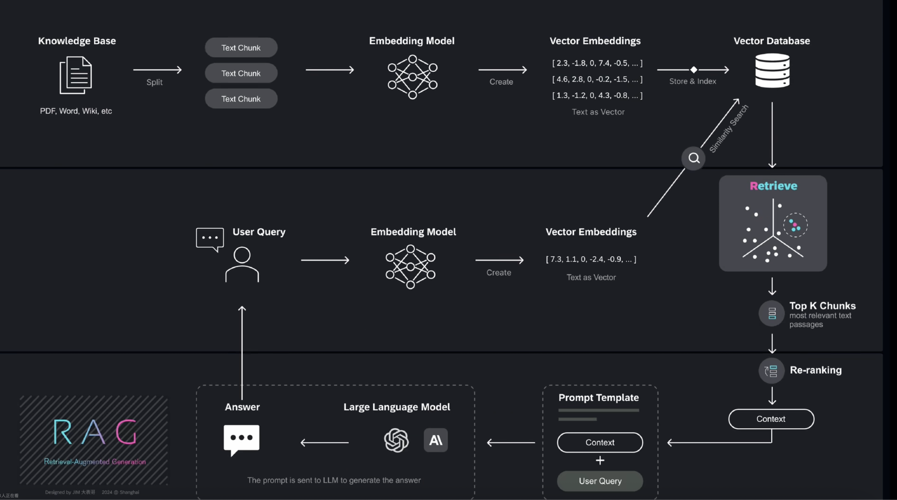
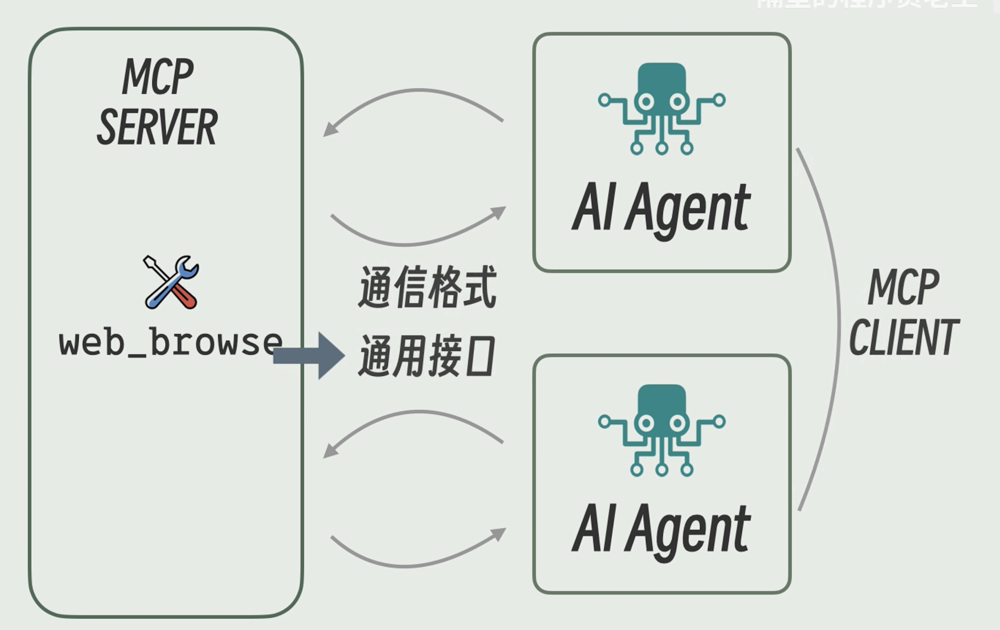

## RAG（Retrieval-Augmented Generation）流程图逐步讲解



这张图把一个典型的 RAG 系统划分为三大阶段：

1.  **构建知识库索引**（上半部分）
2.  **检索相关信息**（中间部分）
3.  **生成最终答案**（下半部分）

下面按照图中的箭头顺序，为初学者解释每一步做了什么、为什么要这么做、常见工具选型以及容易踩的坑。

### 1. 构建知识库索引（Offline / Pre-processing）

| 子步骤 | 作用 | 关键点 |
| :--- | :--- | :--- |
| **① 收集知识库** | 把 PDF、Word、维基网页、Markdown 等原始文档集中到一个文件夹或对象存储。 | 数据越干净、结构越好，后面效果越佳。 |
| **② Split —— 切分文本** | 将长文档按段落、标题或固定字数切成较小 chunk（100 – 1,000 token 常见）。 | • 保证每个 chunk 足够短，可放进 LLM上下文。<br>• 切分时保留层级/标题方便后续重建语义。 |
| **③ Embedding Model —— 向量化** | 把每个 chunk 输入到「文本嵌入模型」（embedding model），输出一个高维向量，例如 `[2.3, -1.8, 0.7, …]`。 | • **open-source**：Sentence-Transformers、BGE、E5；<br>• **商用 API**：OpenAI `text-embedding-3`, `text-embedding-ada-002` 等。 |
| **④ Vector Database —— 存储索引** | 将 `(chunk_id, 向量, 原文)` 写入向量数据库（或本地 ANN 索引）。 | **常见选型**：Milvus、Weaviate、Pinecone、Qdrant、FAISS。 |

📌 **为什么要做向量化？**

因为普通关键词检索只看「字面相同」，向量检索能捕获「语义相近」的段落，例如 “首都” ≈ “capital city”。

### 2. 在线检索（Realtime Retrieval）

| 子步骤 | 作用 | 关键点 |
| :--- | :--- | :--- |
| **⑤ 用户提问** | 例如：“上海迪士尼什么时候开园的？” | |
| **⑥ Query Embedding** | 把用户问题用同一套嵌入模型转成向量。 | 保持与知识库同一语义空间。 |
| **⑦ 相似度搜索** | 在向量数据库里计算查询向量和所有 chunk 向量的相似度（余弦相似、点积等），返回 Top-K（如 K=20）最相近的段落。 | • 搜得越多，召回高但噪声也高。<br>• 引擎通常用 HNSW、IVF、ScaNN 等近似算法来加速。 |
| **⑧ （可选）Re-ranking** | 用更重的模型（如 cross-encoder、rerank-Llama-2）对 Top-K 再精排，选出 Top-N（如 N=5）。 | 精排模型同时读「问题+段落」能给更准的相关度分。 |

### 3. 生成答案（Generation）

| 子步骤 | 作用 | 关键点 |
| :--- | :--- | :--- |
| **⑨ Prompt Template** | 把：<br>• Chat 角色指令（system message）<br>• Re-ranking 选出的上下文段落（Context）<br>• 用户原始问题（User Query）<br>按照模板拼成完整提示词（prompt）。 | |
| **⑩ Large Language Model** | 将 prompt 输入大型语言模型（ChatGPT、GPT-4o、Claude 3、Llama-3 等），模型阅读「上下文+问题」，生成参考答案。 | |
| **⑪ 返回 Answer** | 把模型生成的文本返回给用户。 | 可附带出处链接或高亮片段，增强可追溯性。 |

### 整体数据流快速回顾

* **离线阶段**： 文档 → 切分 → 嵌入 → 向量库
* **在线阶段**： 问题 → 嵌入 → 相似度检索 → 取Top-K → (可精排) → 把上下文塞进prompt → LLM生成答案

### 常见工具栈（最小可用示例）

* **文档加载 & 切分**：`LangChain Loaders` + `RecursiveCharacterTextSplitter`
* **嵌入模型**：OpenAI `text-embedding-3-small`
* **向量数据库**：`FAISS` (本地文件即可)
* **检索**：`LangChain SimilaritySearch`
* **精排**：Cohere Rerank API 或 `BAAI/bge-reranker`
* **LLM**：`gpt-3.5-turbo`
* **应用框架**：Streamlit / FastAPI / Gradio

### 初学者易犯的坑

* Chunk 太大 → LLM 上下文塞不下；太小 → 语义碎片，检索难准。
* 问题/文档 用了不同语言或不同 Embedding Model → 嵌入空间不一致导致检索效果差。
* Top-K 取值过小 → 相关信息没召回；过大 → prompt 过长，超 token 限制。
* 没有做「source attribution」→ 用户不信答案。
* 直接把 Top-K 文本原封不动拼进 prompt → 上下文容量爆炸。可考虑摘要或片段截取。
* 忽视长尾更新 → 文档变化后忘记增量更新向量库。

---

## 向量嵌入

向量嵌入是将非结构化数据（如音频、视频、图像、文本等）转换为高维数字向量的过程。这些向量能够捕捉数据的语义和特征，使计算机能够理解和处理非结构化数据。例如，音频文件可以通过声学特征提取转换为向量，视频文件可以通过帧特征提取转换为向量

---

## 欧几里得距离、余弦相似度与点积

在数据科学和机器学习领域，我们经常需要衡量样本之间的相似性或差异性。欧几里得距离、余弦相似度和点积是三种最基础且应用广泛的度量方法。它们从不同的角度描述了数据点或向量之间的关系。

## 一、 欧几里得距离 (Euclidean Distance)

欧几里得距离衡量的是多维空间中两个点之间的“绝对直线距离”。这是我们日常生活中最直观的距离概念。

### 1. 定义

在 $n$ 维空间中，两个点 $A(a_1, a_2, ..., a_n)$ 和 $B(b_1, b_2, ..., b_n)$ 之间的直线距离。它关心的是点在空间中的**位置差异**。

### 2. 计算公式

对于两个 $n$ 维向量（或点）$A$ 和 $B$，其欧几里得距离 $d(A, B)$ 的计算公式为：

$$
d(A, B) = \sqrt{\sum_{i=1}^{n} (a_i - b_i)^2}
$$

例如，在二维空间中，点 $A(x_1, y_1)$ 和 $B(x_2, y_2)$ 之间的距离为：

$$
d(A, B) = \sqrt{(x_2 - x_1)^2 + (y_2 - y_1)^2}
$$

### 3. 取值范围

- **$[0, +\infty)$**
- 值为 $0$ 表示两个点重合。
- 距离值越大，表示两个点在空间中的**差异越大**、距离越远。

### 4. 应用场景

适用于需要衡量**数值上的绝对差异**或**空间中的实际距离**的场景。

- **K-最近邻算法 (KNN)**：根据样本间的欧几里得距离来判断新样本的类别。
- **聚类算法 (K-Means)**：计算样本点到聚类中心的距离，以进行分组。
- **计算机视觉**：衡量图像中不同特征点之间的空间距离。

## 二、 余弦相似度 (Cosine Similarity)

余弦相似度衡量的是两个向量之间的**方向差异**，而不关心它们的绝对大小（模长）。

### 1. 定义

通过计算两个向量夹角的余弦值来评估它们的相似性。它完全关注向量指向的**方向是否一致**。

### 2. 计算公式

对于两个向量 $\vec{A}$ 和 $\vec{B}$，其点积（Dot Product）为 $\vec{A} \cdot \vec{B}$，模长（Magnitude）为 $\|\vec{A}\|$ 和 $\|\vec{B}\|$。余弦相似度的计算公式为：

$$
\text{Cosine Similarity} = \cos(\theta) = \frac{\vec{A} \cdot \vec{B}}{\|\vec{A}\| \|\vec{B}\|} = \frac{\sum_{i=1}^{n} a_i b_i}{\sqrt{\sum_{i=1}^{n} a_i^2} \sqrt{\sum_{i=1}^{n} b_i^2}}
$$

### 3. 取值范围

- **$[-1, 1]$**
- **值为 $1$**：表示两个向量方向完全相同，夹角为 $0°$。
- **值为 $0$**：表示两个向量正交（垂直），夹角为 $90°$，通常意味着两者**线性无关**。
- **值为 $-1$**：表示两个向量方向完全相反，夹角为 $180°$。
- 值越接近 $1$，代表两个向量越相似。

### 4. 应用场景

适用于**不考虑数值大小，只关心方向或趋势**的场景。

- **文本相似度计算**：将文本表示为词频向量（如 TF-IDF），通过计算向量间的余弦相似度来判断文章内容的相似性。例如，文章A和文章B虽然长度不同，但如果讨论的主题和词汇分布相似，其余弦相似度会很高。
- **推荐系统**：计算用户或物品的特征向量之间的相似性。例如，衡量两个用户的兴趣偏好是否一致。
- **生物信息学**：比较基因表达谱的相似性。


## 三、 点积相似度 (Dot Product Similarity)

点积是余弦相似度的“未归一化”版本，它同时考虑了向量的**方向和大小（模长）**。

### 1. 定义

通过直接计算两个向量的点积（内积）来衡量它们的相似性。

### 2. 计算公式

对于两个向量 $\vec{A}$ 和 $\vec{B}$，其点积相似度就是它们的点积：

$$
\text{Dot Product Similarity} = \vec{A} \cdot \vec{B} = \sum_{i=1}^{n} a_i b_i
$$

从另一个角度看，点积也等于：$\vec{A} \cdot \vec{B} = \|\vec{A}\| \|\vec{B}\| \cos(\theta)$。

### 3. 取值范围

- **$(-\infty, +\infty)$**
- 点积的结果是一个标量，其绝对值越大，通常表示两者在方向和大小上的相关性越强。
- **正值**：表示两个向量方向大致相同（夹角 $< 90°$）。
- **负值**：表示两个向量方向大致相反（夹角 $> 90°$）。
- 由于其取值范围无界，且受到向量模长的影响非常大，因此结果的可解释性较差，通常需要配合归一化或在特定场景下使用。

### 4. 应用场景

在一些特定的机器学习模型中，点积作为计算的核心部分，因为它既能反映方向的相似性，又能体现模长的影响。

- **推荐系统**：在一些模型中，用户和物品的向量点积可以直接作为预测的评分。一个高模长的用户向量（活跃用户）和一个高模长的物品向量（热门物品）如果方向一致，会产生很高的点积。
- **注意力机制 (Attention Mechanism)**：在 Transformer 等模型中，常使用点积来计算查询（Query）和键（Key）之间的相关性得分。

---

## 总结与对比

| 特性 | 欧几里得距离 (Euclidean Distance) | 余弦相似度 (Cosine Similarity) | 点积相似度 (Dot Product Similarity) |
| :--- | :--- | :--- | :--- |
| **核心思想** | 空间中两点的**绝对直线距离** | 两向量的**方向相似性** | 两向量在**方向和大小**上的综合相关性 |
| **公式** | $\sqrt{\sum (a_i - b_i)^2}$ | $\frac{\vec{A} \cdot \vec{B}}{\|\vec{A}\| \|\vec{B}\|}$ | $\vec{A} \cdot \vec{B}$ |
| **取值范围** | $[0, +\infty)$ | $[-1, 1]$ | $(-\infty, +\infty)$ |
| **对模长敏感度**| **非常敏感**，是其核心度量部分 | **不敏感**，已被归一化处理 | **非常敏感**，模长是其重要组成部分 |
| **解释** | 距离越小越相似 | 值越接近1越相似 | 绝对值越大通常越相关，但需结合符号和模长 |
| **典型应用** | KNN, K-Means (聚类、分类) | 文本分析, 推荐系统 (度量内容、兴趣相似) | 推荐模型, 注意力机制 (作为模型内部计算) |

**简单来说：**

- 想知道**"差了多少"**，用**欧几里得距离**。
- 想知道**"方向是否一致"**，用**余弦相似度**。
- 想知道**"方向和强度（大小）的综合结果"**，用**点积**。


---

## HNSW 学习速记

**主题：** Hierarchical Navigable Small-World (HNSW) 索引的检索机理与参数

**场景：** 向量近似最近邻（ANN）检索

**目标：** 搞懂“分层贪心 + 底层扩展”流程、`efSearch` 的作用、为何不是暴力遍历


### 1. 索引结构

-   **分层图:** Layer L → Layer 0，层数 ≈ ln(N)
-   **层级特性:** 层数越高节点越少，边更“长”；Layer 0 最密。
-   **小世界性质:**
    -   每个节点最多连 M 条边（常 16–64）。
    -   任意两点有 O(log N) 跳可达。


### 2. 查询流程

```python
// 1. 从最高层进入
entryPoint ← 最高层的一个节点

// 2. 在高层进行贪心搜索，快速定位
for level = L … 1:
cur = greedy_search(cur) // 只保留 1 个最近节点
// 复杂度 O(log N)

// 3. 到达 Layer 0，进行扩展搜索
候选队列 C ← {cur}
结果堆   R ← ∅
visited_count = 0

while C 非空 ∧ visited_count < efSearch: // 受 efSearch 限制
p = C.pop_nearest() // 从候选队列中取出离查询点最近的节点
visited_count += 1

for n in neighbors(p):
    if n 未访问:
        计算 dist(query, n)
        C.push(n)          // 将邻居加入候选
        R.try_insert(n)    // 尝试插入结果堆，维护Top-K
// 4. 返回结果

```

-   **高层 (L > 0):** 单点贪心，目的是快速逼近目标区域，可能引入误差。
-   **Layer 0:** 多点扩展（受 `efSearch` 截断），用于修正高层误差并精确查找 Top-K 结果。

---

### 3. `efSearch`

-   **含义:** “在底层(Layer 0)扩展搜索时，愿意访问（比较距离）的节点数量”的硬上限。
-   **功能:** 控制 **召回率 (Recall) ↔ 延迟 (Latency) ↔ CPU** 的核心折衷。
-   **经验值:**
    -   从 `K * 10` 起步尝试。
    -   `32 – 512` 是常用范围。
-   **影响:**
    -   `efSearch` **较大**: 召回率 ↑，延迟 ↑，CPU 使用率 ↑。
    -   `efSearch` **较小**: 召回率 ↓，延迟 ↓，CPU 使用率 ↓。
    -   若 `efSearch` → N (总数据量)，则查询性能退化为暴力搜索。

---

### 4. 为何不是暴力遍历？

1.  **图是稀疏的:** 每个节点最多连接 M 个邻居，远小于总节点数 N。
2.  **高层导航:** 查询起点通过高层导航，已经非常靠近最终目标，搜索被限制在一个很小的局部子图中。
3.  **`efSearch` 截断:** 搜索过程在访问了 `efSearch` 个节点后就会提前终止，总距离计算次数与 N 基本解耦。

**实测对比 (百万级向量库):**
-   **暴力搜索 (BF):** 需要计算 **100万** 次距离。
-   **HNSW:** 仅需计算 **几百** 次距离，即可达到 > 95% 的召回率。

---

### 5. 关键参数对照

| 阶段 | 参数 | 作用 |
| :--- | :--- | :--- |
| **建库** | `M` | 每个节点的最大度数（邻居数）上限。 |
| **建库** | `efConstruction` | 索引构建时，插入新节点查找邻居的扩展预算。 |
| **查询** | `efSearch` | 查询时，在 Layer 0 进行扩展搜索的预算。 |
| **查询** | `K` | 需要返回的最近邻的数量。 |

**一句话类比:** “`M` 和 `efConstruction` 负责把路修好；`efSearch` 决定每次出门愿意走多远的路去找东西”。

---

### 6. 调参流程

1.  **设定业务目标:** 明确召回率要求（例如，召回率 ≥ 0.97）。
2.  **固定构建参数:** 通常先固定 `M` (e.g., 32) 和 `efConstruction` (e.g., M * 10 = 320)。
3.  **离线评测 `efSearch`:**
    -   依次测试 `efSearch` = 32, 64, 128, 256...
    -   绘制 **召回率-延迟 (Recall-Latency)** 曲线。
4.  **选择与部署:**
    -   在曲线上选择满足业务目标的最佳性价比点（折中点）。
    -   上线后，可根据 QPS 峰谷动态调节 `efSearch` 以平衡资源与性能。


### 7. 一句话总结

HNSW = **“高层贪心导航 + 底层受控扩展”**，

借助 `efSearch` 参数把 **速度** 与 **精度** 变成了一个可调的“旋钮”，

从而在千万甚至亿级向量库中实现亚毫秒级的近似最近邻检索，其效率远非暴力遍历所能比拟。


---

## HNSW核心参数：M 与 召回率（Recall）深度解析

### 1. 参数 M：索引的“路网密度”

参数 `M` 是构建 HNSW 索引时的核心工程参数，它定义了索引图的结构和质量。

> **核心理解：`M` 是一个分层的约束，而非全局约束。**
> 这意味着一个节点在**每一层**网络中最多可以连接 `M` 个邻居，而不是它在所有层的总连接数不能超过 `M`。

* **角色定义**: `M` 不是由数据固有特性决定的，而是像城市规划师设定的“每个路口最多修几条主干道”的规则。它是在**索引质量**、**内存占用**和**构建速度**之间做出的权衡。

* **分层作用**:
    * **高层 (Layers > 0)**: 通常使用参数 `M` (例如 16)，构建一个稀疏的“高速公路网”，用于快速的远程导航。
    * **底层 (Layer 0)**: 通常使用更大的 `M_max0` (例如 `2 * M`，即 32)，构建一个更稠密的“本地路网”，用于在目标区域进行精确的近邻查找。

* **权衡关系**:

| `M` 值 | 优点 | 缺点 |
| :--- | :--- | :--- |
| **较高 (如 32, 64)** | 索引质量更高，图连接更丰富，更容易找到最优路径，潜在召回率更高。 | 占用内存更大；索引构建时间更长。 |
| **较低 (如 12, 16)** | 占用内存更小；索引构建速度更快。 | 索引质量较低，可能需要更大的`efSearch`来弥补，以达到相同的召回率。 |

一句话总结 `M`：**`M` 决定了我们为向量数据构建的这张“导航地图”的精细程度和建设成本。**

### 2. 召回率 (Recall)：查询结果的“准确度”

召回率是衡量 HNSW 这类**近似**近邻（ANN）算法**查询结果有多准**的核心指标。

* **基本定义**: 它回答了这样一个问题：“在我返回的 K 个结果中，有多少个是**真正**（通过暴力搜索验证）的 Top-K 最近邻？”

* **计算方式**:
    ```
    召回率 = (HNSW 找到的真实近邻数) / (要求返回的总数 K)
    ```
    例如，要求找到 Top-10 (`K=10`) 的近邻，HNSW 返回的结果中有 9 个是完全正确的，那么召回率就是 9 / 10 = 90%。

* **为何重要**: HNSW 为了追求极致的速度，牺牲了 100% 的准确性。召回率就是我们用来量化这种“牺牲”程度的标尺，它让我们知道在多大程度上可以用速度换精度。

* **主要调控参数**: 在查询阶段，召回率主要由 `efSearch` 参数控制。`efSearch` 定义了在底层图中愿意扩展搜索的节点数量上限。`efSearch` 越高，搜索范围越广，召回率越高，但查询延迟也越高。

### 3. 总结：M 与召回率的关系

我们可以用一个简单的比喻来概括二者的关系：**建路与行车**。

* **`M` 是“建路”阶段的参数**：它决定了路网的质量。一个高 `M` 值意味着你投入了更多成本，修建了一个四通八达、路况极佳的道路系统。
* **召回率 (由`efSearch`控制) 是“行车”阶段的表现**：它代表你开着车在这个路网上找一个目的地时，最终找到正确地方的可能性。

**它们的关系是：**

> 在一条**路况更好**（高 `M`）的路上，你**更容易**（用更小的 `efSearch`）也**更可能**（高召回率）找到你的目的地。
>
> 如果路况本身就差（低 `M`），你就需要开着车到处多转转（用更高的 `efSearch`）才能保证不迷路（达到相同的召回率）。

最终，HNSW 的魅力就在于，它允许我们通过 `M` 和 `efSearch` 这两个旋钮，根据业务场景对**内存、速度和精度**做出最合适的平衡。

---

## MCP (Model Context Protocol) 学习笔记

### 1. 核心定义

**MCP (Model Context Protocol，模型上下文协议)** 是一种由 AI 安全和研究公司 **Anthropic** 于 2024 年 11 月推出的**开放标准协议**。

其核心目标是：**统一并标准化大语言模型（LLM）与外部工具（Tools）、数据源（Data Sources）之间的通信方式。**

可以把它理解为 AI 领域的“HTTP”或“USB-C”：在过去，每个模型和工具的连接都需要定制开发，而 MCP 则致力于提供一个“即插即用”的通用标准。

### 2. 结合架构图深度解析

这张图完美地诠释了 MCP 的工作模式。现在我们可以用 MCP 的官方概念来重新审视图中的每一个元素：



 * **`MCP SERVER` (协议的服务端，即工具提供方)**
    * **角色**：这是实现了 MCP 协议的服务器，它持有并“暴露”一个或多个工具。图中的 `web_browse` 就是它暴露的一个工具。
    * **职责**：监听来自客户端的工具调用请求，安全地执行这些工具，并将执行结果按照 MCP 标准格式化后返回。

* **`MCP CLIENT` (协议的客户端，即模型使用方)**
    * **角色**：包含一个或多个需要使用外部工具的 AI 大模型（即图中的 `AI Agent`）。
    * **职责**：当模型在其推理过程中判断需要使用工具时，由客户端负责构建符合 MCP 规范的请求，并发送给服务器。

* **`AI Agent` (AI 智能体 / 大语言模型)**
    * **角色**：系统的“大脑”，例如 Anthropic 的 Claude 系列模型。它是决策者，是工具的最终“用户”。

* **`通用接口` (The MCP Protocol Itself)**
    * **角色**：这不再是一个泛指的概念，它就是 **MCP 协议本身**。它定义了请求和响应的生命周期、认证方式、错误处理等一系列规则。

* **`通信格式` (MCP Data Schema)**
    * **角色**：指 MCP 协议中具体规定的数据结构，通常基于 JSON。它精确定义了如何描述一个工具、如何传递参数、如何返回结果等。

### 3. 工作流程：一次完整的 MCP 调用

1.  **决策 (Decision)**：`AI Agent` 在与用户对话或执行任务时，判断需要获取实时网络信息来回答问题。
2.  **构建请求 (Request Building)**：`MCP CLIENT` 根据模型的意图，按照 MCP 的**通信格式**，构建一个调用 `web_browse` 工具的请求。
3.  **发送 (Sending)**：客户端通过标准化的**通用接口**（MCP协议）将该请求发送到 `MCP SERVER`。
4.  **执行 (Execution)**：`MCP SERVER` 接收并验证请求，调用其内部的 `web_browse` 功能模块，并获得网页内容。
5.  **构建响应 (Response Building)**：服务器将网页内容打包成一个符合 MCP 规范的响应体。
6.  **返回上下文 (Returning Context)**：服务器将响应发回给 `MCP CLIENT`，模型（AI Agent）接收到这个新的“上下文（Context）”信息后，便可以基于它生成最终的答复。

### 4. MCP 的重要性与价值

* **互操作性 (Interoperability)**：任何遵循 MCP 标准的模型，理论上都可以无缝使用任何遵循 MCP 标准的工具。打破了厂商和模型之间的壁垒。
* **模块化与解耦 (Modularity & Decoupling)**：将“思考”（模型）和“行动”（工具）彻底分开。开发者可以专注于开发强大的工具，而模型开发者则专注于提升模型的推理能力。
* **开发效率 (Development Efficiency)**：免去了为“模型 A + 工具 X”、“模型 B + 工具 Y”等无数种组合编写定制化“胶水代码”的繁重工作。
* **生态系统繁荣 (Ecosystem Growth)**：一个公认的标准将极大地促进第三方工具和应用的开发，形成一个繁荣的 AI 工具生态。

**一句话总结：**

**MCP 旨在成为连接 AI 大模型与物理及数字世界的“标准语言”，通过一个统一的协议，让任何模型都能安全、高效地调用任何外部工具，从而极大地释放 AI 的应用潜力。**

---

## AI Agent 插件调用流程学习笔记

### 一、整体概述

本笔记描述了当一个用户向 AI Agent 提问时，系统内部如何通过 **MCP 协议**（Model Context Protocol）和 **`web_browse` 插件**，实现联网查询并最终生成答案的完整工作流程。

这是一个典型的 **RAG (Retrieval-Augmented Generation)** 结合 **Tool-Using** 的应用场景，核心在于模型通过外部工具获取信息来增强其回答能力。

### 二、主要参与角色

* **用户 (User)**
    * 需求的提出者，交互的发起方。

* **AI Agent (MCP Client)**
    * **前端交互与中枢协调者**。它负责接收用户输入，管理与 AI 模型的会话，并作为客户端调用 MCP 服务器上的插件。

* **AI 模型 (LLM)**
    * **决策大脑**。负责理解用户的真实意图，并基于自身知识和 Agent 提供的可用插件列表，来决策下一步是直接回答还是调用插件。

* **MCP SERVER**
    * **后端工具的执行者**。一个独立的服务器，它实际承载并运行着各种插件（如 `web_browse`），并严格按照 MCP 协议响应来自 AI Agent 的调用请求。

* **`web_browse` 插件**
    * **具体的“手”或“脚”**。实现了联网并抓取指定网页内容的具体功能模块。

### 三、详细流程步骤

整个过程可以分解为以下几个关键步骤：

**1. 用户提问 (Input)**
用户通过聊天界面向 AI Agent 提出一个开放性问题，这个问题通常需要外部知识才能完美回答。
> **示例**: `用户 -> AI Agent`: “女朋友肚子疼怎么办？”

**2. 插件能力声明 (Prompt Engineering)**
AI Agent 在向 AI 模型发送请求前，会先在 Prompt 中“声明”自己拥有哪些可用的插件，并附上每个插件的功能描述、用途和参数说明。
> **示例**: `AI Agent -> AI 模型`: (在Prompt中附加信息)
> ```json
> {
>   "available_tools": [
>     {
>       "name": "web_browse",
>       "description": "用于访问互联网并获取指定URL的网页内容，适用于需要最新信息或专业知识的场景。",
>       "parameters": {"url": "要访问的网页地址"}
>     }
>   ]
> }
> ```

**3. AI 模型决策 (Decision Making)**
AI 模型接收到包含**[用户问题 + 可用插件列表]**的完整请求。它会进行分析：
* **意图理解**：意识到“肚子疼怎么办”是一个需要医学建议的严肃问题，不应凭空回答。
* **工具选择**：匹配到 `web_browse` 插件可以用来查询专业的医疗健康网站。
* **指令生成**：决定调用该插件，并生成一个结构化的调用指令（通常是JSON格式）。
> **示例**: `AI 模型 -> AI Agent`:
> ```json
> {
>   "tool_to_call": "web_browse",
>   "parameters": {
>     "query": "causes and relief for female stomach pain" 
>     // 注：聪明的模型会把用户问题转为合适的搜索关键词
>   }
> }
> ```

**4. 插件调用请求 (MCP Call)**
AI Agent 解析来自 AI 模型的调用指令。它作为 **MCP Client**，严格按照 MCP 协议规范，向 `MCP SERVER` 发起一次真实的插件调用网络请求。

**5. MCP SERVER 执行操作 (Execution)**
`MCP SERVER` 收到请求后，调用其内部注册的 `web_browse` 插件。插件执行其核心逻辑：访问搜索引擎或指定网页，抓取相关内容（如HTML文本或摘要）。

**6. 结果返回 (Response)**
`MCP SERVER` 将插件的执行结果（例如，一篇关于缓解腹痛文章的关键段落）通过 MCP 协议返回给 AI Agent。

**7. 答案生成与整合 (Synthesis)**
AI Agent 将从插件获取到的**外部知识（检索到的内容）**再次提交给 AI 模型，并要求它基于这些新信息来回答用户最初的问题。AI 模型最终生成一段人性化、有理有据的自然语言答案，通过 AI Agent 展示给用户。
> **示例**: `AI 模型 -> 用户`: “了解您女朋友肚子疼的情况，这可能由多种原因引起。根据[某健康网站]的资料，常见原因包括... 建议可以尝试... 但如果疼痛持续，请务必及时就医...”

---

**Agent和LLM的关系**

- AI 模型 (LLM) ≈ 电脑的 CPU（中央处理器）

    它提供核心的计算和“思考”能力，但它自己一个裸露的芯片是无法工作的。

- Agent 框架 ≈ 电脑的操作系统（Windows/macOS）+ 主板 + 各种接口

    它负责管理资源，连接外部设备（键盘、鼠标、网络），并为 CPU 提供它能理解的指令，将 CPU 的计算结果呈现出来。

- LLM Agent ≈ 一台完整、可以使用的电脑

    用户直接操作的是这台电脑，体验到的是电脑的强大功能。但所有这些功能，归根结底都是由 CPU 的强大性能所支撑，并通过操作系统和硬件的协调才得以实现。

---

## 核心概念解析：AI 模型、MCP、Function Calling 与 Agent Tool 的关系

### 一、 层次与关系概述

这四个概念共同构成了一个完整的、用于扩展大模型能力的生态系统。它们的关系并非并列，而是一个层层递进、相互依存的体系：

* **AI 模型**是**决策核心**，它决定了“做什么”。
* **MCP** 是**通信桥梁**，它规范了“怎么说”。
* **Function Calling** 是**具体动作**，它是模型意图的表达和执行机制。
* **Agent Tool** 是**能力实体**，它是最终“谁来做”的功能单元。

### 二、 概念深度解析

#### 1. 基础：AI 模型 (The Core Engine)

* **定义**：AI 模型是经过海量数据训练的、具备高级认知能力的机器学习模型（如 LLM）。它是整个系统的智能源泉。
* **功能**：其核心功能在于**理解**自然语言指令、进行复杂的**推理**、制定**规划**以及**生成**响应。
* **作用与局限**：模型提供了智能决策的“大脑”，能判断何时需要借助外部能力来完成任务。然而，模型本身被限制在计算环境中，无法直接与外部世界（如网络、数据库、文件系统）交互。

#### 2. 桥梁：MCP (Model Context Protocol)

* **定义**：MCP 是一种为解决上述模型局限而设计的**开放标准通信协议**。它旨在统一大模型与所有外部数据源和工具之间的通信“语言”。
* **功能**：提供了一套标准化的规则、格式和流程，确保任何遵循此协议的模型和工具之间都能顺畅、安全地交换信息。
* **作用**：MCP 扮演了连接模型“大脑”与外部“世界”的**神经系统**。它使得模型能够动态地获取、更新和管理外部信息，为实现真正的“工具增强型智能”铺平了道路。

#### 3. 动作：Function Calling (The Action of Invocation)

* **定义**：Function Calling 是指在 MCP 这一协议框架下，模型**表明其调用外部函数或服务意图**的这一具体行为和机制。
* **功能**：当模型判断需要外部能力时，它会生成一个结构化的、明确的指令，其中包含要调用的函数名称和所需参数。这不仅仅是一个想法，而是一个可被机器解析的**“调用规范”**。
* **作用**：Function Calling 是将模型的**“决策意图”转化为“可执行指令”**的关键一步。它使得 Agent 框架能够精确地理解模型想要做什么，并据此触发后续的实际操作。

#### 4. 实体：Agent Tool (The Specific Capability)

* **定义**：Agent Tool 是在 MCP 生态中可被调用的、实现了特定功能的**具体服务或应用**。它是 Function Calling 的最终执行者。
* **功能**：每个 Tool 都封装了一项具体的功能，如 `web_browse`（网页搜索）、`database_query`（数据库查询）、`send_email`（发送邮件）等。
* **作用**：Agent Tool 是 AI Agent 能力的**具体体现和无限扩展的基石**。通过组合调用不同的 Tool，Agent 可以完成远超模型自身知识范围的、极其复杂的现实世界任务。

### 三、 完整工作流程：四位一体的协同

让我们通过一个完整的流程，看看这四者是如何协同工作的：

1.  **决策 (AI 模型)**：用户提出问题，AI 模型经过推理，判断需要通过搜索网络来获取最新信息。
2.  **生成指令 (Function Calling)**：模型生成一个结构化的 Function Calling 指令，例如：`{ "function_name": "web_browse", "arguments": { "query": "2025年日本假期安排" } }`。
3.  **封装与传输 (MCP)**：Agent 框架接收到该指令，将其封装成一个符合 MCP 协议标准的网络请求包，然后发送给相应的服务器。
4.  **执行与响应 (Agent Tool)**：服务器根据 MCP 请求，调用已注册的 `web_browse` 这个 **Agent Tool**。Tool 执行搜索操作，并将结果（假期列表）同样按照 MCP 格式返回。
5.  **整合与生成 (AI 模型)**：模型接收到工具返回的信息后，整合这些外部知识，最终生成人性化的自然语言答案给用户。
