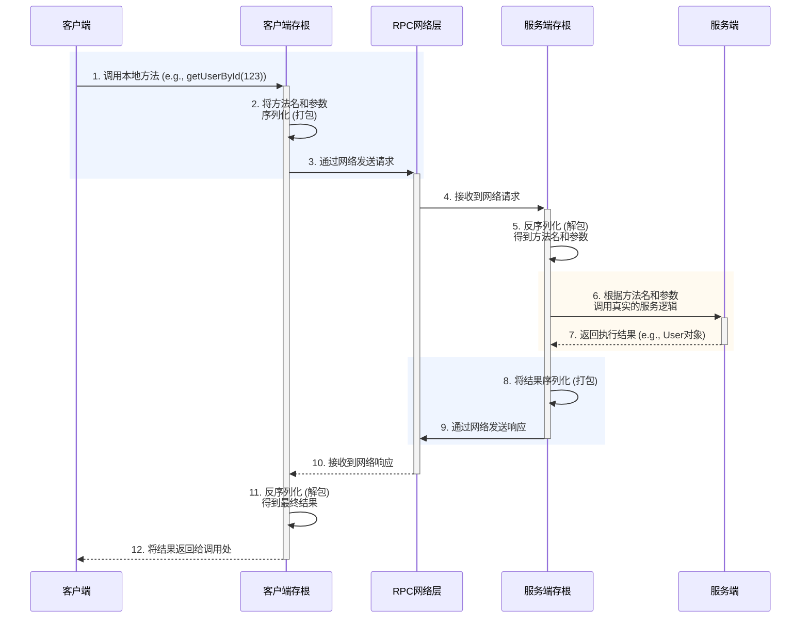
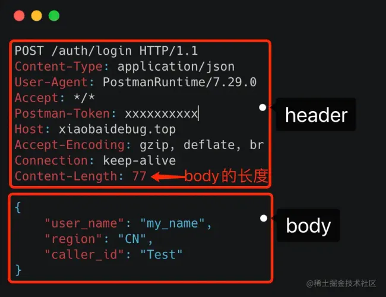

## 远程过程调用（Remote Procedure Call, RPC）

是一种计算机通信协议。该协议允许运行于一台计算机的程序调用另一台计算机的子程序，而程序员无需额外地为这个交互作用编程。其核心思想是让调用远程服务像调用本地方法一样简单。

---
### 背景：一个服务如何调用另一个部署在不同机器上的服务的功能呢？

最直接的方式是使用 HTTP/JSON。比如订单服务想获取用户信息，可以向用户服务发起一个 HTTP GET 请求。这种方式当然可行，但存在一些问题：

- 性能开销： HTTP 协议是文本协议，包含了大量的请求头信息，相对冗余；JSON 的序列化和反序列化开销也比较大。

- 服务发现： 订单服务如何知道用户服务的 IP 地址和端口？

- 面向过程： 开发者需要手动去拼接 URL、构造 HTTP 请求、解析 JSON 响应，思维模式停留在“发送网络请求”，而不是“调用一个功能”。

为了解决这些痛点，RPC 框架应运而生。它的目标就是让程序员忘记底层的网络细节，像调用本地接口一样调用远程服务，从而极大地提高了开发效率。

### RPC 的核心组成部分：

- **客户端 (Client): 服务调用方。**

    客户端存根 (Client Stub): 存放在客户端的一段代码，负责接收客户端的本地调用请求，并将其打包（**序列化**）、通过网络发送给服务端。它表现得像一个本地方法的代理。

- **服务端 (Server): 服务提供方。**

    服务端存根 (Server Stub): 存放在服务端的一段代码，负责接收并解析（反序列化）从网络传来的请求，然后调用真正的业务逻辑方法，最后将执行结果打包（序列化）返回给客户端。

- 网络协议 (Network Protocol): 负责在客户端和服务端之间传输数据。这可以是 TCP、UDP，或者更上层的 HTTP 等。




**网络传输：** 客户端存根通过底层的网络协议（如TCP）将打包好的数据发送到服务端。


---

### 什么是粘包问题

**粘包问题简述**

粘包问题（Packet Stickiness）是指在基于TCP协议进行网络通信时，发送方连续发送多份数据包，而接收方在一次读取操作中，可能会把多个数据包的数据合在一起读取，导致数据边界丢失，接收方无法区分每个数据包的起止。这种现象称为“粘包”。

**为什么会出现粘包？**

- TCP是面向字节流的协议，它只保证数据按顺序到达，不保证每次发送的数据就会被一次性接收。

- 发送方多次send，操作系统或网络栈为了效率，可能将多次发送的数据合并一起发出。

- 接收方调用recv或read时，读取到的数据可能是一个完整包，也可能是多个包拼在一起，甚至只有一个包的一部分。

所以，纯裸 TCP 是不能直接拿来用的，你需要在这个基础上加入一些 自定义的规则 ，用于区分 消息边界 。

---

### HTTP和RPC

**RPC（Remote Procedure Call）本身并不是一个具体的协议，而是一种 调用方式 。**

1. **HTTP和RPC的区别**：

- 首先要向某个服务器发起请求，你得先建立连接，而建立连接的前提是，你得知道 IP 地址和端口 。这个找到服务对应的 IP 端口的过程，其实就是 服务发现。

- 在 HTTP 中，你知道服务的域名，就可以通过 DNS 服务 去解析得到它背后的 IP 地址，默认 80 端口。

- 而 RPC 的话，就有些区别，一般会有专门的中间服务去保存服务名和 IP 信息，比如 Consul、Etcd、Nacos、ZooKeeper，甚至是 Redis。想要访问某个服务，就去这些中间服务去获得 IP 和端口信息。由于 DNS 也是服务发现的一种，所以也有基于 DNS 去做服务发现的组件，比如 CoreDNS。


2. **底层连接形式**：
- 以主流的 HTTP1.1 协议为例，其默认在建立底层 TCP 连接之后会一直保持这个连接（keep alive），之后的请求和响应都会复用这条连接。

- 而 RPC 协议，也跟 HTTP 类似，也是通过建立 TCP 长链接进行数据交互，但不同的地方在于，RPC 协议一般还会再建个 连接池，在请求量大的时候，建立多条连接放在池内，要发数据的时候就从池里取一条连接出来，用完放回去，下次再复用，可以说非常环保。

    **池一般针对“高性能下资源的高效复用”。**

3. **传输的信息：**

    HTTP协议传输的内容以header和body为主：
    

---  

### HTTP请求的结构：

```dts
POST /api/login HTTP/1.1                # 请求行：方法、路径、协议版本
Host: www.example.com                   # 请求头：目标主机（域名）
User-Agent: Mozilla/5.0 (Windows NT 10.0; Win64; x64)  # 请求头：客户端信息
Accept: application/json                # 请求头：期望响应的数据类型
Content-Type: application/json          # 请求头：请求体的数据格式
Content-Length: 38                      # 请求头：请求体长度（字节数）
Cookie: sessionid=xyz123abc             # 请求头：携带的 Cookie

                                        # 空行：分隔头部和请求体

{                                       # 请求体（Body）：实际要提交的数据
  "username": "alice",
  "password": "123456"
}
```

websocket的数据包叫帧


---
4. **some supplements**


    **1. 什么是RPC协议？**

    RPC协议是一种让“调用远程服务器上的函数/方法”像调用本地函数一样简单的通信协议和规范。

    - Remote：远程的，不在本地。
    - Procedure：过程、函数、方法。
    - Call：调用。

    换句话说：
    你在A服务器上写了代码，想调用B服务器的一个函数，用RPC协议就能像本地直接调用那样方便，底层的“网络通信、序列化、反序列化”等复杂细节都由RPC协议来处理。

    底层大部分使用TCP协议，但这并不是必需选项。


    **2. KCP**

    KCP 是一个开源的、高性能的、基于 UDP 的可靠传输协议,为了让 UDP 也能像 TCP 一样可靠，但更灵活、更快。

    #### 为什么需要KCP

    - UDP 原生不保证可靠、顺序、重传，适合实时应用，但容易丢包。
    - TCP 虽然可靠，但有“拥塞控制、队头阻塞、慢启动”等机制，导致延迟高、不适合实时场景。
    - KCP 在 UDP 基础上自己实现了可靠传输、拥塞控制、流量控制等，兼顾了 UDP 的低延迟和 TCP 的可靠性，还能根据需求灵活调整。

    #### KCP 的基本原理


    - 客户端和服务端都用 UDP 通信，但数据不是直接发，而是交给 KCP 处理。
    - KCP 负责把大数据分成小包，加上序号，丢了就重传，包乱了就排序。
    - KCP 有自己的流量控制和拥塞控制机制，保证网络不被塞爆。
    - 双方不断回传 ACK（确认包），丢了自动补发，保证数据可靠送达。

