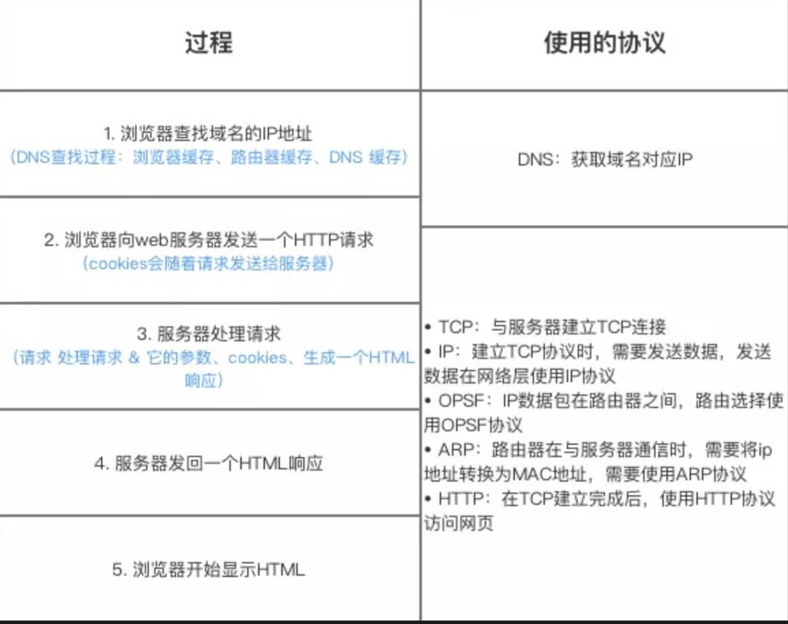
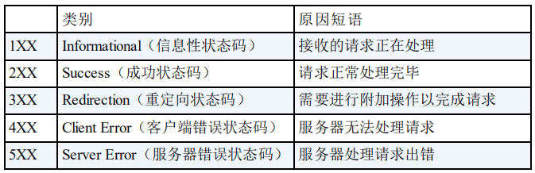

## 苍穹外卖简介

**主要工作:**

1. 使用Nginx作为HTTP服务器，部署静态资源，反向代理和负载均衡
2. 登录及身份验证使用JWT令牌技术，以完成用户认证，通过ThreadLocal配合拦截器来进行Token的校验，判断用户是否处于登录状态，解决HTTP请求无状态的问题（服务器不会自动记住之前请求中发生过什么，也不会保留任何关于这个请求者的历史信息）。
3. 使用Redis缓存高频数据，缓解高并发环境下频繁访问数据库造成的性能下降。
4. 通过WebSocket实现客户端与服务端的长连接，实现来单提醒及客户催单等功能。
5. 使用SpringTask实现订单状态的定时处理，超时自动取消订单等功能

**个人收获：**
1. 熟悉了在 SpringBoot框架下开发项目的整体流程。
2. 熟悉了常用数据库 Redis和 MySOL的区别及适用场景。
3. 学会优化代码细节，编写代码注重可读性。如在登录功能中，将员工表的密码从明文存储转为MD5加密存储。

**项目的基础功能有哪些：**
- 管理端能在网页上对菜品、订单、员工等进行管理修改，
- 用户端能在微信小程序上在线浏览菜品、修改购物车，下单支付、催单等等。

**遇到的问题?如何解决?：**
最开始没有考虑到实际上线后的情况，没有用redis进行缓存，统一用的mysql，业务增多的话会造成数据库访问量很大，数据库宕机且每次查询磁盘而不是缓存会使得速度比较慢，这些都不适用于实际情况。

---

## WebSocket服务端组件

```java
package com.sky.websocket;

import org.springframework.stereotype.Component;
import javax.websocket.OnClose;
import javax.websocket.OnMessage;
import javax.websocket.OnOpen;
import javax.websocket.Session;
import javax.websocket.server.PathParam;
import javax.websocket.server.ServerEndpoint;
import java.util.Collection;
import java.util.HashMap;
import java.util.Map;

/**
 * WebSocket服务
 */
@Component
@ServerEndpoint("/ws/{sid}")
public class WebSocketServer {

    //存放会话对象
    private static Map<String, Session> sessionMap = new HashMap();

    /**
     * 连接建立成功调用的方法
     */
    @OnOpen
    public void onOpen(Session session, @PathParam("sid") String sid) {
        System.out.println("客户端：" + sid + "建立连接");
        sessionMap.put(sid, session);
    }

    /**
     * 收到客户端消息后调用的方法
     *
     * @param message 客户端发送过来的消息
     */
    @OnMessage
    public void onMessage(String message, @PathParam("sid") String sid) {
        System.out.println("收到来自客户端：" + sid + "的信息:" + message);
    }

    /**
     * 连接关闭调用的方法
     *
     * @param sid
     */
    @OnClose
    public void onClose(@PathParam("sid") String sid) {
        System.out.println("连接断开:" + sid);
        sessionMap.remove(sid);
    }

    /**
     * 群发
     *
     * @param message
     */
    public void sendToAllClient(String message) {
        Collection<Session> sessions = sessionMap.values();
        for (Session session : sessions) {
            try {
                //服务器向客户端发送消息
                session.getBasicRemote().sendText(message);
            } catch (Exception e) {
                e.printStackTrace();
            }
        }
    }

}
```

1. sid是什么：
- sid（Session ID），在你的服务端实现中，是客户端连接WebSocket时URL携带的唯一标识。
- 用于区分不同的连接（客户端），实现点对点通信、消息定向推送。
- 你可以通过sid快速定位到某个用户的Session（会话），比如精确推送消息给指定用户。

2. WebSocket里的Session是什么意思？
- 代表一次客户端和服务端之间的WebSocket连接，每当有一个 WebSocket 连接建立时，服务器端就会为该连接分配一个 Session 对象。

3. @OnOpen是什么？回调是什么意思？
- @OnOpen是Java WebSocket标准注解，用来标记“当有客户端和服务端建立连接时会自动调用的方法”。
- 回调（callback） 指的是：某个事件发生后，系统自动帮你调用你指定的方法，而不是你自己主动去调用。
- 当客户端第一次连接WebSocket服务端时，框架会自动触发带有@OnOpen注解的方法，并把本次连接的Session对象和路径参数（如sid）传进来。

4. 消息推送能力：
- @OnOpen：客户端连接建立时回调，保存Session。
- @OnMessage：接收客户端消息，打印日志（可扩展业务逻辑）。
- @OnClose：连接关闭时移除Session。
- sendToAllClient：遍历所有Session，群发文本消息。

---

## 苍穹外卖中的跨域场景

**什么是跨域：**
跨域（Cross-Origin）是指浏览器中，一个网页试图去请求另一个源（域名、协议、端口不同）的资源。同源策略（Same-Origin Policy）是浏览器的重要安全机制，它规定了“同源”的两个页面可以互相访问数据，不同源的则受到限制。
**受限于浏览器，前端代码（如 Ajax、fetch、axios）无法直接访问非同源的后端接口**

**同源的定义（满足全部三项）：**
- 协议相同（如 http、https）
- 域名相同（如 www.example.com）
- 端口号相同（如 :80、:8080）
只要有一项不同，就属于跨域。

<br>

**解决方案：Nginx反向代理**
前端发送请求和后端接口地址不一样，通过 Nginx 配置，将前端的请求代理到后端服务，表现上看是同一个源，解决跨域。
例如，将前端应用部署在某个域名或端口下，后端服务部署在另一个域名或端口下，通过 Nginx 配置反向代理规则，将Nginx代理后端服务器，将前端请求通过Nginx转发到后端服务，并将后端服务的响应返回给前端，这样就避免了浏览器直接跨域请求后端服务时产生的跨域问题​​。

---

## Nginx的负载均衡与静态资源处理

**将Nginx作为Http服务器的作用：**
Nginx 作为 HTTP 服务器，擅长高效地处理静态资源(如前端页面、图片、CSS、JS文件等)，响应速度快、并发能力强，非常适合外卖系统的前端页面访问、商品图片加载等需求。

**负载均衡：**
将请求分发到多个服务器，以提高性能

---

## Token

**token 里的id是从哪来的：**
token，尤其是JWT(JSON Web Token)，是在用户登录成功时由后端生成的。
登录流程：
- 用户提交账号和密码 >后端验证成功
- 后端查到该用户的真实id(比如数据库里的主键id)
- 生成JWT token，把用户id和其他信息作为 payload 写进token
- token返回给前端，前端保存(如localStorage、cookie)

**后续如何获取id?：**
每次前端发请求时，会把token放在请求头(如Authorization)里。
后端收到请求后:
- 拦截器/过滤器解析token，取出 payload 里的userld
- 通常会把userld放入ThreadLocal或上下文，业务代码直接获取
所以，token里的id，其实就是用户登录时查库得到的id。

**id和用户名不一样：**
- 用户名是作为用户登录时的凭证之一（通常配合密码/验证码等）。
- 用户ID是数据库中为每个用户分配的唯一数字（如自增主键、UUID），是系统内部唯一标识用户的主键。
- 在实际场景里，后端接口收到登录请求后，会根据用户名去数据库查询用户信息，查询到用户后，会拿到该用户的 id（如：10086）。后续所有的数据操作、业务流程、权限判断、日志记录，内部都用用户ID唯一标识该用户，而不是用用户名。

**Session-Cookie机制的缺点：**

用户登录成功后，服务端生成一份session数据，并分配一个sessionId。浏览器自动把sessionId存到cookie，后续请求自动带上，服务器通过sessionId找到用户身份。
- 服务端存储压力大:每个用户都需要在服务器保存一份 session，用户多了压力大，
- 分布式困难:如果你有N台服务器，每台各存一份session，负载均衡时同一个用户可能每次请求到不同服务器，导致session丢失或不同步。因此需要额外引入 session共享(如Redis)，增加系统复杂度和开销。

**cookie和session：**

cookie用于在client和server间传递状态信息，sessionID常存放在cookie里，客户端请求时自动携带cookie（包含sessionID），并通过该sessionID找到存在服务器里的session。
- cookie存在客户端
- 每一个sessionID都对应着一份独立的会话数据，（通常存在内存、Redis缓存里）
- 用户第一次访问时没有sessionID,服务端生成并用set—cookie将sessionID放入客户端cookie里
- cookie丢失，则在服务器找不到对应的session，会被当成新用户重新登录。

**JWT无状态的含义：**
- 传统的session-cookie机制需要在服务端存储会话状态，客户端通过cookie里的sessionID关联会话。
- 而JWT中服务端不存储任何会话信息，所有必要数据直接编码到Token里（**也就是自包含**），服务端只需要验证签名和有效期

**JWT的结构：**
- header：声明签名算法和token类型。
- payload：业务数据
- signature：对前两部分进行签名

**Token优劣：**
- 横向扩展方便：无需Session共享，适合分布式架构
- 减少数据库压力：无需频繁查询会话状态
- 无法主动失效，需依赖短期有效期或Redis黑名单机制
- Token的体积大

---

## 两种统一拦截技术

**区别**

1. **过滤器和拦截器其实都是AOP编程思想的实现**
2. **归属不同**： 
    - Filter是Servlet规范的一部分，只能用于web程序中;
    - Interceptor是SpringMVC的一部分，既可以用在web层，又可以用在Application和 Swing程序中
3. **实现方法不同**：
    - 过滤器可以使用 Servlet 3.0提供的@WebFilter 注解，配置过滤 URL规则或者去 web.xml中配置自定义过滤器实现 Filter接口，重写 doFilter方法。
    - 拦截器的实现分为两步，第一步，创建一个普通的挡截器，实现 Handlerlinterceptor接口，并重写接口中的 preHandle/postHandle/aftercompletion 方法;创建的拦截器加入到 Spring Boot 的配置文件，指定拦截的路径。
4. **拦截范围不同:**
    - 过滤器Filter会拦截所有的资源，而Interceptor只会拦截Spring环境中的资源
5. **执行时机不同:**
    - 过滤器会先执行，然后才会执行拦截器，最后进入真正的要调用的方法。
    - 拦截器更接近业务系统，所以拦截器主要用来实现项目中的业务判断，比如:登录判断、权限判断、日志记录等业务。
    - 过滤器通常是用来实现通用功能过滤的，比如:敏感词过滤、字符集编码设置、响应数据压缩等功能。

**总结：**
| 特点         | 过滤器（Filter）                        | 拦截器（Interceptor）                   |
|--------------|-----------------------------------------|-----------------------------------------|
| **所属规范** | Servlet 规范（Java EE标准）             | Spring MVC 框架                         |
| **作用阶段** | Servlet 前后（处理所有进入容器的请求）   | DispatcherServlet与Controller之间       |
| **作用范围** | 几乎所有请求，包括静态资源（如js/css/img/html等） | 只拦截被Controller处理的请求（不包括静态资源） |
| **配置方式** | web.xml 或 @WebFilter 注解              | 实现HandlerInterceptor接口并注册到Spring配置 |
| **使用场景** | 通用任务，如编码、日志、权限、跨域、压缩等 | 业务相关任务，如登录校验、权限检查、日志等 |
| **生命周期** | 由Servlet容器管理                      | 由Spring容器管理                        |
| **执行次数** | 只要经过Servlet，都会被执行              | 只拦截被Spring MVC处理的请求            |
| **技术依赖** | 与Spring无关，任何Java Web项目都可用     | 仅限Spring MVC项目                      |

**拦截器实例：**
```java
//典型场景：接口请求的权限校验
public class AuthInterceptor implements HandlerInterceptor {

    @Override
    public boolean preHandle(HttpServletRequest request, HttpServletResponse response, Object handler)
            throws Exception {
        //从 Session 中取出键为 "user" 的属性。
        Object user = request.getSession().getAttribute("user");
        if (user == null) {
            response.sendRedirect("/login");
            return false; // 不通过，后续Controller方法不会被执行
        }
        return true; // 允许通过，执行Controller方法
    }

    // 省略postHandle和afterCompletion方法
}

//注册拦截器：
@Configuration
public class WebMvcConfig implements WebMvcConfigurer {
    @Override
    public void addInterceptors(InterceptorRegistry registry) {
        registry.addInterceptor(new AuthInterceptor())
                .addPathPatterns("/**"); // 拦截所有Controller请求
    }
}
```

**过滤器实例：**
```java
import javax.servlet.*;
import javax.servlet.annotation.WebFilter;
import java.io.IOException;

@WebFilter("/*") // 拦截所有请求
public class EncodingFilter implements Filter {

    @Override
    public void doFilter(ServletRequest request, ServletResponse response, FilterChain chain)
            throws IOException, ServletException {
        // 1. 设置请求体的编码为UTF-8
        request.setCharacterEncoding("UTF-8");
        // 2. 设置响应体的编码为UTF-8
        response.setCharacterEncoding("UTF-8");
        // 3. 继续执行下一个过滤器或目标资源
        chain.doFilter(request, response);
    }
}
/*
@WebFilter("/*") 表示这个过滤器会拦截所有的请求。
request.setCharacterEncoding("UTF-8") 保证客户端传来的参数不会乱码。
response.setCharacterEncoding("UTF-8") 保证服务端返回的数据不会乱码。
chain.doFilter(request, response) 让请求继续往下走（到下一个过滤器或Controller）。
*/
```
---

## MySQL MVCC & ReadView 
ReadView 是 MySQL InnoDB 的 MVCC（多版本并发控制）实现核心。其本质是一个快照，用于实现事务的可重复读，保证同一事务中多次 select 看到的一致性数据（快照读）。

**ReadView 主要字段：**
- m_ids：生成 ReadView 时当前活跃的事务ID列表（未提交的事务）。
- min_trx_id：m_ids 中最小的事务ID。
- max_trx_id：历史上分配出的最大事务ID的下一个值（即新事务分配ID会从这里开始）。
- creator_trx_id：当前生成 ReadView 的事务ID。

**InnoDB每条记录(每个叶子节点)的隐藏字段：**
- trx_id：最近一次修改这条记录的事务ID。
- roll_pointer：回滚指针，指向 undo log，支持历史版本回溯。

**可见性规则：**
假如当前检查某条记录的 trx_id（该版本的修改者ID）：
- trx_id < min_trx_id<br>
    该事务在 ReadView 生成前已提交，可见。
- trx_id > max_trx_id<br>
    该事务在 ReadView 生成后才开启，不可见。
- trx_id ∈ m_ids（活跃事务列表）<br>
    该事务未提交，不可见。
- trx_id 不在 m_ids 且 min_trx_id ≤ trx_id < max_trx_id<br>
    该事务已经提交，可见。
- trx_id = creator_trx_id<br>
    该事务本身对自己的修改可见。

**MVCC 下快照读和当前读的区别？**
- 快照读（Snapshot Read）：select 普通查询，走 MVCC。
- 当前读（Current Read）：for update、insert、update、delete，读的是最新版本，并加锁。


**读已提交的readview:**<br>
每次执行select时生成新的readview,能看到所有在查询前已提交的数据版本。

**可重复读：**<br>
仅在事务第一次select时生成，事务仅能看到第一次查询时的数据快照

---

## **upload的原子性**<br>
单条update语句的原子性：
无论是InnoDB还是其他主流数据库引擎，单条DML（如update、insert、delete）语句本身就是一个最小的事务单元，数据库会保证其原子性。<br>
update操作本质：行锁+undolog实现。<br>
如果发生回滚，用undolog回滚。<br>
行锁粒度细，支持高并发。<br>
如果修改较多行，锁粒度依然是行锁，undolog记录旧值。<br>
**应用层批量update（多条SQL）：**
只有在同一个事务里提交，才具备整体原子性，否则每条SQL是独立原子的。

---

## 锁的类型:<br>
- 全局锁：如flush tables with read lock，用于备份，全库只读。<br>
- 表级锁：如lock tables，MyISAM引擎使用，阻塞其他线程对表的操作。<br>
- 元数据锁（MDL）：用于防止表结构被并发修改，DML、DDL操作会自动加MDL。<br>
- 意向锁：用于标记事务即将在某些行上加锁的类型，，实际上并不阻止其他事务访问具体的行。<br>
- 行级锁：InnoDB支持，Myisam不支持。
    - 记录锁：记录锁是InnoDB行级锁（行锁）的一种，是最基础的行级锁实现。锁定的是B+树索引的叶子节点上的某一条记录（也就是一行数据）。
    - InnoDB的数据表，每一行数据都存储在B+树的叶子节点上，无论是主键索引还是二级索引。
- 间隙锁：锁两条记录之间的范围，而不是具体的某条记录。
    - 比如，表中有主键值 10 和 20，间隙锁可以锁住 (10, 20) 这个区间，但不包含10和20本身。
    - 防止“幻读”，即防止在事务执行过程中，有其他事务在“间隙”内插入新数据。
    - 主要用于可重复读（RR）隔离级别下的范围查询（如SELECT ... FOR UPDATE、UPDATE ... WHERE ...等）。
    ```sql
    SELECT * FROM user WHERE id > 10 AND id < 20 FOR UPDATE;
    ```
- 临键锁
    - 临键锁是**“记录锁”+“间隙锁”**的组合，即锁住了某条索引记录本身及其前面的间隙。
    - 例如，(10,20]，即锁住了大于10小于等于20的部分，包括20本身和 (10,20) 的间隙。
    - 彻底防止幻读，确保范围内的所有数据都被锁住，包括现有记录和“未来可能插入”的记录。
    - InnoDB在RR隔离级别下的大多数范围查询加锁操作，默认使用临键锁。
    ```sql
    SELECT * FROM user WHERE id >= 10 AND id < 20 FOR UPDATE;
    ```
    此时会对 (10,20) 区间加间隙锁，并对 id=10 也加上记录锁，实际效果是 (10,20) 区间和10本身都被锁住。

**什么是索引：**
- 数据库索引是一种数据结构，加速数据查询和更新。
- 常用B+树作为底层实现。
- 类似于书的目录，查找更快。
- 在innoDB里，一个索引就是一棵B+树。每个二级索引也会构建一棵独立的B+树，叶子结点存索引字段值+主键值。

**索引的创建和管理：**
```sql
-- 创建表时建索引
CREATE TABLE user (
    id INT PRIMARY KEY,
    INDEX idx_name(name),
    UNIQUE INDEX idx_email(email)
);

-- 单独创建索引
CREATE INDEX idx_name ON user(name);

-- 删除索引
DROP INDEX idx_name ON user;
```

**索引的作用：**
- 加速查询。
- 唯一索引保证唯一性。
- 组合索引可加速多条件查询。

**InnoDB索引类型：**
- 主键索引（聚簇索引）：数据存储与主键耦合在一起，B+树叶子节点存储整行数据。
- 二级索引（辅助索引）：叶子节点存储主键值及索引字段值。

---

**变量存储的位置：**
- 局部变量：它们通常存储在栈内存中。栈内存主要用于存储方法的参数和局部变量。
- 实例变量：实例变量是对象的一部分，每个对象都有自己的实例变量副本。当创建对象时，实例变量在堆内存中分配内存，随着对象被垃圾回收而销毁。
- 类变量（也就是静态变量）：**类变量是用static修饰的基本类型变量**，它是类的全局变量，被类的所有实例共享。**类变量在方法区中存储**，但实际在运行时，它和类的其他静态成员（如静态方法）相关联。
- 数组中的基本类型元素：数组本身是一个对象，存储在堆内存中。数组中的基本类型元素作为数组对象的一部分，也存储在堆内存中。

---
## ThreadLocal

**ThreadLocal 核心定位**
- 线程隔离而非线程共享：每个线程都有变量 **副本**，避免竞争、无须加锁。  
- 典型应用：用户会话信息、`SimpleDateFormat`、DB/Redis 连接、分布式 TraceId 等。

**数据结构总览**
```
Thread      ──┐
             │   ThreadLocalMap (每个线程 1 份)
             │   ┌───────────────────────────────┐
             └──►│ Entry[ ] (开放寻址 + 线性探测) │
                 └───────────────────────────────┘
                               │
                               ├─ key  : WeakReference<ThreadLocal<?>>
                               └─ value: Object        (强引用)
```

**set / get / remove 流程：**
1. `set(T val)`
   1. 计算 key.hashCode()  
   2. 在线程自己的 `ThreadLocalMap` 查找空槽或同 key 槽  
   3. 写入 value；如遇替换 & 发现 **stale entry** ⇒ 触发 `expungeStaleEntry()` 清理
2. `get()`
   1. 定位槽位；若 key 匹配直接返回  
   2. 若 slot.key 已被 GC ⇒ **找不到** → 调用 `set(initialValue)`
3. `remove()`
   1. 将槽位 value 设 null，key 设 null  
   2. `expungeStaleEntry()` 连带清理 cluster

<br>

**内存泄漏原因:**

• key 弱引用：`ThreadLocal` 对象被 GC 后，`Entry.key == null`。  
• value 强引用：只要线程活着，value 就跟随 `ThreadLocalMap` 活着。  
• 在线程池场景中，线程长期不销毁，**遗留 value** ⇒ 堆占用持续增长。  

解决：
1. 业务结束立即 `remove()`  
2. 将 `ThreadLocal` 声明为 **static final**（生命周期与 JVM 同步） 
    - static final 变量生命周期和类加载器、JVM 一样长，只要类还在，ThreadLocal 实例就不会被回收为 null。
这样 ThreadLocalMap 的 entry 的 key 永远不是 null，不会出现孤儿 value 悬挂，GC 能正常回收 value（GC root可达）。

---

## SpringMVC 是什么东西？
SpringMVC 是 Spring Framework 提供的一个基于 MVC（Model-View-Controller，模型-视图-控制器）设计模式的 Web 框架。它用于帮助开发者高效、灵活地构建 Web 应用，属于 Java EE 技术体系中的表现层（Web 层）解决方案。

**核心流程**
- 用户通过浏览器发起 HTTP 请求；
- 前端控制器 DispatcherServlet 拦截所有请求（配置在 web.xml 或 Spring Boot 自动配置）；
- DispatcherServlet 根据 HandlerMapping 找到处理该请求的 Controller 方法（Handler）；
- HandlerAdapter 调用具体的 Controller 方法处理业务逻辑；
- Controller 方法返回 ModelAndView（模型和视图）或直接返回数据（如 @ResponseBody 支持的 JSON）；
- ViewResolver 解析视图名，生成最终的视图（如 JSP、Thymeleaf 等）；
- DispatcherServlet 响应数据或页面给浏览器。

**核心注解：**
1. **控制器相关注解**
- @Controller
    声明一个控制器类，交由Spring IOC容器管理，通常用于返回视图（页面）。
    面试延伸：和@RestController的区别？

- @RestController
    组合注解，相当于@Controller + @ResponseBody，返回JSON等数据，常用于前后端分离项目。

2. **请求映射相关**
- @RequestMapping
    作用于类或方法，映射HTTP请求路径和方法（GET/POST等）。
    <br>属性：value（路径），method（请求方式），consumes，produces等。
    <br>面试延伸：可否作用于类和方法？映射优先级？

- @GetMapping, @PostMapping, @PutMapping, @DeleteMapping, @PatchMapping
    @RequestMapping的语法糖，分别对应GET、POST等HTTP方法。
    <br>推荐RESTful风格开发时使用。

3. **参数绑定和数据获取**
- @RequestParam
获取请求参数（query、form），支持默认值、是否必填。
例：
```java
@RequestParam(name = "id", required = false, defaultValue = "0") Integer id
```

- @PathVariable
获取路径中的变量（如/rest/{id}），常用于RESTful API。
例：
```java
@PathVariable("id") Long id
```

- @RequestBody
绑定请求体（通常是JSON），自动反序列化为Java对象，常用于POST/PUT。
例：
```java
@RequestBody UserDTO user
```

- @ModelAttribute
用于表单提交，参数绑定到对象，用于复杂类型接收，支持前置处理方法。

- @RequestHeader
获取HTTP请求头参数。
例：
```java
@RequestHeader("token") String token
```

- @CookieValue
获取Cookie中的值。

4. **响应相关**
- @ResponseBody
方法返回值序列化为JSON/XML等数据格式，直接写到HTTP响应体，常用于API接口。
面试延伸：和@Controller/@RestController配合使用场景。

- @ResponseStatus
指定方法/类返回的HTTP状态码。
例：@ResponseStatus(HttpStatus.CREATED)


---

## 幂等性问题及其解决方案
**幂等性（Idempotence)**<br>
是指一个操作无论执行多少次，产生的结果与执行一次时相同。在后端开发中，幂等性设计尤为重要，主要原因有：
- 用户重复提交：如用户误操作或恶意攻击，导致同一请求多次发起。
- 网络重试机制：在分布式架构下，为保证数据一致性，服务间可能会因超时进行自动重试，导致接口被多次调用。<br>
因此，数据变更类接口（如下单、支付、转账等）必须保证幂等性，即多次调用只会影响数据一次。

**常见解决方案**
- 数据库唯一约束<br>
通过数据库唯一键（如订单号、流水号）保证数据唯一性。
多次插入相同数据时，数据库抛出唯一约束异常，避免重复数据写入。<br>
适用场景：订单创建、用户注册等。

- Redis分布式锁（setnx/setIfAbsent）<br>
利用setnx命令为每个操作生成唯一key，只有首次请求能成功写入并处理，后续请求因key已存在而被拒绝。<br>
常用于消息队列消费、接口防重等场景。

- 状态机机制<br>
通过数据的状态流转控制幂等性，如订单状态只能从“待支付”变为“已支付”，再次提交不会重复变更。<br>
适用需要多阶段、状态不可逆的业务流程。

- Token机制<br>
前端请求前先向后端获取唯一token，每次操作时携带token，后端校验后立即失效，确保同一token只处理一次。<br>
适合防止表单重复提交等场景。

- 乐观锁<br>
通过版本号（version）或时间戳字段控制并发修改，保证数据只被成功修改一次。<br>
适合高并发场景下的数据更新操作。
<br>

<span style="color=red">**实现幂等性的核心思想有两类：**</span>
- 接口只允许执行一次：如唯一约束、分布式锁、token机制等。
- 数据变更只产生一次影响：如状态机、乐观锁、去重表等。

---

## Java线程状态

Java线程一共有6种状态，它们在java.lang.Thread.State枚举中被正式定义。如下：

| 状态名         | 说明                                                                                 |
|----------------|-----------------------------------------------------------------------------------------------------|
| NEW            | 新建状态，线程对象已创建，但尚未调用`start()`启动。                                                   |
| RUNNABLE       | 可运行状态，包括“正在运行”和“就绪等待CPU调度”。                                                      |
| BLOCKED        | 阻塞状态，等待获取某个对象的排它锁（synchronized），比如进入同步块时被其他线程占用。                   |
| WAITING        | 等待状态，线程主动等待（如`Object.wait()`、`Thread.join()`、`LockSupport.park()`），没有超时时间，需被唤醒。|
| TIMED_WAITING  | 超时等待，和WAITING类似，但有超时时间（如`Thread.sleep(ms)`、`wait(ms)`、`join(ms)`等）。              |
| TERMINATED     | 终止状态，线程已经执行完毕或抛出未捕获异常。                                                          |

**常考点：**<br>

**sleep和wait的区别**
- **sleep**<br>
属于Thread类的静态方法（Thread.sleep(ms)）。
让当前线程“睡眠”指定时间，不释放锁，时间到自动恢复运行。<br>
- **wait**<br>
属于Object类的实例方法（obj.wait()）。<br>
让当前线程进入等待状态，同时释放所持有的对象锁（monitor），必须在synchronized块/方法内调用，需用notify/notifyAll或时间超时唤醒。

  - 线程在synchronized块内部调用obj.wait()时，会释放obj的monitor锁，并进入WAITING状态，等待被notify()/notifyAll()唤醒。
  释放锁后，其他线程可以获得obj的锁，进入synchronized(obj)块执行代码。
  - 当线程被notify()或notifyAll()唤醒后，不是立刻恢复执行，而是进入“就绪队列”，等待重新获得锁。


**线程池的线程生命周期和普通线程的区别**
- **普通线程**
  - 生命周期短：一般是new Thread()后start()，执行完run()方法就TERMINATED，线程对象被GC回收。
  - 一次性：每个线程只能用一次，不能复用。
  - 频繁创建销毁：大量并发任务时，频繁创建和销毁线程，带来较大系统开销（线程栈、上下文切换等）。
- **线程池中的线程（Worker线程）**
  - 生命周期长：线程池创建一定数量的工作线程（Worker），线程不会在每次任务结束后立即销毁，而是长时间存活，等待后续任务。
  - 可复用：一个线程可以被多次复用，循环从任务队列中取任务并执行。
  - 统一管理：线程的创建、调度、回收都被线程池自动管理，避免系统资源浪费。
  - 线程状态变化：线程空闲时处于WAITING或TIMED_WAITING（阻塞在任务队列），有任务时进入RUNNABLE，只有线程池关闭或特殊场景才会真正TERMINATED。

**线程池的线程什么时候会被销毁？**
- **线程池主动关闭**
调用shutdown()或shutdownNow()，线程池不再接受新任务，已完成的任务处理完后线程终止。
- **空闲线程超时销毁**（非核心线程，或corePoolSize=0时核心线程也可超时）
  - ThreadPoolExecutor有corePoolSize和maximumPoolSize两个参数。 超过corePoolSize的线程（也就是“非核心线程”）如果空闲时间超过keepAliveTime，会被回收销毁。

**线程的三种实现方式：**
- 继承 Thread 类:
直接继承java.lang.Thread，重写run()方法。
缺点：单继承局限，不推荐用于实际生产。
- 实现 Runnable 接口:
推荐方式之一，解耦任务与线程，适合与线程池配合。
- 实现 Callable 接口 + Future:
可以有返回值和异常，配合线程池和Future一起用，是最推荐的现代方式。
    - Future的作用<br>
Future 表示一个“未来可以获取的结果”，用于异步任务的结果接收、状态查询和取消控制。可以在任务还没执行完的时候，对Future做轮询或等待，等任务结果出来之后再获取。
    ```java
        // 阻塞直到任务执行完毕，获取返回值
        Integer result = future.get(); 
        // 用于轮询判断任务是否完成。
        boolean isDone = future.isDone();
        // 尝试中断任务线程
        future.cancel(true);
    ```


**线程池提交任务的类型**
Runnable和Callable。
- Runnable无返回值且不能抛出受检异常，适合只需执行任务的场景。
- Callable有返回值且可抛出异常，适合需要结果或异常处理的任务。


---

**字节码的好处**<br>
javac将.java编译成.class，一次编译到处可以运行，
但是对于不同的操作系统，将字节码转为机器码的解释器也不同，

---

## **Java 异常体系**
- **Throwable**：所有错误和异常的父类
    - **Error**：严重错误，程序无法处理（如内存溢出 `OutOfMemoryError`、栈溢出 `StackOverflowError`）
    - **Exception**：可捕获异常
        - **RuntimeException**（运行时异常，非受检异常，往往是逻辑错误）：非强制捕获，常见有
            - `NullPointerException`
            - `ArrayIndexOutOfBoundsException`
            - `ClassCastException`
            - `ArithmeticException`
        - **CheckedException**（受检异常，编译时异常）：编译器强制处理，需显式 `try-catch` 或 `throws`
            - 如：`IOException`、`SQLException`
- **异常处理关键字**
    - `throws`：用于方法声明，通知调用者该方法可能抛出异常
    - `try-catch`：用于捕获并处理异常

---

## **类加载机制（双亲委派模型）**
- **类加载器加载类的流程**
    1. 先检查父加载器是否已加载该类（向上委托）
    2. 父类加载器无法加载时，才由当前加载器加载
- **优势**
    - 避免类的重复加载和安全问题
- **常见类加载器**
    - 启动类加载器（Bootstrap ClassLoader）：JVM内置加载器，负责加载 Java 核心类库。
    - 扩展类加载器（Extension ClassLoader）：负责加载 Java 扩展类库
    - 应用类加载器（App ClassLoader）

---

## **JVM存储空间**

| 区域         | 作用                                                         |
|--------------|--------------------------------------------------------------|
| 程序计数器   | 记录当前线程所执行的字节码行号指示器，是线程私有的。        |
| 虚拟机栈     | 存储局部变量表、操作数栈、方法出口等，随线程生命周期创建/销毁。 |
| 本地方法栈   | 为 Native 方法服务，与虚拟机栈类似。                        |
| 堆（Heap）   | 对象实例和数组的主要存储区，GC 管理的主要区域（线程共享）。   |
| 方法区       | 存储类的结构信息、常量、静态变量、JIT 编译后的代码等。       |

**程序计数器为什么是线程私有？**
每个线程都有自己的程序计数器，用于记录该线程正在执行的字节码指令的地址。这是为了确保每个线程能够独立地执行代码，避免线程之间的相互干扰。

**什么是栈帧？溢出怎么发生？**
栈帧是虚拟机栈中的一个逻辑单元，用于存储方法的**局部变量表**、**操作数栈**、**方法出口**等信息。每个方法的调用都会创建一个新的栈帧，并将其压入虚拟机栈中。当栈帧的大小超过虚拟机栈的限制，或者线程的栈深度超过 JVM 的限制时，就会发生栈溢出（StackOverflowError）。

**本地方法栈和虚拟机栈的区别？**
本地方法栈和虚拟机栈在功能上类似，都用于存储方法的局部变量、操作数栈等信息。但本地方法栈主要为 Native 方法服务，即用于**执行非 Java 代码的本地方法**。Native 方法通常用于调用操作系统原生 API 或其他低级操作，这些方法的执行不受 Java 虚拟机的管理，因此需要单独的栈来处理。

**新生代/老年代区别？**
堆是 Java 内存中最大的一块，用于存储对象实例和数组。新生代是堆中用于存储新创建对象的区域，垃圾回收在此区域频繁发生。老年代用于存储经过多次垃圾回收仍然存活的对象。

---

## 多态
多态指的是父类引用或接口引用在不同子类对象上表现出不同的行为。

**接口多态：**
```java
interface Animal {
    void speak();
}
class Dog implements Animal {
    public void speak() { System.out.println("Woof!"); }
}
class Cat implements Animal {
    public void speak() { System.out.println("Meow!"); }
}

Animal a1 = new Dog();
Animal a2 = new Cat();
a1.speak(); // 输出 Woof!
a2.speak(); // 输出 Meow!
```

**父类多态:**
```java
class Animal {
    void speak() { System.out.println("Animal sound"); }
}
class Dog extends Animal {
    void speak() { System.out.println("Woof!"); }
}
class Cat extends Animal {
    void speak() { System.out.println("Meow!"); }
}

Animal a = new Dog();
a.speak(); // 输出 Woof!
a = new Cat();
a.speak(); // 输出 Meow!
```

- 多态的实现依赖于方法的重写（override），和方法的动态绑定。<br>
- 多态只适用于“非静态、非私有、非final”的实例方法。

**动态绑定**<br>
多态的实现依赖于动态绑定（Dynamic Binding），也叫运行时绑定——即方法调用在运行时，根据对象的实际类型确定要执行的方法体。
Java对实例方法采用动态绑定，对静态方法、私有方法、final方法采用静态绑定（编译期绑定）。
- 静态方法属于类，不属于对象，方法调用在编译时就确定了。
- 私有方法只在当前类可见，子类无法访问和重写，谈不上“多态”。
- final方法不允许被子类重写，只有一个实现，不存在“多种表现”。

- 编译时多态：在编译阶段就确定了调用哪个具体的方法，例如方法重载。
- 运行时多态：在运行时才确定调用哪个具体的方法，这是通过多态实现的，例如上面的接口多态和类的继承多态示例，具体执行哪个方法取决于实际的对象类型。

**为什么说多态“使解耦”**
- 调用方只依赖接口/父类，不关心具体实现类。
- 代码只面向抽象层，具体实现可以自由替换、扩展，调用方无需修改，极大提升了灵活性和可扩展性。

**重载和重写的区别**
- 重载指的是在同一个类中，方法名相同，但参数列表（参数类型、参数个数或参数顺序）不同。
  - 与返回值类型无关，**仅靠返回值不同不能形成重载。** 
  - **发生在同一个类中。**

- 重写指的是子类继承父类（或实现接口）时，重新实现父类中已经存在的方法，
  - 方法签名（方法名+参数列表）必须完全相同。目的是对父类的行为进行扩展。
  - 发生在父子类之间（或实现接口），父类方法如果是private、static、final，不能被重写。注意：实现接口也是重写
  - 子类重写方法可以加上@Override注解，编译器辅助检查


---

## 继承
- 继承（Inheritance）是面向对象三大特性之一，指的是子类自动拥有父类的属性和方法，并可以扩展或重写。
- Java支持单继承（一个类只能有一个直接父类，但可以实现多个接口）。

---

**怎么保证Redis和数据库(MySQL)的数据一致性？**
- **方案一：Cache Aside Pattern（旁路缓存/主动失效）**
  - **写操作（更新数据）**<br>
    先写数据库
    <br>再删除/更新缓存
  - **读操作**<br>
    先查缓存，没有再查数据库并回写缓存<br>
优点：实现简单，适合大多数场景<br>
缺点：极端情况下会有短暂不一致

  - **延迟双删策略**<br>
写数据库→删缓存→延迟一段时间再删缓存，降低并发下缓存脏数据风险。
- **方案二：先删除缓存，后写数据库**<br>
先删缓存，再写数据库，防止并发脏读，但如果写数据库失败会导致缓存被清空但数据没更新。

---

**SQL 占位符与参数注入**
- **#{}**：MyBatis语法，JDBC预编译，防止SQL注入，推荐使用，
  不论用户输入什么，传入的内容都仅仅作为参数值，不会被当作SQL语句的一部分进行解析，
- **${}**：字符串直接替换，容易注入风险，慎用
- 示例：  
  ```sql
  select * from ${tableName} where id = #{id}
  ```

**注入风险演示**<br>
假如接口允许用户传tableName参数为：

```sql
user; drop table user; --
```
整个SQL会变成：

```sql
select * from user; drop table user; -- where id = ?
```
这样攻击者就能删除表！

---

## Redis

**为什么用Redis而不用本地缓存？**
- 本地缓存的特点：
本地缓存指的是将数据缓存在应用服务器的内存中（比如用Guava、Caffeine、Ehcache等）。
  - 优点：读取速度极快，毫无网络开销，实现简单。
  - 缺点：
    - 数据一致性差：各节点缓存各自维护，更新后数据很难实时同步，容易出现脏数据。
    - 容量受限：受限于单机内存，缓存空间有限且扩展困难。
    - 无法支撑分布式场景：应用部署在多台服务器时，缓存内容不共享，数据极易不一致。
    - 容灾性差：单机宕机缓存全部丢失，无法自动恢复。

- Redis的优势
  - 分布式共享：所有节点都可以访问同一个Redis实例，实现数据共享，天然适配分布式部署。
  - 高性能：Redis基于内存，QPS极高，远远优于数据库。
  - 数据一致性好：数据集中存储，更新同步及时，有效避免本地缓存导致的脏读问题。
  - 可扩展性强：支持持久化、主从、集群，易于横向扩展和容灾。
  - 丰富的数据结构：支持String、Hash、List、Set、SortedSet等多种结构，功能丰富。
  - 原子操作/分布式锁：支持原子性的操作和分布式锁，便于复杂业务场景的实现。

**Redis分布式锁的实现原理**
- 基本实现（SETNX/SET+EX）
  - SETNX（set if not exists）或SET key value NX PX/EX 只在key不存在时设置key，并可加过期时间。
  - 防止死锁：务必加过期时间（EX/PX），防止因进程/节点宕机导致锁无法释放。
    ```shell
    SET lock-key unique-value NX PX 30000
    ```
    - lock-key：锁的唯一标识（如业务类型+资源ID）。
    - unique-value：锁归属者（当前客户端）的唯一标识（如UUID），防止误删他人锁。
    - NX：只有key不存在时才设置
    - PX：锁在30秒后自动过期（防死锁）
- key（锁名）：唯一标识你要保护的资源。比如：lock:order:123、lock:product:456。只要key在，说明这个资源已经被某个客户端“锁住”了，别人不能再获得这把锁。
- value（客户端唯一标识）：标记当前是谁占有这把锁。
只有value等于自己的客户端才有权释放这把锁，防止误删。

- Note: 
    - 该语句唯一地原子地在Redis里创建一个代表资源的Key，Value为获得锁的客户端的唯一标识
    - 解锁操作：
      - 用Get lock_key拿到value
      - 如果是自己的标识则Del lock_key
      - 以上操作都放入Lua写成一条命令
    - 针对同一个业务资源，都用同一个库存做锁标识，谁把这个key先写入Redis，谁就获得这把锁，从而确保分布式系统中同一资源同一时刻只有一个客户端能操作

**Redis限流实现（Lua+Redis）**
- 使用唯一标识（如userId:api:minute）作为key。
- 用户访问时INCR key，首次会创建key并初始化为1。
- 第一次访问时顺带EXPIRE key设置过期时间（比如60秒）。
- 若计数超限，拒绝访问。


**Redis的数据类型**
- String：
  - 最基本类型，适合存储简单数据，如Session、Token、计数器、缓存对象的序列化结果。
  - 业务常见用法：SET key value、GET key、INCR key等。
- List：链表结构，底层是**双向链表**，支持两端插入、弹出，常用于消息队列、任务队列。
- Set：
  - 适合存储无序、唯一元素集合，如点赞、标签、黑名单。
  - 底层是**字典+哈希**。
  - 支持集合运算（交、并、差），常用于社交关系、推荐系统。
  - 典型操作：SADD key member、SREM key member、SISMEMBER key member。
  - 随机弹出元素：SPOP key count。
- Hash：
  - 键值对集合，适合存储对象属性，如用户信息、商品信息等，适合字段更新频繁的场景。
  - 典型用法：HSET key field value、HGET key field。
  - 删除field不会影响其他字段，field删空后key自动被删除。
- ZSet（Sorted Set）：
  - 有序集合，每个元素带一个score，支持排序，常用于排行榜、延时队列。
  - 每个元素带score，支持范围查询和排序。
  - 典型操作：ZADD key score member、ZRANGE key start stop、ZREM key member。
- HyperLogLog：基数统计，用于快速统计海量数据的唯一元素个数，占用内存极小。
- Bitmap：位图，适合海量布尔状态的统计（如签到、在线状态）。
- Geospatial：地理位置相关，支持地理坐标存储与范围、距离计算。

**重点问题**
- **Sorted Set底层为什么用跳表？**
  - 跳表（skiplist）插入、删除、范围查询效率高，且实现简单，适合有序集合频繁操作的场景。这方面要优于平衡树和红黑树。
  - 跳表支持高效的区间范围查找，且并发友好。
  - Redis中的ZSet同时维护了一个跳表和一个字典，保证查找和排序的高性能。
  - B+树更适合存储大量数据由数据库或文件系统的索引结构。

- **Redis常见的key过期删除策略**
  - 主动删除
    - 主动、定时DEL key，或业务逻辑删除，最直接。
  - 惰性删除
    - 只有在访问key时才检查其是否过期，过期则删除。
    - 优点：节省CPU，缺点：不访问可能占内存。
  - 定期删除
    - Redis后台定期随机采样部分key，发现过期则删除。
    - 适中方式，防止内存积压。
  - 惰性+定期结合
      - Redis实际采用“定期+惰性”混合策略：定期批量删除部分过期key，访问时再做惰性删除。

**大量key集中过期的影响**
- 定期删除线程压力大，CPU占用高，可能影响正常服务。
- 内存短时暴涨，风险增大。
- 实际生产建议错开key过期时间，避免“雪崩”。

**为什么不直接“到期就删？**
Redis是高性能KV数据库，为了避免到期瞬间删除大量key造成主线程阻塞（阻塞单线程，影响响应），采用了惰性+定期的渐进清理策略。

**Hash和String存对象的区别**
- 用String存对象
  - 做法：把整个对象序列化（如JSON、Protobuf等），然后以一个String类型保存到Redis。
  ```shell
  set user:1001 '{"id":1001,"name":"Tom","age":18}'
  ```
- 用Hash存对象
  - 做法：对象的每个字段作为hash的field，属性值作为field的value。
  ```shell
  hmset user:1001 id 1001 name Tom age 18
  ```

**总结**


| 方面               | String 存对象                          | Hash 存对象                            |
|--------------------|----------------------------------------|----------------------------------------|
| 读写性能           | 一次读/写整个对象                      | 可单独读/写某个字段，粒度更细          |
| 内存占用           | 适合小对象，序列化后压缩更优           | 小对象 Redis 有专门优化，hash 内存更节省（ziplist 优化） |
| 可维护性           | 改字段需整体反序列化和序列化           | 直接 HSET 某字段，灵活高效             |
| 原子性             | 操作整体，原子性好                     | 单字段操作也具备原子性                 |
| 网络开销           | 取全部字段时网络开销更小               | 只需某字段时，可以只传一部分数据，节省网络带宽 |
| 可读性/可监控性    | value 是串，难以直接分析               | 可直接读到每个字段，便于监控和分析     |
| 灵活性             | 业务变更时需整体改动                   | 字段增删方便，支持动态扩展             |


**用hash做苍穹外卖的购物车：**
- 在 Redis 中，可以使用 Hash 结构来存储这些数据。每个用户的购物车存储在一个独立的 Hash 中，用户 ID 作为 Redis 的键，商品 ID 作为 Hash 的字段，field对应商品ID，而value对应商品数量。
- 用户添加商品是在hash里对应的key里加上一对Key-value
- 查是遍历哈希
- 更是修改value
- 删是删field
- 清空购物车：删key


---

## **`equals` / `hashCode`**

**`equals(Object obj)`**<br>
方法定义在 java.lang.Object 类中，默认实现是比较两个对象的引用是否相等（即 ==）。
一般我们会重写它，实现"内容相等"的比较。

**`hashCode()`**<br>
也是定义在 Object 类中，返回对象的哈希码（int 类型）。
默认实现通常是将对象的内存地址转化成一个整数。
语义：为对象生成一个"散列码"，便于散列表等数据结构快速定位对象。

**`equals` 和 `hashCode` 的关系**
如果两个对象通过 equals 比较相等，则它们的 hashCode 必须相等。
反之，hashCode 相等，不一定 equals 相等。

**重写 `equals` 时是否要重写 `hashCode`？**

**必须！**
否则在集合类中可能导致查找不到、数据重复等问题。

**重写 `equals/hashCode` 的标准写法**<br>
**equals 示例**
```java
@Override
public boolean equals(Object o) {
    if (this == o) return true;
    if (o == null || getClass() != o.getClass()) return false;
    MyClass myClass = (MyClass) o;
    return field1 == myClass.field1 &&
           Objects.equals(field2, myClass.field2);
}
```
**hashCode 示例**
```java
@Override
public int hashCode() {
    return Objects.hash(field1, field2);
}
```

---

**HashMap**
| 版本 | 底层 | 冲突解决 | 其他差异 |
|-----|------|----------|----------|
| JDK 7 | *数组 + 单向链表* | 头插（易形成环，导致死循环） | `resize` 时先扩再迁移 |
| JDK 8 | *数组 + 链表/红⿊树* | 末插 | 链表⻓度≥8且数组⻓≥64 => 树化；反之仍链表 |

**HashMap 的 put 方法流程**
- 判断表是否初始化<br>
如果 table（数组）为空，调用 resize() 初始化默认容量（16）。
- 计算 key 的 hash 值<br>
通过 hash(key) 方法，扰动运算，减少哈希冲突。
- 定位数组下标<br>
通过 (n - 1) & hash 计算数组索引。
- 查找桶，处理冲突<br>
如果该桶为空，直接插入新节点。
如果桶已存在节点（哈希冲突）：
- 遍历链表/红黑树<br>看是否存在“相同key”，存在则覆盖 value。
否则，尾插新节点。
- 链表转红黑树（JDK8 新特性）<br>
如果链表长度超过阈值（默认8），且数组容量>=64，链表转为红黑树，提升查询效率。
- 扩容判断<br>
插入后如果 size 超过 threshold（容量*负载因子），调用 resize() 扩容。

并发场景 `HashMap` 会死循环

---

synchronized vs ReentrantLock`
| 维度 | synchronized | ReentrantLock |
|------|--------------|---------------|
| 实现 | JVM 层⾯ (ObjectMonitor) | JUC，基于 AQS |
| 可重⼊ | ✔ | ✔ |
| 公平锁 | ✘（不可指定） | 可 `new ReentrantLock(true)` |
| 可中断 | ✘（`wait` 可） | ✔ `lockInterruptibly()` |
| 超时 | ✘ | ✔ `tryLock(timeout)` |
| 多条件队列 | ✘ | ✔ `newCondition()` |
| 锁降级 | ✔（读→写） | 自行实现 |

**synchronized “不能中断”指的是什么？**<Br>
指的是：线程在“等待获取锁”时，无法响应中断。<Br>
例如，线程A持有了某个 synchronized 锁，线程B尝试进入同步代码块/方法，此时B会阻塞在锁获取处。如果这时对B线程调用 interrupt()，B不会抛异常，也不会提前返回，只能继续死等直到拿到锁。

**wait “可以中断”指的是什么？**<Br>
指的是：线程已经“获得了锁”，在同步代码块里调用了 wait，进入了“等待队列”。<Br>
此时如果被中断，会立刻抛出 InterruptedException，线程被唤醒并退出等待。

**synchornized细节**
* 编译后产生 `monitorenter/monitorexit` 字节码，由 JVM 对象/类的 **Monitor** 实现。  
* **锁升级**：偏向锁 → 轻量级锁 → 重量级锁（互斥量），根据竞争自动升级。  


---

**ArrayList**<br><br><br>
**底层数据结构**
  
| JDK 版本 | 初始 elementData | 第一次 `add()` 扩容 | 之后每次扩容 |
|----------|-----------------|---------------------|--------------|
| 1.7 及以前 | `new Object[10]` | 不发生 | 1.5 倍 |
| 1.8+      | `EMPTY_ELEMENTDATA` (`size==0`) | 容量 = 10    | 旧容量 * 1.5 |

**扩容公式（1.8+）**  <br>
```java
int newCapacity = oldCapacity + (oldCapacity >> 1); // 1.5 倍
```
* 拷贝采用 `System.arraycopy`，是 native 内存块复制，O(n)。

<br>

**为什么是 1.5 倍？**  <br>
兼顾“减少扩容次数”与“避免过大浪费”；


**预估容量**：`new ArrayList<>(expectedSize)` 或 `ensureCapacity(n)`，可显著减少复制。  

**随机访问与插入删除**  
   * `get(int)`、`set(int)` O(1)  
   * `add/remove(index)` O(n)（移动后半段元素）  

**线程不安全，要手动加锁，或者使用线程安全类，**
  - Collations.synchronizedList(new ArrayList<>()),该操作对所有的操作都进行加锁，例如add(),remove();
  - CopyOnWriteArrayList,读时不加锁，当add(),set()时先复制一份，在新的数组上面修改，完成后覆盖旧的数组
  
**如何⼀次搞定 1 000 000 条数据？**<br>
`new ArrayList<>(1_000_000)`，避免多次扩容 & `System.arraycopy()`。

**删除元素**<br>

```java
    List<Integer> list = Arrays.asList(1,2);
    list.remove(1);                 // 编译选中按索引删除
    list.remove(Integer.valueOf(1)); // 才是删值
```


**`toArray` 重载**<br>

```java
    Object[] a1 = list.toArray();              // 最终返回 Object[]
    String[] a2 = list.toArray(new String[0]); // 推荐写法，JDK 会⾃动扩
```


---


**守护线程**：JVM 内仅剩守护线程时进程退出（典型例⼦：GC）。  

```java
Thread t = new Thread(task);
t.setDaemon(true);
t.start();
```

⾯试常问：为什么 `finally` 语句有可能不执⾏？ → 主线程结束，守护线程被强停。

---


**`join()` / `yield()` / `sleep()`**

* `join()`：等待指定线程执⾏完毕，谁调用它，就等待谁执行，可带超时；底层靠 `wait()` / `notifyAll()`。
* `yield()`：让出 CPU，但不释放锁；调度器可忽略。
* `sleep()`：休眠后重新就绪，同样不释放锁。

---

子类构造方法执行前会调用父类的构造方法，默认为无参，但父类要是没有无参构造函数，则要手写super参数。

---

**volatile**

1. 可见性：写入会把工作内存数据刷新到主内存，读取强制重新从主内存加载。  
2. 有序性：写-读之间插入 `StoreLoad Barrier`。  
3. 不保证原子性 → 需配合 CAS 或锁。 

---

**String 体系**

| 类 | 线程安全 | 可变 | 底层 | 典型场景 |
|----|---------|-----|------|---------|
| String | 安全 | 不可变 |  final char[] | 常量、Map key |
| StringBuilder | 不安全 | 可变 | char[] | 单线程频繁拼接 |
| StringBuffer  | 安全  | 可变 | char[] | 少量并发拼接（现已少用） |

- String 每次修改字符串都会创建信的String对象，适用于常量、缓存和传参等不可变场景
- StringBuilder 底层是一个可扩容的Char[]，支持append、insert和delete等操作，适用于单线程环境，因为它无锁
- StringBuffer 所有方法都有synchronized多线程下拼接字符串

**"abc" 和 new String("abc")区别**
- 在Java中，直接写出的字符串字面量（比如"abc"）会被放在运行时常量池（String Constant Pool）中。常量池是JVM为节省内存专门开辟的一块区域，所有相同内容的字符串字面量只会有一份拷贝。
- 如果你写 new String("abc")，这段代码会在堆内存中新建一个String对象。即使常量池中已经有了"abc"，但new出来的对象，和常量池的那个"abc"不是同一个引用。

**拼接优化**
- 编译期："a" + "b" → "ab"<br>
    如果你在代码中直接写 "a" + "b"，编译器会在编译期间就把它优化成"ab"，也就是直接作为一个常量处理，避免了运行期间的拼接操作，提高了效率。
- 运行期：StringBuilder sb = new StringBuilder().append(a).append(b)<br>
如果你是用变量拼接，比如a+b，编译器会自动把它变成StringBuilder sb = new StringBuilder().append(a).append(b)这样的代码。
这样做的好处是，使用StringBuilder拼接字符串的效率远高于直接用"+"操作符，因为String是不可变对象，直接用"+"拼接会产生很多临时对象，浪费内存。

---

**Spring 三级缓存与循环依赖**

**Spring 如何解决单例 Bean 的循环依赖？**<br>
在Bean实例化但未完全初始化时，提前将“半成品”对象暴露出来，这样其他依赖它的Bean可以先引用到它，避免了因互相依赖导致的死锁

**缓存结构**（`DefaultSingletonBeanRegistry`）  
- `singletonObjects`（一级缓存）：存放完全初始化好的单例Bean。
- `earlySingletonObjects`（二级缓存）：存放还未初始化完成、但已实例化的早期Bean（半成品）。
- `singletonFactories`（三级缓存）：存放能够创建“早期Bean”的ObjectFactory。

**Spring 单例 Bean 循环依赖解决核心流程**
- **实例化A，放入三级缓存**<br><br>
Spring 调用 createBeanInstance() 实例化A对象，还未填充属性时，将A的ObjectFactory放进三级缓存（singletonFactories）。

    **Note**: ObjectFactory 是 Spring 提供的一个简单的泛型工厂接口，只有一个方法 getObject()，ObjectFactory 只是一个“引用”或“代理”，用来在三级缓存中“临时保存”获取 A 早期引用的能力。
<br><br>
- **A注入B，递归创建B**<br><br>
A需要依赖B，但B还未初始化，于是Spring递归去创建B。<br><br>
- **B注入A，三级缓存获取A的早期引用**<br><br>
B依赖A，Spring先查一级缓存（没有），再查二级缓存（也没有），最后查三级缓存，执行ObjectFactory#getObject()获取A的early reference。这个early reference还可能被BeanPostProcessor处理（比如生成A的代理对象）。<br><br>
- **B初始化完成，放入一级缓存**<br><br>
B的依赖注入和初始化流程结束，B被放入一级缓存（singletonObjects），三级和二级缓存里的B被清除。<br><br>
- **A继续完成初始化，放入一级缓存**<br><br>
回到A的流程，完成属性填充和初始化，也被放入一级缓存。同时，A在三级和二级缓存中的条目被移除。

---

**能解决/不能解决的场景**  
   * 能解决：单例作用域，**属性（Setter/字段）注入**造成的循环依赖。  
   * 不能解决：  
     - **构造器注入**的循环依赖（没有提前暴露时机）。  
     - **原型作用域** Bean（Spring 不会对 prototype 建立缓存链）。  

---

**另一种解决方案@Lazy**  
   * 给 A 注入 B 时对字段加 `@Lazy`：Spring 注入的是 `ObjectFactory` 代理，只有真正调用时才触发 B 的创建。可“人为打破”循环依赖。  
   * 但滥用惰性注入会让 Bean 初始化时堆栈变浅、错误延迟爆炸到运行期，要权衡可维护性。  

---

## 代理

- **JDK 动态代理**<br>
必须要有一个接口。<br>
代理类会实现被代理对象的接口，通过 InvocationHandler 实现方法增强。<br>
如果目标类没有接口，JDK动态代理无法使用。<br>
- **CGLIB 动态代理**<br>
不需要接口，可以直接代理一个普通的类。<br>
CGLIB通过继承目标类并“子类化”来实现代理（底层用ASM生成字节码）。<br>
所以，CGLIB是继承目标类本身，不是继承接口。<br>

---

## Spring 事务回滚规则

**RuntimeException 和 Error 触发事务回滚**<br>
Spring默认情况下，如果你的方法抛出了未检查异常（RuntimeException及其子类，比如NullPointerException、IllegalArgumentException等）或者Error，事务会自动回滚。<br>

**受检异常（checked exception）默认不会回滚**<br>
如果抛出的是受检异常（checked exception，比如IOException、SQLException），Spring默认不会回滚事务。

**自定义回滚**
- @Transactional(rollbackFor = XXX.class, noRollbackFor = YYY.class)
你可以通过@Transactional注解的rollbackFor和noRollbackFor属性，自定义哪些异常需要回滚，哪些不需要，比如：
    ```java
    @Transactional(rollbackFor = IOException.class)
    ```
    表示遇到IOException也回滚。

- 手动标记回滚：TransactionAspectSupport.currentTransactionStatus().setRollbackOnly()
有时你在catch里处理了异常，但还是希望回滚事务，可以手动标记当前事务为“只回滚”，这样即使方法正常结束，也会回滚。

---

## NoSQL
- 不保证关系数据的ACID特性
    - 原子性：事务是不可分割的最小操作单元，事务中的所有操作要么全部完成，要么全部不完成。
      - 例如，在银行转账业务中，假设用户 A 要向用户 B 转账 100 元。这个转账事务包括两个主要操作：从 A 的账户中扣除 100 元和向 B 的账户中存入 100 元。原子性要求这两个操作必须作为一个整体来执行，不能只执行其中一个操作。如果在操作过程中出现系统故障等情况，要么两个操作都完成，要么都不完成，这样可以保证账户数据的正确性。
  <br>
    - 连续性：数据库中的数据在事务开始之前和事务结束之后都必须保持是符合数据库完整性约束的。
      - 还是以银行转账为例，假设银行规定账户余额不能为负数。在转账事务执行之前，A 和 B 的账户余额都符合这一约束（假设都大于 100 元）。事务执行后，A 的账户余额减少 100 元，B 的账户余额增加 100 元，这两个账户余额依然符合余额不能为负数的约束，这就保持了数据库的一致性。
  <br>
    - 隔离性：多个事务并发执行时，事务之间是相互隔离的，一个事务的执行不能被其他事务干扰。
      - 例如，在一个网上书店系统中，用户 A 和用户 B 同时购买同一本书。如果没有隔离性，可能会出现超卖的情况。但在具有隔离性的事务处理机制下，当用户 A 开始购买这本书并生成一个事务时，这个事务会对这本书的库存进行锁定（或者采用其他隔离机制），用户 B 的购买事务在尝试操作这本书的库存时就会被阻塞或者采用其他合适的方式处理，直到用户 A 的事务完成（提交或回滚），这样可以保证两个事务之间的相互独立性，确保数据的正确性。 
  <br>
    - 持久性：事务一旦提交，它对数据库的改变就应该是永久性的，即使在事务完成后出现系统故障（如停电、服务器崩溃等），数据库也能保证事务执行的结果不会丢失。
      -  例如，当用户在电商平台上完成一笔订单支付事务后，系统会将订单和支付信息存储到数据库中。一旦事务提交成功，这些数据就会被写入到存储设备（如磁盘）上，并且即使后续服务器出现故障，再次启动后仍然能够从存储设备中恢复这些数据，保证用户订单和支付信息的持久保存。
- 消除数据之间关联性：
   - 例如，在 MyBatis 中可以使用 SQL 的 join 语句来关联查询用户和用户的角色信息，但在 Redis 中，如果要获取用户和角色信息，需要分别去查询对应的 key，然后在应用代码中将这些数据组合起来，它不会像 MyBatis 那样通过数据库层面的关联操作自动获取相关联的数据。
   - 例如，在一个电商系统中，商品信息经常被访问，为了减轻数据库压力，会将商品信息缓存到 Redis 中。在 Redis 中存储的商品信息只是简单的 key - value 对，它不考虑商品与其他数据（如订单、库存等）之间的关联，而这些关联在数据库中（使用 MyBatis 操作）是被维护的。
---
## 外键和联表查询的关系

外键可以用于建立表之间的关系，但 MySQL 中的数据表之间的关系并不全是通过外键维系的。dish_flavor.id = meal.id 是用于联表查询的条件，但并不一定意味着 flavor.id 是外键。
<br>

**1. 无外键的联表查询**
可以仅通过字段值的关联来实现联表查询，而这些字段之间没有外键约束。例如，假设有一个 orders 表和一个 customers 表，orders 表中有一个 customer_id 字段，customers 表中有一个 id 字段。虽然 customer_id 没有被定义为外键，我们仍然可以通过 orders.customer_id = customers.id 这样的条件进行联表查询，来获取订单和对应的客户信息。这种情况下，表之间的关联只是基于字段值相等的逻辑关系，而不是数据库层面的外键约束。

**2. 外键的作用**
外键主要用于维护数据的完整性和一致性。当设置外键时，数据库会自动进行一些约束检查。

---

## 外键作用和优势的例子：<br>
**表结构**
假设我们有两个表，一个是 orders（订单）表，一个是 customers（客户）表：
- customers 表：存储客户信息
    1. customer_id（客户编号，主键）
    2. customer_name（客户姓名）
- orders 表：存储订单信息
    1. order_id（订单编号，主键）
    2. customer_id（客户编号，外键，指向 customers.customer_id）
    3. order_date（订单日期）
    4. order_amount（订单金额）

**维护数据完整性**
场景：现在有一个客户在 customers 表中，编号为1，姓名为“张三”。我们想在 orders 表中插入一条该客户的订单。
```sql
INSERT INTO orders (order_id, customer_id, order_date, order_amount)
VALUES (1001, 1, '2025-06-08', 1000);
```
结果：由于 orders.customer_id 是外键，指向 customers.customer_id，数据库会自动检查 customers 表中是否存在编号为1的客户。因为存在，所以这条记录可以成功插入。
优势体现：如果试图插入一个不存在的客户编号（如2）到 orders 表中，数据库会拒绝插入，防止出现孤立的订单记录，即一个不存在的客户对应的订单，从而维护了数据的完整性。

**级联更新和删除**
设置级联操作：假设我们在创建表时，为 orders.customer_id 外键设置了级联更新和删除。
```sql
ALTER TABLE orders
ADD CONSTRAINT fk_customer
FOREIGN KEY (customer_id)
REFERENCES customers(customer_id)
-- REFERENCES customers(customer_id) 
-- 表示 orders.customer_id 列的值必须在 
-- customers.customer_id 列中存在。
ON UPDATE CASCADE
ON DELETE CASCADE;
```
**级联更新场景：**
```sql
UPDATE customers
SET customer_id = 2
WHERE customer_id = 1;
```
结果：customers 表中编号为1的客户更新为编号2。由于设置了级联更新，orders 表中对应的 customer_id 也会自动更新为2。
优势体现：当客户编号需要变更时，只需要更新 customers 表，相关订单表中的客户编号会自动同步更新，无需手动去 orders 表中修改，减少了人工操作的错误和遗漏。

**级联删除场景：**
```sql
DELETE FROM customers
WHERE customer_id = 2;
```
结果：customers 表中编号为2的客户被删除。由于设置了级联删除，orders 表中所有 customer_id 为2的订单记录也会被自动删除。
优势体现：当删除一个客户时，与该客户相关的订单也会被自动清理，避免出现无效的订单数据，保持了数据库的整洁和一致性。

---

## 乐观锁与悲观锁使用场景
- **乐观锁**  
  - 适用场景：读多写少、并发冲突概率低的场景（如订单状态更新、用户信息修改）  
  - 实现方式：CAS操作、版本号机制（MySQL的version字段）  
  - 特点：冲突时才重试，冲突概率低时性能更好  

- **悲观锁**  
  - 适用场景：写多或冲突概率高的场景（如银行转账、库存扣减）  
  - 实现方式：数据库行锁/表锁、分布式锁（Redis/Zookeeper）  
  - 特点：数据一致性要求高时优先使用  

<br>
note: Mysql是悲观锁，Redis是乐观锁。

---

## 缓存删除失败问题及解决方案
- **问题**：数据更新成功但缓存未删除 → 用户读取旧数据（脏读）  
- **解决方案**：  
  1. **延时双删**：  
     - 更新DB后先删缓存  
     - 延迟一定时间（如500ms）再次删除缓存（防止并发读导致旧值回写）  
  2. **数据旁路模式**：  
     - 读请求：缓存命中直接返回；未命中则查DB并回填缓存  
     - 写请求：更新DB后删除缓存  

---

## 大规模用户共同关注计算
- **小规模方案**：集合取交集（如Redis的`SINTER`命令）  
- **百万级关注解决方案**：  
  1. **压缩位图**：  
     - 使用`Bitmap`或`RoaringBitmap`存储关注列表  
     - 优点：内存占用低，支持高效交集/并集运算  
  2. **分布式计算**：  
     - 通过`MapReduce`或`Spark`分片计算交集  
     - 适用超大规模数据（如十亿级用户）  

---

## Redis Sorted Set选型排行榜原因
- **核心优势**：  
  - 按分数（score）自动排序，天然适合排行榜场景  
  - 高效操作：  
    - `ZADD`更新分数：O(log N)  
    - `ZRANGE`获取排名：O(log N + M)（M为返回元素数）  
    - `ZRANK`查询用户排名：O(log N)  
  - 支持区间查询、实时更新  

---

## Prompt编写范式
1. **清晰具体**：避免歧义，明确需求细节  
2. **分步指令**：复杂任务拆解为多步骤  
3. **上下文补充**：提供必要背景信息  
4. **示例引导**：给出输入/输出样例  
5. **约束格式**：如"JSON输出"或"列出要点"  
6. **角色扮演**：指定回答风格/身份  
7. **多轮交互**：根据反馈动态调整Prompt  

---

## MySQL索引与优化
### 索引结构（B+树）
- **层高影响因素**：  
  - 数据总量（数据量↑ → 层高↑）  
  - 页大小（默认16KB，页大小↑ → 单页存储索引项↑ → 层高↓）  
  - 索引项大小（主键长度↑ → 单页存储索引项↓ → 层高↑）  

### 索引类型
| 类型         | 特点                                                                 |
|--------------|----------------------------------------------------------------------|
| 聚簇索引     | 数据与索引一起存储（主键索引），叶子节点存数据行                     |
| 非聚簇索引   | 叶子节点存主键值，需回表查询                                         |
| 唯一索引     | 强制列值唯一，加速唯一值查询                                         |
| 联合索引     | 多列组合索引，遵循最左匹配原则                                       |

### Mysql查询分析与优化
- **分析流程**：  
  1. `EXPLAIN`分析执行计划（索引使用/回表/全表扫描）  
  2. 检查慢查询日志定位慢SQL  
  3. 审查表结构与索引设计  
  4. 优化SQL语句（避免`SELECT *`、`LIKE '%xx'`等）  
  5. 检查数据量与统计信息  
  6. 监控硬件资源（CPU/IO/内存）  
  7. 排查锁竞争问题  

- **常见优化手段**：  
  - 合理添加索引  
  - SQL重写  
  - 分库分表  
  - 读写分离  
  - 热点数据缓存  

---

## MySQL事务与锁
### 隔离级别
- **默认隔离级别**：可重复读（Repeatable Read）  
- **可重复读问题**：  
  - 幻读（当前读操作可能读到新插入行）  
  - **解决方案**：  
    - 快照读：通过MVCC+undo log保证一致性视图  
    - 当前读：通过间隙锁（Gap Lock）阻止区间插入  

### 间隙锁原理
- **锁定范围**：索引记录的区间（左开右开区间）  
- **作用**：阻止区间内的插入/删除操作（仅RR隔离级别生效）  
- **临键锁（Next-Key Lock）**：行锁 + 间隙锁组合，锁定记录及前后间隙  

---

## Java锁机制

**底层实现**
- **synchronized**：  
  - 对象头Mark Word实现锁升级（无锁 → 偏向锁 → 轻量级锁 → 重量级锁）  
  - 编译后对应`monitorenter`/`monitorexit`指令  

- **ReentrantLock**：  
  - 基于AQS（AbstractQueuedSynchronizer）实现  
  - 支持公平/非公平锁、可中断、条件变量  

- **CAS**：  
  - 底层CPU指令（如`CMPXCHG`）  
  - 核心方法：`Unsafe.compareAndSwapInt()`  

### synchronized使用方式
| 方式                | 锁对象                     | 示例                          |
|---------------------|----------------------------|-------------------------------|
| 实例方法            | 当前实例（`this`）         | `synchronized void foo()`     |
| 静态方法            | 类对象（`ClassName.class`）| `static synchronized void bar()`|
| 代码块              | 指定对象                   | `synchronized(obj){...}`      |

### AtomicInteger
- 基于CAS实现的线程安全整数操作
- 可以实现原子操作的自增  
- 适用场景：计数器、状态标志等轻量级同步  

---

## 事务控制场景与目标
- **典型场景**：  
  - 银行转账（A扣款/B入账原子性）  
  - 订单系统（扣库存/减余额/生成订单）  
  - 支付结算等多步骤操作  

- **核心目标**：  
  - 保证**ACID特性**：  
    - **A**tomicity（原子性）：操作全成功或全失败  
    - **C**onsistency（一致性）：数据状态合法  
    - **I**solation（隔离性）：并发操作互不干扰  
    - **D**urability（持久性）：提交后数据永久保存  

---

## 集群Key管理原理
  - **分片机制**：
    - Redis集群内部把所有数据空间划分成16384个“槽”（slot），每个槽相当于一个小的数据分区。
    - 每插入一条数据时，先对Key做CRC16哈希运算，得到一个整数。
    然后用这个整数对16384取模，结果就是该Key应该归属的槽编号（0~16383）。
    - 这16384个槽会被分配到集群中的各个主节点上。
    每个节点负责管理它分配到的那些槽中的所有Key和数据。
    - 比如有3个节点，可能每个节点负责约5461个槽。
    - eg: 假设有10万个Key，Redis会自动根据Key的哈希值，把这些Key均匀分配到各个节点上，应用端无感知。
  - 数据、槽（slot）、节点（node）之间的关系：
    - <small><span style="color:orange;">槽的作用：解耦Key和节点，简化数据迁移</span></small>
    - **数据（Key-Value）**：就是我们实际存储的业务数据，比如订单、商品、用户信息等。
    - **槽（Slot）**：Redis Cluster把整个Key空间分成16384个槽（slot），每个槽的编号是0~16383。
    - **节点（Node）**：集群中的每一台Redis实例称为一个节点，节点可以是主节点（master）或从节点（slave）。

---

## Redis的key常用淘汰策略：
 * **noeviction（默认）** ：内存不足时，返回错误，不再淘汰任何 key（适合只做持久化存储，不适合缓存）。
  * **allkeys - lru** ：所有 key 中，淘汰最近最少使用的 key（LRU）。
  * **volatile - lru** ：只在设置了过期时间的 key 中，淘汰最近最少使用的 key。
  * **allkeys - random** ：所有 key 中，随机淘汰。
  * **volatile - random** ：只在设置了过期时间的 key 中，随机淘汰。
  * **volatile - ttl** ：只在设置了过期时间的 key 中，优先淘汰即将过期的 key。


### 生产环境建议:
- 通常allkeys-lru最常用，能保证缓存命中率。<br>
- Redis的内存管理是惰性机制+定期删除结合，能避免频繁全量遍历。
---

## 拦截器对JWT令牌校验是在哪个环节？
- JWT令牌校验一般在服务端收到请求后、业务处理前，通过拦截器（如Spring的Filter/Interceptor）进行。
- 典型流程是：<span style="color:orange;">请求 -> 网关/服务端拦截器 -> 解析JWT并校验签名、过期、权限等 -> 合法则放行到后端业务逻辑，不合法则直接返回<big> 401 </big>等错误。</span>

---

## 地址栏输入网址到页面展示的流程

**1. DNS 解析**
输入网址后，浏览器首先将域名通过 DNS 解析为 IP 地址（会查询本地 DNS 缓存、系统缓存、hosts 文件，若未命中则递归到权威 DNS 服务器）。

**2. 建立 TCP 连接（三次握手）**
浏览器与目标服务器建立 TCP 连接（如果是 HTTPS，还要额外进行 TLS 握手，协商加密方式、证书校验等）。

**3. 发送 HTTP/HTTPS 请求**
浏览器根据输入的网址拼装 HTTP 请求（GET/POST 等）发送到服务端，包括请求头、Cookie 等。

**4. 服务器处理请求**
服务器收到请求，经过反向代理（如 Nginx）、负载均衡，路由分发到后端服务，后端进行业务处理（查数据库、逻辑运算等）。过程中可能会有鉴权（如 JWT 校验）、缓存命中、限流等操作。

**5. 服务器响应**
服务器将处理结果（HTML、JSON、图片等）作为 HTTP 响应返回。

**6. 浏览器渲染页面**
浏览器解析 HTML、CSS、JS 等静态资源，构建 DOM 树、CSSOM、渲染页面。遇到外部资源（图片、JS、CSS、字体等），继续发起请求。JS 引擎执行脚本、页面交互、首屏渲染、异步加载等。

**ThreadLocal 使用场景**
在项目中，通常在拦截器/过滤器里将用户信息等上下文信息存入 ThreadLocal，后续业务代码随时取用，提升代码整洁和可维护性。

**消息转换器使用场景**
在 RESTful API 的开发中，使用 JSON 格式进行前后端数据的传输。通过配置消息转换器，能够自动将 Controller 的方法返回的 Java 对象转换成 JSON 格式响应给客户端。

---

## AOP（面向切面编程）

**（一）定义与作用**
AOP 是一种编程范式，主要用于将横切关注点（如日志、事务、安全、监控等）从业务逻辑中分离出来，提高代码的可复用性和可维护性，在 Spring 等主流框架中有广泛应用。
- **关注点**：横切关注点是多个业务模块都会涉及的通用逻辑。
- **切面**：用于将像日志记录、事务管理这样的通用逻辑集中处理，避免代码重复，提升可维护性和可读性。
- **Weaving（织入）**：将切面应用到目标对象，形成代理对象的过程。

**（二）Spring AOP 的实现方式**

**1. 基于 JDK 动态代理（接口代理）**
目标实现了接口，Spring 会为接口创建代理对象。
```java
public static Object getProxy(Object target) {
    return Proxy.newProxyInstance(
        target.getClass().getClassLoader(),     // 1. 类加载器
        target.getClass().getInterfaces(),      // 2. 代理实现哪些接口
        (proxy, method, args) -> {              // 3. 方法拦截器（InvocationHandler）
            System.out.println(">>> 前置增强");
            Object result = method.invoke(target, args);
            System.out.println("<<< 后置增强");
            return result;
        }
    );
}
```
**1. 基于 CGLIB 动态代理（子类代理）**
目标没有实现接口，Spring 会基于 CGLIB 为目标类创建子类实现代理。

```java
public static Object getProxy(Class<?> clazz) {
    Enhancer enhancer = new Enhancer();                  // 1. 创建增强器
    enhancer.setSuperclass(clazz);                       // 2. 设置父类 = 目标类，代理类会变成这个类的子类。
    enhancer.setCallback((MethodInterceptor) (obj, method, args, proxy) -> { // 3. 方法拦截器
        System.out.println(">>> 前置增强");
        Object result = proxy.invokeSuper(obj, args);    // 4. 调用父类原始方法
        System.out.println("<<< 后置增强");
        return result;
    });
    return enhancer.create();                            // 5. 生成代理对象（子类）
}
```

- JDK 动态代理特点：基于接口，适合有接口的类，代理的是接口的实现类对象（代理生成的对象类型是接口类型，而不是目标类类型）、速度快、依赖少。
- CGLIB 动态代理特点：基于继承，适合无接口的类，代理的是普通类（即没有实现接口也没关系，只要不是 final 类），生成慢、调用快。
- Spring 代理策略：实际开发中，Spring 优先用 JDK 代理，无接口时自动切换 CGLIB。

---

## 反射

反射就是在运行时，动态地获取类的结构（如类名、属性、方法、构造器等），并可以对对象进行实例化、方法调用、属性赋值等操作。类加载器在运行时分阶段加载字节码到内存的机制。只有类被加载到 JVM 之后，才可以通过 Class<?> 对象获取它的结构信息（字段、方法、注解等），这就是反射的基础。动态创建和管理 Bean 本质是通过反射实现的。

---

## 外键设置

逻辑外键（Foreign Key）在“多”的一方表里。“一” 的一方表用主键（如 department_id）唯一标识。“多” 的一方表（Employee）里，增加一个字段（如 department_id），指向“一” 的一方表的主键。

---

## @ConfigurationProperties 注解
@ConfigurationProperties 是 Spring Boot 提供的一个常用注解，<big>**用于将配置文件中的属性自动映射到 Java Bean 的属性上**。</big>


例如：将配置文件（application.yml 或 application.properties）中以 sky.alioss 开头的配置项，自动绑定到 Java Bean 的属性上。

在配置文件中写：

```yaml
sky:
  alioss:
    endpoint: https://oss-cn-beijing.aliyuncs.com
    access-key-id: yourAccessKeyId
    access-key-secret: yourAccessKeySecret
bucket-name: yourBucketName

```

Java Bean这样写

```java
@Component
@ConfigurationProperties(prefix = "sky.alioss")
public class AliOssProperties {
    private String endpoint;
    private String accessKeyId;
    private String accessKeySecret;
    private String bucketName;

    // getters and setters...
}
```
- Spring Boot 启动时，会自动加载你的配置文件（application.yml 或 application.properties）。
- 遇到带有 @ConfigurationProperties("sky.alioss") 的Bean，会自动从配置文件中找 sky.alioss 下的所有属性（如 endpoint、access-key-id 等）。
- Spring 会将这些配置项的值，通过反射机制，自动映射到你的 Java Bean 对应的字段上。
- YAML里的 access-key-id 通过驼峰映射，自动绑定到 Java 的 accessKeyId 属性上。

---

## collection和association的区别
- <association> 标签用于处理一对一的关联关系。例如，在实际的数据库场景中，一个班级对应一个班主任（假设每个班级只有一个班主任），这种班级和班主任的一对一关系就可以通过 <association> 来映射。
- <collection> 标签用于处理一对多的关联关系。以订单系统为例，一个订单可以包含多个订单详情（如购买了多种商品），这时订单和订单详情就是一对多的关系，可以通过 <collection> 来映射这种关系。

---

## AOP

**AOP解决了什么问题？**
AOP 主要解决了横切关注点和核心业务逻辑耦合的问题。例如：
  - 日志记录
  - 权限校验
  - 性能监控
  - 事务管理
  
如果没有AOP，这些逻辑就会散落在各个业务代码中，导致代码膨胀、可维护性差、难以复用。AOP通过统一的切面实现，将这些横切逻辑抽离出来，业务代码只关注自身本职功能。

**AOP应用场景**
- 统一日志处理（如接口调用日志、异常日志）
- 权限校验和认证
- 数据库事务统一处理

**AOP中切面可以有多个吗？可以作用于同一个切入点方法吗？**
可以！
- 一个系统中可以有多个切面（Aspect）。
- 多个切面可以作用于同一个切入点（Pointcut）方法。
- 多个切面同时作用于同一方法时，执行顺序由切面的优先级（如@Order注解）决定。
- 同一个切面内部可以有多个通知（Advice），如前置、后置、异常、最终、环绕通知。

---

## Java 线程池
**ExecutorService#submit(Callable|Runnable)**
<br>
ExecutorService 是 Java 并发包中线程池的核心接口。它有 submit 方法，支持提交两类任务：

- Runnable：只执行任务，不返回结果。
- Callable<V>：执行任务，可以返回结果（泛型 V）。
返回值
无论是提交 Runnable 还是 Callable，submit 方法都会返回一个 Future<V> 对象。Future 代表一个异步计算结果，你可以用它来：
  1. 查询任务是否完成
  2. 获取任务结果（使用 get()，会阻塞直到结果准备好）
  3. 取消任务

**易错点**

1. **Future#get() 阻塞的是哪个线程？**<br>
Future#get() 方法的确会阻塞，但阻塞的不是执行任务的线程，而是调用 get 的线程。也就是说，如果主线程调用 get()，主线程就会被阻塞，直到任务执行完并返回结果。执行任务的线程（在线程池中）是一直在工作的，不会被阻塞。<br>

2. **线程池参数与手写公式**
- 核心线程数（corePoolSize）：线程池保持的最小线程数，即使空闲也不会销毁。
- 最大线程数（maximumPoolSize）：线程池能容纳的最大线程数。
- 任务队列（workQueue）：用于保存等待执行的任务的队列（如LinkedBlockingQueue）。
- 拒绝策略（RejectedExecutionHandler）：任务无法被线程池处理时的处理策略（如丢弃、抛异常、交给调用者执行等）。
- 线程空闲存活时间（keepAliveTime）：非核心线程的最大空闲时间，超时会被回收。

3. **拒绝策略**
- AbortPolicy：直接抛出RejectedExecutionException异常，阻止系统正常运行。
- CallerRunsPolicy：由提交任务的调用线程（比如main线程）自己去执行这个任务，不交给线程池。
- DiscardPolicy：直接丢弃新提交的任务，不抛异常，也不给提示。
- DiscardOldestPolicy：丢弃队列中最老的一个任务（队头），然后尝试把新任务加入队列。

---

## Http会话和Session会话的区别

- HTTP会话（Session）：指客户端和服务器之间的一次完整的交互过程，由多次请求响应组成。
- Session（会话/会话对象）：通常指Web开发中，服务端为某个用户维护的、用于保存用户数据的“会话状态对象”。

---


## Http会话和Http请求的区别
- HTTP请求的确是独立的<br>
    HTTP协议是无状态的，每一次HTTP请求与响应，从协议层面来看，都是完全独立、互不关联的。也就是说，服务器如果不做特殊处理，无法区分两次请求是不是同一个用户发来的。

- 在实际Web应用中，为了实现“一个用户连续的多次操作”，比如：登录、下单、支付等，业务上希望把同一个用户在一段时间内的多次请求“归为一组”，这组请求的整体就叫会话（Session/Conversation）。一个“HTTP会话”通常包含多个“HTTP请求”。比如你登录后连续浏览商品，这一系列请求都属于同一个会话。**http会话靠session机制来成功实现**

---

## **MyBatis 缓存机制**
- **一级缓存**（SqlSession级别）<br>
  - 默认开启，同一个SqlSession内多次查询相同SQL会命中缓存，生命周期是SqlSession级别。<br>
  - 每个SqlSession对象内部维护一个本地缓存（LocalCache，一般底层是HashMap结构）。<br>
  - 只对当前SqlSession有效，SqlSession关闭后缓存失效。<br>
  
  - **失效场景**:增删改操作后，缓存会清空（防止脏读）。<br>
  - **Sqlsession**:
    - SqlSession是MyBatis框架中的一个核心对象，表示和数据库之间的一次会话。
    - SqlSession是线程不安全的，不能在多个线程之间共享，每次操作建议创建新的SqlSession，用完要及时关闭

    ```sql
    // 1. 获取SqlSession
    SqlSession sqlSession = sqlSessionFactory.openSession();
    try {
        // 第一次查询，发起SQL到数据库
        User user1 = sqlSession.selectOne("com.example.mapper.UserMapper.selectById", 1);
        // 第二次查询相同的SQL和参数，不会再查数据库，而是直接返回缓存
        User user2 = sqlSession.selectOne("com.example.mapper.UserMapper.selectById", 1);

        System.out.println(user1 == user2); // 输出 true（同一个对象，命中一级缓存）
    } finally {
        sqlSession.close();
    }
    ```
- **二级缓存**（Mapper级别，基于namespace）
  - 需要手动开启，作用域是namespace，即同一个Mapper.xml下。
  - 一个Mapper.xml 通常对应 一张数据库表，里面写这张表相关的所有SQL（如增删改查）。
  - 多个SqlSession共享，跨SqlSession。<br>
  **失效场景**：同样是增删改操作，会清空对应namespace下的缓存。


    ```java
    // User实体类
    import java.io.Serializable;

    public class User implements Serializable {
        private Integer id;
        private String name;
        // getter/setter
    }

    // UserMapper接口
    public interface UserMapper {
        User selectById(Integer id);
    }

    // UserMapper.xml
    <?xml version="1.0" encoding="UTF-8" ?>
    <!DOCTYPE mapper PUBLIC "-//mybatis.org//DTD Mapper 3.0//EN"
        "http://mybatis.org/dtd/mybatis-3-mapper.dtd">

    <mapper namespace="com.example.mapper.UserMapper">
        <!-- 开启二级缓存 -->
        <cache/>

        <select id="selectById" parameterType="int" resultType="com.example.User">
            SELECT id, name FROM user WHERE id = #{id}
        </select>
    </mapper>
    ```

    ```yml
    // MyBatis全局配置（application.yml或mybatis-config.xml）
    mybatis:
    mapper-locations: classpath:mapper/*.xml
    configuration:
        cache-enabled: true   # 二级缓存开关，默认就是true
    ```

    ```java
    import org.apache.ibatis.session.SqlSession;
    import org.apache.ibatis.session.SqlSessionFactory;

    public class CacheDemo {
        public static void main(String[] args) {
            SqlSessionFactory sqlSessionFactory = ...; // 获取方式略

            // 第1次查询（创建Session1）
            SqlSession session1 = sqlSessionFactory.openSession();
            UserMapper mapper1 = session1.getMapper(UserMapper.class);
            User user1 = mapper1.selectById(1); // 走数据库
            session1.close(); // session关闭后，数据写入二级缓存

            // 第2次查询（创建Session2）
            SqlSession session2 = sqlSessionFactory.openSession();
            UserMapper mapper2 = session2.getMapper(UserMapper.class);
            User user2 = mapper2.selectById(1); // 走二级缓存，不查数据库
            session2.close();

            System.out.println(user1 == user2); // false（不同对象），但内容一样
        }
    }
    ```


**Sqlsession和Mapper的划分**
- 一个业务逻辑（一次完整的用户请求）使用一个SqlSession。
- Mapper以表为单位划分

---

## **Executors四种线程池**
- newFixedThreadPool：固定大小线程池，适合任务稳定的场景。
- newCachedThreadPool：按需创建线程，适合短生命周期、任务量激增的场景。
- newSingleThreadExecutor：单线程池，保证任务串行执行。
- newScheduledThreadPool：定时任务线程池。

---

## **集合底层原理**
- ArrayList：基于数组，随机访问快，插入/删除慢（涉及元素移动）。
- HashSet：底层是HashMap，元素存储在HashMap的key上，value是一个固定对象。
- HashMap：JDK1.8后链表+红黑树，超过8个元素转红黑树。

---

## **Java 基本类型与包装类**

基本类型：byte, short, int, long, float, double, char, boolean。<br>
包装类：Byte, Short, Integer, Long, Float, Double, Character, Boolean。<br>
Java集合只支持对象，所以要用包装类。

**包装类缓存机制**<br>
Integer的-128到127之间有缓存，超出范围会new新对象，所以会出现a==b和a.equals(b)不一致。
```java
Integer a = 127;
Integer b = 127;
System.out.println(a == b); // true

Integer a = 128;
Integer b = 128;
System.out.println(a == b); // false
```

---

## **Web安全（CSRF & XSS）**

**CSRF (跨站请求伪造)**<br>
利用用户已登录状态，诱导用户访问恶意URL，浏览器自动带上Cookie，攻击者完成恶意操作。<br>
防护：如加CSRF Token、Referer校验等。<br>

**XSS (跨站脚本攻击)**<br>
恶意JS注入，盗取Cookie或劫持会话。<br>
防护：前端输出内容时做HTML转义，HttpOnly Cookie等。

---

**MySQL 为什么建议用自增主键而不是UUID/组合主键**
- **主键有序，B+树维护成本低，插入性能高**
InnoDB 主键是聚簇索引，数据按主键顺序存储。自增主键插入总是在右侧叶子节点，避免频繁分裂和回表、页分裂、反复移动数据，性能好。
- **InnoDB聚簇索引友好**
聚簇索引的叶子节点存储完整行数据。自增主键插入总追加，顺序性好。
- **UUID不适合作主键**
  - 长度大（16字节 vs 4字节 int）
  - 无序，插入时分布随机，极易导致B+树频繁分裂，磁盘I/O增加，缓存命中率下降，空间浪费大。

**MySQL用B+树的优势**
- 所有数据都存在叶子节点，非叶子节点只存索引字段，提高磁盘I/O利用率
- 便于范围查找：所有数据有序链表串联，范围查询效率高
- 分支因子高：一个节点能存更多指针，树高度低，减少磁盘访问次数

**SQL执行流程**
- 客户端发送SQL到MySQL服务器
- 连接器：管理连接，建立连接池
- 查询缓存：MySQL8.0已废弃
- 解析器：词法、语法分析
- 优化器：选择最优执行计划
- 执行器：调用存储引擎API（如InnoDB），按执行计划取数据、计算结果
返回结果

**执行计划怎么查看？**
直接在SQL前面加EXPLAIN关键字即可。

---

**红黑树 vs AVL树**
- 红黑树查找性能略逊AVL，但插入/删除/旋转次数少，适合高并发场景
- AVL树平衡性更好，但维护代价高
- HashMap底层链表转红黑树：长度大于8时，查找退化O(n)→O(log n)

---
**面向对象三大特性**

封装：属性和行为包裹，暴露接口，隐藏实现

继承：子类复用父类行为，可重写/扩展

多态：父类引用指向子类，方法重写、接口多实现

---

**GET和POST区别**

| 区别点    | GET  | POST        |
| ------ | ---- | ----------- |
| 参数传递方式 | URL  | 请求体         |
| 参数长度限制 | 有    | 理论无限        |
| 幂等性    | 通常幂等 | 不幂等（可能改变资源） |
| 用途     | 查询   | 新增/修改资源     |

GET常用于查询（如获取商品列表、获取订单详情）。
POST常用于提交（如提交订单、创建用户）。

**为什么GET适合缓存？：**
因为GET请求不会修改资源，缓存命中后直接返回数据即可，且浏览器、CDN等中间件天然支持GET缓存。

---

**数据库与线程的关系**
- MySQL（尤其是InnoDB引擎）默认每个客户端连接分配一个服务端线程，这就是著名的“一线程一连接”模型。
- 客户端（比如你的Java应用）每发起一个连接，MySQL服务端就为其分配一个线程，专门负责该连接的所有SQL请求的处理、结果返回等。
- 这种设计简单直观，但并发量大时，线程数会快速飙升，服务端消耗的内存和调度成本也会上升。因此在高并发场景下，大厂通常会对MySQL参数做调优，或者采用连接池和Proxy等中间件做限流。

**工作流程**

1. 客户端（浏览器）发起HTTP请求

2. 请求到达服务端，被主线程（Acceptor/Boss线程）接收

3. 主线程把请求分发给线程池中的一个工作线程

4. 工作线程执行业务代码，访问数据库/第三方接口等

5. 工作线程将响应写回给客户端

6. 客户端收到响应

线程池的主要作用就是管理“工作线程”，当主线程接收到请求后，不会自己处理业务，而是把请求“丢进线程池”。Spring Boot默认的内嵌Tomcat就是典型的主线程+工作线程池模型。


**HTTP请求和TCP连接是什么关系？**
HTTP请求基于TCP连接，一个TCP连接可以承载多个HTTP请求（如HTTP/1.1的keep-alive）。

---

**核心线程数和CPU关系**

- CPU密集型业务：<br>
 理论最佳线程数就是CPU核心数（N），因为每个线程都在执行计算任务，超过就会频繁切换，反而有损耗。

    **经验公式：核心线程数 = CPU数 + 1**

    +1这样即使有一个线程阻塞（比如垃圾回收）或者上下文切换，也不会让CPU完全空闲。

- I/O密集型业务：<br>
 大部分线程在等待IO，CPU就是空闲的。多开线程可以让CPU在有IO完成时，及时有线程去处理后续业务，提升系统整体吞吐量。但也不能过大，否则会导致线程切换成本、内存占用过高。
 
    **核心线程数 ≈ CPU核数 / (1 - 阻塞系数)**

---

## **阻塞队列**
- 阻塞队列（BlockingQueue） 是一种线程安全的队列，支持在队列为空时获取元素的线程阻塞、队列满时插入元素的线程阻塞。<br>
- 解决多线程“生产者-消费者”模型中的线程安全和调度问题。
- 在线程池（如ThreadPoolExecutor）中，阻塞队列用于缓存提交但暂时没有可用线程处理的任务。设置过大会导致任务堆积、响应变慢、极端情况下可能OOM；设置过小则高峰期容易触发拒绝策略。

---

## 类加载的完整过程
JVM加载一个class类到内存，通常分为五个主要阶段：
- 加载（Loading）
  - 查找并加载类到内存，生成class对象
- 验证（Verification）
  - 校验class文件的字节流的正确性和安全性
- 准备（Preparation）
  - 为类的静态变量分配内存，并初始化为默认值
- 解析（Resolution）
  - 将常量池中的符号引用（如类名、方法名、字段名）替换为直接引用（指向方法区的具体对象地址）。
例如：把"java/lang/String"变成JVM里的Class对象引用。
- 初始化（Initialization）
  - 执行类变量的显式赋值和静态代码块（static {}）的内容。


---

## Springboot自动装配：

传统Spring（大量手动配置，不用自动配置）

**特点：**
- 需要写很多XML或Java配置类，Spring MVC、AOP、定时任务、消息队列等不同功能，通常会拆分成不同的XML文件。

- 各种Bean（如DispatcherServlet、视图解析器、静态资源映射）都要自己声明

**自动装配（Auto Configuration）**
指的是Spring Boot根据你引入的依赖（starter），自动帮你把很多常用的Bean和组件注册好，你不用再手动写一堆配置代码或XML。
比如：你加了spring-boot-starter-web，Spring Boot就会自动注册DispatcherServlet、Tomcat、Jackson等Web相关Bean。

**自动装配的核心注解**
@SpringBootApplication是一个复合注解，底层包含了@EnableAutoConfiguration、@ComponentScan等。

**自动装配默认优于配置**
Spring Boot会优先加载默认配置，你可以通过application.properties/yml覆盖默认参数，无需关心复杂的Bean声明。

**为什么自动装配了还需要 application.properties？**
自动装配让你不用写Bean和组件的声明，但“参数化的设置”你还是需要告诉Spring Boot——比如：
- 服务端口是多少？
- 数据库的连接地址、用户名、密码是什么？
- 日志要输出到哪个文件、什么级别？
- 你的某个业务功能要不要开启？
- Redis、MQ、缓存、OAuth等各种三方组件的地址、密钥、连接池参数是多少？

**什么是服务端口**
- 服务端口就是服务器对外暴露的入口<br>
    只有通过server.port指定的这个端口，外部客户端（如浏览器、Postman、前端应用、其他服务）才能发送HTTP请求到你的Spring Boot应用。
- 这个端口本质上是服务器监听的TCP端口，只有端口开放并监听成功，外部请求才能“进得来”。
- 例如：你在服务器上启动了Spring Boot项目，server.port=8080，那你或者前端、第三方系统就要通过http://你的服务器ip:8080/你的接口来访问后端服务。


---
## JVM
**主要结构**
- **虚拟机栈**
  - 存储内容 ：每个线程都有一个私有的虚拟机栈，它随着线程的创建而创建。栈中存储的是一个个栈帧（Frame），每个栈帧对应一个方法的调用。栈帧中保存了局部变量表、操作数栈、动态链接和方法出口等信息。
  - 作用 ：用于支持 Java 方法的执行，执行方法时，会创建一个栈帧并压入栈顶，方法执行完毕后，栈帧出栈。
    - 局部变量表（Local Variable Table）<br>
      用于存储方法中的各种基本数据类型变量、对象引用等。
    - 操作数栈（Operand Stack）<br>
      用于字节码指令的操作数临时存储和计算。
    - 方法出口（Return Address/方法返回地址）<br>
      用于方法调用完成后返回到上层方法的执行位置。
- **本地方法栈**
  - 存储内容 ：和虚拟机栈类似，每个线程也有一个本地方法栈。它用于存储本地方法（Native Method）的调用信息。本地方法是用其他编程语言（如 C、C++）编写的。
- **堆（Heap）**
  - 存储内容 ：堆是 JVM 所管理的内存中最大的一块，是被所有线程共享的运行时数据区域。它用于存储对象实例以及数组。当在 Java 代码中**使用 new 操作符创建对象**时，对象的内存分配就在堆中进行。
  - 作用 ：堆是垃圾收集器管理的主要区域，因为对象的分配和释放比较频繁。合理的堆内存大小设置对于应用程序的性能和稳定性至关重要，过小可能导致频繁的垃圾回收甚至内存溢出，过大可能会影响系统的响应时间。
- **程序计数器**
  - 存储内容 ：程序计数器是一块较小的内存空间，它属于当前线程私有的数据区域。它可以看作是当前线程所执行的字节码的行号指示器，存储了下一条要执行的指令的地址。
- **元空间**
  - 存储内容 ：它用于存储类的元数据，包括类的结构、方法、字段、常量池等信息。元空间的本质是一个本地内存区域，而不是在虚拟机内部划分的内存空间。


- **Note：虚拟机栈和本地方法栈是线程私有的内存区域**
<br>


**堆内存的两个部分**<br>
Java堆（Heap）是JVM内存结构中最大的一块区域，主要用于存放对象实例和数组（即所有new出来的对象都在这里）[1]。堆内存按照垃圾回收的策略和对象生命周期的不同，常被划分为三个部分：
- 新生代：用于存放新创建的对象。大多数对象在这里被创建和销毁。
- 老年代：存放生命周期较长或者多次从新生代“晋升”过来的对象。


**如何判断一个对象是否应该被回收**<br>
- 可达性分析（Reachability Analysis）<br>
  JVM设置了一些“GC Roots”对象作为起点（如虚拟机栈中的引用、方法区中的类静态引用、常量引用、本地方法栈中的引用等）。
  从GC Roots出发，沿着引用链能到达的对象都是“可达对象”，不会被回收。
  没有被GC Roots引用链连接上的对象就是“不可达对象”，即“垃圾对象”，会被GC回收。
- 引用计数法<br>
   - 每个对象维护一个引用计数器，被引用一次计数+1，引用失效-1，计数为0时对象可以回收。
   - 无法处理对象间的循环引用，实际JVM很少使用。
- 引用类型的影响<br>
  - 强引用：只要对象有强引用存在，GC永远不会回收。
  - 软引用/弱引用/虚引用：不同引用强度决定对象被回收的时机。

**具体的回收方法**<br>
- **标记-清除（Mark-Sweep）**
  - 第一阶段“标记”所有需要回收的对象，第二阶段“清除”这些对象，释放内存。
  - 标记阶段一般采用“可达性分析法”判断哪些对象需要回收。
  - 优点：实现简单，缺点：会产生内存碎片。
- **复制算法（Copying）**
  - 将内存分为两个等大小的区域，每次只使用一块，回收时将存活对象复制到另一块，剩余空间一次性清理。
- **标记-整理（Mark-Compact）**
  - 先标记存活对象，再将存活对象移动到内存一端，清理边界外的空间，避免碎片。
  - 适用于老年代。

---

**JRE、JVM和JIT的区别**
- JRE： Java 运行时环境，是用于运行 Java 程序的软件环境。
  - JRE 包括 JVM 和 Java 基础类库（Java API）
- JVM： Java 虚拟机，是 Java 技术的核心，它是一种抽象的计算机。
  - 它定义了一个可以执行 Java 字节码的虚拟机环境。它负责将 Java 字节码转换为特定平台的机器码，从而实现 Java 程序的跨平台运行。
- JIT：即时编译器，是一种在程序运行时将字节码编译成本地机器码的技术。
  - 将经常执行的字节码编译成特定平台的本地机器码，这样在后续执行时可以直接使用编译后的机器码，从而提高程序的执行效率。
- javac：Java 编译器，它将 Java 源代码文件（.java 文件）编译成字节码文件（.class 文件）。

---

**Linux的增删改**
- 增加
  - 新建文件: touch文件名
  - 新建目录: mkdir目录名
  - 向文件添加内容: echo "内容" >> 文件名
- 删除
  - 删除文件 rm 文件名
  - 删除目录 rm -r 目录名
  - 删除文件里的指定内容：vim
- 修改
  - 编辑文件内容:vim/nano + 文件名
  - 修改文件名或目录名 mv 原名 新名

---

**软件测试的流程**

1. 需求分析：理解和分析产品的需求
2. 测试计划制定：编写测试计划，明确测试的目标、范围、资源等
3. 设计测试用例：基于需求分析，编写测试用例
4. 测试执行：执行测试用例，提交bug到缺陷管理系统，将bug修复
5. 回归测试：确保修复bug的时候没有引入新的bug
6. 测试总结和评估：输出测试报告

---

postman的作用：
1. 接口调试和测试：用postman模拟前端向后端发送各种HTTP请求，并查看服务器的相应内容。
2. 他可以自动生成接口文档，支持接口的mock功能

---

苍穹外卖的测试工作：
1. 进行了很多单元测试，

---

**苍穹外卖项目中的缓存穿透**<br>
- 请求的数据在缓存和数据库中都不存在:<br>
  当客户端请求某个数据（比如商品、订单等），如果该数据在Redis等缓存中没有命中，接着去数据库查询也查不到（说明数据本身就不存在），这时每一次相同的请求都会直接打到数据库，导致缓存形同虚设，数据库压力骤增。这就是典型的缓存穿透场景。
<br>
- 恶意请求或异常请求:<br>
  有时候黑客或爬虫会故意请求系统中根本不存在的ID（如超大或随机的商品ID、用户ID等），这些ID在缓存和数据库中都查不到，频繁直接穿透到数据库，容易造成雪崩效应，影响系统稳定性。
<br>
- 缓存未妥善处理空值或异常数据:<br>
  如果系统没有对“数据库中不存在的数据”做特殊处理（比如把空结果做短暂缓存），就会让每一次查询都绕过缓存，直接访问数据库，造成缓存穿透。

**布隆过滤器是怎么解决缓存穿透的**<br>
其核心思想是：将所有有效的数据（如商品ID、用户ID等）预先通过多个哈希函数映射到一组位数组（bit array）上，每个数据会设置多个bit位为1。当有请求时，先用同样的哈希函数判断对应的bit位是否都为1——
  - 如果有某个位为0，可以确定该数据一定不存在；
  - 如果所有位都为1，只能说明“可能存在”（有一定误判率，但可接受）。

---

## **IP位于哪一层**
位于OSI七层模型的第三层——网络层。网络层的主要功能是实现不同网络之间的数据包传递和路由选择，IP协议正是负责为数据包分配地址并进行路由转发。

---

## **数据库范式：**
- 第一范式：第一范式要求数据表中的每一列都是不可再分的原子值。
- 第二范式：第二范式要求在满足1NF的前提下，表中的每个非主属性必须完全依赖于主键，而不能只依赖主键的一部分。
- 第三范式：第三范式要求在满足2NF的前提下，表中的每个非主属性都不能传递依赖于主键。

---

## b+树层高和什么有关
- 数据总量（记录条数）
数据总量越大，存储的数据需要的节点就越多，为了容纳更多的数据，B+树的层高就会相应增加。也就是说，随着数据量的增加，层高呈对数级增长[3]。
- 页大小（节点大小）
数据库中每个B+树节点（页）的大小通常是固定的，比如MySQL InnoDB默认是16KB。页越大，单个节点能存储的索引条数就越多，扇出（每个节点的子节点数）就越大，树的层高就越低。反之，页越小，层高越高[3]。
- 每条记录（索引项）的大小
每条记录越小，节点内能容纳的索引项就越多，扇出越大，层高越低。反之，如果索引字段很长，能存的索引数变少，层高会升高。

---

### **OSI 七层参考模型**

#### 1. **应用层**

这是 OSI 模型的最顶层，也是我们作为用户最常接触到的一层。它不是指我们电脑上安装的软件（如 Chrome 浏览器、微信），而是指这些应用程序用来进行网络通信的协议。这一层的作用是为应用程序提供一个访问网络服务的接口。简单来说，它决定了通信的“目的”是什么。

**应用层常见协议：**

- HTTP/HTTPS (超文本传输协议/安全超文本传输协议)：用于浏览网页。

- FTP (文件传输协议)：用于传输文件。

- SMTP (简单邮件传输协议)：用于发送电子邮件。

- DNS (域名系统)：用于将网站域名 (如 javaguide.cn) 解析成 IP 地址。

- 数据单元： 数据 (Data) 或报文 (Message)。

**生活比喻：** 您决定要写一封信（发邮件）或寄一个包裹（传文件）。应用层就是您用来表达“我要做什么”的规则。


#### 2. 表示层


表示层可以被看作是网络的“翻译官”和“格式处理专家”。它确保从一个系统应用层发出的信息，可以被另一个系统的应用层理解。如果通信双方使用不同的数据格式，表示层就负责进行转换。

**核心功能：**
- 数据格式化/编码： 将数据转换为网络通用的标准格式，或在不同字符集（如 ASCII, EBCDIC, UTF-8）之间转换。

- 数据压缩/解压缩： 为了减少传输的数据量，提升传输效率，可以对数据进行压缩，在接收端再解压。

- 加密/解密： 为了保证通信的安全性，可以在数据发送前进行加密，在接收后进行解密，如 SSL/TLS 协议就工作在这一层。

- 数据单元： 数据 (Data)。

**生活比喻：** 您写好了信，为了让对方一定能看懂，您把信的内容翻译成国际通用的标准语言（编码）。为了防止被偷看，您用密码锁把信锁进了盒子里（加密）。为了让信更轻，您用了一种特殊的折叠方法（压缩）。


#### 3. 会话层 (Session Layer)

这一层负责建立、管理和终止两个正在通信的应用程序之间的“会话”或“连接”。它就像一个对话管理器。

核心功能：

  1. 建立会话： 允许两个应用进程建立、使用和结束一个连接。

  2. 对话控制： 决定通信双方在某一时刻谁可以发送数据（全双工、半双工、单工）。

  3. 同步： 在数据流中设置“同步点”或“检查点”。如果通信因故中断，可以在最后一个检查点恢复，而不需要从头开始传输。这在传输大文件时非常有用。

  4. 数据单元： 数据 (Data)。

生活比喻： 您要和朋友打电话。首先，您拨号并等待对方接听（建立会话）。在通话期间，你们保持通话状态（维护会话）。通话结束后，您挂断电话（终止会话）。整个通话过程就是一个完整的会话。


#### 4. 传输层 (Transport Layer)

传输层是整个网络协议栈的核心。它负责**端到端**的通信，即从源主机的某个应用程序到目标主机的某个应用程序的通信。它为上层屏蔽了底层网络细节，使其看起来像是在两个主机之间有一条可靠的虚拟链路。

**核心功能：**

1.  端口寻址： 确保数据包能够准确送达目标主机上的正确应用程序（通过端口号识别，如 HTTP 用 80 端口）。

2. 分段与重组： 将上层发来的大数据块分割成更小的数据段（Segment），并在接收端重新组装它们。

3. 连接控制、流量控制、差错控制： 提供可靠或不可靠的传输服务。


**两大核心协议：**

TCP (传输控制协议)：可靠的、面向连接的协议。它会确保数据无差错、不丢失、不重复、且按序到达。就像寄挂号信，必须确认对方签收。

UDP (用户数据报协议)：不可靠的、无连接的协议。它只负责尽力发送数据，但不保证数据能否到达或按序到达。就像寄平信，速度快但可能会丢失。

数据单元： 数据段 (Segment)。

生活比喻： 邮局。它把您的一大堆信件（数据）分装到标准大小的邮政包裹（数据段）里，并给每个包裹写上收件人地址和具体的部门或人名（IP地址+端口号）。它还决定是用可靠的快递服务（TCP）还是普通的平邮服务（UDP）。

#### 网络层 (Network Layer)

网络层负责在复杂的网络环境中，为数据包选择一条最佳的传输路径，并进行逻辑地址（IP地址）的寻址。它的目标是实现数据从源网络到目标网络的成功转发。

**核心功能：**
- 逻辑寻址： 使用IP地址来唯一标识网络中的每一台主机。
- 路由： 当数据包需要跨越多个网络时，路由器（工作在这一层的设备）会根据路由表，为数据包选择最佳的前进路径。

**核心协议：** IP (互联网协议) 是这一层最重要的协议。

**数据单元：** 数据包 (Packet)。

生活比喻： 国际/国内的物流系统。它看着包裹上的城市和街道地址（IP地址），决定这个包裹应该上哪辆卡车、哪趟火车或哪架飞机（路由选择），才能从A市的邮局送到B市的邮局。


#### 数据链路层 (Data Link Layer)

如果说网络层负责的是跨网络（主机到主机）的通信，那么数据链路层负责的就是在同一个物理网络内，相邻两个节点之间（例如，您的电脑到家里的路由器）的通信。

核心功能：

- 组帧 (Framing)： 将来自网络层的数据包封装成“帧”（Frame），帧包含了物理地址（MAC地址）和差错校验信息。

- 物理寻址： 使用 MAC 地址（烧录在网卡上的唯一地址）来标识同一链路上的设备。

- 流量控制和差错控制： 控制相邻节点间的传输速率，并检测（有时也能纠正）物理层可能产生的传输错误。

核心设备： 交换机 (Switch)、网桥 (Bridge)。

数据单元： 帧 (Frame)。

生活比喻： 本地邮递员。他拿到了一车要送到您小区的包裹（数据包），他会根据每个包裹上的具体门牌号（MAC地址），准确地将包裹投递到每一户的信箱里。

#### 物理层 (Physical Layer)
这是 OSI 模型的最底层，也是最基础的一层。它负责在物理媒介（如铜线、光纤、无线电波）上传输原始的二进制比特流（0和1）。它定义了所有物理和电气的规范。

核心功能： 定义接口和介质的物理特性，如电压、针脚、线缆标准、传输速率等，最终目的是实现比特流的透明传输。它不关心比特流的含义，只负责把它们从一个节点传到另一个节点。

涉及内容： 网线、光纤、集线器 (Hub)、中继器 (Repeater)、网卡等物理设备。

数据单元： 比特 (Bit)。

生活比喻： 运送信件的公路、铁路、卡车、飞机等基础设施，以及信件所用的纸张本身。它只负责承载，不关心上面写的是什么。

#### 总结：
当您发送一封邮件时，数据会经历一个从上到下封装的过程：
应用层（邮件内容） -> 表示层（加密/压缩） -> 会话层（建立连接） -> 传输层（切分成TCP段，加上端口号） -> 网络层（封装成IP包，加上IP地址） -> 数据链路层（封装成帧，加上MAC地址） -> 物理层（转换成电信号/光信号发送出去）。


---

### **数据链路层和网络层的关系**

理解这个区别的关键在于理解两个概念：“最终目标” 和 “下一步”。

- 网络层 (Network Layer) 关心的是 “最终目标”。

- 数据链路层 (Data Link Layer) 关心的是 “下一步”。

**旅行的例子：从东京的办公室到巴黎的朋友家** 

假设您（主机A）在东京的办公室，要寄一个包裹给远在巴黎的朋友（主机B）。

1. 网络层的工作：制定总旅行计划 (The Strategist)

    您的包裹要想到达巴黎，需要一个完整的、跨越多个国家的旅行计划。这个计划可能看起来是这样的：

    从您的办公室 -> 东京的国际机场。

    从东京机场 -> 迪拜的枢纽机场（中转）。

    从迪拜机场 -> 巴黎的戴高乐机场。

    从戴高乐机场 -> 您朋友在巴黎的家。

    这就是网络层的工作。 它**负责制定这个端到端（主机到主机）的宏观路线**。

    最终目标：巴黎朋友家（目标IP地址）。这个目标在整个旅途中是永远不变的。

    使用的地址：IP地址。就像信封上写的最终收件人地址“法国巴黎XX街X号”，无论包裹在哪一站，这个地址都不会被修改。

**关键决策点：在每一个中转站（机场），都需要根据这个最终地址，决定下一站去哪里。做出这个决策的设备就是路由器 (Router)。**

2. 数据链路层的工作：完成每一段具体的旅程 (The Tactical Mover)
现在，包裹需要实际地移动。数据链路层负责的就是完成这个庞大计划中的每一小段路程。

    第1段：从您的办公室 -> 东京国际机场

    您不能直接把包裹“瞬移”到机场。您需要一个本地的快递员（比如“日本邮政”）来上门取件，然后开车把它送到机场。

    **这就是数据链路层的工作。 它只负责在同一个物理网络内（比如您办公室所在的这个局域网）的两个相邻节点之间移动数据。**

    下一步目标：东京国际机场的入口（在网络里，这就是路由器的地址）。

    使用的地址：MAC地址 (物理地址)。这就像快递员只关心“从A大楼前台取件，送到B机场货运部”，他不需要知道包裹最终要去巴黎。当包裹成功送到机场货运部，他这一段的任务就完成了。

    第2段：从东京机场 -> 迪拜机场

    包裹被交给航空公司。航空公司负责把它从东京安全地运到迪拜。这是另一段独立的旅程。

    这又是数据链路层的工作。 它现在负责的是在东京机场和迪拜机场这两个“相邻”的航空节点之间移动数据。使用的“地址”可能是航班号和集装箱号。

    在每一个中转站（路由器）会发生什么？

    当包裹到达迪拜机场，工作人员会打开外包装，查看里面的信封。

    他们看到最终地址是“巴黎”（**网络层查看IP地址**），于是决定下一步应该把它交给飞往巴黎的航班。

    然后，他们会给包裹套上一个新的外包装，上面写着“目的地：巴黎戴高乐机场”（数据链路层封装新的帧）。


#### **帧是哪一步出现的**

数据从上层（如应用层）往下走的封装过程。当数据一路来到网络层时，它被封装成一个IP数据包 (Packet)。这个IP包包含了最终的目标IP地址，就像一个写好了最终收件人地址的信件。

现在，这个IP包需要被发送到“下一步”的目的地（比如您家里的路由器）。这时，数据链路层 (Data Link Layer) 就出场了。

- 接收任务： 电脑的数据链路层从网络层那里接收到这个IP包。

- 创建包装： 它会为这个IP包套上一个“外包装”，这个外包装就是帧 (Frame)。

- 贴上“本地快递单”： 在这个“帧”的包装上，它会贴上一个只在当前局域网内有效的“本地快递单”。这张快递单包含：
  1. 目标MAC地址 (Destination MAC Address)： 下一跳设备的物理地址（例如，您家里路由器的MAC地址）。
  2. 源MAC地址 (Source MAC Address)： 发送方设备自己的物理地址（您电脑网卡的MAC地址）。

**Summary:**
帧是为了一次“跳跃”而生的。 它的生命周期非常短，只存在于两个相邻节点之间。
每经过一个路由器，旧的帧就会被“拆掉”，然后路由器会创建一个全新的帧，用于下一跳的传输。所以，帧是在旅途的每一段都由发送方重新给予的。


#### 传输层、网络层和数据链路层的关系
**第一幕：发送端（您的电脑） - 从上到下的封装之旅**

假设您在浏览器中输入 www.google.com 并按下回车。

**第一步**
- 传输层 (发件人专家) 的工作
  接收数据： 浏览器（应用程序）将HTTP请求数据交给传输层。

-  选择服务并打包： 传输层选择TCP协议（因为网页浏览需要可靠送达）。它将HTTP数据分割成多个有序的小块，并为每一块数据创建一个TCP段 (Segment)。

- 贴上“房间号”： 在每个TCP段的头部，它会写上：

  1. 源端口号 (Source Port): 您的电脑为这次浏览器请求随机分配的一个端口（如 51000）。

  2. 目标端口号 (Destination Port): Web服务器的熟知端口 443 (因为是HTTPS)。

- 交接任务： 传输层将这个准备好的TCP段，递交给楼下的网络层。

- 此时的状态： 数据已经被打包成TCP段，有了端口号，明确了应该由哪两个应用程序进行收发。

**第2步**
网络层 (路线规划师) 的工作
- 接收包裹： 网络层接收到来自传输层的TCP段。

- 封装成IP包： 它将整个TCP段作为“货物”，封装进一个IP数据包 (Packet) 中。

- 贴上“最终地址”： 在IP包的头部，它会写上：

  1. 源IP地址 (Source IP): 您电脑的IP地址。

  2. 目标IP地址 (Destination IP): www.google.com 服务器的IP地址。

- 交接任务： 网络层将这个准备好的IP包，递交给楼下的数据链路层。

- 此时的状态： TCP段被封装在IP包里，有了IP地址，明确了应该由哪两台主机进行收发。

**第3步**
数据链路层 (本地配送员) 的工作
- 收包裹： 数据链路层接收到来自网络层的IP包。

- 封装成帧： 它将整个IP包作为“货物”，封装进一个以太网帧 (Frame) 中。

贴上“下一站地址”： 在帧的头部，它会写上：

1. 源MAC地址 (Source MAC): 您电脑网卡的MAC地址。

2. 目标MAC地址 (Destination MAC): 您家里路由器的MAC地址（这是“下一站”）。

- 此时的状态： IP包被封装在帧里，有了MAC地址，明确了数据应该发送给本地网络中的哪一个相邻设备。

**第二幕：中间路由器 - 承上启下的中转站**
数据帧到达了您家的路由器。

- 接收并拆包 (数据链路层)： 路由器的数据链路层接收到这个帧，检查目标MAC地址是自己的，于是“拆开”帧，取出里面的IP包，递交给网络层。

- 路径决策 (网络层)： 路由器的网络层查看IP包的目标IP地址（Google服务器），然后查询自己的路由表，决定下一步应该把这个包发给谁（比如ISP的某个设备）。

- 重新打包 (数据链路层)： 决策完成后，网络层将IP包交给相应端口的数据链路层。数据链路层会创建一个全新的帧，源MAC是路由器自己的MAC，目标MAC是下一跳设备的MAC。然后发送出去。

**协同关键点： 在路由器中，IP包（网络层）的核心内容全程不变，而帧（数据链路层）在每一跳都会被销毁并重建。**

**第三幕：接收端（Google服务器） - 从下到上的解封装之旅**

经过多次跳转，包含您请求的帧终于到达了Google服务器。

- 数据链路层接收： 服务器的数据链路层接收到帧，确认MAC地址是自己的，拆开帧，将IP包递交给网络层。

- 网络层接收： 服务器的网络层接收到IP包，确认IP地址是自己的，拆开IP包，将里面的TCP段递交给传输层。

- 传输层接收： 服务器的传输层接收到TCP段，看到目标端口是443，就知道这是给Web服务应用程序的。它会负责将所有收到的TCP段按顺序重组成完整的HTTP请求数据，然后交给Web服务器程序去处理。

至此，三层完美协同，完成了一次单向的数据投递。服务器的响应数据会以完全相同但方向相反的方式，再经历一次完整的封装和解封装过程回到您的浏览器。

---

### 数据在网络中传输的完整流程
网络通信的起点是应用层产生的数据。这些数据在发送端主机的协议栈中，会经历一个自上而下的封装 (Encapsulation) 过程。

首先，在传输层，这些数据根据其对可靠性或速度的需求，被封装成包含源、目标端口号的TCP段 (Segment) 或 UDP数据报 (Datagram)，这标志着一次端到端（进程到进程）的逻辑连接被建立。

该数据段随后被下沉至网络层，在此被封装进一个IP数据包 (Packet) 中，其头部记录了通信双方主机的源、目标IP地址，明确了这次通信的起点和最终目的地（主机到主机）。

接着，IP数据包被递交至数据链路层，它被进一步封装成一个帧 (Frame)。帧的头部包含了在当前物理网络中进行下一跳传输所需的源、目标MAC地址，并附有用于差错校验的帧尾。最终，数据在物理层被转换成光信号或电信号在物理介质上传输。

在数据包的传输路径上，每经过一个路由器，都会执行一个“解封装-路由-再封装”的核心操作。路由器在其数据链路层接收并拆解帧，将IP数据包取出并上传至网络层。网络层根据IP包头部的目标IP地址查询路由表，做出转发决策，然后将IP数据包交给相应传出端口的数据链路层，为其创建并封装一个全新的帧，发往下一跳。这个过程的核心是：IP包在整个旅程中保持不变，而帧在每一跳都会被销毁和重建。

最终，当数据帧抵达目标主机后，将经历一个与发送端完全相反的、自下而上的解封装 (De-encapsulation) 过程：数据链路层剥离帧头，将IP包上交；网络层剥离IP包头，将TCP段上交；传输层根据TCP段头部的目标端口号，将原始数据准确无误地递交给正在该端口上监听的应用程序。至此，一次完整的端到端通信得以完成。

---

### 中间路由是什么

把数据包从您的电脑发送到一个位于国外的服务器，就像一次国际长途旅行，几乎不可能“直达”，必然要经过多个“中转站”，而每一个中转站就是一个路由器 (Router)。

互联网的本质就是一个“网络的网络”（Inter-network）。它是由无数个大大小小的独立网络（比如您家的局域网、您公司的网络、大学校园网、电信/联通等运营商的网络）通过路由器互相连接而成的。

您的数据包要想到达目的地，就必须在这些不同的网络之间“跳跃”。

- 离开本地网络： 您的数据包首先要从您的电脑，通过您家的路由器，跳到您的互联网服务提供商（ISP，如中国电信、中国联通）的网络中。（这是第1个路由）

- 在运营商网络内传输： 您的数据包会在ISP的骨干网络中经过多个路由器，从您所在的城市，被路由到处理国际流量的出口城市（如北京、上海、广州）。（这里可能就有好几个路由）

- 跨越国境： 在国际出口，数据包会通过海底光缆，被路由到另一个国家或地区的运营商网络中。（这里至少有1个关键的国际出口路由）

- 在目标国家网络内传输： 到达目标国家后，数据包又会在当地运营商的网络中经过多个路由器进行传输。

- 进入目标网络： 最终，数据包会被路由到Google服务器所在的那个数据中心的网络，再经过数据中心内部的路由器，最终到达目标服务器。

---

### 域名、IP 地址和 IP 协议之间的关系如下：
- IP 协议 ：IP 协议（Internet Protocol）是互联网通信的基础协议，它规定了数据在网络中的传输规则。IP 协议为每个数据包提供了源 IP 地址和目标 IP 地址，使得数据包能够在复杂的网络中找到正确的路径，从源设备传输到目标设备。它主要负责数据的寻址和路由选择，确保数据能够准确地从源设备传输到目标设备。
- IP 地址 ：IP 地址是设备在网络中的唯一标识，用于在网络中精确定位设备。IP 地址是根据 IP 协议为每个设备分配的数字地址，它使得设备能够在网络中被识别和区分。IP 地址是 IP 协议用于标识网络中设备的关键信息，没有 IP 地址，设备就无法在网络中进行通信。
域名 ：域名是 IP 地址的易记替代品，它通过域名系统（DNS）与 IP 地址进行映射。域名的主要作用是方便用户记忆和访问网站，用户通过域名可以更轻松地找到目标网站，而不需要记住难以记忆的数字 
- IP 地址。域名的解析过程依赖于 IP 协议和 IP 地址，DNS 服务器将域名转换为对应的 IP 地址，以便设备能够按照 IP 协议找到目标设备并进行通信。
总之，IP 协议是网络通信的基础规则，IP 地址是设备在网络中的唯一标识，域名为 IP 地址提供了易于记忆的名称。三者共同协作，使得互联网通信能够顺利进行。


**NOTE：**

- IP 协议依赖 IP 地址进行数据传输 ：IP 协议通过 IP 地址来标识网络中的设备，确保数据能够准确地发送到目标设备。每个数据包都包含源 IP 地址和目标 IP 地址，这些地址指导数据包在网络中的传输路径。
- IP 地址是 IP 协议的实现基础 ：IP 地址是根据 IP 协议的规则为设备分配的数字标识，没有 IP 地址，IP 协议将无法实现其功能。
---

### MAC地址和IP地址的区别

MAC地址 (Media Access Control Address)，直译为“媒体访问控制地址”，它是一个用于识别网络设备的、全球唯一的物理地址。

您可以把它想象成一个设备的**身份证号或出厂时烙印在主板上的序列号**。

MAC地址的核心特性：
- 唯一性 (Uniqueness):
  理论上，任何一个网络设备（如电脑的网卡、手机的Wi-Fi模块、路由器）的MAC地址都是全球独一无二的。这个唯一性是由国际组织IEEE（电气和电子工程师协会）来管理的，它会分配给每个硬件制造商一个唯一的前缀，制造商再为自己生产的每一个设备分配一个唯一的后缀。

- 物理性/固定性 (Physical/Fixed):
  MAC地址是烧录在网络硬件的ROM（只读存储器）中的。它与设备“终身绑定”，不随设备所处的网络环境改变而改变。无论您的笔记本电脑是在家里、在公司还是在咖啡馆，它的MAC地址都是同一个。

**IMPORTANT：**
对比IP地址： IP地址是逻辑地址，像您住的“门牌号”，搬家了就会换。MAC地址是物理地址，像您的“身份证号”，无论您搬到哪都不会变。

**格式 (Format):**
MAC地址是一个48位的二进制数，通常用12位十六进制数来表示。常见的写法有两种：

- 冒号分记法： 00:1A:2B:3C:4D:5E

- 横杠分记法： 00-1A-2B-3C-4D-5E

其中，前6位 (00:1A:2B) 是OUI (Organizationally Unique Identifier)，即厂商识别码，由IEEE分配；后6位 (3C:4D:5E) 由厂商自行分配。

**工作层次 (Operating Layer):**
MAC地址工作在 数据链路层 (Data Link Layer)。

作用 (Function):
它的主要作用是在一个**本地的、物理的局域网（LAN）**内部，准确地识别和定位一个设备。当数据在一个局域网内从一个节点（如您的电脑）发送到另一个节点（如您的路由器）时，就是靠MAC地址来找到对方的。它负责的是“下一跳”的精确地址。


**IP协议和IP地址**

 IP 协议主要分为两种，一种是过去的 IPv4，另一种是较新的 IPv6
 每个连入互联网的设备或域（如计算机、服务器、路由器等）都被分配一个 IP 地址（Internet Protocol address），作为唯一标识符。每个 IP 地址都是一个字符序列，如 192.168.1.1（IPv4）、2001:0db8:85a3:0000:0000:8a2e:0370:7334（IPv6） 。当网络设备发送 IP 数据包时，数据包中包含了 源 IP 地址 和 目的 IP 地址 。源 IP 地址用于标识数据包的发送方设备或域，而目的 IP 地址则用于标识数据包的接收方设备或域。这类似于一封邮件中同时包含了目的地地址和回邮地址。


**IMPORTANT：**

**互联网中每一个资源**都由 IP 地址唯一标识（IP 协议内容），那么**一切网络设备**都由 MAC 地址唯一标识。

---

### ARP协议解决了什么问题

ARP 协议，全称 地址解析协议（Address Resolution Protocol），它解决的是网络层地址和链路层地址之间的转换问题。因为一个 IP 数据报在物理上传输的过程中，总是需要知道下一跳（物理上的下一个目的地）该去往何处，但 IP 地址属于逻辑地址，而 MAC 地址才是物理地址，ARP 协议解决了 IP 地址转 MAC 地址的一些问题。

---

### TCP/IP四层模型：互联网的实践标准
我们在之前讨论的OSI七层模型是一个非常完美的理论模型，有助于我们理解网络的复杂性。但在现实世界中，真正支撑着整个互联网运行的是 TCP/IP四层模型，它更简洁、更注重实践。


1. 应用层 (Application Layer)

- 对应OSI模型： 应用层、表示层、会话层。

- 核心功能： 负责处理应用程序的各种网络通信需求。它整合了数据表示（如编码、加密）和会话管理的功能。简单来说，它定义了应用程序应该如何与网络进行交互。

常见协议： HTTP, HTTPS, FTP, SMTP, DNS, SSH, WebSocket 等。

2. 传输层 (Transport Layer)

- 对应OSI模型： 传输层 (完全对应)。

- 核心功能： 负责提供端到端（应用程序到应用程序）的数据传输服务。它定义了两种核心的传输方式：

  - TCP (传输控制协议): 提供可靠的、面向连接的数据流服务。

  - UDP (用户数据报协议): 提供不可靠的、无连接的数据报服务。

- 寻址方式： 使用端口号来识别不同的应用程序。

3. 网际层 (Internet Layer) - 也常被称为 网络层 (Network Layer)

- 对应OSI模型： 网络层 (完全对应)。

- 核心功能： 负责处理数据包在网络中的路由和转发。它定义了数据包的格式，并使用IP地址作为网络中设备的唯一逻辑标识。

- 核心协议： IP (互联网协议), ICMP (互联网控制报文协议), ARP (地址解析协议)。

4. 网络接口层 (Network Interface Layer) - 也常被称为 链路层 (Link Layer)

- 对应OSI模型： 数据链路层、物理层。

- 核心功能： 负责处理与物理网络媒介（如网线、光纤、无线电波）相关的所有事务。它包括将IP数据包封装成帧，使用MAC地址在本地网络进行寻址，以及通过物理硬件发送和接收二进制比特流。

- 涉及技术/协议： Ethernet (以太网), Wi-Fi, PPP 等。

---

### **从输入URL到页面展示发生了什么**




1. 在浏览器中输入指定网页的 URL。浏览器通过**DNS 协议**，获取域名对应的 IP 地址。
2. 浏览器根据 IP 地址和端口号，向目标服务器发起一个 **TCP 连接**请求。
3. 浏览器在 TCP 连接上，向服务器发送一个 **HTTP 请求报文**，请求获取网页的内容。
4. 服务器收到 HTTP 请求报文后，处理请求，并返回 HTTP 响应报文给浏览器。
5. 浏览器收到 HTTP 响应报文后，解析响应体中的 HTML 代码，渲染网页的结构和样式，同时根据 HTML 中的其他资源的 URL（如图片、CSS、JS 等），再次发起 HTTP 请求，获取这些资源的内容，直到网页完全加载显示。
6. 浏览器在不需要和服务器通信时，可以主动关闭 TCP 连接，或者等待服务器的关闭请求。


---

### **HTTP 状态码**



---

### 为什么“协议”会有端口号？

其实并不是 HTTP这个协议本身 有一个80端口。

而是，提供HTTP服务的那个应用程序（比如Apache、Nginx等Web服务器软件），它作为一个运行中的进程，需要监听（Listen）一个端口来接收外部的请求。

全世界的工程师们达成了一个共识或标准（Convention）：“咱们都让Web服务器默认在80端口上提供HTTP服务吧！”

这个共识被写入了国际标准（由IANA - 互联网号码分配局管理），所以80就成了HTTP服务的**“熟知端口” (Well-Known Port)**。

**在服务器端（提供服务的一方）**

为了让 HTTP协议 能够“起作用”：

必须有一个实现了HTTP协议的服务器应用程序（如Nginx、Apache）。

这个应用程序作为一个运行中的进程，必须绑定并监听一个指定的端口（HTTP协议默认是80端口，HTTPS协议默认是443端口）。

“监听”这个动作，就是该进程进入一种**时刻准备、等待连接**的状态。


**在客户端（请求服务的一方）**

当任何客户端应用程序（如Chrome、Firefox浏览器）需要使用HTTP协议获取一个网页时：

它会解析出目标服务器的IP地址。

然后，它会主动地、有目的地向 [目标服务器IP地址]:[指定端口号] 发起一个TCP连接请求。

因为客户端知道HTTP服务的“惯例”，所以它会默认去找80端口。

小结： 客户端是 “按图索骥”。它根据协议的“地图”（熟知端口标准），直接去那个确切的端口“敲门”。


---
### 单工、半双工、全双工

**单工 (Simplex)**： 数据只能在一个方向上传输，永远不能反向。
- 例子：
  - 传统的广播电台、电视台：信号只能从发射塔发送到你的收音机或电视，你不能把信号发回去。
  - 键盘、鼠标：数据只能从键盘/鼠标单向传输到电脑主机。

**半双工 (Half-duplex)**： 数据可以在两个方向上传输，但不能在同一时刻进行。在任意时刻，只有一个方向的数据在流动。
- 例子：对讲机 (Walkie-talkie)。

**全双工 (Full-duplex)**： 数据可以在两个方向上同时进行传输，互不干扰。
- 例子：
  - 电话： 你和对方可以同时说话和收听。
  - 现代交换机连接的网络： 你的电脑可以同时向服务器发送数据和从服务器接收数据。


---

### WebSocket 是位于哪一层

WebSocket 是一种**应用层**（Application Layer）协议。

但它的工作方式比较特殊：

1. 初始握手： WebSocket连接的建立，巧妙地“伪装”成一个标准的HTTP请求。客户端会发送一个带有特殊头部信息（如 Upgrade: websocket）的HTTP请求到服务器。这个过程是利用应用层的HTTP协议来完成的。

2. “升级”连接： 如果服务器支持WebSocket，它会同意这个“升级”请求。之后，这条底层的 TCP 连接（传输层） 就从原本的HTTP协议“升级”为了WebSocket协议。

3. 持久通信： 一旦连接建立，WebSocket就在这条TCP连接上提供了一个持久的、全双工的通信通道。数据可以直接在这条通道上双向流动，而不需要再遵循HTTP那种“请求-响应”的模式。

总结： 因为WebSocket定义了应用程序之间应该如何交换数据帧（消息格式、控制帧等），它是一种为应用程序服务的协议，所以它被归类为应用层协议。它只是利用了HTTP来“敲门”，然后直接在传输层的TCP之上进行高效的数据交换。

---

### 端口是什么意思

端口 (Port) 是一个逻辑概念，用于区分一台计算机上同时运行的多个网络应用程序。

我们可以用一个非常经典的比喻来理解：一栋公寓楼。

**IP 地址**： 相当于这栋公寓楼的街道地址（例如：XX市XX路100号）。网络层通过IP地址，能把数据包（信件）送到正确的计算机（公寓楼）。

**端口号**： 相当于公寓楼里每个住户的房间号或信箱号（例如：101房，808房）。当数据包（信件）到达了这栋楼，传输层就需要根据端口号，决定把这个数据包交给哪个具体的应用程序（住户）。

**端口目的**： 实现了一个IP地址可以同时服务于多个网络应用。没有端口，你的电脑就无法一边浏览网页（通常使用80/443端口），一边用微信聊天，一边玩网络游戏。

本质： 是一个16位的数字，范围从 0 到 65535。

**分类：**

1. 熟知端口 (Well-Known Ports, 0-1023): 分配给最核心、最常见的网络服务。例如：HTTP (80), HTTPS (443), FTP (21), SSH (22)。

2. 注册端口 (Registered Ports, 1024-49151): 分配给特定的应用程序或服务。

3. 动态/私有端口 (Dynamic/Private Ports, 49152-65535): 客户端在发起网络连接时，操作系统会临时从这个范围里随机选择一个端口作为自己的“源端口”。

**完整过程**： 
当你访问 https://www.google.com 时，你的浏览器会向 Google服务器的IP地址:443 发送一个请求。同时，你的电脑也会为这个请求分配一个动态端口，比如 你的IP地址:52000。这样，当Google服务器回送数据时，它就知道应该把数据送到你电脑的52000端口，你的操作系统再根据这个端口号把数据交给正确的浏览器窗口。

---

### 短轮询、长轮询以及websocket的区别

#### 短轮询（Short Polling）

**原理**：客户端每隔固定时间（如 5 秒）发起一次 HTTP 请求，询问服务器是否有新数据。服务器收到请求后立即响应。
**优点**：实现简单，兼容性好，直接用常规 HTTP 请求即可。
**缺点**： 实时性一般：消息可能在两次轮询间到达，用户需等到下次请求才知晓。资源浪费大：反复建立/关闭连接，且大多数请求收到的都是“无新消息”，极大增加服务器和网络压力。


#### 长轮询（Long Polling）

**原理**：客户端发起请求后，若服务器暂时无新数据，则会保持连接，直到有新数据或超时才响应。客户端收到响应后立即发起下一次请求，实现“伪实时”。
**优点**： 实时性较好：一旦有新数据可立即推送，无需等待下次定时请求。空响应减少：减少了无效的空响应，提升了效率。
**缺点**： 服务器资源占用高：需长时间维护大量连接，消耗服务器线程/连接数。资源浪费大：每次响应后仍需重新建立连接，且依然基于 HTTP 单向请求-响应机制。

#### WebSocket

**原理**：客户端与服务器通过一次 HTTP Upgrade 握手后，建立一条持久的 TCP 连接。之后，双方可以随时、主动地发送数据，实现真正的全双工、低延迟通信。
**优点**： 实时性强：数据可即时双向收发，延迟极低。资源效率高：连接持续，无需反复建立/关闭，减少资源消耗。功能强大：支持服务端主动推送消息、客户端主动发起通信。
**缺点**： 使用限制：需要服务器和客户端都支持 WebSocket 协议。对连接管理有一定要求（如心跳保活、断线重连等）。实现麻烦：实现起来比短轮询和长轮询要更麻烦一些。

---

### 一、PING 的主要作用

`ping` (Packet Internet Groper) 的核心目的很简单：**测试一台计算机是否能够通过网络与另一台计算机成功通信**。

具体来说，它有以下几个关键作用：

1.  **测试网络连通性 (Connectivity)**
    * 这是 `ping` 最主要、最常用的功能。通过 `ping` 一个目标IP地址或域名，你可以快速判断你的电脑和目标服务器之间的网络链路是否通畅。
    * 如果能收到回复（Reply），说明网络是通的；如果收不到（Request timed out），则说明中间某个环节可能出了问题。

2.  **测量网络延迟 (Latency)**
    * `ping` 会显示每次请求的往返时间（Round-Trip Time, RTT），单位通常是毫秒（ms）。这个时间值就是我们常说的“延迟”或“Ping值”。
    * 延迟越低，说明数据传输速度越快，网络质量越好。这对于在线游戏、视频会议等实时应用至关重要。

3.  **检测数据包丢失 (Packet Loss)**
    * `ping` 会发送一系列的数据包，并在最后给出统计结果，告诉你发送了多少、接收了多少、丢失了多少。
    * 丢包率是衡量网络稳定性的一个重要指标。如果丢包率很高，说明网络连接非常不稳定。

4.  **辅助域名解析诊断 (DNS)**
    * 当你 `ping` 一个域名（例如 `ping www.google.com`）时，它会首先显示该域名被解析到的IP地址。
    * 如果 `ping` 域名失败，但 `ping` 对应的IP地址成功，那通常说明问题出在 DNS 解析环节，而不是网络连接本身。

---

### 二、PING 的工作原理

`ping` 的工作原理非常精妙，它主要依赖于 **ICMP 协议** (Internet Control Message Protocol，互联网控制报文协议)。ICMP 协议是网络层的一个辅助协议，专门用于在 IP 主机、路由器之间传递控制消息，报告错误或提供诊断信息。

**核心流程可以分为以下几个步骤：**

1.  **准备阶段：DNS 解析**
    * 当你在命令行输入 `ping www.google.com` 时，你的操作系统首先会通过 **DNS** 服务，将域名 `www.google.com` 查询转换为一个具体的 IP 地址（例如 `142.250.207.14`）。

2.  **构建 ICMP 请求报文**
    * `ping` 程序会创建一个 **ICMP Echo Request**（回显请求）报文。这就像一封装好、准备发出的“探测信”。
    * 这个报文里包含了特定的**类型(Type)值为 8**，以及一个**序列号 (Sequence Number)** 和一个**时间戳 (Timestamp)**，用于后续的计算和匹配。

3.  **封装与发送**
    * 这个 ICMP 报文会被交给 **IP 层**进行封装，形成一个 IP 数据包。IP 包的头部会写上源 IP 地址（你的电脑）和目标 IP 地址（目标服务器）。
    * 然后，这个 IP 包再被交给**数据链路层**，封装成一个以太网帧（Frame），最终通过物理网卡发送出去。

4.  **目标服务器的响应**
    * 当目标服务器收到这个数据包后，其网络协议栈会层层解开封装。
    * 当 IP 层发现这是一个 ICMP 报文，并且类型是 8（Echo Request）时，操作系统内核会**自动**地、**立即**地构建一个响应。
    * 这个响应是一个 **ICMP Echo Reply**（回显应答）报文，其**类型值为 0**。服务器会把收到的序列号和时间戳原封不动地复制到这个应答报文中。

5.  **返回与计算**
    * 这个 ICMP Echo Reply 报文会同样被封装成 IP 包，沿着网络路径返回给你的电脑。
    * 你的电脑收到后，`ping` 程序会进行分析：
        * **计算延迟**：通过当前时间减去应答报文中带回来的原始时间戳，计算出**往返时间 (RTT)**。
        * **匹配序列号**：检查返回的序列号，确认收到的回复是对应哪一次请求的，并据此判断是否有数据包丢失。

---

### 三、如何解读 PING 的结果

我们来看一个典型的 `ping` 输出：

```bash
> ping [www.google.com](https://www.google.com)

Pinging [www.google.com](https://www.google.com) [142.250.207.14] with 32 bytes of data:
Reply from 142.250.207.14: bytes=32 time=15ms TTL=116
Reply from 142.250.207.14: bytes=32 time=14ms TTL=116
Reply from 142.250.207.14: bytes=32 time=16ms TTL=116
Reply from 142.250.207.14: bytes=32 time=15ms TTL=116

Ping statistics for 142.250.207.14:
    Packets: Sent = 4, Received = 4, Lost = 0 (0% loss),
Approximate round trip times in milli-seconds:
    Minimum = 14ms, Maximum = 16ms, Average = 15ms

```

- Pinging www.google.com [142.250.207.14]: 表明 DNS 解析成功，目标 IP 是 142.250.207.14。

- Reply from ...: 表示成功收到了来自目标 IP 的回复。

- bytes=32: 数据包的大小是 32 字节。

- time=15ms: 核心指标，本次往返的延迟是 15 毫秒。

- TTL=116: Time To Live（生存时间）。数据包每经过一个路由器，TTL 值会减 1。这个值可以大致判断数据包经过了多少个路由节点。
- Packets: ... Lost = 0 (0% loss): 核心指标，本次测试中没有发生丢包。
- Minimum, Maximum, Average: 核心指标，显示了延迟的最小值、最大值和平均值，可以评估网络抖动情况。

---

### TCP和UDP的区别

TCP 和 UDP 都是工作在**传输层 (Transport Layer)** 的核心协议，它们定义了应用程序之间应该如何传输数据。但它们的设计哲学和适用场景截然不同。

* **TCP (Transmission Control Protocol, 传输控制协议)**：是一种**面向连接的、可靠的、基于字节流**的传输层通信协议。它的设计目标是**确保数据的完整性和顺序性**，不惜牺牲一些速度。
* **UDP (User Datagram Protocol, 用户数据报协议)**：是一种**无连接的、不可靠的、基于数据报**的传输层通信协议。它的设计目标是**追求最快的传输速度和最低的延迟**，为此牺牲了可靠性。


#### 详细对比表

| 特性 | TCP (传输控制协议) | UDP (用户数据报协议) |
| :--- | :--- | :--- |
| **连接性** | **面向连接 (Connection-Oriented)** | **无连接 (Connectionless)** |
| **说明** | 发送数据前，必须先通过“三次握手”建立连接。数据传输完毕后，需要通过“四次挥手”断开连接。 | 发送数据前不需要建立连接，直接把数据包丢给对方。每个数据包都是独立的。 |
| **可靠性** | **高，可靠的** | **低，不可靠的** |
| **说明** | 通过**序列号、确认应答(ACK)、超时重传、拥塞控制、流量控制**等机制，确保数据无差错、不丢失、不重复、且按序到达。 | 不保证数据能否到达、不保证按序到达、不保证数据完整性。发送后就不管了，是一种“尽力而为”的服务。 |
| **传输效率** | **慢** | **快** |
| **说明** | 因为需要建立连接、发送确认、处理重传等，开销较大，传输速度相对较慢。 | 没有复杂的控制机制，协议开销小，传输速度快，实时性好。 |
| **报文头部大小** | **大 (最小20字节)** | **小 (固定8字节)** |
| **说明** | 头部包含了序列号、确认号、窗口大小等复杂的控制信息，因此体积较大。 | 头部只包含源/目标端口、长度、校验和等最基本的信息，非常轻量。 |
| **数据传输方式** | **字节流 (Byte Stream)** | **数据报 (Datagram)** |
| **说明** | 将应用层数据视为一个连续的、无边界的字节流。接收端看到的数据和发送端发送的一样，没有“消息”边界的概念。 | 应用层交给UDP多大的数据包，UDP就原样打包发送，保留了消息的边界。接收端每次必须读取一个完整的报文。 |
| **使用场景** | 对数据**可靠性要求极高**的场景。 | 对**实时性要求高、能容忍少量丢包**的场景。 |


#### 典型应用场景

**使用 TCP 的应用**

1.  **Web 浏览器 (HTTP/HTTPS)**：网页内容（文字、图片）必须完整无误地加载，否则页面会显示错乱。
2.  **文件传输 (FTP)**：传输文件时，一个比特的错误都可能导致整个文件损坏，必须保证100%可靠。
3.  **电子邮件 (SMTP, POP3, IMAP)**：邮件内容不容许丢失或出错。
4.  **远程登录 (SSH, Telnet)**：你输入的每个命令和服务器返回的每个字符都必须准确无误。

**总结**：这些场景的核心需求是**数据完整性和准确性**，可以接受一定的延迟。

**使用 UDP 的应用**

1.  **在线游戏**：游戏中的玩家位置、动作等信息需要极快的速度传输，如果为了等一个丢失的数据包而卡顿，体验会非常差。偶尔丢失一帧画面影响不大。
2.  **视频/语音通话 (VoIP)**：和游戏类似，实时性是第一位的。宁愿偶尔听到一点杂音或看到一点马赛克，也不能接受长时间的通话中断。
3.  **直播 (Live Streaming)**：观众需要实时看到画面，延迟越低越好。
4.  **DNS (域名系统)**：DNS查询就是一个简单的“请求-响应”过程，追求的是快速响应。如果一次查询失败，应用层自己会发起重试，不需要传输层提供复杂的可靠性保证。

**总结**：这些场景的核心需求是**低延迟和高实时性**，可以容忍少量的数据丢失。

---

###  运行在 TCP 上的常见协议

TCP 提供可靠、面向连接的数据传输，因此对数据**完整性、准确性和顺序性**要求极高的应用协议会选择它。

| 协议 | 端口号 | 功能叙述 |
| :--- | :--- | :--- |
| **HTTP/HTTPS** | 80 / 443 | **超文本传输协议 / 安全的超文本传输协议**。这是浏览网页的基础，用于从 Web 服务器请求和传输网页内容（HTML、CSS、图片等）。HTTPS 在 HTTP 的基础上增加了 SSL/TLS 加密，确保数据传输的机密性和完整性，是现代 Web 的标准。 |
| **FTP** | 20, 21 | **文件传输协议**。专门用于在客户端和服务器之间进行文件的上传和下载。它使用两个独立的 TCP 连接：一个用于控制命令（端口 21），另一个用于实际数据传输（端口 20），以保证文件内容在传输过程中不丢失、不出错。 |
| **SMTP** | 25 | **简单邮件传输协议**。这是发送电子邮件的“标准动作”。当你点击“发送”邮件时，你的邮件客户端（如 Outlook、Foxmail）通过 SMTP 协议将邮件发送到邮件服务器，或者邮件服务器之间通过它来传递邮件。 |
| **POP3 / IMAP** | 110 / 143 | **邮局协议版本3 / 互联网消息访问协议**。这两个协议都用于**接收**电子邮件。**POP3** 将邮件从服务器下载到你的本地设备，并可能从服务器上删除。**IMAP** 则允许你在多个设备上同步和管理服务器上的邮件，而不必下载它们。 |
| **SSH** | 22 | **安全外壳协议**。用于对远程服务器进行加密的安全登录和管理。它提供了一个加密的命令行界面，确保你和服务器之间的所有通信（命令、文件传输等）都是安全的，以替代不安全的 Telnet。 |
| **Telnet** | 23 | **远程终端协议**。一个早期的远程登录协议，允许用户通过网络登录到远程计算机。但其所有数据（包括用户名和密码）都是明文传输的，极不安全，现已基本被 SSH 取代。 |

---

### 运行在 UDP 上的常见协议

UDP 提供无连接、尽力而为的数据传输，速度快、开销小，因此对**实时性要求高、能容忍少量丢包**的应用协议会选择它。

| 协议 | 端口号 | 功能叙述 |
| :--- | :--- | :--- |
| **DNS** | 53 | **域名系统**。这是互联网的“电话簿”，负责将人类易于记忆的域名（如 `www.google.com`）解析为机器能够理解的 IP 地址（如 `142.250.74.78`）。DNS 查询追求的是快速响应，一次简单的“请求-应答”即可，使用 UDP 效率最高。 |
| **DHCP** | 67, 68 | **动态主机配置协议**。用于网络中的设备（如你的电脑、手机）自动获取 IP 地址、子网掩码、默认网关等网络配置信息。设备加入网络时，通过 DHCP 的广播请求快速获得配置，无需手动设置。 |
| **SNMP** | 161, 162 | **简单网络管理协议**。用于网络管理员收集网络设备（如路由器、交换机、服务器）的状态信息、性能数据并进行管理。它需要快速、频繁地查询大量设备，UDP 的低开销特性非常适合这种场景。 |
| **RTP** | 不固定 | **实时传输协议**。专为传输实时音视频数据而设计。它在 UDP 的基础上，增加了时间戳、序列号等信息，用于处理乱序和抖动，但本身不保证可靠性。常用于网络电话（VoIP）、视频会议和直播流。 |
| **TFTP** | 69 | **简单文件传输协议**。一个非常简化的文件传输协议，通常用于局域网内无盘工作站的启动或网络设备的固件更新。它功能简单，代码量小，使用 UDP 进行快速传输。 |


---

### 什么是操作系统

- 操作系统（Operating System，简称 OS）是管理计算机硬件与软件资源的程序，是计算机的基石。
- 操作系统本质上是一个运行在计算机上的**软件程序** ，主要用于管理计算机硬件和软件资源。
- 操作系统存在屏蔽了硬件层的复杂性。
- 操作系统的内核（Kernel）是操作系统的核心部分，它负责系统的内存管理，硬件设备的管理，文件系统的管理以及应用程序的管理。 内核是连接应用程序和硬件的桥梁，决定着系统的性能和稳定性。

---

### 用户态和内核态

- 用户态(User Mode) : 用户态运行的进程可以直接读取用户程序的数据，拥有较低的权限。当应用程序需要执行某些需要特殊权限的操作，例如读写磁盘、网络通信等，就需要向操作系统发起系统调用请求，进入内核态。

- 内核态(Kernel Mode)：内核态运行的进程几乎可以访问计算机的任何资源包括系统的内存空间、设备、驱动程序等，不受限制，拥有非常高的权限。**当操作系统接收到进程的系统调用请求时**，就会从用户态切换到内核态，执行相应的系统调用，并将结果返回给进程，最后再从内核态切换回用户态。

- 系统调用是运行在用户态的应用程序，向操作系统内核请求更高权限服务的一种接口或机制。

**NOTE：**
内核态需要付出较高的开销（需要进行一系列的上下文切换和权限检查），应该尽量减少进入内核态的次数。

---

### 用户态切换到内核态的 3 种方式：

- 系统调用（Trap）：用户态进程 主动 要求切换到内核态的一种方式，主要是为了使用内核态才能做的事情比如读取磁盘资源。系统调用的机制其核心还是使用了操作系统为用户特别开放的一个中断来实现。
  - 用户态的程序发起系统调用，因为系统调用中涉及一些特权指令（只能由操作系统内核态执行的指令），用户态程序权限不足，因此会中断执行，也就是 Trap（Trap 是一种中断）。
  - 发生中断后，当前 CPU 执行的程序会中断，跳转到中断处理程序。内核程序开始执行，也就是开始处理系统调用。
  - 当系统调用处理完成后，操作系统使用特权指令（如 iret、sysret 或 eret）切换回用户态，恢复用户态的上下文，继续执行用户程序。

- 中断（Interrupt）：当外围设备完成用户请求的操作后，会向 CPU 发出相应的中断信号，这时 CPU 会暂停执行下一条即将要执行的指令转而去执行与中断信号对应的处理程序，如果先前执行的指令是用户态下的程序，那么这个转换的过程自然也就发生了由用户态到内核态的切换。比如硬盘读写操作完成，系统会切换到硬盘读写的中断处理程序中执行后续操作等。

  **因为处理中断的程序（中断服务例程）是操作系统内核的一部分，而要执行内核的代码，CPU就必须处于内核态。**

- 异常（Exception）：当 CPU 在执行运行在用户态下的程序时，发生了某些事先不可知的异常，这时会触发由当前运行进程切换到处理此异常的内核相关程序中，也就转到了内核态，比如缺页异常。