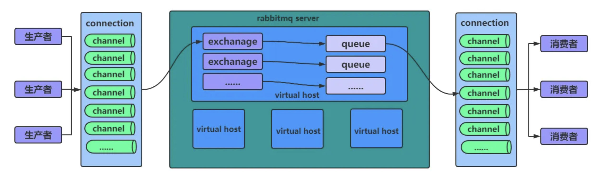
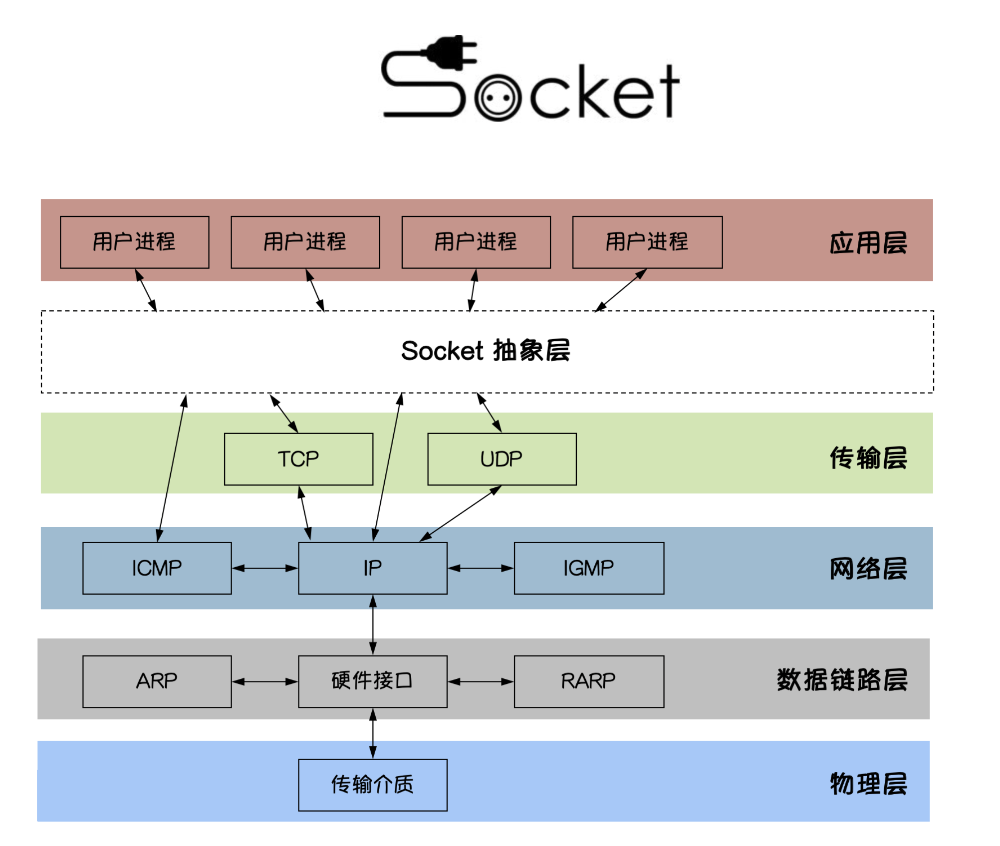
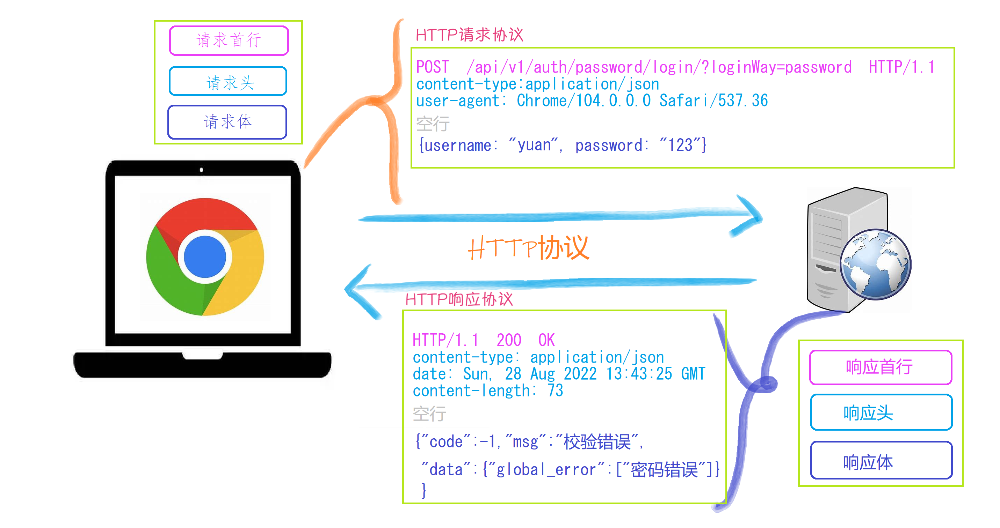

# Python 后端栈

### FastAPI/Starlette（ASGI、依赖注入、WebSocket）
- FastAPI：一个现代、快速的 Web 框架，用于构建 API。
- Starlette：ASGI 框架，为 FastAPI 提供底层支持。
- ASGI：异步服务器网关接口，支持异步操作。
- 依赖注入：简化对象创建和管理。
- WebSocket：支持实时通信。

### Gunicorn/Uvicorn 运行模式、Worker 类型、graceful reload
- Gunicorn：Python WSGI HTTP 服务器。
- Uvicorn：支持 ASGI 的服务器。
- 运行模式和 Worker 类型：配置服务器的工作方式。
- graceful reload：平滑地重新加载服务，减少停机时间。

### AsyncIO 基础：async / await，事件循环，协程池
- async/await：异步编程的关键字，用于构建非阻塞的异步函数。
- 事件循环：管理异步任务的执行。
- 协程池：管理并发执行的协程。

### 任务队列 & 调度
- Celery 5.x：分布式任务队列，支持 Redis/RabbitMQ 作为 broker 和 backend。
- 重试机制：任务失败时的自动重试功能。
- 链、组、和弦：任务组合模式，用于复杂工作流。
- APScheduler / Celery-Beat：定时任务调度。
- Cron 表达式：定义任务的执行时间。

### Redis 进阶
- 数据结构：Redis 支持的多种数据结构，如字符串、列表、集合、哈希表、有序集合等。
- Pipeline：通过管道提高批量操作的效率。
- LuaScript：在 Redis 服务器端执行脚本，保证操作的原子性。
- RedLock：分布式锁解决方案。
- 热点缓存穿透/击穿：防止缓存雪崩和缓存穿透的策略。

### Stream & PubSub（Agent 事件或增量日志常用）
- Stream：用于处理实时数据流。
- PubSub：发布/订阅模式，用于事件通知和消息传递。

### 数据存储
- PostgreSQL：关系型数据库。
- 索引、隔离级别：优化查询性能和保证交易一致性。
- 连接池：管理数据库连接，提高性能。
- psycopg / asyncpg：PostgreSQL 的 Python 数据库连接库。
- 向量数据库：用于处理向量数据。
- quick-win：pgvector 或 Milvus 示例。
- embed→存→查：向量数据库的基本操作流程。

### AI Agent 服务套路
- OpenAI / Tongyi / Qianwen SDK 调用：调用不同的 AI 服务。
- 流式响应：处理实时响应数据。
- Prompt 版本管理：管理提示模板的版本。
- Tool Calling/Function Calling：在提示中调用工具或函数。
- Chunking：将数据分割成小块进行处理。
- Token 估算：计算文本的 token 数量。
- 异常重试 / 指数退避：处理请求失败和重试策略。

## 可观测性 & 运维
- 结构化日志：使用 loguru 或 structlog 记录结构化日志。
- Prometheus 指标：监控系统性能指标。
- Grafana 面板：可视化展示监控数据。
- OpenTelemetry trace：分布式追踪。
- Dockerfile & docker-compose：容器化应用和编排服务。
- 多服务本地联调：在本地环境中调试多个服务。
- 基础 K8s 概念：Pod、Deployment、Service、ConfigMap、HPA。

### 工程基建
- Git Flow + Conventional Commit：版本控制流程。
- pytest + coverage：测试框架和代码覆盖率工具。
- pre-commit：代码提交前的检查工具。
- Black/ruff：代码格式化工具。
- GitHub Actions / GitLab CI：持续集成和持续部署工具。

---

**ASGI和WSGI的区别**

- ASGI(Asynchronous Server Gateway Interface)是一种Python Web服务器和应用程序之间的通信协议,是WSGI(Web Server Gateway Interface)的异步版本。

- WSGI是用于Python Web应用程序和Web服务器之间通信的标准协议,但它是同步的,这意味着请求和响应是一对一的,一个请求需要等待直到处理完成才能返回响应。

- ASGI则支持异步操作,这意味着它可以同时处理多个请求,并在请求处理过程中进行异步操作,如I/O等待,从而提高整体的并发处理能力。

**ASGI的主要特点包括:**

- 支持异步: ASGI可以支持异步编程模型,充分利用CPU资源,提高并发能力。
- 协议灵活: ASGI定义了一套通用的协议,可以支持HTTP、WebSocket、长连接等多种Web应用场景。
- 跨框架: ASGI协议被越来越多的Python Web框架(如FastAPI、Starlette、Uvicorn等)所采用,提高了跨框架的互操作性。
- 使用基于ASGI的Web框架如FastAPI可以显著提高Web应用的性能和并发处理能力,特别适合于需要处理大量I/O操作的场景,如实时聊天、流媒体等。这是Python Web开发的一个重要发展趋势。

**异步编程的核心概念：**

- 非阻塞操作: 在异步编程中，发起一个操作后，程序不会等待该操作完成，而是继续执行后续代码。当操作完成后，会通过回调函数、事件、Promise 等方式通知程序。
 
- 并发与并行: 异步编程允许多个任务并发执行，但不一定并行。并发是指多个任务在同一时间段内交替执行，而并行是指多个任务同时执行（需要多线程或多核支持）。


---

**RabbitMQ架构**



**生产者(Publisher)和消费者(Consumer):**

1. 生产者负责生产消息并发送到Exchange

2. 消费者从Queue中消费消息

## **Channel:**
- 客户端通过建立一个Channel来与RabbitMQ进行通信
- Channel使用AMQP协议,而不是HTTP协议
- 每个客户端连接都会创建一个Channel,这样可以减轻RabbitMQ服务器的压力
  - 连接管理开销的降低:
    1. 如果客户端直接使用连接(Connection)与RabbitMQ通信,那么每个客户端都需要建立和维护一个独立的TCP连接。
    2. 建立和关闭TCP连接都会带来一定的开销,尤其是对于短连接的场景。而使用Channel,客户端只需要建立一个持久的TCP连接,然后在这个连接上创建多个Channel来传输消息。这样可以大幅降低连接管理的开销。
  - 资源利用效率的提高:
      1. 每个TCP连接都会占用RabbitMQ服务器的资源,如内存、CPU等。
      2. 如果大量客户端直接使用连接,那么RabbitMQ服务器需要管理和调度这些连接,会造成较大的开销。而使用Channel,多个Channel共享同一个TCP连接,大大减少了RabbitMQ服务器需要管理的连接数量,提高了资源利用效率。
  - 并发处理能力的增强:
      1. 使用Channel,客户端可以在同一个TCP连接上并发地发送和接收消息。
      2. 这样可以充分利用TCP连接的带宽,提高消息的吞吐量,增强RabbitMQ的并发处理能力。 

- Connection 就像是一条高速公路。
- Channel 就像高速公路上的多条车道。
- 你不用为每辆车（每个消息）建一条高速公路（Connection），
而是用一条高速公路（Connection）开很多车道（Channel）让车流动。


**Connection 与 Channel 的区别和优势**

1. Connection（连接）

就是客户端和 RabbitMQ 服务器之间的 TCP 连接。
每次建立/关闭 Connection，都会涉及底层 TCP 的三次握手、四次挥手，开销很大。
如果每个业务操作都开一个 Connection，RabbitMQ 性能会很快被拖垮。

2. Channel（信道）

Channel 是 AMQP（RabbitMQ）协议设计的“虚拟连接”，依赖于已经建立好的 Connection。
Channel 的创建和销毁是纯内存操作，极快且轻量。
在一个 Connection 上可以开很多 Channel，每个 Channel 就像一条独立的通道，互不影响。

**Channel 如何与 Queue 关联**

1. Channel 是客户端与 RabbitMQ 交互的“操作载体”。所有关于 Queue 的操作（比如创建队列、投递消息、消费消息等），都是通过 Channel 发出的 AMQP 指令。

2. 关联/协同方式：AMQP 指令
无论你要声明队列、发送消息、消费消息，都必须在 Channel 上用 AMQP 协议发出对应指令。
Channel 不“拥有”队列，也不和队列建立物理绑定，而是通过指令和队列进行“临时交互”。

## **Exchange:**
**1. Exchange 是什么？**

Exchange（交换机）是 RabbitMQ 服务器上的一个路由组件，负责接收生产者发送过来的消息，并根据一定的规则把消息“分发”到一个或多个队列（Queue）。

**2. Exchange 的角色**

- 消息接收者：所有生产者发的消息都必须先发到 Exchange，而不是直接发到 Queue。
- 消息路由者：Exchange 决定消息应该被路由到哪些队列（可以是 0、1 或多个队列）。
- 路由规则执行者：根据 Exchange 类型和 routing key（路由键），来决定消息的去向。

## **Queue:**
- Queue是消息的最终存储和缓冲区
- 生产者发送的消息会先进入Queue,等待消费者来消费
- Queue可以配置持久化、内存限制等属性,控制消息的存储策略

## **Virtual Host:**
- Virtual Host提供了一种环境隔离的机制
- 不同的Virtual Host互相隔离,拥有自己独立的Exchange、Queue和权限设置
- 这样可以方便地实现不同业务或环境(dev/test/prod)的分离


## **User和Virtual Host在RabbitMQ中关联**

1. User:

- User代表RabbitMQ中的登录用户账户。
- 每个User都有一个用户名和密码,以及一组权限标签(tags)。
这些权限标签决定了用户可以执行的操作,例如管理Exchange、Queue等。

2. Virtual Host:

- Virtual Host提供了一种环境隔离的机制。
- 每个Virtual Host都是一个逻辑上独立的RabbitMQ环境,包含自己的Exchange、Queue和权限设置。
- Virtual Host可以用于隔离不同的业务或应用程序,防止它们之间产生资源和访问冲突。
User和Virtual Host的关系如下:

3. 一个User可以访问和操作多个Virtual Host。

- 但是每个Virtual Host可以有自己独立的用户权限设置,限制某些User对该Virtual Host的访问。因此,通过组合User和Virtual Host,可以实现非常细粒度的权限控制和资源隔离。

**在RabbitMQ中,默认情况下会自动创建两个Direct类型的Exchange**

**(AMQP default)Exchange:**

- 这是RabbitMQ默认使用的Exchange。
- 当生产者不指定Exchange时,消息会被路由到这个默认Exchange。
- 它使用空字符串("")作为名称。


**amq.direct Exchange:**
- 这也是一个Direct类型的Exchange。
- 与(AMQP default)Exchange不同,amq.direct Exchange需要显式地进行绑定操作,才能路由消息。


它们都是Direct类型的Exchange,但在实际使用中还是有一些区别:

**默认行为不同:**

(AMQP default)Exchange是默认使用的Exchange,不需要手动创建和绑定。
amq.direct Exchange需要手动创建并绑定,才能进行消息路由。

**应用场景不同:**

(AMQP default)Exchange适用于简单的应用场景,无需复杂的路由逻辑。
amq.direct Exchange适用于需要更精细化路由控制的场景,可以灵活地设置路由键。
性能差异:

由于(AMQP default)Exchange是默认使用的,它可能在大规模场景下表现稍逊于手动创建的amq.direct Exchange。

## 死信队列

- 死信队列（Dead-Letter Queue，DLQ）就是 “正常队列的回收站”：
- 凡是在正常队列里因为各种原因不能再继续待下去的消息，都会被 RabbitMQ 自动扔进你事先准备好的 DLQ，让你集中处理、补偿或记录。


**DLQ应用场景**
- 业务超时：下单后 15 min 不支付就取消；
- 业务拒绝：消费端发现数据非法，直接 basic.reject(requeue=false)；
- 系统限流：队列长度满了，再来一条就得先踢掉最旧的；
- 监控排障：把“有问题”的消息统一落地，方便排查。

**RabbitMQ 判断死信后操作**

1. 读取 当前队列 上配置的 x-dead-letter-exchange（DLX）；
2. 按 x-dead-letter-routing-key 把消息重新投递给这个 DLX；
3. 最终路由到你准备好的 死信队列。

## 工作队列

**一个生产者，多个消费者，谁空闲谁干活。**

在 RabbitMQ 里就对应 一个队列 Q ➜ 挂 N 个消费者
所有消费者监听同一条队列，谁先 basic.consume 到消息谁就开始干活，这种“竞争消费”（Competing Consumer）就是 Work Queue 的本质。

**为什么会出现“一个人把活全抢了”？**

RabbitMQ 一次会把尽可能多的消息推送给已连接的消费者。
如果你 不限制预取数（prefetch count）、又开了 自动确认（auto-ack），第一个启动的消费者可能在一瞬间就把队列里所有消息都收走——后来的消费者只能干等。


---

## Python 编程回忆
1. 定义函数

```python
    def function_name(parameters):
        # 函数体
        return value  # 可选
```


2. 定义类

```python
    class ClassName:
        # 类体
        def __init__(self, parameters):
            # 初始化方法
            pass
```


```python
    class Person:
        def __init__(self, name, age):
            self.name = name
            self.age = age
```


---

## FASTapi的两大核心组件

### **1. Starlette** —— FastAPI 的网络/协议层
   1. 位置：FastAPI 直接继承自 starlette.applications.
    - Starlette，所有路由、Middlewares、Request/Response 对象、WebSocket、BackgroundTask、TestClient 等都是 Starlette 提供的。
   2. 主要功能：
    - 异步路由机制（支持 async / sync 处理器）
    - Middleware/Hook 体系
    - WebSocket、SSE、GraphQL 支持
    - 静态文件、文件上传、Stream 响应
    - 100% 基于 ASGI，天然兼容 uvicorn, hypercorn, daphne 等服务器
   3. 特点：
    - 纯 Python、零依赖、代码量小（几千行），可被当成一个极简异步微框架单独使用
    - 性能高——路径匹配用 starlette.routing.Router（基于 trie），I/O 切换完全交给 asyncio / uvloop

### 2. Pydantic —— FastAPI 的数据层

1. 位置：FastAPI 中所有请求体、查询参数、响应模型乃至 Settings，都靠 Pydantic 的 BaseModel 进行解析、校验和序列化。
2. 主要功能：
   - 基于类型注解的解析与强制转换（int, datetime, EmailStr …）
   - 声明式校验（Field(gt=0, max_length=32)）与自定义 @validator、@root_validator
   - 自动生成 JSON Schema，FastAPI 再把这些 Schema 拼成 OpenAPI 3 规范，实现零成本 API 文档
   - Settings 管理（BaseSettings）：可从 env / ini / .env / secrets 等多种来源加载配置
3. 设计理念：
   - 「合法即常驻」(validate & persist)——模型一旦构造成功就保证内部数据始终合法
   - 性能优先——解析与序列化底层用 cython / rust 加速（v1.10+）
   - 与标准库 typing 深度集成（GenericModel, Annotated, Literal, TypedDict）

4. 代码示例：

```python
    from fastapi import FastAPI, HTTPException
    from pydantic import BaseModel, Field, EmailStr, validator

    app = FastAPI()

    class UserCreate(BaseModel):
        #这个括号的意思是继承自BaseModel

        # 类型注解 ：在 Python 中，parameter: Type 是一种类型注解，用于指定参数的预期类型。

        email: EmailStr                       # 自动验证邮箱格式
        password: str = Field(..., min_length=6)
        age: int = Field(..., ge=0, le=150)   # 年龄 0~150

        @validator("password")
        def strong_password(cls, v):
            if v.isdigit() or v.isalpha():
                raise ValueError("密码必须包含字母+数字")
            return v

    class UserRead(BaseModel):
        id: int
        email: EmailStr
        age: int

    # 内存里的“数据库”
    _fake_db = {}

    @app.post("/users/", response_model=UserRead, status_code=201)
    async def create_user(user: UserCreate):
        if user.email in _fake_db:
            raise HTTPException(409, "邮箱已存在")
        new_id = len(_fake_db) + 1
        _fake_db[user.email] = {**user.dict(), "id": new_id}
        return _fake_db[user.email]
```

---


## http协议特性

(1) 基于TCP/IP协议

http协议是基于TCP/IP协议之上的应用层协议。

(2) 基于请求－响应模式

HTTP协议规定,请求从客户端发出,最后服务器端响应该请求并 返回。换句话说,肯定是先从客户端开始建立通信的,服务器端在没有 接收到请求之前不会发送响应

(3) 无状态保存

HTTP是一种不保存状态,即无状态(stateless)协议。HTTP协议 自身不对请求和响应之间的通信状态进行保存。也就是说在HTTP这个 级别,协议对于发送过的请求或响应都不做持久化处理。

使用HTTP协议,每当有新的请求发送时,就会有对应的新响应产 生。协议本身并不保留之前一切的请求或响应报文的信息。这是为了更快地处理大量事务,确保协议的可伸缩性,而特意把HTTP协议设计成 如此简单的。

(4) 短连接

- HTTP1.0默认使用的是短连接。浏览器和服务器每进行一次HTTP操作，就建立一次连接，任务结束就中断连接。
- HTTP/1.1起，默认使用长连接。要使用长连接，客户端和服务器的HTTP首部的Connection都要设置为keep-alive，才能支持长连接。
- HTTP长连接，指的是复用TCP连接。多个HTTP请求可以复用同一个TCP连接，这就节省了TCP连接建立和断开的消耗。

---

## HTTP协议格式



**Socket 抽象层的作用**
- 统一接口：Socket 抽象层为应用层（比如用户进程）提供了一个统一的接口，应用程序通过“Socket”进行网络通信，而不需要关心底层的实现细节。
- 屏蔽底层：无论底层用的是 TCP 还是 UDP，Socket 接口的使用方式基本一致。应用程序只需选择协议类型，其余连接、收发、关闭等操作都可以通过统一的 Socket API 完成。
- 即插即用：应用层开发者只需关心如何“用”Socket，无需关心数据如何传到对方、如何分包、如何重传等复杂细节，这些都由 Socket 抽象层和下方的传输层、网络层来负责。




HTTP请求协议和HTTP相应协议都是字符串形式。