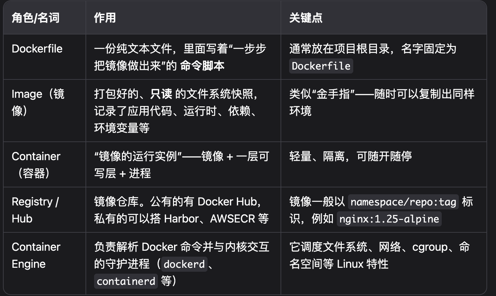
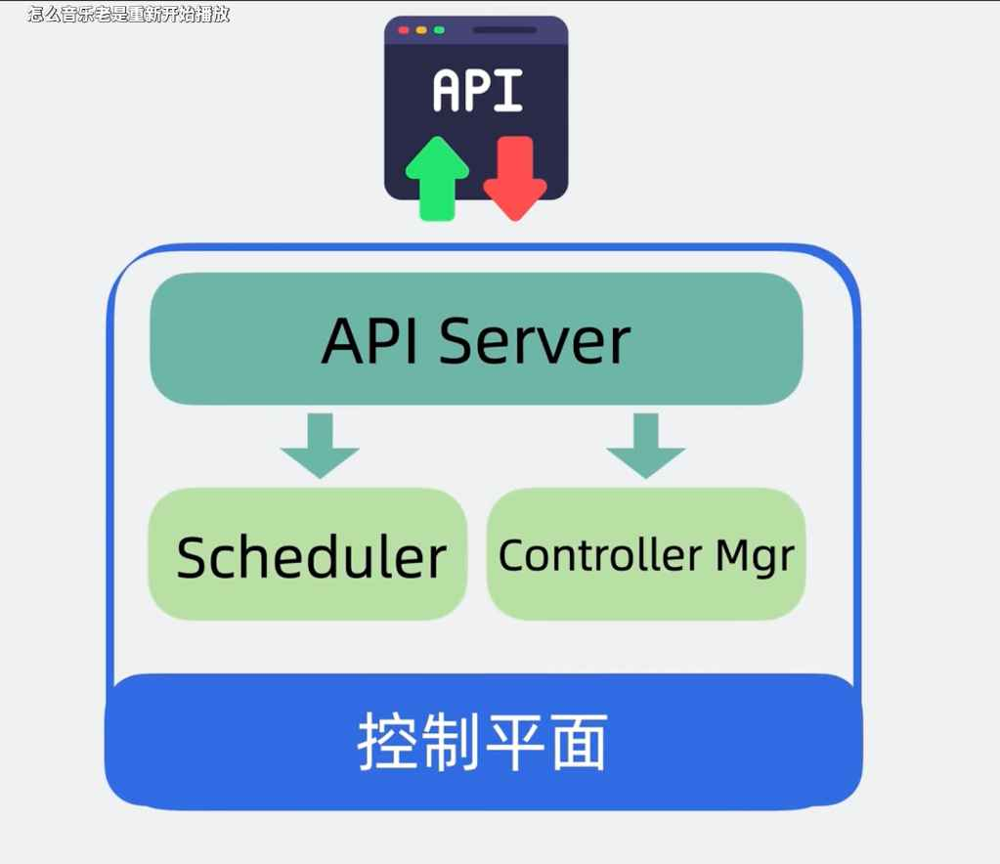

## 什么是 KubeSphere？

KubeSphere 是一个基于 Kubernetes 的开源分布式多租户容器平台（项目地址：https://github.com/kubesphere/kubesphere）。
一句话概括：它把 “原汁原味” 的 Kubernetes 做了可视化、集成化、企业级增强——让开发、运维、测试团队可以更容易地使用和管理 Kubernetes 及其周边生态。
许可证：Apache-2.0

## Kubernetes（简称 K8s）是一个用于自动部署、扩缩和管理容器化应用的开源平台。

你可以把它理解成“容器集群的操作系统”：

• Docker 等容器只解决了“单台机器跑一个进程”的问题；

• Kubernetes 解决的是“成百上千台机器协同跑成千上万个进程”的问题。

## Pod 是什么？

**Pod 是 Kubernetes 中可以创建和管理的、最小的部署单元。**

您可以把它想象成一个**“豆荚”或者一个“小房子”，它本身不是应用程序，但它是运行应用程序的容器（Container）的家**。

核心特点：

- 最小单元： K8s 不会直接管理单个容器，而是以 Pod 为单位进行调度、部署和管理。

- 包含容器： 一个 Pod 中可以包含一个或多个紧密关联的容器。最常见的情况是一个 Pod 里只放一个主应用容器。

- 共享网络和存储：

  - 共享网络： Pod 里的所有容器共享同一个网络空间，即它们共享同一个 IP 地址和端口范围。它们之间可以通过 localhost 直接通信，就像在一台物理机上的不同进程一样。

  - 共享存储： 可以为一个 Pod 设置存储卷（Volume），这个 Pod 里的所有容器都可以共享访问这个存储卷。

**重要：** Pod 的生命周期是短暂的、有生有死的 (Ephemeral)。它可能会因为节点故障、资源不足或更新而被销毁并重新创建一个全新的。因此，您永远不应该直接创建一个单独的 Pod 来运行重要应用。

---

### Kubernetes 里的 Service 是什么

Service 是一种抽象，定义了一组 Pod 的访问策略，通常为这组 Pod 提供一个固定的网络访问入口（IP+端口）。

每一组做同样事情的容器（Pod），如多个副本的订单服务，可能 IP 经常变。
Service 帮你做了一层“中转站”，保证无论背后的 Pod 如何变化，访问 Service 的 IP 和端口都不会变。

**Service 的作用**
- 给一组动态变化的 Pod分配一个固定的 IP 和端口。
- 负责负载均衡（把流量平均分给多个后端 Pod）。
- 支持服务发现（可以用 DNS 直接找服务名）。

Kubernetes Service，就是给一组动态变化的后端服务提供一个“固定IP+端口”的访问入口，让服务发现和调用变得稳定、可靠。

---

### Dockerfile

**Dockerfile 的核心思想：**

把要做的事情像命令行一样列出来。Dockerfile 本质上就是一个文本文件，它像一份“说明书”或者“菜谱”，里面按照顺序写明了从一个空白的基础环境开始，一步步构建出一个我们需要的应用程序镜像（Image）所需的所有指令和步骤。

- 自动化 (Automation)：将手动配置环境的每一步都固化成代码，任何人、任何时间、任何地点，只要拿到这份 Dockerfile，执行 docker build 命令，都能构建出一个一模一样的、标准化的应用镜像。

- 可复现性 (Reproducibility)：确保了开发、测试、生产环境的完全一致，避免了“在我电脑上明明是好的”这种经典问题。

- 版本控制 (Versioning)：Dockerfile 本身是一个文本文件，可以像代码一样存放在 Git 等版本控制系统中，方便追踪、审计和协作。

---

### 容器和虚拟机的区别

**容器（Container）**

**结构：**

   - 包括应用程序、依赖库、配置文件和独立文件系统。
   - 依赖宿主机操作系统的内核，不包含完整操作系统。
   - 通过 Namespace（命名空间）实现进程、网络、文件系统等资源的隔离。
   - 通过 Cgroup（控制组）实现对资源（CPU、内存等）的限制和分配。

**工作原理：**

   - 容器直接运行在宿主机操作系统之上，所有容器共享同一个内核。
   - 容器镜像包含了运行应用所需的全部依赖，但不包含操作系统内核。
   - 启动容器实际上是启动一个进程，极为快速。

**NOTE：**
   - 只支持与宿主机相同类型的操作系统（如Linux主机只能运行Linux容器）。
   - 占用资源少，可以在一台机器上运行更多容器。
   - 启动快，秒级启动。
   - 适用于微服务架构和持续集成与持续部署（CI/CD）

**传统虚拟机（VM）**

**结构：**

- 每个虚拟机都包含完整的操作系统、应用程序和依赖。
- 通过虚拟化软件（如VMware、KVM、VirtualBox等）模拟硬件环境。
- 虚拟机之间完全隔离。

**工作原理：**

- 虚拟化层（Hypervisor/虚拟机管理器）运行在物理主机之上，为每个虚拟机分配独立的硬件资源。
- 虚拟机内有自己的内核和操作系统，和物理主机操作系统完全独立。
- 启动虚拟机类似于启动一台新电脑，需要加载完整操作系统。

**NOTE：**
- 隔离性强，安全性高，每个虚拟机像一台独立的物理主机。
- 可以运行不同操作系统（如在Windows主机上运行Linux虚拟机）。
- 启动慢，通常需要几分钟。
- 适用于多操作系统环境的开发与测试

---

### Docker里的镜像

Docker 镜像 (Image) 是一个“只读的模板”，它打包了运行一个应用程序所需的一切。

**镜像：** 它定义了您的应用程序应该是什么样子，包含了代码、运行时、系统工具——即应用程序运行的“形状”和“环境”。镜像本身是静态的、只读的。

**容器：** 它是镜像的一个正在运行的实例。您可以启动很多个容器，它们都基于同一个镜像，但彼此之间完全隔离。您在一个容器里写入数据、修改文件，丝毫不会影响到其他容器或作为模板的镜像。

### 一份代码“用 Docker 部署”到它真正跑起来的步骤

1. 打包到镜像 
      
   Dockerfile 把源码、依赖、可执行文件等复制到镜像层里（或者在镜像里用 git clone、pip install 等生成）。

2. 镜像生成容器
   
   docker run 时，Docker 在宿主机 /var/lib/docker/overlay2/… 下再叠一层 可写层，并启动隔离进程。

3. 容器进程运行

   最终只是宿主机上一个（或一组）普通进程，被 Linux namespace/cgroups 隔离，看上去拥有独立文件系统。

### 代码主要存在哪里？

1. 镜像层（只读）
   - 打包阶段已写入，任何基于该镜像启动的容器都能看到同一份代码。
   - 删除容器 不影响 镜像；删除镜像才会一起消失。
2. 容器可写层（临时）
   - docker exec 进去随手 vi app.py 改的内容写在这里。
   - 只对这一个容器可见；docker rm 以后层被丢弃。
3. 卷（Volumes/Bind Mount） ‒ 推荐
   - 专门用来持久或共享数据、源码、日志。
   - 不会因容器删除而消失，可被多个容器挂载。

### 删除容器会发生什么？
- 相关进程结束，cgroup 资源释放。
- 可写层被清理，你在容器里临时改的文件全部丢失。
- 只读镜像层依旧保留，本地还能用同一镜像再起一个新容器。

---

### “卷” (Volume) 是做什么的

**核心问题：容器是“健忘”的**

想象一个容器（无论是 Docker 还是 K8s 里的），它就像一个拥有临时记忆的机器人。

容器的文件系统是临时的：当你在容器内部创建一个文件时，这个文件是存放在容器自己的一个可写层里的。容器被删除，数据就丢失：一旦这个容器因为崩溃、重启或被删除，它的整个文件系统都会被销毁。你存放在里面的所有数据，就像机器人断电后忘记的短期记忆一样，永久丢失了。这对于需要保存数据的应用来说是致命的，比如数据库、用户上传的文件、重要的日志等等。

**解决方案：给机器人一个“外接硬盘”或“背包”
为了解决这个问题，我们需要一种方法，把数据存放在一个独立于容器生命周期的地方。这个方法就是 Volume（卷）。**

数据独立：机器人（容器）可以随时往背包（Volume）里存取东西（读写文件）。

生命周期解耦：即使机器人断电重启（容器重启），背包里的东西依然存在。你甚至可以把这个背包交给一个新的机器人（将 Volume 挂载给一个新的容器），它就能立刻拥有之前所有的东西。

---

### CI/CD是什么

CI/CD 是两个概念的缩写，它们共同构成了一套通过自动化来频繁、可靠地向用户交付应用的实践方法。

**CI (Continuous Integration / 持续集成)**

CD (Continuous Delivery / 持续交付 & Continuous Deployment / 持续部署)

您可以把它想象成一个软件开发的“自动化生产流水线”，从工程师写下第一行代码开始，一直到最终用户能用上新功能为止。

#### **第一部分：CI (持续集成) - 质量的守护者**

核心思想： 开发人员频繁地（每天多次）将自己的代码更改合并到主代码库中。

**为什么这么做？**

在过去，开发团队可能长达数周甚至数月才合并一次代码，这会导致巨大的冲突和难以修复的 Bug，被称为“集成地狱”。持续集成通过“少量多次”的方式完美解决了这个问题。

自动化流程：
当任何一位开发者提交代码后，CI 流水线会自动被触发，执行以下步骤：

1. 获取代码 (Fetch)： 从代码仓库（如 GitHub）拉取最新的代码。

2. 构建 (Build)： 将源代码编译成可执行的软件。对于 Java 项目，就是运行 mvn package 生成一个 .jar 文件。

3. 测试 (Test)： 运行各种自动化测试（如单元测试、集成测试），确保新的代码没有破坏原有功能。

4. 反馈 (Feedback)：
   - 如果失败： 任何一个步骤失败，流水线会立刻停止，并立即通知相关开发者。这实现了“快速失败”，让 Bug 在萌芽阶段就被发现和修复。
   - 如果成功： 流水线会生成一个通过了所有验证的“产物”(Artifact)，比如一个可运行的 JAR 包，或者一个打包好的 Docker 镜像。

**CI 的目标： 确保主代码库在任何时候都是健康的、可构建的、经过测试的。**

#### **第二部分：CD (持续交付/部署) - 自动化的延伸**
CD 是 CI 的自然延伸。当 CI 成功地构建并验证了一个“产物”后，CD 负责将这个产物送到用户手中。CD 有两个层次：

**1. 持续交付 (Continuous Delivery)**

流程： CI 成功后，自动将应用程序部署到类似生产的环境（如“测试环境”或“预发布环境”）。

关键点： 部署到最终的生产环境这一步，需要人为地手动点击一下按钮来确认。

目的： 确保软件在任何时候都处于可发布状态。最终的发布时机可能需要根据市场活动、运营计划等商业决策来定，但从技术上讲，一键即可发布。

**2. 持续部署 (Continuous Deployment)**

流程： 这是 CD 的最高境界。一旦代码通过了所有自动化测试阶段，它将自动地、无需任何人工干预地被直接部署到生产环境，交付给最终用户。

关键点： 完全自动化，无人干预。

目的： 实现最快速的价值交付。这要求团队对自动化测试有极高的信心。像亚马逊、Netflix 这样的公司每天都进行上千次这样的自动部署。

#### 一个完整的 CI/CD 流程示例
我们以一个 Java 项目部署到 KubeSphere 为例：

1. 编码 (Code): 开发者在自己电脑上完成一个新功能，并将代码推送到 GitHub。

2. 持续集成 (CI):

    GitHub 的推送操作自动触发了 KubeSphere 内置的 Jenkins 流水线。

3. 流水线开始执行：

    - 拉取最新代码。

    - 运行 mvn test 执行单元测试。

    - 运行 mvn package 将项目打包成 app.jar。

    - 根据 Dockerfile 构建一个新的 Docker 镜像。

    - 将新镜像推送到镜像仓库（如 Harbor）。

    - CI 阶段成功！ 我们得到了一个经过验证的、包含新功能的 Docker 镜像。

4. 持续交付 (CD):

   - 流水线继续执行，自动将这个新镜像部署到 KubeSphere 的“测试集群”中。

   - 在测试集群中运行自动化端到端测试。

   - 流水线暂停，等待人工审批。

5. 人工验证与发布:

   - 测试工程师（QA）在测试环境中手动验证新功能，确保一切正常。

   - 产品经理确认当前是发布的最佳时机。

   - 他们在流水线界面上点击“批准发布”按钮。

6. 生产部署:

   - 流水线接收到批准指令后，继续执行最后一步。

   - 将同一个 Docker 镜像部署到 KubeSphere 的“生产集群”中。

   - 发布完成！ 最终用户现在可以使用到新功能了。

---

### 虚拟机与容器的区别

- 容器是一个应用层抽象，用于将代码和依赖资源打包在一起。 多个容器可以在同一台机器上运行，共享操作系统内核，但各自作为独立的进程在用户空间中运行 。与虚拟机相比， 容器占用的空间较少（容器镜像大小通常只有几十兆），瞬间就能完成启动 。
- 虚拟机 (VM) 是一个物理硬件层抽象，用于将一台服务器变成多台服务器。管理程序允许多个 VM 在一台机器上运行。每个 VM 都包含一整套操作系统、一个或多个应用、必要的二进制文件和库资源，因此 占用大量空间 。而且 VM 启动也十分缓慢 。

---

### Kubernetes 自动化的核心理念：声明式（Declarative）

您不是告诉 Kubernetes “去做什么”（命令式），而是告诉它**“我想要什么状态”（声明式）**。

这就像调节空调温度：

- 命令式：你感觉热了，就去把空调打开；感觉冷了，就去关掉。你需要不断地手动操作。

- 声明式：你把空调设定在 24°C（这就是“声明”你想要的“状态”）。空调的控制器会自动地、持续地检查当前室温，如果高于 24°C 就制冷，低于就停止，它会自己想办法一直维持在你设定的状态。

Kubernetes 就是这个自动化的空调控制器。您通过配置文件（YAML 文件）向它声明“我想要这个应用有 3 个副本，使用版本 v1.2 的镜像，并对外开放 80 端口”。

Kubernetes 收到这个“最终状态”的声明后，会启动一个永不停止的控制循环（Control Loop），持续地：

- 观察（Observe）：检查系统的“当前状态”（比如，现在只有 2 个副本在运行，其中一个还崩溃了）。

- 比较（Compare）：将“当前状态”与你声明的“期望状态”进行比较。

- 行动（Act）：执行必要的操作来修正差异（比如，它会立刻删除崩溃的副本并重新创建一个，同时再额外启动一个新的，以达到总数 3 个的目标）。

---

### Kubernetes 具体会自动化哪些部署相关的工作？
基于上述理念，Kubernetes 在部署方面可以自动化以下关键任务：

1. 自动部署（Automated Rollout）
当你提交一个应用的部署声明时，Kubernetes 会自动在集群的众多服务器（Nodes）中寻找合适的机器，并启动你的应用容器。你不需要关心它具体在哪台机器上运行。

2. 自动修复（Self-Healing）
这是最强大的功能之一。如果你的某个应用容器崩溃了、无响应了，或者它所在的服务器宕机了，Kubernetes 会自动检测到，并在其他健康的服务器上重新启动一个新的容器来替代它，整个过程无需人工干预。

3. 自动伸缩（Automated Scaling）

   - 水平伸缩：你可以手动将声明的副本数从 3 改为 50，Kubernetes 会自动创建另外 47 个副本。更强大的是，你可以设定一个策略（比如“当 CPU 使用率超过 80% 时”），Kubernetes 会根据实时的负载情况，自动增加或减少应用副本的数量（这被称为 Horizontal Pod Autoscaler, HPA）。
   - 垂直伸缩：也可以自动为应用调整CPU和内存资源。

---

### "部署 (Deployment)" 是什么意思？

在这个场景下，“部署”并不仅仅是“安装”的意思。它是一个包含了一系列动作的完整过程。

我们可以把它比作在商场里开一家店：

- 找个铺位（选择节点）：Kubernetes 会在它管理的众多服务器中，自动找一台有空闲资源的服务器，用来运行你的 Agent。

- 开始营业（启动容器）：它在这台服务器上启动你的 Agent 程序（容器）。这就好比把你的货架、商品、收银机都搬进铺位，通上电，让店员开始工作。

- 挂上店名和门牌号（创建服务）：Kubernetes 会给你的 Agent 一个固定的、内部的网络地址（Service）。这样系统里的其他部分就知道去哪里找你的 Agent 了。这就像给你的店挂上一个永久的门牌号，例如“C区-108号”，别人可以直接找过来。

- 签订管理合同（创建 Deployment 对象）：你告诉商场管理员（Kubernetes）：“我的这家店必须永远保持开着，而且要有1个店员（副本）在岗。” 这个“合同”就是 Kubernetes 里的 Deployment 对象。

所以，当说“把 Agent 部署在 Kubernetes 里”时，意思就是完成了上述从找位置、开店营业到挂牌、并签订管理合同的全过程，让 Agent 作为一个正规的服务开始对外提供能力。

它就像一个极其负责的商场管理员：

- 巡逻检查：它会 7x24 小时不间断地检查你的店（Agent）是否在正常营业。

- 故障处理：如果你的店员（容器）突然生病了（程序崩溃），或者整个铺位都停电了（服务器宕机），管理员会立刻发现。

- 立即重开：根据“合同”（Deployment 对象）里“必须保持一家店开着”的规定，它会立刻、自动地在商场另一个好的铺位上，重新开一家一模一样的店，让新的店员上岗。

这个自动“重开”的过程就是自我修复（Self-Healing）。所以，它不是“祈祷”Agent 正常运行，而是通过机制“确保”了当它不正常时，能以最快的速度恢复正常。

### 用户在前端页面上看到的一切交互，背后都是这样运作的：

1. 用户在前端页面点击按钮，与 Agent 对话。

2. 前端将请求发送给一个 API 地址。这个地址最终指向了你的 Kubernetes 集群。

3. Kubernetes 接收到请求后，像一个聪明的接线员，把它转接给一个当前健康运行的 Agent 容器。

4. Agent 容器（它就运行在 Kubernetes 的某个服务器上）处理请求，返回结果。

5. 结果再原路返回给前端，展示给用户。

6. 从前端用户的角度看，他只知道 Agent 在工作。但实际上，支撑这个 Agent 可靠工作的“生命维持系统”，就是 Kubernetes。

---

### 核心控制平面（Control Plane）详解

### 什么是控制平面？

控制平面是 K8s 集群的大脑和决策中心。它负责管理整个集群的状态，做出所有全局性的决策。例如：应用的调度、扩缩容、故障自愈等。

简单来说，它不直接运行我们的业务应用容器，而是管理那些承载着应用的**工作节点 (Node)**。图中最外层的蓝色方框就代表整个控制平面。

### 控制平面的核心组件

控制平面主要由以下几个关键组件构成，它们协同工作，让集群能够自动化地运转。

### 1. API Server (API 服务器)

**API Server 是整个 K8s 系统的入口和唯一网关。**

* **统一入口**：所有组件之间的通信，以及我们用户（通过 `kubectl` 等工具）与集群的交互，都必须经过 API Server。图顶部的 `API` 图标就代表了用户或外部工具，绿色箭头表示我们发送的请求（例如“创建应用”），红色箭头则表示 API Server 返回的响应和状态。
* **集群状态的唯一存储**：它持久化了整个集群的状态信息（存储在 etcd 中，图中未画出），是集群的“唯一事实来源 (Single Source of Truth)”。

### 2. Scheduler (调度器)

**Scheduler 的职责非常专一：为新创建的 Pod 找到最合适的 Node。**

* **功能**：它就像一个专业的“调度员”。当一个新的 Pod 需要运行时，Scheduler 会介入决策。
* **工作流程**：
    1.  Scheduler 会持续监听 (Watch) API Server，寻找那些处于“待调度 (Pending)”状态的 Pod。
    2.  当发现目标后，它会根据预设的调度策略（如 Pod 的资源需求 `requests`、节点的资源剩余量、亲和性 `affinity` 等）进行评估和计算。
    3.  最终，它为 Pod 选择一个最优的 Node，并将这个“绑定”信息更新回 API Server。

### 3. Controller Mgr (Controller Manager / 控制器管理器)

**Controller Manager 是集群的状态“守护者”，负责确保集群的实际状态与我们期望的状态保持一致。**

* **核心理念：期望状态 (Desired State) vs 实际状态 (Actual State)**：我们通过 API Server 声明期望的状态（比如：“我希望我的应用有 3 个副本”）。而 Controller Manager 则像一个永不疲倦的机器人，持续监控集群的**实际状态**。
* **调谐循环 (Reconcile Loop)**：如果“期望”与“现实”不符，控制器就会执行相应的动作来修复差异。例如：
    * **Replication Controller**：发现应用副本数少于期望值，就会立刻创建新的 Pod。如果多于期望值，则会删除多余的。
    * **Node Controller**：负责监控节点的健康状况，如果某个节点宕机，它会负责处理该节点上的 Pod 的迁移等后续工作。

## 组件协同工作流程示例

让我们通过一个“应用扩容”的例子来串联起整个流程：

1.  **用户**：在终端执行命令 `kubectl scale --replicas=3 my-app`。这个指令被发送到 **API Server**。
2.  **API Server**：接收到请求，验证通过后，将 `my-app` 的期望副本数（Desired State）更新为 3。
3.  **Controller Manager**：其内部的 `Replication Controller` 通过 API Server 监控到 `my-app` 的期望状态是 3，但实际运行 (Actual State) 可能只有 1。于是它立刻创建了 2 个新的 Pod 对象来弥补差距，并将这个信息也提交给 **API Server**。
4.  **Scheduler**：它通过 API Server 发现有 2 个“待调度”的新 Pod。于是它开始工作，为这两个 Pod 分别选择了最合适的 Node，然后将绑定结果更新到 **API Server**。
5.  **最终结果**：对应的 Node 上的 `kubelet` (图中未画出的节点代理) 接收到指令，开始下载镜像并启动容器。最终，**Controller Manager** 观察到集群中 `my-app` 的副本数达到了 3，与期望状态一致，本次调谐循环结束，并继续它的下一次监控。

通过这种声明式的 API 和各组件的协同工作，K8s 实现了强大的自动化管理和故障自愈能力。

---

### Kubernetes 中的 Node 节点详解

#### Node 的定义与角色
在 Kubernetes 集群中，Node 是执行工作负载的计算单元，通常被称为工作节点 (Worker Node)。每个集群至少包含一个 Node，生产环境中则由多个 Node 组成。

- 物理形态：Node 可以是一台物理服务器，也可以是云环境中的虚拟机 (VM)。

- 核心作用：Node 的主要职责是为容器化的应用提供必要的计算资源，包括 CPU、内存、存储和网络。**它是 Pod 的实际运行环境**。**控制平面（Control Plane）负责管理所有 Node**，并将 Pod 调度到这些 Node 上运行。

#### Node 的核心组件
每个 Node 都必须运行以下几个关键组件，以确保其能够被控制平面管理并正确地运行 Pod。

1. 容器运行时 (Container Runtime)
容器运行时是负责运行容器的基础软件，是 Node 能够执行容器化应用的前提。

   - 核心功能：管理**容器**的整个生命周期，包括：

      - 拉取容器镜像 (Image)

      - 创建和启动容器

      - 停止和销毁容器

   - 实现标准：Kubernetes 通过容器运行时接口 (Container Runtime Interface, CRI) 与具体的容器运行时进行解耦。任何实现了 CRI 标准的运行时都可以被 K8s 使用。

2. Kubelet (节点代理)
Kubelet 是运行在每个 Node 上的主要代理程序，是连接 Node 与控制平面的桥梁。

   - 核心功能：

      - 与控制平面通信：Kubelet 在 Node 启动时向 API Server 注册自己，并定期监听分配给该节点的 Pod 信息。

      - Pod 生命周期管理：它是 Pod 的直接管理者。当 Kubelet 接收到一个 Pod 的规约 (PodSpec) 后，它会调用容器运行时来执行具体操作（如启动、停止容器），确保 Pod 中的容器按照预期运行。

      - 状态上报：Kubelet 会持续监控 Node 和在其上运行的 Pod 的健康状况，并将这些状态信息（如 NodeReady、PodRunning 等）汇报给 API Server，从而让集群管理员能够了解到集群的实时状态。

      - 卷（Volume）和挂载管理：负责为 Pod 关联和挂载存储卷。

3. Kube-proxy (网络代理)
Kube-proxy 是一个运行在每个 Node 上的网络代理程序，负责实现 Kubernetes 的 Service 概念。

   - 核心功能：

      - 维护网络规则：Kube-proxy 监控 API Server 中 Service 和 Endpoint (或 EndpointSlice) 对象的变化。

      - 实现服务发现与负载均衡：它根据 Service 和 Endpoint 的信息，在 Node 上配置相应的网络规则（通过 iptables、IPVS 或 eBPF 等模式），将发往 Service 虚拟 IP (ClusterIP) 的流量，路由并分发到正确的后端 Pod 上。

      - 网络通信：它确保了集群内部以及从集群外部到 Service 的网络通信能够正确建立。

4. Node 上承载的工作负载：Pod

   虽然上述组件是 Node 的一部分，但 Node 的最终目的是运行工作负载，而在 Kubernetes 中，这个工作负载的基本单位就是 Pod。

   - 定义：Pod 是 Kubernetes 中创建和管理的、最小的可部署计算单元。

   - 结构：一个 Pod 封装了一个或多个应用容器、存储资源（卷）、唯一的网络 IP 地址以及控制容器如何运行的选项。

   - 与 Node 的关系：Pod 总是运行在 Node 之上。一个 Node 可以运行多个 Pod。具体哪个 Pod 运行在哪个 Node 上，是由控制平面的 Scheduler (调度器) 来决定的。一旦 Pod 被调度到某个 Node，除非被销毁或节点故障，它会一直在该 Node 上运行，并由该节点的 Kubelet 进行管理。

5. 组件协作流程总结

   当一个用户请求创建一个 Pod 时，整个流程如下：

      - 请求被发送到控制平面的 API Server。

      - Scheduler 监控到这个未被调度的 Pod，通过算法为其选择一个最合适的 Node。

      - Scheduler 将绑定信息写回 API Server。

      - 目标 Node 上的 Kubelet 监控到这个 Pod 被分配给了自己。

      - Kubelet 读取 Pod 的详细规约，调用容器运行时来拉取镜像并启动指定的容器。

      - 同时，Kube-proxy 会更新 Node 的网络规则，以确保这个新的 Pod 能够被关联的 Service 正确地访问。

      - Kubelet 持续向 API Server 汇报 Pod 的运行状态。

#### Pod 和 Node 的关系：公寓与公寓楼

**核心关系**：Pod 运行在 Node 之上。

- Node 是 Pod 的运行环境：就像公寓（Pod）必须存在于公寓楼（Node）之中，Node 为 Pod 提供了所有必需的计算资源，包括 CPU、内存和网络。没有 Node，Pod 无法存在。

- 调度（Scheduling）：当你需要创建一个新的 Pod（相当于要租一套新公寓）时，Kubernetes 的调度器（Scheduler）会像一个房产中介，自动在集群中所有的 Node（所有公寓楼）里，为你选择一个最合适的 Node（找到一栋最合适的楼），然后将 Pod “安置”进去。

- 生命周期绑定：一旦 Pod 被调度到某个 Node 上，它就会一直在这个 Node 上运行，直到 Pod 被销毁或 Node 出现故障。Pod 不会“漂移”到其他 Node 上。如果一个 Node 宕机了（整栋楼断电了），那么这个 Node 上的所有 Pod 都会“死亡”（公寓里的灯都灭了）。此时，Kubernetes 的控制器（比如 ReplicaSet）会发现 Pod 数量不够，然后在其他健康的 Node 上（在别的楼里）创建新的 Pod（重新分配一套新公寓）来替代死去的 Pod。

**小结**：Node 是承载 Pod 的物理或虚拟主机，Pod 是 Node 资源的使用者。

#### Pod 和 容器的关系：公寓与房间

**核心关系**：Pod 包含并管理着一个或多个容器。

- Pod 是容器的“外壳”：就像公寓（Pod）是由一个或多个房间（容器）组成的，Pod 为它内部的容器提供了一个隔离的、受保护的运行环境。Pod 是 Kubernetes 中可以创建和管理的最小部署单元。你不能直接在 K8s 中部署一个孤零零的容器，你必须先创建一个 Pod，再把容器放进去。

资源共享是关键：这是 Pod 设计理念的精髓。同一个 Pod 内的所有容器共享两大核心资源：

- 网络环境 (Network Namespace)：Pod 内的所有容器共享同一个 IP 地址和端口空间。这意味着它们可以用 localhost 来互相通信，就像你在自己家的卧室可以直接走到厨房一样，非常方便。

- 存储卷 (Storage Volumes)：Pod 可以声明一组存储卷，这组存储卷可以被其内部的所有容器共享访问。这解决了容器之间数据共享和持久化的问题，就像整个公寓共用一个储藏室一样。

#### 为什么需要 Pod？：

多容器场景（Sidecar 模式）：当多个容器需要紧密协作、共享资源时，将它们放在一个 Pod 中就非常高效。经典例子是一个主应用容器（比如一个 Web 服务器），旁边再放一个“边车”容器（Sidecar）专门负责收集日志或代理网络请求。它们俩紧密协作，但又实现了功能解耦。

**小结**：Pod 是容器的逻辑集合，为内部容器提供共享的运行环境和生命周期管理。

---

## Kubernetes里的若干问题

### 只要镜像配置变更，就会“换容器”也就会“换 Pod”

- 在 Kubernetes 里，如果你更新了 Deployment 的镜像（比如从 v1 升级到 v2），K8s 的“滚动更新”机制会逐步销毁旧 Pod，创建新 Pod（新 Pod 用新镜像）。

- 旧容器和 Pod 会被删除、释放资源，新 Pod 起起来，分配新 IP，加载新镜像，成为新一代实例。

### 伸缩副本数（replica）会增减 Pod

当你把 Deployment 的副本数（replicas）从3改到5，K8s 会自动多启动2个 Pod，跑同样的镜像和配置。
反之，如果从5缩到2，会自动删除3个 Pod，只保留2个。

---

### Kubernetes (K8s) 视为“应用服务和服务器的中间层”

**1. 对上：为“应用服务”提供一个标准化的运行平台**

在没有 K8s 的世界里，开发者或运维人员需要直接关心应用运行在哪台服务器上。你需要：

- 登录到某台服务器 (ssh server-101)。

- 确保这台服务器有正确的环境（如 Java, Python 版本）。

- 手动启动你的应用进程 (java -jar my-app.jar)。

- 配置防火墙、负载均衡器等，让用户能访问到它。

- 当服务器宕机时，你需要手动到另一台服务器上重复以上所有步骤。

这整个过程，应用服务和物理服务器是紧密耦合的。

**Kubernetes 作为中间层，将应用与服务器解耦：**

开发者不再关心“我的应用要跑在哪台机器上”，而是向 K8s 这个平台声明一个期望状态 (Desired State)。

开发者说：“K8s，我需要运行我的 webapp 应用，使用 v1.2 版本的镜像，我需要 3 个副本以保证高可用，请给它分配 1 核 CPU 和 2GB 内存，并通过一个负载均衡器将它的 80 端口暴露给外界。”

K8s 提供了一套面向应用的、标准化的 API 和资源对象（如 Deployment, Service, ConfigMap）。开发者只需要与这个标准化的“中间层”对话，用它的语言来描述应用的需求即可。K8s 让开发者从关心“机器”转变为关心“服务”本身。

**对下：将“服务器”抽象成一个统一的资源池**

有了上层应用的需求，K8s 就要负责把这些需求变成现实。它是如何管理底层服务器的呢？

- 资源池化：K8s 会接管所有服务器（无论是物理机还是虚拟机，K8s称之为 Node），并将它们所有的计算资源（CPU、内存、存储）汇集成一个巨大的、统一的资源池。

- 自动化调度与管理：当 K8s 收到开发者的“期望状态”后，它会像一个智能的“操作系统”一样，自动在这个资源池中进行操作：

   1. 调度 (Scheduling)：自动寻找最合适的 Node 来运行应用的副本 (Pod)。

   2. 自愈 (Self-healing)：如果某个 Node 宕机了，K8s 会自动将其上运行的应用迁移到其他健康的 Node 上。如果某个应用容器崩溃了，K8s 会自动重启它。

   3. 弹性伸缩 (Scaling)：根据开发者的指令或实际负载，自动增加或减少应用的副本数量。

   4. 服务发现 (Service Discovery)：提供统一的网络机制，让应用之间可以方便地互相通信，而无需关心对方到底运行在哪台机器上。

K8s 对下层屏蔽了单台服务器的差异和故障。在 K8s 眼中，这些服务器不再是一台台独立的个体，而只是提供 CPU 和内存的“资源单元”。K8s 将一个由多台服务器组成的集群，变成了一台逻辑上的、永不宕机的“超级计算机”。

---

### 基础镜像

基础镜像 (Base Image) 是一个打包了用户空间程序、依赖库和标准文件系统的只读模板。它不包含操作系统内核，因为它将直接利用宿主机的内核。它为我们的应用程序提供了一个标准、隔离、可复现的运行环境，我们可以在这个“最小系统”之上，添加我们自己的代码和配置，最终构建成一个完整的应用镜像 (Application Image)。

**基础镜像里包含了什么？**

1. 文件系统 (File System)
这是最底层的基础。它提供了我们所熟悉的一个 Linux 操作系统的基本目录结构，比如：

   /bin 和 /sbin：存放着最基本的可执行命令（如 ls, cat, ps）。

   /lib：存放着核心的共享库文件。

   /etc：存放着系统配置文件。

   /usr：存放着用户安装的程序和文件。
   等等。这个文件系统结构为上层应用提供了一个标准的、可预期的环境。

2. 依赖库 (Dependencies)
在有了文件系统骨架之后，里面需要填充一些必要的“肉”，也就是各种基础的依赖库。这些是绝大多数程序运行时都离不开的公共组件，最核心的就是 glibc (GNU C Library) 或者 musl libc (在 Alpine Linux 中使用)。它们提供了 C 语言程序运行时所需的基础函数。

      此外，通常还会包含一个包管理器，比如：

      - apt (用于 Debian/Ubuntu 镜像)

      - yum (用于 CentOS 镜像)

      - apk (用于 Alpine 镜像)

   这个包管理器非常重要，它允许你在这个基础之上，方便地安装你的应用所需要的其他任何依赖，比如 Python、Node.js、Nginx 等。

3. 用户空间 (User Space)
这是一个关键概念。我们知道，容器技术的核心之一是共享宿主机的操作系统内核 (Kernel)。

   - 内核 (Kernel)：负责管理硬件、进程、内存等最底层的核心任务。

   - 用户空间 (User Space)：是内核之外的所有东西，包括我们上面提到的文件系统、依赖库、以及各种应用程序。

   因为所有容器都共享同一个宿主机内核，所以**容器镜像不需要包含内核本身**。它只需要打包“用户空间”的这部分内容就足够了。这也是为什么容器镜像可以做到如此轻量（通常只有几十到几百MB），而一个完整的虚拟机镜像（包含内核）则要大得多（通常是几个GB）。

---

## Nacos

### Nacos简介

**Nacos 的核心价值主要体现在两大功能上：动态服务发现和动态配置管理。**

#### 1.动态服务发现
在微服务架构中，**一个应用通常由多个独立的服务**组成，这些服务实例的**网络位置**（IP地址和端口）是动态变化的。如果手动管理这些服务的地址，将是一场噩梦。Nacos 的服务发现机制完美地解决了这个问题。

- 服务注册 (Service Registration)：服务提供者在启动时，会主动向 Nacos Server 注册自己的信息，包括服务名、IP、端口、元数据（如版本号、权重等）。

- 服务发现 (Service Discovery)：服务消费者向 Nacos Server 查询指定服务名下的所有可用实例列表，然后通过负载均衡算法选择一个实例发起调用。

#### 2.动态配置管理 

传统的应用配置通常**硬编码**在代码中或存放在本地配置文件中，修改配置需要重新打包部署，效率低下且风险高。Nacos 提供了统一的配置中心，将配置从应用中解耦出来。

- 集中化管理：您可以将所有环境（开发、测试、生产）的应用配置集中存储在 Nacos Server 中，实现统一管理。

- 动态更新：当配置发生变更时，Nacos Server 会主动将最新的配置信息推送给订阅了该配置的客户端（微服务应用），应用可以实时获取最新配置，无需重启服务即可生效。

- 版本管理与回滚：Nacos 会记录配置的每一次变更历史，支持版本比对和一键回滚到历史版本，极大地增强了配置变更的安全性。

- 灰度发布：支持配置的灰度发布，可以先让一小部分实例使用新配置，验证无误后再全量发布，降低了变更风险。

#### 3.动态 DNS 服务

Nacos 还支持基于 DNS 的服务发现，允许您像访问普通域名一样访问微服务，这使得服务发现对于应用层更加透明，并且可以轻松实现负载均衡、灵活的路由策略和流量管理。

### Nacos的热更新功能

**Nacos 作为配置中心，最大的优点之一就是支持配置的热更新。**

**原理：**
你把配置信息（比如数据库地址、开关、参数等）存到 Nacos。
当你在 Nacos 控制台修改了某个参数，所有订阅了这个配置的服务会自动收到通知、动态更新配置，不用重启服务。

### 几个核心概念

- 命名空间 (Namespace)：用于进行租户隔离或环境隔离。不同的命名空间下的服务和配置是完全隔离的。例如，可以为 dev、test、prod 三个环境创建不同的命名空间。

- 分组 (Group)：用于将相关的服务或配置逻辑上划分到一组。默认的分组是 DEFAULT_GROUP。例如，可以将同一个项目下的所有服务和配置划分到同一个 Group 中。

- 数据 ID (Data ID)：是配置的唯一标识符，通常采用 [应用名]-[模块名].[文件格式] 的方式命名，例如 order-service-db.properties。

- 服务 (Service) 与 实例 (Instance)：一个服务可以包含多个实例。服务定义了应用对外提供的能力，而实例是提供该服务的具体进程，包含了 IP 地址和端口号。

### Nacos 的“网络发现”是什么？

**本质：**
让你的服务（A服务、B服务等）能够动态地找到彼此，而不是靠你手写死IP和端口。

- 每个服务启动时都向 Nacos “报到”（注册自己的IP、端口、健康状态）。
- 其它服务需要访问时，直接向 Nacos 查询“我要找B服务”，Nacos就告诉它B服务现在有哪些实例、各自的IP和端口。

**好处：**
- 服务实例增删（扩容/宕机）不用手动改配置。
- 天然支持负载均衡和高可用。

即：网络发现 = 服务实例的“自动查找和定位”

### Nacos 的“集中管理”是什么？

**本质：**
把原本分散在各个服务（本地文件/环境变量/数据库等）的配置信息，都统一存放和管理在 Nacos 里。

- 在 Nacos 控制台或API里，维护所有服务用到的配置信息。
- 各服务启动时从 Nacos 拉取配置，运行时也能监听配置变更，实现热更新。

**好处：**

配置一处修改，所有服务都能同步感知。
权限、版本、回滚都能统一管理。
运维效率大大提高。
一句话总结：

**集中管理 = 配置的“一站式管理和分发”**

---

### 什么是Jenkins

一款开源的自动化服务器，主要用于软件开发的持续集成（CI）和持续交付/部署（CD）。

- 自动化构建（Build）: 当开发者提交代码后，Jenkins 可以自动获取最新代码，并执行编译、打包等操作，将源代码转换成可执行的软件。**比如对于 Java 项目，它能自动运行 mvn package 生成 .jar 或 .war 文件。**

- 自动化测试（Test）: 构建完成后，Jenkins 会自动运行各种测试，如单元测试、集成测试、端到端测试等，确保新的代码没有引入 Bug 或破坏现有功能。

- 自动化部署（Deploy）: 在代码通过所有测试后，Jenkins 可以自动将软件部署到开发环境、测试环境，甚至是生产环境。这大大加速了软件的交付速度。

- 持续集成（CI）的核心： Jenkins 是实现持续集成的关键工具。它通过自动化上述步骤，确保团队成员的代码能够频繁、小批量地集成到主干，并立即进行验证。这有助于快速发现并解决集成问题，避免了“集成地狱”。

- 持续交付/部署（CD）的桥梁： Jenkins 不仅能做 CI，还能作为持续交付和持续部署的驱动力。它能将验证通过的软件自动地交付到用户手中，甚至直接部署到生产环境。

---

### Docker、Kubernetes、Nacos 和 Jenkins的联动

- Jenkins (自动化管家/CI/CD 引擎): 负责整个自动化流程的调度和执行。它监听代码仓库的变化，触发构建、测试、打包 Docker 镜像，并将镜像推送到仓库，最终协调 Kubernetes 进行部署。

- Docker (应用打包/容器化): 负责将应用程序及其所有依赖项打包成一个轻量级、可移植的容器镜像。这确保了应用在任何环境中都能以相同的方式运行，解决了“在我机器上能跑”的问题。

- Kubernetes (容器编排/部署管理): 负责大规模容器的自动化部署、扩展和管理。它调度 Docker 容器在集群中的运行，处理负载均衡、服务发现、滚动更新、故障自愈等复杂任务。

- Nacos (服务注册与发现/配置管理): 专为微服务架构设计，提供服务注册与发现和动态配置管理功能。微服务启动后向 Nacos 注册，需要调用其他服务时从 Nacos 获取地址。它确保了微服务之间的通信畅通无阻，并允许动态调整服务配置。

### 一个典型的CI/CD与微服务部署流程

---

#### 1. 开发与代码提交

* **开发者编写代码**：开发者在本地编写微服务代码。
* **提交代码到版本控制系统**：开发者将代码提交到 Git 仓库（如 GitHub、GitLab、Bitbucket）。

---

#### 2. Jenkins 触发 CI/CD 流水线

* **Jenkins 监听代码仓库**：**Jenkins** 配置了 SCM (Source Code Management) 轮询或 Webhook，一旦检测到新的代码提交，就会自动触发预定义的 CI/CD 流水线。
* **拉取代码**：Jenkins 首先从 Git 仓库拉取最新的源代码。
* **构建与测试**：
    * Jenkins 执行项目的构建命令（例如 Maven 的 `mvn clean package`），编译源代码，并运行单元测试、集成测试。
    * **失败反馈**：如果任何一步失败，Jenkins 会立即停止流水线，并通过邮件、Slack 等方式通知开发者，实现“快速失败”。

---

#### 3. Docker 容器化

* **构建 Docker 镜像**：如果构建和测试成功，Jenkins 流水线会执行 Docker 命令，根据项目中的 `Dockerfile` 将编译好的应用打包成 **Docker 镜像**。这个镜像包含了应用代码、运行时环境和所有依赖。
* **推送 Docker 镜像**：Jenkins 将构建好的 Docker 镜像推送到一个**容器镜像仓库**（如 Docker Hub、Harbor 或云服务商提供的 ACR/ECR 等）。这个镜像仓库是 Kubernetes 获取应用镜像的地方。

---

#### 4. Kubernetes 部署与管理

* **Kubernetes 部署触发**：Jenkins 可以通过多种方式触发 **Kubernetes** 的部署：
    * **kubectl 命令**：Jenkins 直接执行 `kubectl apply -f deployment.yaml` 命令，更新 Kubernetes 集群中的部署配置。
    * **Helm Charts**：如果使用 Helm 管理应用，Jenkins 会运行 `helm upgrade --install` 命令。
    * **Kubernetes 插件**：Jenkins 有专门的 Kubernetes 插件可以直接与集群 API 交互进行部署。
* **Kubernetes 拉取镜像**：Kubernetes 在接收到部署或更新指令后，会从之前 Jenkins 推送的容器镜像仓库中拉取最新版本的 Docker 镜像。
* **调度容器运行**：Kubernetes 根据部署配置（Deployment、ReplicaSet 等）在集群的节点上启动或更新容器实例。它负责确保所需数量的副本运行、负载均衡流量以及在节点故障时进行自我修复。

---

#### 5. Nacos 服务注册与发现

* **微服务启动并注册**：当 Kubernetes 成功启动微服务的 Docker 容器实例后，应用程序内部集成的 **Nacos 客户端**（例如，Spring Cloud 应用通常会引入 Nacos Discovery 依赖）会自动向 **Nacos Server** 注册自己的服务名称、IP 地址和端口等信息。
* **服务调用**：其他微服务需要调用此服务时，不再需要硬编码其 IP 地址，而是通过 Nacos 客户端向 Nacos Server 查询目标服务的健康实例列表，然后进行调用。
* **动态配置**：Nacos 也作为集中配置中心。应用程序启动时从 Nacos 拉取配置，并且可以在运行时动态更新配置，而无需重启服务。Jenkins 流水线在部署时，可能会确保 Nacos 中的配置是最新的。

---

#### 6. 持续反馈

* 整个流程中，Jenkins 会持续监控各个步骤的执行结果。任何阶段的失败都会及时通知相关人员。

---

## DevOps 核心流程阶段

DevOps 生命周期通常由以下几个核心阶段构成，它们彼此连接，形成一个闭环：

### 1. 持续规划 (Continuous Planning)

这是整个 DevOps 流程的起点。在这个阶段，团队会：

* **定义需求**：明确业务需求和用户故事。
* **制定计划**：规划软件开发周期、迭代和发布版本。
* **优先级排序**：确定功能的优先级，并分配任务。
* **工具**：Jira、Trello、Asana 等项目管理工具。

---

### 2. 持续开发 (Continuous Development)

在这个阶段，开发者编写代码、管理代码并进行版本控制：

* **编码**：开发者编写新功能或修复 Bug 的代码。
* **版本控制**：使用 **Git** 等版本控制系统管理代码，确保团队协作和代码的可追溯性。
* **代码审查**：团队成员互相审查代码，确保代码质量和一致性。
* **工具**：Git、GitHub、GitLab、Bitbucket、IDE（如 VS Code, IntelliJ IDEA）。

---

### 3. 持续集成 (Continuous Integration, CI)

这是 DevOps 的核心实践之一，旨在频繁地将开发者的代码合并到共享主干分支，并自动验证：

* **代码提交**：开发者将小的、频繁的代码更改提交到共享代码仓库。
* **自动化构建**：CI 服务器（如 **Jenkins**）自动拉取最新代码，执行编译和打包操作。
* **自动化测试**：运行单元测试、集成测试、代码质量检查等，以确保新代码没有破坏现有功能。
* **快速反馈**：如果任何构建或测试失败，团队会立即收到通知，以便快速定位并修复问题。
* **工具**：**Jenkins**、GitLab CI/CD、GitHub Actions、CircleCI、Travis CI、Maven、Gradle。

---

### 4. 持续测试 (Continuous Testing)

测试贯穿整个 DevOps 流程，并尽可能实现自动化：

* **自动化测试**：除了 CI 阶段的单元测试和集成测试，还包括更高级别的测试，如功能测试、性能测试、安全测试、UI 自动化测试等。
* **测试环境**：自动部署到测试环境进行验证。
* **早期发现 Bug**：通过持续测试，在软件开发生命周期的早期发现并修复缺陷。
* **工具**：Selenium、Junit、TestNG、SonarQube、JMeter、Postman。

---

### 5. 持续交付 (Continuous Delivery, CD)

持续交付确保软件可以随时被可靠地部署到生产环境：

* **发布准备**：通过所有测试的代码被打包成可发布状态的“制品”（Artifacts），并存储在制品仓库中。
* **手动部署审批**：在持续交付模式下，部署到生产环境通常需要人工审批，但部署过程本身是自动化的。
* **版本管理**：管理和追踪所有已发布的制品。
* **工具**：Artifactory、Nexus、Spinnaker、ArgoCD、**Jenkins**（也可以管理发布）。

---

### 6. 持续部署 (Continuous Deployment)

持续部署是持续交付的延伸，它将软件完全自动化地部署到生产环境，无需人工干预：

* **自动化部署**：一旦代码通过所有自动化测试，就会自动部署到生产环境。
* **小批量发布**：通常采用蓝绿部署、金丝雀发布等策略，降低发布风险。
* **基础设施即代码 (IaC)**：使用代码来管理和配置基础设施，确保环境一致性。
* **工具**：**Kubernetes**、Ansible、Terraform、Puppet、Chef、**Docker**。

---

### 7. 持续运营 (Continuous Operations)

软件部署到生产环境后，需要持续的运营和管理：

* **运行和维护**：确保生产系统的稳定运行。
* **资源管理**：有效管理计算、存储和网络资源。
* **自动化运维**：使用自动化工具进行日常运维任务。
* **工具**：**Kubernetes**、Ansible、Terraform。

---

### 8. 持续监控 (Continuous Monitoring)

这是 DevOps 流程中至关重要的一环，用于实时收集和分析系统性能和用户行为数据：

* **实时监控**：监控应用程序、基础设施和网络的性能指标。
* **日志收集与分析**：收集、存储和分析日志，帮助诊断问题。
* **警报机制**：当系统出现异常时，及时触发警报通知相关团队。
* **用户反馈**：收集用户使用情况和反馈，为下一轮规划提供依据。
* **工具**：Prometheus、Grafana、ELK Stack (Elasticsearch, Logstash, Kibana)、Splunk、Datadog。

---

### 9. 持续反馈 (Continuous Feedback)

所有阶段的监控和运营数据都会反馈回开发团队，形成改进的循环：

* **数据分析**：分析监控数据、用户反馈、Bug 报告等。
* **经验学习**：从成功和失败中学习，识别瓶颈和改进点。
* **融入规划**：将反馈信息纳入到下一轮的规划和开发中，实现持续改进。
